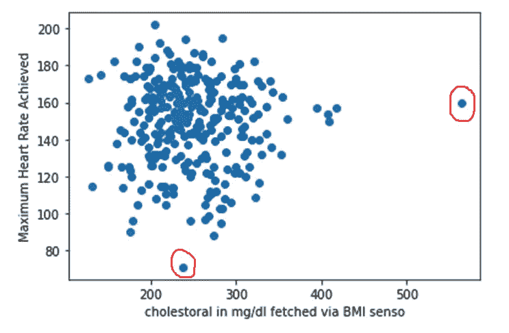
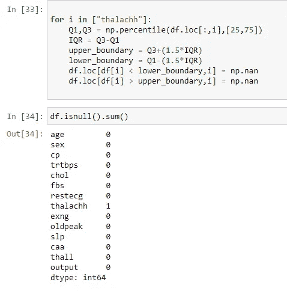

# 深入了解异常值

> 原文：<https://medium.com/analytics-vidhya/understanding-outliers-in-depth-5acdc3821f74?source=collection_archive---------5----------------------->

[图像来源](https://prwatech.in/blog/machine-learning/outliers-in-machine-learning/)

为了理解什么是离群值，让我们举个例子。假设一个婚礼派对有着装规范。在聚会中，我们可以观察到人们根据提到的着装规范打扮自己。现在，如果一些人不遵守着装规范参加聚会，他们的聚会服装看起来和其他人的不一样。这些人可以被认为是局外人。

如果一个数据点位于其他数据点的分布范围之外，那么它就是异常值。它的行为不同于其他点。它可以被视为对数据集没有贡献的奇数数据点。还有，被认为是噪音。异常值会影响数据的正态分布，并导致数据偏斜。

假设我们要找出参加婚礼的孩子的平均年龄。

有异常值:

年龄= [6，7，9，12，8，5，10，96]

平均值= (6+7+9+12+8+5+10+96)/8 = 19.125

无异常值:

年龄= [6，7，9，12，8，5，10]

平均值= (6+7+9+12+8+5+10)/7 = 8.143

这里，在这个例子中，96 是异常值，因为它不在儿童的年龄范围内。计算儿童平均年龄时异常值的存在给出的平均年龄比无异常值的儿童的平均年龄高得多。在这个例子中，我只使用了一个异常值来展示它是如何影响我们的数据的。想象一下处理包含许多离群值的数据集。

现在我们知道什么是异常值，以及它们是如何误导我们的数据的。因此，作为数据清理的一部分，我们需要删除这些异常值。要移除它们，我们需要首先识别它们。

**检测异常值**

1.**图**-检测异常值的最简单方法是从图中可视化它们。散点图、箱线图和直方图可以帮助我们非常容易地从视觉上发现异常值。

我从 Kaggle 上取了一个数据集来展示我们如何从图中发现异常值。在我使用的数据集中，有一些你可能不理解的特性。所以为了消除你的困惑，让我来提一下。a) thalachh-达到的最大心率，b)通过身体质量指数传感器获取的以 mg/dl 为单位的胆固醇。

**加载数据集**

**散点图**

在上面的散点图中，红色圆圈点是异常值，因为它们远离其他数据点。

**箱线图**

在上面的方框图中，红色圆圈点是异常值，因为它超出了数据分布的范围。

**直方图**

我们可以发现直方图中的异常值。

我从这个博客中获得了检测异常值的想法-[**https://medium . com/analytics-vid hya/outliers-in-data-and-ways-to-detect-them-1c 3a 5 f 2c 6 B1 e**](/analytics-vidhya/outliers-in-data-and-ways-to-detect-them-1c3a5f2c6b1e)

2.**四分位数范围** -四分位数范围或 IQR 给出了第 75 和第 25 个百分点之间的差异。第 25 个百分位数作为第一个四分位数，第 75 个百分位数作为第三个四分位数。第 50 百分位是中间值。我们必须设定一个下限和一个上限。位于下边界以下或上边界以上的任何数据点都被认为是异常值。

为了更清楚地理解这一点，我在同一个数据集上做了进一步的工作，通过简单的计算让您清楚地了解如何检测异常值。

我取了一个特定的变量，它的第一个和第三个四分位数是计算出来的。然后我计算了 IQR。

现在要设定上下限，有一个公式，那就是:

**下限:Q1–1.5 * IQR**

**上限:Q3+1.5 * IQR**

其中，Q1=第一个四分位数，Q3 =第三个四分位数

任何低于 84.75 或高于 214.75 的点都是异常值。要检查是否有异常值:

因此，正如您所见，我在特征“thalachh”的下边界下方有一个异常值。

3. **Z 得分** - Z 得分有助于了解数据点与其平均值的偏差程度。其值的范围是从-3 标准差到+3 标准差。使用的公式:

**Z 得分= (x 均值)/标准差**

其中 x 是数据点。

为了理解如何使用 Z 分数来检测异常值，我们必须获取一个特征并计算该特征的每个点的 Z 分数。接下来，我们需要设置一个阈值，如果我们得到一个 Z 值高于阈值的点，那么我们说它是一个异常值。

让我们使用 Z score 从数据集中找出异常值。

如您所见，我们有四个高于阈值的异常值。

4.**假设检验**——假设检验是关于检验从样本数据中做出的假设是否成立。格拉布检验遵循假设检验。在这种情况下，我们不得不采取零假设和替代假设。这些是从我们的观察中得到正确结果的假设。

## **零假设(H0)** —数据中没有异常值。

## **替代假设(H1)** —数据中存在异常值。

在假设检验中，我们采用 0.05 的显著性水平或α值。然而，在医学相关实验中，使用 0.01 或 0.001 的非常小的显著性水平。

我们需要计算 p 值。

## **p 值= P(实验观察| H0 )**

假设零假设为真，通过从实验中找到我们观察的概率来计算 p 值。

如果我们得到的 p 值小于α值，那么我们拒绝 H0，接受 H1。这意味着我们接受数据中存在异常值的事实。否则，如果我们得到的 p 值大于α值，那么我们接受 H0，拒绝 H1。这意味着没有异常值。

5.**局部异常值因子(LOF)** —局部异常值因子是数据点与其最近邻点的偏差的度量。在这种情况下，计算数据点的 K 个最近邻居的可达性距离，以获得局部可达性密度(LRD)。然后，如果将该点的局部密度与其他点进行比较，并且发现具有较低密度的点，则该点被认为是异常值。

**局部异常因子=一个数据点的 k 个邻居的所有 LRD 的平均值/该数据点的 LRDs】**

如果一个数据点的 LOF > 1，那么它就是一个异常值。

我从这篇博客中引用了 LOF- [**的代码 https://medium . com/ml point/local-outlier-factor-a-way-to-detect-outliers-DDE 335d 77 E1 a**](/mlpoint/local-outlier-factor-a-way-to-detect-outliers-dde335d77e1a)

上面的图清楚地显示了异常值。

**处理异常值**

首先，理解什么时候去除异常值，什么时候不去除异常值是非常重要的。如果异常值对数据产生重大影响，则应将其移除。但是删除异常值有时会导致数据中的信息丢失。因此，我们可以用平均值或中值代替异常值，而不是完全删除异常值。

我参考了这篇博客来处理离群值-[**https://www . ask python . com/python/examples/detection-removal-outliers-in-python**](https://www.askpython.com/python/examples/detection-removal-outliers-in-python)

处理异常值的方法是-

a) **用空值替换异常值** -异常值可以用空值替换。这可以通过使用四分位间距来实现。我们知道，我们使用第一个四分位数和第三个四分位数来设置一个边界，如果任何数据点超出该边界，我们将把它视为异常值。因此，在检测到异常值后，我们可以用空值替换它，而不是将其从数据中完全删除。

让我们看看我们如何能做到这一点。

如您所见，要素“thalachh”中缺少一个值，因为它有一个异常值，现在该异常值被一个空值替换。

b) **插补** -统计学中的插补是一种我们可以用其他值替换缺失值或空值的方法。

**i)平均值插补** -在用空值替换离群值后，现在我们可以用该特征的平均值替换该值。

我们来看看怎么做。

特性“thalachh”以前有一个空值。将该值替换为平均值后，我们可以看到该特性不再具有空值。

ii) **中值插补** -我们可以使用中值插补，而不是平均值插补，用计算中值后得到的值来填充缺失值。

我们可以这样做。

我们可以看到，特征“thalachh”没有空值，因为该值被中值所取代。

c) **删除空值的行**——这是处理空值的另一种方式。在用空值替换离群值之后，我们可以简单地删除包含空值的整行。但是如果有许多空值，那么删除许多行会导致大量信息的丢失。

删除缺少值的行-

删除一行后，数据集的形状会缩小。

还有许多其他方法来处理异常值。我已经提到了其中的一些。

**总结**

由于错误的数据输入，在数据集中发现异常值。他们可以操纵数据，所以他们是不受欢迎的。它们会导致模型中的偏差。我们已经看到了一些检测异常值的方法。我们已经用缺失值替换了异常值，但是这些值不应该保持为空，因为它会影响数据的效率。如果离群值的存在不影响数据，那么我们可以保留它们，而不是从数据集中删除它们。保留或删除异常值的决定取决于许多因素，包括我们工作的特征、我们使用的模型等。

**注**——Jupyter 笔记本已用于此项工作。

## 链接到 Github 代码- [链接](https://github.com/RouhinaDey/Detecting-and-Dealing-with-Outliers)

## 您可以在 Linkedin 个人资料- [链接](http://linkedin.com/in/rouhina-dey-46527b217)上与我联系