# 了解变压器中的 Q、K、V(自我关注)

> 原文：<https://medium.com/analytics-vidhya/understanding-q-k-v-in-transformer-self-attention-9a5eddaa5960?source=collection_archive---------1----------------------->

我写这篇文章是对以前关于 Transformer 的文章的跟进。([链接](/analytics-vidhya/nlp-transformer-unit-test-95459fefbea9))这里我假设你已经知道什么是 Transformer，只是想了解更多关于架构中的 Q、K、V 向量。

我从[这里](#https://github.com/bentrevett/pytorch-seq2seq/blob/master/6%20-%20Attention%20is%20All%20You%20Need.ipynb)得到基础代码。但是我变化太大了，所以你可能跟不上我的台词。代码在 github，但使用 nbviewer.com 查看颜色。nbviewer 中的
代码[链接](https://nbviewer.jupyter.org/github/mcelikkaya/medium_articles/blob/main/transformer_debugging.ipynb)github 中的
代码[链接](https://github.com/mcelikkaya/medium_articles/blob/main/transformer_debugging.ipynb)

让我把一切都简单化。什么是 **n** 维的向量？
对具有 **n** 个特征的数据进行编码。所以当维度很高时，很难想象。

所以让我们做最简单的事情。
假设我们下面有句子是:

**吃苹果
吃面包
喝水
喝啤酒
看报纸
看书**

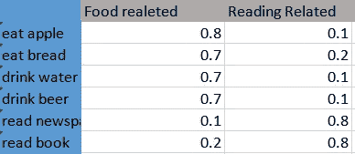

维度 2 的向量表

如果我们为这些句子生成二维向量(不是单词的向量，而是句子的向量)，我们可以像上面那样创建。(维度越多，编码越好)通过这种过度(过度，过度)简化，如果我们将这些句子向量相乘，我们可以看到，当与食物相关的项目相乘时，食物相关的得分更高。

吃苹果 x 吃面包= 0.8 * 0.7 + 0.1 * 0.2 = 0.58
吃苹果 x 看书= 0.8 * 0.2 + 0.1 * 0.8 = 0.24

这是二维空间。现在想想，对于一个 NLP 问题，我们实际上需要多少个维度。回到我们的问题，我们的问题是学习英德翻译。我们的向量是 64 维的。我会尽量把它们调小 2 或 3。

在 transformer **中，Q，K，V** 是我们用来对源词和目标词进行更好编码的向量。

**问:**矢量(线性层输出)与我们编码的内容相关(输出，可以是编码器层的输出，也可以是解码器层的输出)
**K:** 矢量(线性层输出)与我们用什么作为输入来输出相关。
**V** :作为计算结果的学习矢量(线性层输出)，与输入相关

在《变形金刚》中，我们有三个地方可以使用自我关注，所以我们有 Q，K，V 向量。

1- **编码器自我关注** Q = K = V =我们的源句子(英文)

2- **解码器自我关注** Q = K = V =我们的目标句子(德语)

3- **解码器-编码器注意** Q =我们的目标句(德语)
K = V =我们的源句(英语)

有了这个 Q 和 K 向量，我们就可以计算注意力，然后乘以 V。所以非常粗略地说

attention = soft max((**Q * K**)/Scale)
enbed for attention layer = attention ***V**

这只是其他博客或教程上的热身概述。首先，这些不是什么特别的东西，它们只是线性层。

**Q、K、V 用法的简化代码**

如你所见，我们正在做一些非常基础的事情。我们有线性层，我们正在对它们进行一些操作。更有趣的是线性层的输入和输出大小是相同的。所以我们不做降维。我们在做什么？只是学习！

当你开始训练一个网络时，所有的权重都是随机的，然后通过展示你的训练数据，根据你的损失进行小的更新，希望训练后有更好的权重。

所以现在我将展示 Q，K，V 的各种可视化，以了解它们的作用。

在编码器**处，Q、K、V** 来自编码器嵌入，因此它们的嵌入层是针对同一种语言的。(Src 语言英语)那么它们是来自相同空间的向量。对于两个不同的句子，我正在收集时间点[1，15，30]的[Q，K，V，X1]向量，并转储到 3d 或 2d。

```
energy = torch.matmul(Q, K.permute(0, 1, 3, 2)) / self.scale
...                            
attention = torch.softmax(energy, dim = -1)
...
x1 = torch.matmul(self.dropout(attention), V)
#x1 is the vector of attention multiplied by V, so it is what Q,K,V learnssentence1 = "we want to eat apple"
sentence2 = "we want to eat bread"
```


**编码器的 Q、K、V 和 x1 向量行进解空间**

上图显示了两个句子(不同颜色)的向量和它们的聚类。标签解释:

吃@k@30

**吃**:息字
**K** :向量
**30** :历元

上面的图表显示了什么？我有两个句子，都有动词“吃”。在语言建模中，单词必须有符合其上下文的含义。所以一个好的模型必须有不同的表现**【吃面包】****【吃苹果】**。

如你所见，Q、K、V 形成了它们的聚类，并且句子 1 的结果 X1@30 对于**“eat”**变得不同于句子 2。这是编码器侧。

我们可以在解码器端做同样的事情。

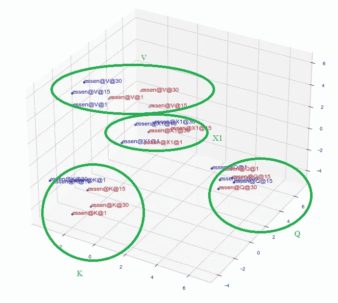

**解码器的 Q、K、V 和 x1 向量行进解空间**

如你所见，解码器端更分散。因为编码器只有 1 个输入类型，(源语言)，但是解码器端有他的自我关注+编码器关注+位置层。

你能理解与 Q，K，V 和一个单词的嵌入的关系吗？想我有一个只有**输入- > Q - > K - > V - >输出**的网络，我把我的话馈入这个网络。在每个时期，我更新这个网络的权重，根据损失(这里是多类分类)网络更新这些 Q、K、V(线性层)权重。现在，在训练结束时，V 输出将符合输入字，对不对？这就是神经网络学习的方式，这就是这里发生的事情。

现在让我们总结一下，在一个大的网络架构中，我们有 3 个线性层，Q，K，V，通过这些层，我们为我们的单词创建了一个嵌入。不如我们只学 1 编码。

```
Think we have 3 values 
10,20,30      -> Their multiplication is 6000
If we decrease every value
9 x 19 x 29   -> 4959
If we increase every value
11 x 21 x 21  -> 7161As you see with little changes(with little updates to parameters by backpropagation) we can make big differences.
```

现在让我们试试，
**理论**:改变句子的顺序一定会得到相同的 X4。
为什么？因为 Q，K，V 向量不讲究位置，而且是通过，乘以所有其他的来计算的。认为这些是对一本书的总结，或者更好地表达一些特征。汽车是轮子、窗户、座位和刹车的组合。所以创建 Q，K，V 在某种程度上是特征提取。

还要记住，Q，K，V 的计算是排列不变的。本质上，我认为结果向量 X4 是相似的。(校验码)

我声称句子**“我们能吃苹果”**和**“苹果能吃我们”**将有:
**Q:相似的**(最后它们将产生相同的句子，所以在每一步它们将有相似的 Q)，对角线上相同的条目
**K:不同的**，不是所有的对角线都不同，但是不同位置的相同项目(苹果，吃…)将有相同的嵌入。(反对角线)
**V:不同**，不是所有的对角线都不一样，但是相同的物品(苹果，吃…)在不同的位置会有相同的嵌入。(反对角线)
**X4:相同**，因为最后 3 个矩阵相乘(几乎与 scale 和 softmax 相乘)的效果会产生相似的向量，因为源语句相同，我们一个一个生成输出。
**注意:**必须是**相同**不同位置的相同项目。

我生成了两个句子的 Q，K，V 向量，并得到所有组合的余弦相似度。检查对角线，以了解如何在不同位置为相同的项目创建相同的嵌入。列和索引是相同的，因为两个句子创建了相同的输出。

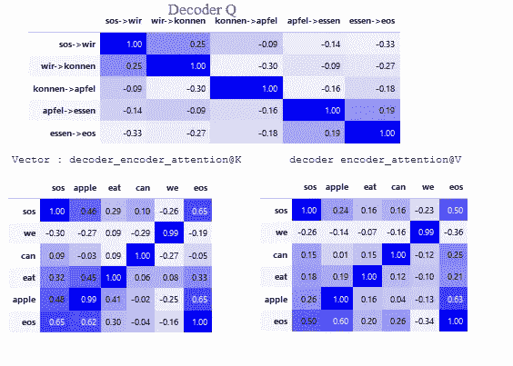

**Q，K，V 为 2 个句子的解码器。**

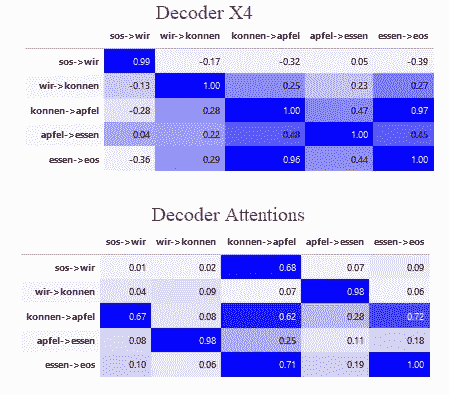

**解码器 x4 及注意事项**

通过检查上面的表格，你可以理解这些向量的关系。你也可以尝试不同的句子，不同的组合。

现在让我们做另一个例子。对于 5 个句子，我将得到 Q，K，V，X4 向量，并检查它们在空间中的位置。第一句和第二句是恰当的，第三句和第四句是废话。最后一句都有“苹果”和“书”，所以它是有误导网络。

```
#The translations of 5 sentences 
**source = ['i', 'can', 'eat', 'apple']**
predicted target = ['ich', 'konnen', 'apfel', 'essen', '<eos>']
**source = ['i', 'can', 'eat', 'bread']**
predicted target = ['ich', 'konnen', 'brot', 'essen', '<eos>']
**source = ['i', 'can', 'eat', 'book']**
predicted target = ['ich', 'konnen', 'apfel', 'essen', '<eos>']
**source = ['i', 'can', 'eat', 'newspaper']**
predicted target = ['ich', 'konnen', 'brot', 'essen', '<eos>']
**source = ['i', 'can', 'eat', 'apple', 'book']**
predicted target = ['ich', 'konnen', 'apfel', 'essen', '<eos>']
```

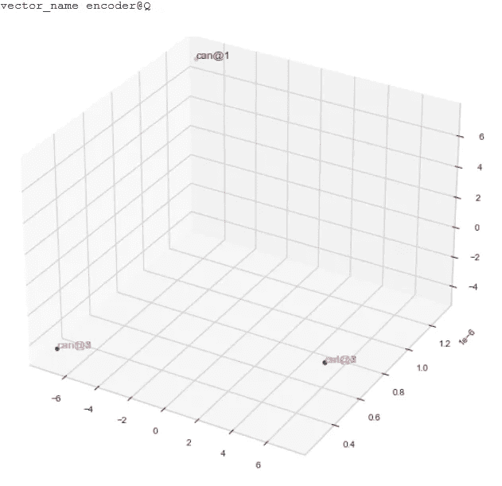

q 矢量

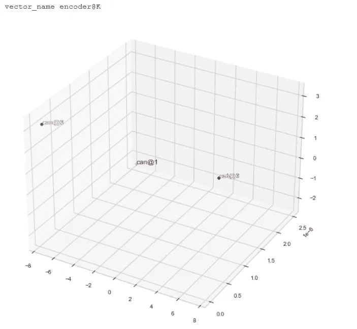

k 向量

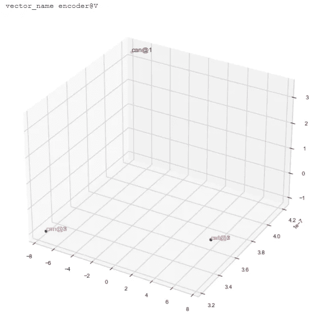

v 向量

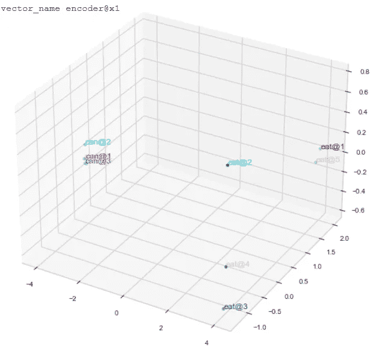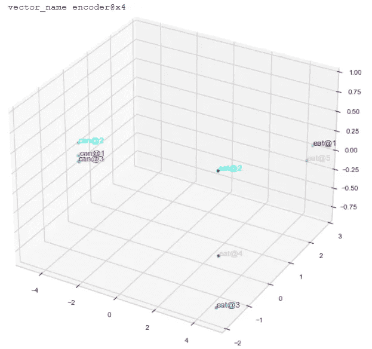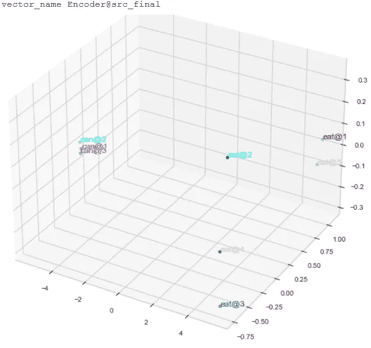

如你所见， **Q，K，V** 向量看起来如此相似，但结果( **X1，X4，src_final** )却是分散的。因为正如我说的，也许一个向量和其他向量在类别上没有太大的不同，但是它们的组合效果是不同的。我们也可以展示它的解码器部分。

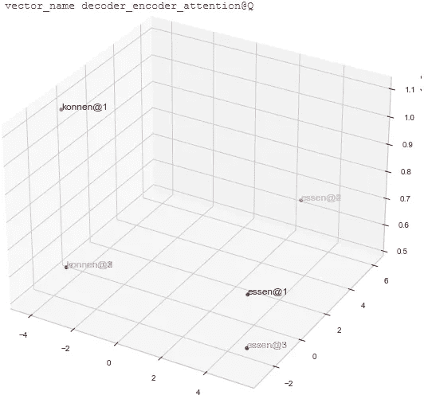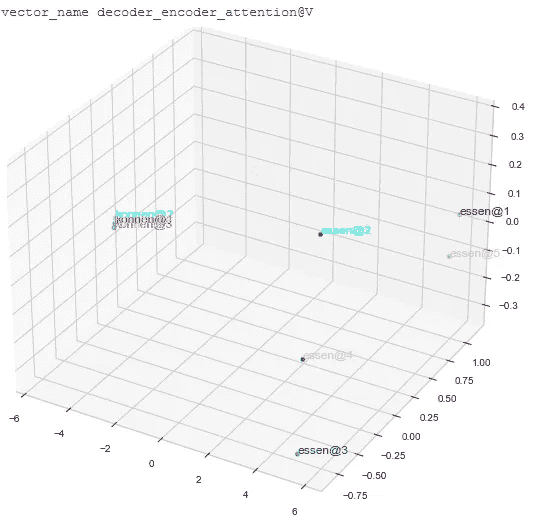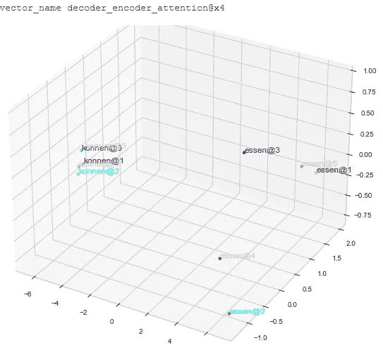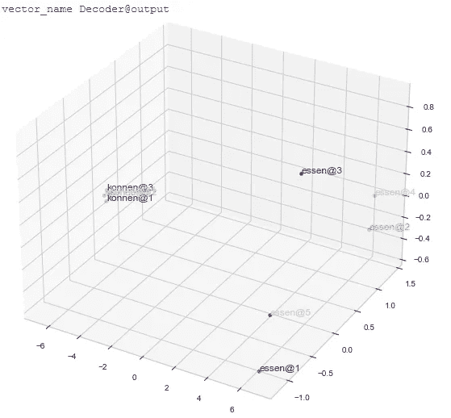

正如你看到的，解码器有更多的分散向量，因为它有更多的数据来源，(包括计算中更多和不同的向量)

通过上面我展示的例子，我们用这些向量所做的是创建单词的良好表示。我们怎么知道“水”是“可以喝的”，而“苹果”是可以吃的？因为我们看到很多成对出现的句子。所以当你看到一个自我关注的逻辑时，你会明白，随着时间的推移，网络学习哪些是随机出现的，哪些不是。然后根据上下文创建好的输入向量。