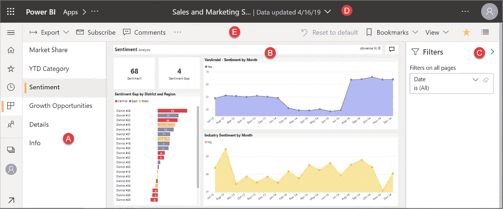
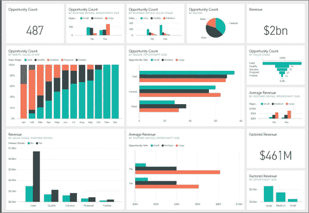
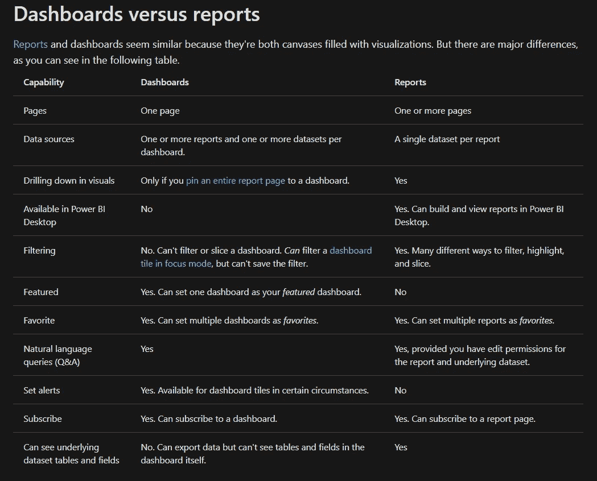

# 了解报表和仪表板

> 原文：<https://medium.com/analytics-vidhya/understanding-reports-and-dashboards-be6dc0d89d17?source=collection_archive---------27----------------------->

## 第四部分

## Microsoft Power BI 学习系列

> 在之前的博客中，我们了解了 Power BI 中的**【可刷新】**和**【不可刷新】**数据源。如果你还没有看过之前的博客，你可以看看这里的。

 [## 快速了解数据更新

### Microsoft Power BI 学习系列

medium.com](/analytics-vidhya/a-quick-dive-into-data-refresh-ceefbabfae1f) 

在这篇博客中，我们将讨论与 Power BI 相关的一个主要话题，即**报告和仪表板**以及它们之间的主要区别。那么，我们开始吧。

# 报告

报告由可视化或图表组成。这些是根据用户提供的数据集构建的。可以通过修改和操作可视化来制作报告，方法是从头开始制作或编辑现有的可视化。它可以只有一张图片，也可以是几页图片。报告的主要目的是作为仪表板的信息提供者。这些信息可以以几种不同的格式提供，如表格、图表、数字、文本等。

Power BI 中的报告

# 仪表板

仪表板是一种图形化或说明性的方式来呈现数据，以识别关键见解。仪表板能够从几个不同的报告中提取数据，并能够在一个页面上呈现这些数据。他们通常作为决策者来帮助用户做出更有意识的商业决策。最先进的是交互式的，进一步增强客户或利益相关者的能力。仪表板具有与报告类似的功能，但它们仅用于可视化重要数据，因为它们可以导出为有限的格式。

Power BI 中的仪表板

# 报告和仪表板的主要区别

毫无疑问，乍看之下，报告和仪表板可能与任何开始使用 Power BI 的人非常相似，但它们非常不同。您可能想知道为什么需要创建两个不同的实体，即报告和仪表板？没错，因为，两者不一样！这两者在使用和工作上有很多不同。

以下是 Power BI 报告和仪表盘之间的主要区别:

来源:[https://docs . Microsoft . com/en-us/power-bi/create-reports/service-dashboards # dashboards-vs-reports](https://docs.microsoft.com/en-us/power-bi/create-reports/service-dashboards#dashboards-versus-reports)

*   可以在桌面上查看和创建 Power BI 报告，而仪表盘在桌面上不可用。
*   报告仅允许您使用单个数据集作为源，而 Power BI 仪表板允许用户使用各种数据源。
*   Power BI 报告具有切片和过滤功能，而这对于控制面板无效。
*   自然语言查询功能在 Power BI 报告中不可用，但是可以查询仪表板中的数据。该特征使用户能够为可视化导出有意义的结论。
*   Power BI 报告是几个数据集的集合表示，在几个页面上进行描述，而仪表板仅限于一个屏幕大小的页面，包含所有重要信息和组合报告。
*   Power BI 报告不支持警报功能，而在仪表盘的情况下，当出现紧急情况时，可以发出警报。
*   Power BI 报告支持任何格式的导出，而在 Power BI 仪表板中，只能导出数据，不能导出可视化数据。
*   通过订阅功能，电子邮件订阅功能仅在 Power BI 报告中可用。Power BI 仪表盘没有这样的功能。
*   用户可以将 Power BI 控制面板设置为特色或收藏夹，但 Power BI 报告无法做到这一点。
*   Power BI 报告可以有多页，包含详细的数据信息，如员工工资、团队规模、日工资等，因此，它需要多页来容纳数据，而仪表板是单页屏幕显示。

总之，仪表板的作用是将来自不同报告的数据汇集在一起，并在单个屏幕视图上显示出来。仪表板被广泛用于与同事共享多份详细报告，从而为他们提供所需的数据，以得出有意义的结论。

现在，您已经了解了仪表板和报告之间的基本区别，您可以继续使用 Power BI 创建自己的仪表板或报告。

此外，您可以浏览一下微软的官方文档，了解更多关于 Power BI 中的**报告和仪表板**的概念。

 [## 面向 Power BI 设计人员的仪表盘简介- Power BI

### Power BI 仪表板是一个单独的页面，通常称为画布，它通过可视化来讲述一个故事。因为这是…

docs.microsoft.com](https://docs.microsoft.com/en-us/power-bi/create-reports/service-dashboards#dashboards-versus-reports) 

如果你有任何建议，欢迎[与我分享！](https://twitter.com/hemshree_madaan)

快乐学习到那时！