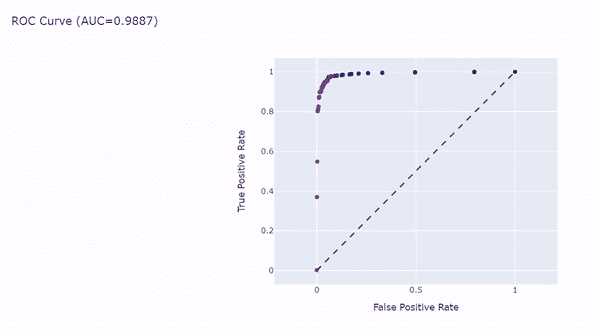

# 了解分类任务中的 ROC 和 AUC 指标

> 原文：<https://medium.com/analytics-vidhya/understanding-roc-and-auc-metrics-in-classification-tasks-e5e7594cd6b?source=collection_archive---------7----------------------->

## Python 的可视化实现

每当我们训练一个机器学习模型时，我们都需要一套工具，能够让我们了解我们的算法执行得有多好。在二进制分类的情况下，性能的评估可以非常简单:我们可以直接计算有多少实例被我们的…