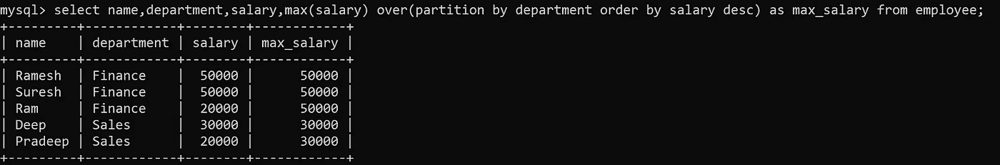
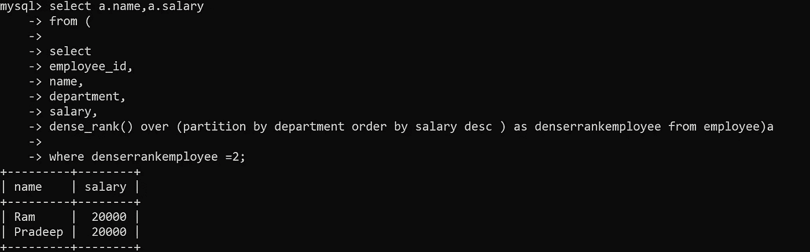

# 了解 SQL 窗口函数

> 原文：<https://medium.com/analytics-vidhya/understanding-sql-window-functions-32f21dba483d?source=collection_archive---------13----------------------->

SQL 中的窗口函数为数据工程师提供了一个机会窗口，通过将 SQL 查询快速连接到业务计算，可以最大限度地减少工作量和时间。RDBMS 中的窗口函数可以顺利地解决使用基本 SQL 查询难以解决的关键问题。窗口功能包括-

a)函数名，如 **sum、avg、min、max、lead、lag、row_no、rank、dense_rank、ntile 等。**

b) **Over 子句**和 within over 子句是使用像 **partition by、order by 和行或行之间的范围这样的子句指定计算框架的地方。**

c) **分配给最终计算帧的别名**。

语法: **Window_Function_Name(参数)Over(Window _ Frame)AS Alias _ Name**

**窗口功能的通用语法**

下面我将带你浏览一些最常用的 SQL 窗口函数的概念和例子。

## **考虑下面表格中两个部门“财务”和“销售”的 5 名员工及其相应的年龄和工资详细信息。**

员工表

**例 1:计算员工所在部门的最高工资**

现在，我们可以将上面计算的基本 SQL 写成—

使用基本 SQL 计算**最大值**

如果我们希望在一行中显示每个员工的最高工资，该怎么办？同样有两种方法——使用 **join** 或 **window function** 。使用 **join** 可能会很棘手并且消耗内存，而**窗口函数**可以很容易地解决这个问题。

使用窗口函数计算**最大值**

**解释:**

1.  员工表被解雇。
2.  财务和销售部门创建了两个分区。
3.  在每个分区中，按薪水降序排序。
4.  如果未提及，则默认情况下，范围被视为无界的前一行和当前行。*前面无界表示当前行以上的所有行，后面无界表示当前行以下的所有行*。还有其他范围的组合，比如—

*前无界与后无界之间的行数
当前行与后无界之间的行数
前 n 行与后 n 行之间的行数
前 n 行与当前行之间的行数
当前行与后 n 行之间的行数*

其中 **n** 是帧中前面或下面的行数。根据需要使用它们。

5.Max 是为每个分区从 over 子句中获得的数据框行计算的。

6.最后完成行的选择。

**例 2:计算员工表**中所有员工的工资总额

所有员工的工资总额

**说明:**

1.  员工表被解雇。
2.  读取 Over 子句，如果 over 子句中没有提及任何内容，它将作用于表中的所有行。
3.  计算所有行的总和。
4.  列的选择已完成。

**例 3:计算每个员工的累计总数**

每个雇员的累计。

**注意:**order by 一放入 over 子句，默认范围就进入每行的画面。默认情况下，在 over 子句中，范围在前面的行和当前的行之间是无界的。其余说明与例 2 相同。

**例 4:对各部门薪资最高的员工进行排名**

SQL 有 3 个排名函数 **row_number** 、 **rank** 和 **dense_rank** 。为了更好地理解，下面是所有 3 个的结果集。

**步骤 1** : *让我们使用这些函数对员工进行排名。*

员工排名

**第二步** : *过滤掉排名最高的。由于两个雇员(Ramesh 和 Suresh)的最高工资相同，我们不能使用 row_number，因为它给了他们不同的数字，所以我们将使用 rank 或 dense_rank 来获得这些雇员。*

最高等级

正如我们所见，拉梅什、苏雷什和迪普在这三个部门的薪水最高。

**例 5:** *计算各部门员工表中第二高的薪资。*

现在这是一个棘手的问题，我们知道我们有 3 个排名函数，但使用哪一个来获得第二高。让我们看看 Ex4 步骤 1 的结果集，似乎 dense_rank 是更好的函数。

**第一步** : *计算每个部门的 dense _ rank*。

**第二步** : *过滤掉 dense_rank 2* 的员工。

第二高的薪水

我们可以看到，在员工表中，拉姆和帕拉德普的工资在各部门中排名第二。

通过这些例子，我们可以观察到窗口函数是如何轻松地解决业务所需的各种任务的。

暂时就这些了。希望你喜欢阅读。