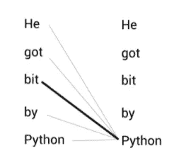
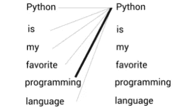
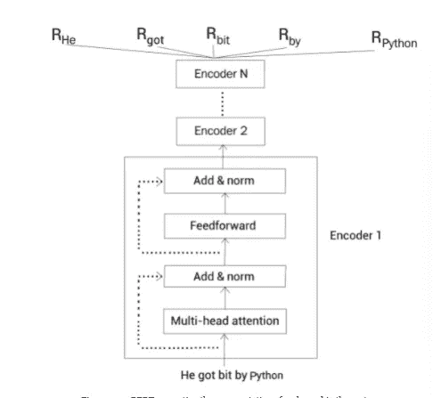
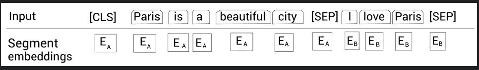
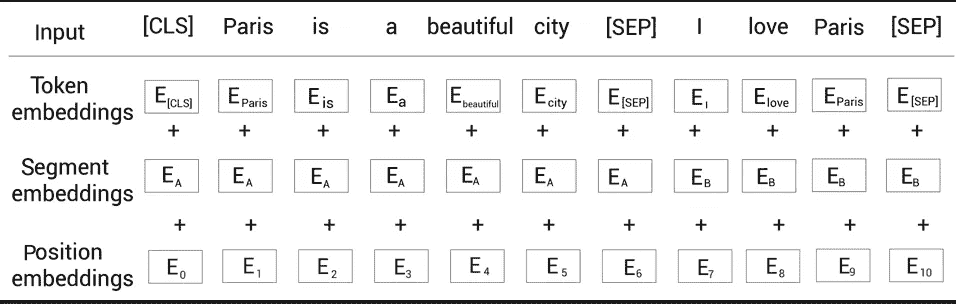
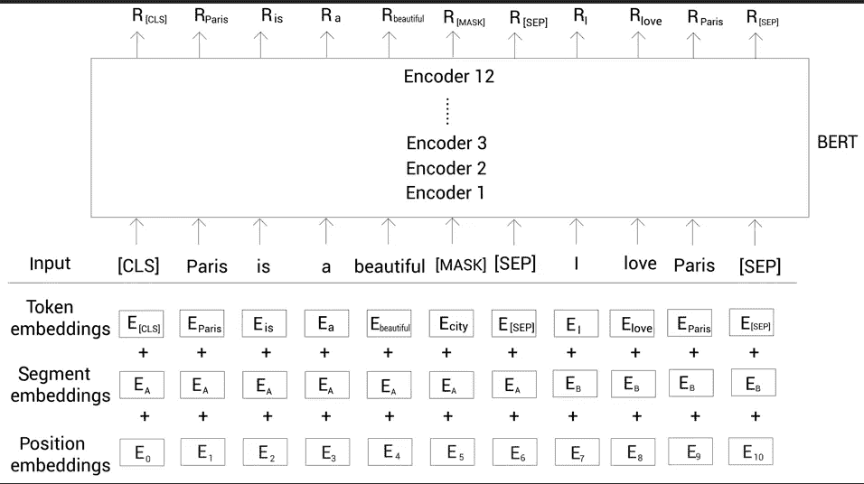
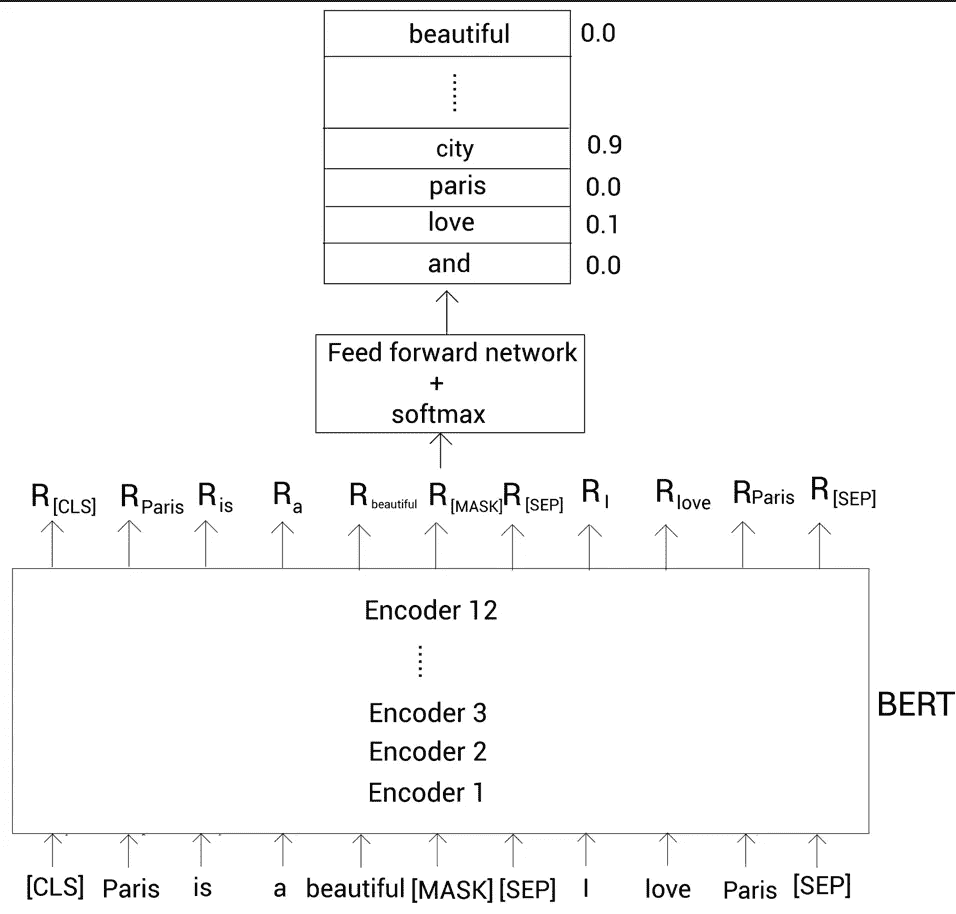

# 理解伯特模型

> 原文：<https://medium.com/analytics-vidhya/understanding-the-bert-model-a04e1c7933a9?source=collection_archive---------0----------------------->

苏阿德·卡玛丁在 [Unsplash](https://unsplash.com?utm_source=medium&utm_medium=referral) 上拍摄的照片

> *Bert 是最常用的文本嵌入模型之一。它彻底改变了 NLP 任务的世界。在这个博客中，我们将开始什么是 Bert 模型，它与其他嵌入模型有何不同。然后，我们将详细研究 Bert 的工作及其配置。*

> ***涉及主题*** *:*

*   伯特的基本思想
*   伯特的工作
*   Bert 的配置
*   预先训练 Bert 模型
*   训练前程序
*   子词标记化算法

> 伯特的基本思想

Bert 代表 ***双向编码器表示转换器*。**它在自然语言处理领域取得了重大突破，为许多自然语言处理任务提供了更好的结果，如问答、文本生成、句子分类等等。它成功的主要原因之一是它是一个基于上下文的嵌入模型，不像任何流行的嵌入模型，如 word2vec，它是一个上下文无关的。

首先让我们理解上下文无关和基于上下文的模型之间的区别。考虑下面的句子

***句子 A:他被蟒蛇咬了。***

***B 句:Python 是我最喜欢的编程语言。***

通过阅读这两个句子，我们可以理解单词***【Python】***在这两个句子中的意思是不同的。在 ***句 A*** 中的单词***【Python】***指代一条蛇，而在 ***句 B 中的*** 指代一种编程语言。

现在，如果使用 word2vec 这样的嵌入模型来嵌入单词***【Python】***，我们将为两个句子获得相同的嵌入，因此将在两个句子中呈现单词的含义。这是因为 word2vec 是一个上下文无关的模型，它会忽略上下文，对单词***【Python】***给予相同的嵌入，而不考虑上下文。

另一方面，Bert 是一个基于上下文的模型。它将理解上下文，然后基于上下文生成单词的嵌入。所以，对于前面两个单词，它会给单词***“Python”不同的嵌入。***

***但是这是怎么做到的呢？伯特是如何理解语境的？***

让我们以句子 A 为例，在这种情况下，Bert 将句子中的每个单词与句子中的所有单词联系起来，以获得每个单词的上下文含义。通过这样做，伯特可以理解，单词 ***【蟒蛇】*** *表示蛇。*同样，在句子 B 中，Bert 理解单词***“Python”****表示一种编程语言。*

***现在的问题是伯特到底是如何工作的？它是如何理解上下文的？***

> 伯特的工作

顾名思义，Bert 是基于变压器模型的。要简单了解什么是变压器，请参考我的 [***以前的博客***](/analytics-vidhya/the-ultimate-transformer-and-the-attention-you-need-1dafaf8cb6c7) 关于变压器及其工作原理。

在 Transformer 中，我们将句子作为输入提供给转换器的编码器，它将句子中每个单词的表示作为输出返回。这就是 Bert 的确切含义— ***变压器的编码器表示*** 但是 ***双向，因为变压器的编码器是双向的。***

***一旦我们将句子作为输入馈送给编码器，编码器就会使用多头注意力机制来理解上下文。***

> Bert 的配置

***研究者们提出了伯特的两种主要构型***

*   ***T43【伯特-大号】T44***

****Bert-base*** —有 ***12 个编码器层*** 堆叠在另一层的顶部， ***12 个注意头*** 和由 ***768 个隐藏单元*** 组成。参数 Bert-base 总数为***1.1 亿*** 。*

****Bert-large***——有 ***24 个编码器*** 层层叠放， ***16 个注意*** 头和由 ***1024 个隐藏单元*** 。Bert-large 的参数总数为 ***3400 万*** 。*

*除了两种标准配置之外，还有其他 Bert 配置，例如 Bert-mini、Bert-tiny、Bert-medium 等。*

*我们可以在计算资源有限的环境中使用较小的 Bert 配置。然而，该标准给出了更准确的结果，因为它们被广泛使用。*

> *预先训练 Bert 模型*

*预训练一个模型意味着用一个巨大的数据集为一个特定的任务训练一个模型，并保存训练好的模型。现在对于一个新的任务，我们将初始化已经训练好的模型的权重，而不是用随机权重初始化一个新的模型。由于模型是在一个巨大的数据集上训练的，而不是为一个新任务从头开始训练模型，我们使用预训练的模型，并根据新任务调整(微调)其权重。这是一种迁移学习。*

*Bert 模型使用两个有趣的任务在巨大的语料库上进行预训练，这两个任务被称为掩蔽语言建模和下一句预测。对于一个新的任务，比方说问答，我们使用预训练的 Bert 并微调其权重。*

> ****输入数据表示****

*在将输入馈送给 Bert 之前，我们使用 3 个嵌入层将输入转换成嵌入*

*   *令牌嵌入*
*   *片段嵌入*
*   *位置嵌入*

****令牌嵌入****

*我们举个例子来理解这一点。考虑下面两句话*

*巴黎是一座美丽的城市。*

*句子 B:我爱巴黎。*

*首先，我们对这两个句子进行了标记，我们的输出如下*

****|tokens =【巴黎，是，一个，美丽，城市，我，爱，巴黎】****

*然后，我们在令牌的开头添加一个名为[cls]的新令牌*

****|tokens =[[cls]，巴黎，是，一个，美丽，城市，我，爱，巴黎]****

*然后我们在每个句子的末尾加上[sep]标记*

****|tokens =[[cls]，巴黎，是，a，美丽，城市，[sep]，我，爱，巴黎]****

****【cls】***记号用于分类任务，而***【sep】***用于表示每个句子的结束。现在，在将令牌提供给 Bert 之前，我们使用称为令牌嵌入层的嵌入层将令牌转换为嵌入。注意，嵌入的值将在训练期间学习。*

****段嵌入****

*片段嵌入用于区分两个给定的句子。*

*让我们再次考虑我们之前的例子。*

****|tokens =[[cls]，巴黎，是，a，美丽，城市，[sep]，我，爱，巴黎]****

*现在，除了***【sep】***之外，我们还必须给我们的模型一些指示符，以区分这两个句子。为此，我们将输入令牌提供给片段嵌入层。*

*片段嵌入层仅返回两个嵌入 e A(句子 A 的嵌入)或 e B(句子 B 的嵌入)中的一个，即如果输入标记属于句子 A，则 EA 否则 EB 用于句子 B*

**

****位置嵌入****

*因为我们知道转换器不使用任何递归机制，而是并行处理所有单词，所以我们需要提供一些与单词顺序相关的信息，所以我们使用了位置编码。*

*我们知道 Bert 本质上是转换器的编码器，所以我们需要在将单词直接输入到我们的 Bert 之前给出单词在句子中的位置信息。*

****最终表现****

*现在让我们看看输入数据的最终表示*

**

****分词器****

*Bert 使用一种特殊类型的记号赋予器，称为 ***单词块记号赋予器*** 。单词标记器遵循子单词标记器方案。让我们理解单词块标记器，考虑一个句子*

****“让我们开始预训练模型”****

*现在，如果我们使用单词块来标记句子，那么将获得*

****|token = [let，us，start，pre，###train，##ing，the，model]****

*在对句子进行分词时，我们的单词预处理被分成 3 个部分，这是因为我们的单词片段分词器首先检查单词是否在我们的词汇表中。如果这个单词存在，那么它将被用作一个标记，如果不存在，那么我们的单词将被递归地分割成子单词，直到在我们的语料库中找到这些子单词。这个过程有效地处理了 ***中的不在词汇表中的单词。****

> *培训前策略*

*Bert 模型针对以下两项任务进行了预训练:*

1.  *掩蔽语言建模*
2.  *下一句预测*

*在直接进入这两个模型之前，让我们先了解一下语言建模。*

> ****语言建模****

*在语言建模任务中，我们训练模型来预测给定单词序列的下一个单词。我们可以将语言建模分为两个方面:*

1.  ****自回归语言建模****
2.  ****自动编码语言建模****

****自回归语言建模****

*我们可以将自回归语言建模分类如下*

*   *向前(从左到右)预测*
*   *向后(从右到左)预测*

*现在考虑我们之前的例子 ***“巴黎是个美丽的城市。我爱巴黎”。*** 我们把城市这个词去掉，加个空格。现在，我们的模型必须预测空白。如果我们使用前向预测，那么我们的模型从左到右读取空白处的所有单词，以便进行预测。*

****巴黎是个美丽的 __。****

*但是如果我们使用反向预测，那么我们的模型从右到左读取所有的单词，以便进行预测*

****__。我爱巴黎。****

*因此，自回归模型是单向的，这意味着它们只能从一个方向解读句子。*

****自动编码语言建模****

*自动编码语言建模利用了前向和后向预测，因此我们可以说自动编码模型本质上是双向的。从两个方向阅读句子会使句子更加清晰，因此会得到更好的结果。Bert 是一种自动编码语言模型。*

> ***蒙版语言建模***

*在给定输入的屏蔽语言建模任务中，我们随机屏蔽 15%的单词，并训练网络来预测屏蔽单词。为了预测屏蔽词，我们的模型从两个方向读取。*

*让我们来了解一下掩码语言建模是如何工作的。*

****|tokens =[[cls]，Paris，is，a，漂亮，[Mask]，[sep]，I，love，Paris ]****

*在前面的例子中，我们用***【Mask】***token 替换单词 city。*

*以这种方式屏蔽令牌将在预训练和微调之间产生差异，这意味着我们通过预测 ***【屏蔽】*** 令牌来训练 Bert。在训练之后，我们可以对预训练的 Bert 进行微调，以用于下游任务，例如情感分析。但是在微调期间，我们不会在输入中有任何***【Mask】***标记，这将导致 Bert 的预训练方式和它用于微调的方式之间的不匹配。*

*为了解决这个问题，我们玩 80-10-10%规则。我们知道我们随机屏蔽了句子的 15%,现在对于这 15 %,我们做如下处理:*

*   *80 %的时间我们用 ***【面具】*** 令牌替换单词。*
*   *对于 10 %的时间，我们用随机令牌替换令牌，这样我们的输入将如下*

****【【cls】，巴黎，是，a，美，[sep]，爱，我】****

*   *10 %的时间我们不做任何改变。*

*在标记化和屏蔽之后，我们将输入标记馈送到标记、分段和位置嵌入层，并获得输入嵌入。*

*现在我们将输入嵌入到 Bert 中。Bert 接受输入并返回每个令牌的表示作为输出*

**

*为了预测屏蔽令牌，我们将由 Bert 返回的屏蔽令牌 R[masked]的表示馈送给具有 SoftMax 激活函数的前馈。现在，前馈网络将 R[masked]作为输入，并返回我们词汇表中的单词成为我们的单词的概率。*

**

*掩蔽语言建模任务也称为完形填空任务。屏蔽输入标记时，我们也可以使用稍微不同的方法，称为全词屏蔽。*

> ****全字掩蔽****

*考虑句子 ***“让我们开始预训练模型”，*** 在使用分词器后我们将得到*

****|token =【让，合，开始，预，# # #列车，###ing，the，model】****

*接下来我们将添加***【Cls】***令牌并屏蔽单词的 15 %*

****|token = [[CLS]，[掩码]，us，start，pre，[掩码]，###ing，the，model]****

*正如我们可以看到的，我们已经按照单词预处理的部分屏蔽了一个子单词。在整个单词屏蔽中，子单词被屏蔽，然后我们屏蔽对应于该子单词的所有单词，保留我们的屏蔽率，即 15%。*

****|token = [[CLS]，let，us，start，[面具]，[面具]，[面具]，the，model]****

> ****下一句预测(NSP)****

*NSP 是一个二元分类任务，我们给伯特两个句子，他必须预测第二个句子是否是第一个句子的后续。通过执行 NSP 任务，我们的模型可以理解这两个句子之间的关系。理解这两个句子之间的关系在诸如问答和文本生成的下游任务的情况下是有用的。*

*为了执行分类，我们简单地采用***【CLS】***记号的表示，并用 SoftMax 函数将它馈送给前馈网络，该网络然后返回句子对是 isNext 或 notNext 的概率。***【CLS】***的嵌入基本上持有所有令牌的聚合表示。*

> *训练前程序*

*使用多伦多图书语料库和维基百科数据集对 Bert 进行预训练。我们知道，伯特是使用掩蔽语言建模和 NSP 任务进行预训练的。现在，我们如何使用这两项任务为经过训练的 Bert 准备数据集。*

*让我们考虑两个句子*

*我们喜欢这场比赛。*

****句子 B:调了收音机****

****注意——两个句子的记号总数之和必须小于等于 512。在对两个文本进行抽样时，50%的时间我们将句子 B 视为句子 A 的后续，而 50%的时间则视为不是后续。****

*在对句子进行标记化并在每句话尾添加[CLS]和[SEP]标记后，我们得到*

****|令牌-【【CLS】，我们，乐此不疲，游戏，[九月]，打开收音机】****

*接下来，根据 80–10–10%规则随机屏蔽 15%的令牌。*

****|令牌-【【CLS】，我们，乐此不疲，【面具】，【九月】，调收音机】****

*现在，我们将通过蒙版建模和 NSP 任务来训练伯特。*

> *子词标记化算法*

> ***字节对编码(BPE)***

*它包括以下步骤*

1.  *从给定的数据集中提取单词及其计数*
2.  *定义词汇量。*
3.  *将单词拆分成字符序列。*
4.  *将我们字符序列中的所有独特字符添加到词汇表中。*
5.  *选择并合并具有高频率的符号对。*
6.  *重复步骤 5，直到达到词汇量。*

> ***字节级字节对编码(BBPE)***

*它类似于 BPE，但不是将单词拆分成字符序列，而是将其拆分成字节码序列。它在处理 OOV 单词方面非常有效，在跨多种语言共享词汇方面也非常棒。*

> ***文字片***

*像 BPE 一样，我们在 WordPiece 中做了同样的事情，但是有一点不同，这里我们不基于频率合并符号对。相反，我们基于可能性合并符号对。*

*谢谢你..*