# 了解变压器的构建模块

> 原文：<https://medium.com/analytics-vidhya/understanding-the-building-blocks-of-transformers-c28484788d5a?source=collection_archive---------0----------------------->

变压器作为解决 NLP 问题的一种架构选择已经变得无处不在。本文将介绍一些从零开始理解变压器如何工作所需的基本背景知识。

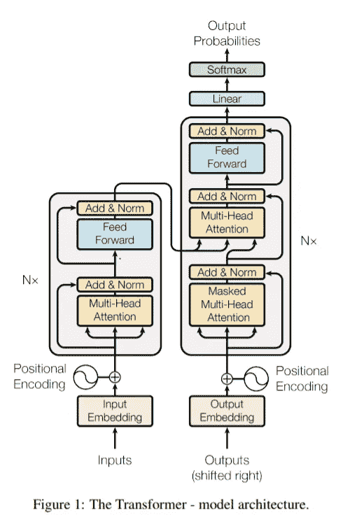

[“你所需要的只是关注”](https://arxiv.org/pdf/1706.03762.pdf)中提出的变压器架构

# **以前的建筑:**

为了理解为什么有人会有这样的想法，我们可以回顾一下变形金刚出现之前的一些架构。

## **编解码 RNN**

在 2014 年，题为“[序列到序列学习与神经网络](https://arxiv.org/pdf/1409.3215.pdf)”的论文介绍了“编码器-解码器”结构，该结构具有 RNN 来编码序列以获得**固定向量长度表示**(以英语为例)。类似地，RNN 解码器会接收固定的向量表示，并将其逐字转换成法语。这很有用，因为两个序列都可以是**可变长度**，这在语言翻译过程中很常见。

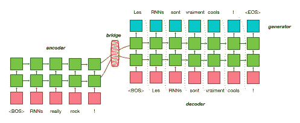

用于 NMT 的编码器-解码器结构的例子

在上面的例子中，我们可以看到“RNN 的真正摇滚”是如何被转换成法语的。**最后一个“隐藏状态”作为句子整个上下文的固定编码**。然后，解码器获取该上下文，即开始标记，并预测 timestep_0 的字分布。那么同一个单词(上图中的“Les”)将作为下一个时间步长的输入。

我们已经可以尝试找出一些可以尝试和改善这一点的调整。

为什么我们应该将整个输入句子**表示为一个固定的表示？**当然，如果有一个很长的句子，**一个固定的向量不能很好地处理整个上下文**。这就是注意力集中的 RNNs 带着论文[“通过联合学习对齐进行神经机器翻译&翻译](https://arxiv.org/pdf/1409.0473.pdf)”进来的地方。

## **编解码 RNNs 关注:**

这里**不是使用固定的上下文表示，而是通过搜索输入句子在每个时间步**计算上下文向量。因此，有效地，给定解码器的隐藏状态，模型决定输入序列的哪一部分对它翻译(或生成)当前单词是重要的。

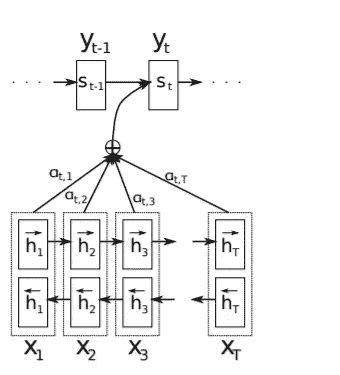

注意力集中的编码器-解码器

让我们试着弄清楚上图是怎么回事。我们的输入序列由单词(X1，X2 …XT)给出，其中每个单词通过双向 RNN 馈入，其中 h1，h2..是隐藏的状态。在没有注意的情况下，我们将向量 **h_T** 作为我们的上下文向量。但是在这种情况下，我们通过一些权重α对我们所有的隐藏状态和解码器 **S_t-1** 的先前状态进行线性组合，以预测 **S_T** 以及随后我们当前时间步长的翻译后的字 **Y_t** 。

针对单个预测的注意力模型的步骤如下:

1.  **编码器&解码器**:编码器保持不变。给定时间步长 t 处的输入，新的隐藏状态被计算为输入和先前隐藏状态的函数。解码器曾经有一个固定的上下文向量 c，**，但是现在在解码器的每个时间步长 I，我们使用不同的向量**。

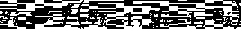

解码器

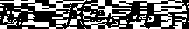

编码器

2.**相似度得分:**我们如何知道各种隐藏状态与预测解码器中当前单词的相关程度？我们计算所有隐藏状态和先前解码器状态之间的**对准分数**。

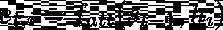

这里 **e** 是每个先前的解码器隐藏状态和编码器隐藏状态之间的相似性分数。F_att 可以是 MLP，甚至是点积，这将有助于确定分数。其想法是， *t* ***他的分数越高，隐藏状态(以及因此的输入)对当前翻译的单词*** 的贡献就越大。

3.**注意力权重——转换成概率:**我们简单地通过 softmax 运行所有相似性得分，将所有得分转换成概率分布。根据上图，这些是我们的权重α。

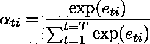

4.**计算上下文向量:**一旦我们获得了与编码器的每个隐藏状态相关联的这些概率，我们计算上下文向量如下

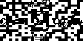

5.**使用**上下文向量 C_i** 、先前预测的单词 **Y_(i-1)** 和先前解码器隐藏状态 **s_(i-1)** 来预测翻译后的世界**

```
Example: English to FrenchSource Sentence: "I am eating pizza"Translated sentence: "je mange des pizzas"The intuition would be that while predicting the word "eating" the similarity score of "mange" would be higher.
```

最令人惊讶的是，这不是一个受监督的过程。我们没有明确地告诉模型关注序列中的特定部分。由于整个函数是可微的，在回推期间，模型**自动收敛到序列的最佳部分，以关注**。

## **使用 RNNs 的缺点:**

不知何故，我们想摆脱顺序计算。对于 RNNs，每个隐藏状态都依赖于前一个状态。借助现代 GPU，我们希望通过一次巨大的矩阵乘法一次性处理整个输入序列。此外，我们还必须确保能够处理更长的序列。

## **概括#1 —单个查询向量**

1.  我们有 i **nput 向量 X** (形状:Nx，Dq)，它可以被认为是前面例子中编码器的隐藏状态。
2.  我们引入了**查询向量 q** (Shape: Dq)，它可以被认为类似于我们用来计算相似性得分的先前解码器状态。实际上，这可以看作是我们搜索最相似输入的查询。
3.  作为我们的相似性函数，我们使用一个**缩放的点积**，其中我们将查询向量与输入相乘，该输入由查询向量**的维度的平方缩放。**X 中第 I 个输入的得分如下所示:

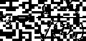

```
Side note: Why do we use the square root?A higher dot product would cause a higher softmax for that input, and a very low probability for all others. This causes very low gradients during back-propagation. Hence a scaling factor, the square root of the query vector dimension is used to prevent this.
```

## **泛化#2 多个查询向量&关注层**

1.  我们可以有 Nq 个查询向量，并用矩阵乘法计算相同的相似性得分，而不是只有一个查询向量 q。所以现在我们有了 **Q** (形状:Nq，Dq)
2.  **输入向量 X** (形状:Nx，Dq)

**计算:**

1.  **相似性:**我们用一次矩阵乘法来计算相似性

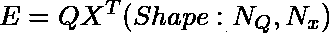

该矩阵的每个元素由下式给出:

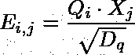

其本质上是第**个查询向量** r 和第 j **个输入**之间的点积

2.**注意力权重:**正如我们在前面的例子中所做的，我们通过 softmax 运行我们的矩阵 E，以获得每个查询向量的所有输入的概率分布。

**A= Softmax(E，dim=1)**

对于 3 个查询向量和 3 个输入向量

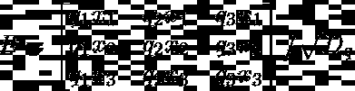

相似矩阵

归一化后，该矩阵的每一列的总和将为 1

3.**输出向量:**我们将输出向量定义为注意力权重的线性组合，类似于我们在前面的例子中如何找到上下文向量。

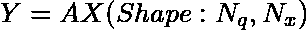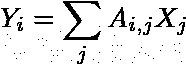

输出的每个元素由关注矩阵的列与输入的线性组合给出。

现在我们差不多有了 ***一个自给自足的层*** ，有输入(X1，X2…)和输出(Y1，Y2)...).

## **概括#3 键和值矩阵**

在之前的归纳中，我们使用了两次输入向量，一次是计算相似度，另一次是计算输出。

为了区分这两个任务，我们创建了两个可学习的矩阵:

**键矩阵&值矩阵:**

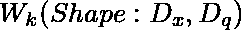

关键矩阵

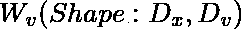

价值矩阵

这个想法是将我们的输入转换到两个空间，一个是当我们想要计算我们与查询的相似性时。另一个是当我们检索与查询相关的值时。

**所有涉及的计算:**

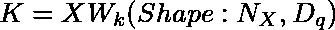

关键向量

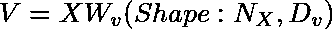

价值向量

注意我们是如何输入两次来计算键和值向量的。现在，我们必须计算我们与键的相似性和与值的输出。

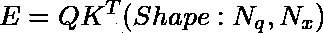

查询和关键字之间的相似性矩阵

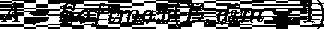

注意力权重

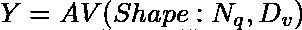

以值的线性组合形式输出

就是它，这就是我们的“**注意力层**”，我们可以用它来比较我们的查询和输入！

## **泛化#4 自我关注**

我们正在慢慢进入这些变形金刚的一个组成部分。在前面的概括中，我们有单独的查询向量。但是如果你必须在一个序列中找出每个单词所指的是什么呢？或者换句话说，给定一个单词，我们想要计算出在序列的其余部分的注意力权重。比如你有一句“我过了河就到了银行”之类的话。**银行是指河岸还是真正的银行？为了表示“银行”，我们需要整个句子的上下文。与 RNNs 不同的是，自我关注机制正是以并行方式做到这一点的。这是变压器的主要部分。对于输入-输出依赖，我们使用自我关注，而不是递归或卷积。**

transformer 架构以 3 种不同的方式使用自我关注。让我们看一下在论文演示中给出的例子。输入的句子是“动物没有过马路是因为它太累了”:

1.  Input-Input:输入中的所有单词相互照应。

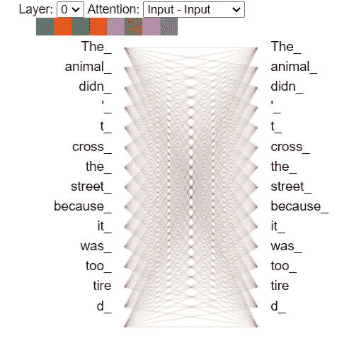

2.输入-输出:就像我们的 RNN 编码器-解码器结构一样，在翻译过程中，我们希望知道输入序列中的哪些单词对应于翻译。

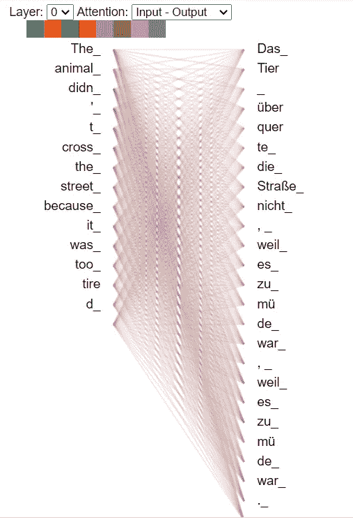

3)输出-输出:我想在相应的图中显示权重，而不是连接。你注意到什么不同了吗？

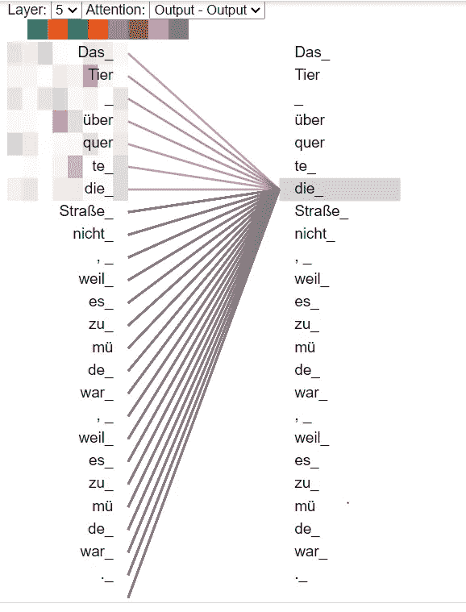

在翻译的输出中，好像网络没有在翻译的序列中向前看。这是合乎逻辑的，因为在翻译过程中，你不希望你的网络已经注意到它还没有翻译的单词。在上面的例子中，我们看到了在“die”之前的主动权重词。这是一个很好的技巧，当你把相似性矩阵推到一个大的负数时，那么 post softmax 那些概率会变成 0。它被称为**被掩盖的自我关注。**

**自我关注的计算:**

1.  输入向量 X(形状:Nx，Dx)
2.  关键矩阵:W_k(形状:Dx，Dq)
3.  价值矩阵:W_v(形状:Dx，Dv)
4.  查询矩阵:W_q ( Shape: Dx，Dq):唯一新的可学习矩阵，它将我们的输入转换为查询

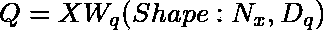

查询向量

这是唯一的区别，我们发现键、值、相似性和输出与归纳#3 类似。

**自我注意是排列同变:**

这意味着输入中的任何排列都会产生完全相同的输出，但排列方式相似。这意味着如果你改变句子的顺序，模型不会真的知道。这就是作者在输入中嵌入**额外位置编码的原因。**

## 概括#5 多头自我关注

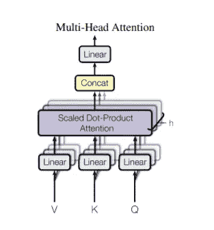

论文中描述的多头自我关注

我们将这种计算重复 8 次，而不是只有一个自我关注模块。不同组的键、值和查询矩阵用于转换我们的输入。我们还降低了每个头部的维度，以保持它在计算上类似于单个注意力头部。例如，如果我们先前使用 512 作为我们的模型尺寸，并且如果我们必须分成 8 个头。我们将使用 64 作为每个键、值和查询矩阵的维度。最后，当我们连接所有这 8 个头时，我们将得到一个输出维度(*Nx，64x8)。但是我们的输入是(*Nx，512)的，应该和我们的输出大小一样。因此需要另一个形状为(64x8，512)的矩阵 **W_o** ，将我们注意力的输出转换为(*Nx，512)。

```
**Example:**We have a sentence which needs to be translated:"The boy plays on the field" We assume an embedding dimension of 512 for each word.Therefore our input X is of size (5,512)Now, let's assume 8 attention heads and an query dim of 64.Therefore each of our matrices (key,query&value) would be of size (512,64).Post applying the self-attention mechnaism each of these 8 heads would give us an output of (5,64).Now if we concatenate 8 of these matrices we would get one giant matrix of size (5,64*8) which would finally be transformed by the W_0 matrix to the same size as our input vector (5,512)
```

## **其他图层**

贴出这个自我关注层，就有了层正常化之后的全连通网络。此外，在所有这些层之间的输入和输出之间存在剩余连接。注意力标准化前馈网络的同一块被重复。它们被用于编码器和解码器。我打算在另一篇文章中用一个实际的编码示例更深入地研究它们。