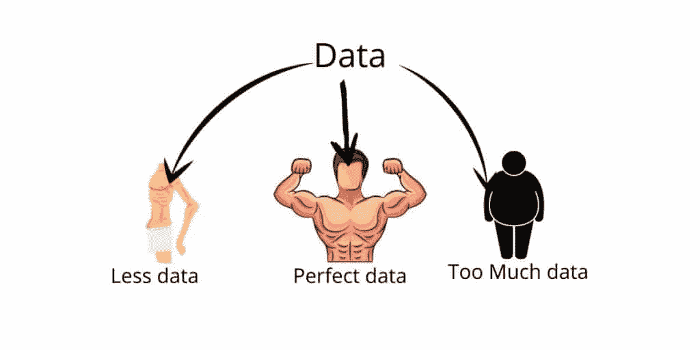

# 理解数据对 ML 的重要性。— ML 代表懒惰 2021

> 原文：<https://medium.com/analytics-vidhya/understanding-the-importance-of-data-for-ml-ml-for-lazy-2021-a8b4265e447b?source=collection_archive---------9----------------------->

数据是机器学习最重要的必备食物。它可以是任何事实、文本、符号、图像、视频等。，但以未加工的形式。当数据被处理时，它被称为信息。没有数据的机器学习只不过是一台没有灵魂没有头脑的裸机。这些数据让机器完成如此惊人的任务，这在几年前是我们没有想到的。

尽管如此重要，但机器并不理解数据代表什么。他们不明白为什么‘a’是‘a’，为什么要这样写或者为什么‘this’是什么意思。我们大多数人不了解我们吃的食物。我们唯一知道的是，我们必须吃东西，而且我们就是这样做的。我们不在乎背景和前景。机器学习的数据就是食物。它只是消耗数据，然后学习不同数据之间的关系，而不是理解数据。

所以基本上，所有机器所做的，就是找到不同数据之间的关系。请和我一起理解为什么数据很重要，为什么机器不理解数据，却能找到数据之间的关系。

# 数据对于机器学习的价值是什么

数据对于机器学习至关重要，没有数据，机器学习是不可能的。它需要某种形式的数据。就像我们人类需要食物来发展心智，然后当我们通过视觉、听觉等获得另一种类型的数据时。，并从这样的数据中获取经验。这些数据对我们未来的人类起着至关重要的作用。

同样，机器学习的数据对于增长其经验和根据输入的数据做出决策的能力也很重要。这种用于机器学习的数据可以有两种类型—(对于初学者):

# 数据

这种类型的数据是数字的形式，并且只有数字。这是一种很好的数据类型，所有的机器学习模型都与数据一起工作。所有其他数据类型都需要转换成这种形式，然后将这些数据输入到机器中——如 1、2、年龄、工资、经验等数据。

# 分类数据

这是另一种类型的数据。通常，包含文本、符号等字符的数据属于这一类。这种类型的数据首先要使用一些技术转换成数字形式，这一点非常重要。除非经过转换，否则机器无法获取这些数据，也无法建立输入和输出数据之间的关系。在处理这种类型的数据时，记住这一点很重要。

如果你想深入了解数据的类型，请阅读**张萌**的[惊人帖子](https://7r6.com/VcnNydBK)。

> 总是将分类数据转换成数字数据

# 应该有多少数据。

这也是处理机器学习时需要考虑的一个本质点。多少是一个重要的因素，请记住，我们应该有足够的数据，使机器不会饿死，也不要有太多的数据，使机器不会变得一文不值。

非常重要的一点

> 太少和太多都不利于机器，也不利于人类和所有生物。

有时我们只有很少的数据，而在那些时候，我们必须获得更多的数据。有各种技术可以获得更多的数据。

1.  第一步应该是通过调查、问卷等手动获取数据。如果这样的事情是不可能的，那么其他技术确实存在这样的目的。
2.  数据扩充是用于产生更多数据的技术之一。它产生假数据，这些数据可以用于机器学习。

而且有时候，我们有更多的数据，在那些时候，我们留下一些数据，只使用一些数据。但这可能会导致有价值的数据丢失。

另一种方法使用所有数据，但是每个训练阶段都留下一些数据，只使用一些数据。在下一次训练中，使用另一个数据，并省去一些其他数据。

# 拆分数据

当我们训练一个机器学习模型时，我们必须在一些数据上测试它。就像学生在考试中被测试一样。出于这样的目的，我们留下一些数据用于测试，只使用一些数据用于训练。用于测试的数据称为测试数据，用于训练的数据称为训练数据。

测试数据应该对机器隐藏起来，只在测试阶段使用，而不是在此之前。整个目的就是看机器学习的有多好。

# 机器学习什么？

当训练模型和数据作为机器的输入时，机器遍历数据集中的每个数据项。它学习数据，记住数据模式。当我们最终要求机器做出预测时，它会使用以前从数据中收集的知识和经验，并做出预测。

假设我们举一个天气预报的例子。当数据被提供给机器时，它将输入映射到输出，即映射原因和结果。当我们要求预测，并给出一些数据，如温度等。它使用以前数据的映射，即来自经验的训练数据，并预测给定的数据。

所以，机器学习数据的映射，并根据经验做出预测，如果预测是真的，那么机器已经学习了，如果是假的，那么就有改进的空间。机器学习总会有错误，人类也一样。学习的目的是最大限度地减少这些错误，减少预测与实际的差距。

# 结论

这篇文章看到了数据对机器的重要性，以及为什么数据应该充分呈现。对于机器来说，数据就像食物和经验，正是这些数据使机器学习成为可能。

在投入机器学习项目时，确保你有足够的数据。如果你喜欢这篇文章，给它竖起大拇指，并分享这个。

想看前面的[篇](https://mlforlazy.in/classification-machine-learning-projects/)，里面给出了 4 个项目的清单，供新手分类。

我是一名来自克什米尔的计算机科学研究生。在这些日子里，我转向传播关于机器学习的信息，这是我的激情和未来的研究。目的是让人们了解和理解机器和深度学习本身的基本概念，这些概念对该领域的进一步成功至关重要。

*原载于 2021 年 5 月 9 日*[*https://mlforlazy . in*](https://mlforlazy.in/understanding-and-importance-of-data-for-ml/)*。*