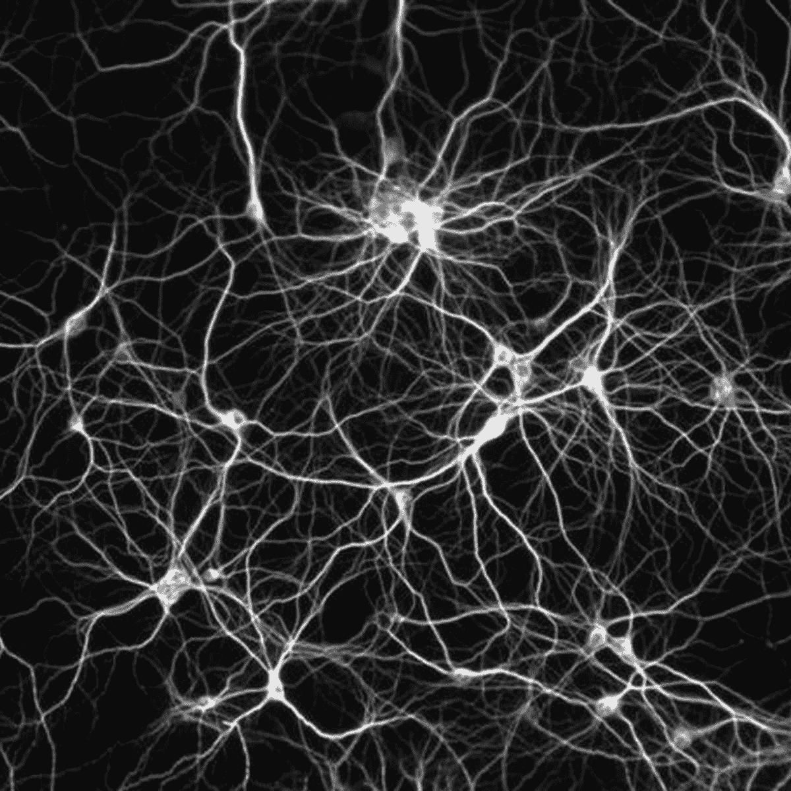

# 理解感知器算法

> 原文：<https://medium.com/analytics-vidhya/understanding-the-perceptron-algorithm-4a368f493109?source=collection_archive---------2----------------------->

神经网络。如果那么 else / Wikimedia， [CC BY-SA](http://creativecommons.org/licenses/by-sa/4.0/)

## 循序渐进的例子

感知机由 Frank Rosenblatt 于 1958 年在康奈尔航空实验室发明，是一种二进制分类算法，属于[神经网络](https://towardsdatascience.com/neural-networks-parameters-hyperparameters-and-optimization-strategies-3f0842fac0a5?source=your_stories_page-------------------------------------)算法群。

更具体地说，感知器是一个单层前馈神经网络，其能力仅限于二元和线性分类…