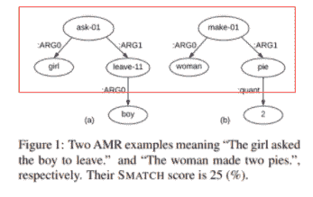
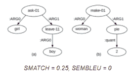
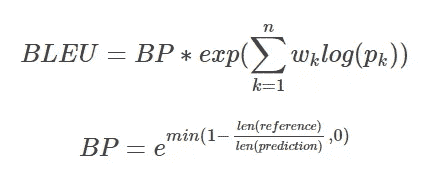
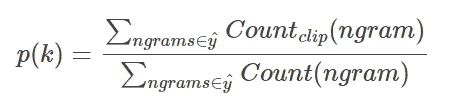
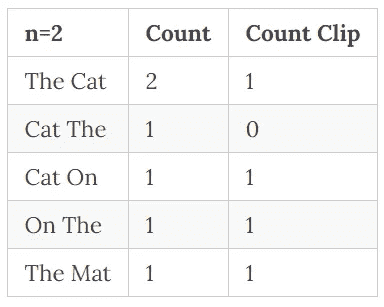
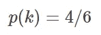
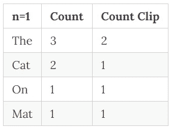
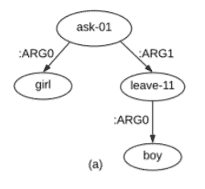

# 了解 SEMBLEU(和 BLEU)度量

> 原文：<https://medium.com/analytics-vidhya/understanding-the-sembleu-and-bleu-metric-2e8a01cedcb3?source=collection_archive---------15----------------------->

# 一种健壮的 AMR 解析评估方法

我最近开始探索语义推理的抽象意义表示。我熟悉流行的 SMATCH 指标，但今天我将学习一下 [SEMBLEU](https://arxiv.org/pdf/1905.10726.pdf) ，这是一个针对 AMR 解析器的更健壮的评估。

# 自主移动机器人（Adaptive Multi-Rate 的缩写）

AMR 图的要点是将句子的语义编码成有向图。图中的节点表示句子中的语义术语，边标识节点之间的语义关系。语义推理任务的一个主要目标是能够从常规句子中提取这些图形。如果我们可以自动提取句子的语义和相应的关系，这将对 NLP 产生巨大的影响，因为现代语言模型通常很难理解许多关于语义的内容(特别是长距离语义关系)。

在从输入句子中自动提取 AMR 图的努力中，我们需要适当的评估度量来理解推断图和金色标记图之间的相似性。为此，人们历来使用 SMATCH 指标进行 AMR 评估。

# SMATCH

比较两个 AMR 图是否相似的经典方法是使用 *SMATCH* 性能指标**，它可以有效地解决两个图之间的最佳映射，并计算相应的 F1 分数**。这有几个问题。

1)寻找精确的最佳映射是一个 NP 完全问题。因此，找到最佳匹配的良好近似的结果策略容易出错，这削弱了度量的质量。有一些方法可以使这种方法不容易出错，比如用不同的随机初始化多次运行它，但是，这是非常昂贵的。

SMATCH 的另一个问题是，在比较边标签时，不考虑节点内容。因此，如果节点不正确，但边是正确的，则 SMATCH 奖励实际上没有意义的模型。

图鸣谢:[林峰宋和丹尼尔吉尔迪](https://arxiv.org/pdf/1905.10726.pdf)，有修改

考虑图 1 中的两个 AMR 图，其给出的 smatch 得分为 0.25。有人可能会问，**为什么我们要给没有语义相似性的图任何分，即使存在一些边标签对齐的配置**？这显然是一个有缺陷的程序，塞姆勒试图解决这个问题。

# 塞姆勒乌

让我们介绍一下 SEMBLEU，它是对常用于评估机器翻译模型输出的 BLEU 度量的改编。

## 为什么使用 SEMBLEU

SEMBLEU 将节点/边视为 n-gram，从而强制评估过程将节点和边标签作为一个单元进行匹配

*   这确保了模型不会被错误地归因于 F1 点，以在不正确的节点对上产生正确的边标签。

SEMBLEU 不会出现搜索错误，而且速度明显更快

*   SEMBLEU 通过计算 AMR 图上的 BLEU 分数来工作，其中每个 n 元文法由节点和边组成

通过扩展我们想要查看的节点的 n-grams 数，我们可以评估图中越来越长的依赖关系。

*   例如，如果我们在一个 SEMBLEU 计算中考虑一个三元组，那么我们要看这个模型是否正确地识别了一系列的 3 个节点。在评估期间要考虑的 n-grams 的数量是 SEMBLEU 系统的超参数。

图鸣谢:[林峰宋和丹尼尔吉尔迪](https://arxiv.org/pdf/1905.10726.pdf)，有修改

# 计算组件

## BLEU 的背景知识

原始 BLEU 度量用于识别机器翻译算法执行得有多好。如果我们不使用 BLEU，而使用 Precision 这样的度量标准，会发生什么

> 参考文献 1:猫在垫子上
> 参考文献 2:垫子上有只猫
> 预测翻译:The The The The

在上面的例子中，我们可以通过查看预测翻译中的每个单词是否出现在参考句子中来评估预测翻译。然而，这会给我们 4/4 的精度，这显然不是翻译质量有多高的良好表示。

BLEU 做的更聪明！让我们看看 BLEU 的等式

其中 *k* 是考虑中的 n-gram 的数量，而 *w_k* 是我们对每个 n-gram 的分类的权重。“简洁惩罚”，BP 用来鼓励长句子。 *len(参考)*和 *len(预测)*分别指参考句和预测句的长度。

让我们通过一个例子来学习 p(k)的含义。假设我们想要将这个预测的翻译与我们的两个参考句子进行比较。

> 参考文献 1:猫在垫子上
> 参考文献 2:垫子上有一只猫
> 预测翻译:猫垫子上的猫

在上表中，计数是每个二元模型在预测翻译中出现的次数。计数片段(BLEU 的核心)是二元模型在任一句子中出现的最大次数。

给定这些信息，我们可以计算 *p(k)*

现在再次为 *n=1*

我们看到 *p(k)=5/7*

为了计算 BLEU 分数的其余部分，我们可以简单地将句子长度插入 BP 计算中，并根据我们对分类单词和双词的关心程度来选择每个 n-gram 的权重。如果我们想平等地衡量它们，我们可以简单地将它们设置为 0.5。

# 为语义图调整 BLEU

我们可以使用同样的想法来计算两个语义图之间的关系，正如在 SEMBLEU 论文中介绍的那样。需要进行的高级别调整如下

1)我们使用图中的节点，而不是将 n 元语法视为句子中的单词。具体来说，一元图将由单个节点组成，二元图将由两个节点和一条边组成，三元图将有 3 个节点和 2 条边，等等。

在下图中，我们会发现一个二元模型= (ask-01，ARG1，leave-11)

图鸣谢:[宋和](https://arxiv.org/pdf/1905.10726.pdf)

2)我们不考虑句子长度(在 *BP* 术语中),而是使用图形大小。明确地

3)我们从所有可能的根节点开始计算 n 元文法。

现在我们可以将与 BLEU 相同的逻辑应用于语义图！我们将从预测图中获得所有的 n-grams，检查它们是否出现在参考图中，并计算 BLEU 分数！

# 参考

塞布勒纸:【https://arxiv.org/abs/1905.10726】T4布鲁纸:[https://www.aclweb.org/anthology/P02-1040/](https://www.aclweb.org/anthology/P02-1040/)