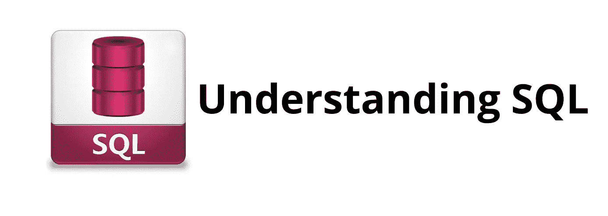

# 新手理解 SQL

> 原文：<https://medium.com/analytics-vidhya/understanding-the-sql-as-a-newbie-284cb3eb8387?source=collection_archive---------19----------------------->



对一大群人来说，听到 SQL (sequel)这个词听起来仍然令人生畏。对于一些人来说，这是一个常见术语，我们基本上是在工作或想要描述数据库时听到的，但是对于外行人来说，SQL 是一些需要详细解释的术语。

那么什么是 SQL 呢？

它被称为结构化查询语言。它是一种专门为管理数据库中的数据而设计的语言。

*一个* [*数据库*](https://en.wikipedia.org/wiki/Database) *是一个有组织的数据集合，一般以电子方式存储和处理。一个例子是关系数据库管理系统(*[*)RDBMS*](https://en.wikipedia.org/w/index.php?title=Relational_database_management_system&redirect=no)*像 Mysql、Postgre、SQLite、& SQL server。)和一个 NoSQL 数据库系统(NoSQL 像 MongoDB，Redis，Cassandra。)*

我们有哪些类型的数据库？通常，在关系数据库中，数据存储在关系表中，称为模式。在 [NoSQL](https://en.wikipedia.org/wiki/NoSQL) 中，数据以 JSON 等其他数据形式存储。这使得键值对能够在任意点嵌套值。

**SQL 是如何下载的？**

对于我们目前拥有的所有已知计算机，如 Windows、Mac 和 Linux 操作系统，安装上面列出的任何示例都是可能的。我们将推荐一个免费的、流行的关系数据库管理软件，如 MySQL、SQLite 和 Microsoft Server。我的 SQL 的下载步骤可以在所有机器上找到。

**访问 MySQL 服务器。**

在您的机器上成功安装后。建议使用图形用户界面(GUI)进入服务器。这可以通过使用 Microsoft server management studio 或在您的机器上安装 Postgres 服务器，最后是 SQLite 来实现。使用命令提示符(CMD)或终端(macOS)也可以连接到数据库。

**SQL 中的命令**

SQL 中的命令包括数据定义语言(DDL)、数据*操作语言(DML)* ，最后是数据控制语言(DCL)。

**数据定义语言(DDL)** 是一种用于定义数据库模式的语言。很好的例子是创建、更改和删除。

```
DROP TABLE IF EXIST customer;CREATE TABLE customer(
  customer_id INT ,
  execution_time DATETIME, 
  direction VARCHAR(6), 
  execution_size FLOAT , 
  execution_price FLOAT , 
  instrument_id INT 
);
```

*数据操纵语言主要是操纵数据库中的数据。它们是选择、更新和删除。*

```
*SELECT customer_id, SUM(execution_price * executuion_size) as size from customer group by customer_id order by size desc limit 5;*
```

*而 ***数据控制语言(DCL)*** 包括向数据库授予权限和其他控制功能的命令。这包括授予和撤销。*

*本文仅涵盖 SQL 的介绍部分。这里的知识是更基础的。为了进一步了解，下面列出了进一步阅读的建议。*

1.  *[https://www.w3schools.com/sql/sql_intro.asp](https://www.w3schools.com/sql/sql_intro.asp)*
2.  *https://www.tutorialrepublic.com/sql-tutorial/*
3.  *【https://www.dataquest.io/blog/sql-basics/ *