# 了解 StyleGAN 和 StyleGAN2 架构

> 原文：<https://medium.com/analytics-vidhya/understanding-the-stylegan-and-stylegan2-architecture-add9e992747d?source=collection_archive---------1----------------------->

这篇文章包含了对 StyleGAN 和 StyleGAN2 架构的介绍，这将让您有所了解。从 StyleGAN 开始可能对你有帮助。您会发现一些您不知道的度量或操作名称，要深入了解 StyleGAN 和 StyleGAN2，您可以浏览参考资料部分提供了链接的文章。

让我们从 StyleGAN 开始，然后我们转向 StyleGAN 2。

# StyleGAN

他们在“GANs 渐进增长”架构的发电机部分所做的主要改变。下面你可以看到传统的和基于风格的生成器(新的或风格网络)网络。

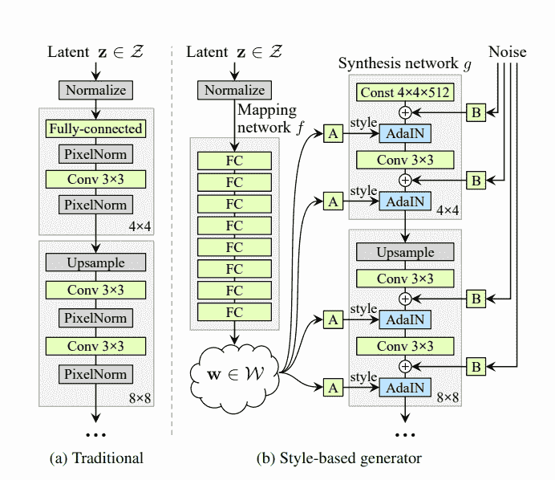

风格建筑

在传统网络中，潜在向量在归一化之后直接进入块，而在 StyleGAN 网络中，归一化之后的潜在向量通过映射网络(8 个完全连接的网络的层)，然后输出被变换(A 代表仿射变换，其是线性变换和平移的组合)并被传递到块，并在实例归一化(AdaIN 即自适应实例归一化)之后被添加噪声 B。

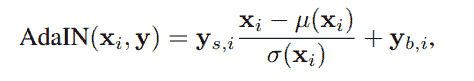

自适应实例规范化

上面，你可以看到 AdaIN 的公式，其中 x 来自 conv 网，y 来自左侧网。很明显，在等式中可以看出，在 x 归一化后，y(s，I)用于缩放，y(b，I)作为偏差用于变换。下面你可以看到一个简单的样式。

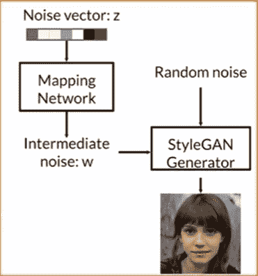

在官方论文中，你将看到 CelebA 和 FF(Flickr Faces)高质量数据集上的结果，其中他们使用从训练集中随机抽取的 50K 张图像显示了 FIDs (Frechet inception distances)分数。下面你可以看到结果

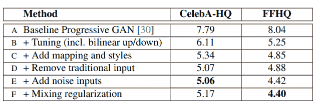

对应于 CelebA 和 FF 高质量数据集上不同配置的 FIDs 分数

他们从基线配置 A(渐进式 GAN)开始，在添加双线性上/下采样、长训练后，他们看到了改进。然后添加映射网络和 AdaIN 操作，或者在配置 D 中，他们从综合网络中移除传统输入，并用 4x4x512 常数张量来替换它们。

我们可以看到 FIDs 值相对于传统生成器(B)的改进，启用混合正则化(该操作也称为样式混合)可以对样式和高级方面(如姿势、发型、眼镜等)进行更多控制。

这是对 StyleGAN 架构的简单介绍，现在让我们看看 StyleGAN 2 中有哪些改进，并了解其架构。

# 风格根 2

在下图中，您可以看到从 64x64 分辨率生成的图像中的缺陷或模糊部分。这是重新设计生成器的主要原因，生成的图像质量也有所提高。

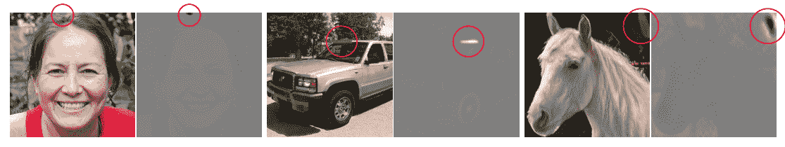

水滴状伪像

那么，让我们来看看网络架构中的哪些变化一步步提高了生成图像的性能。下面你可以看到建筑方面的改进

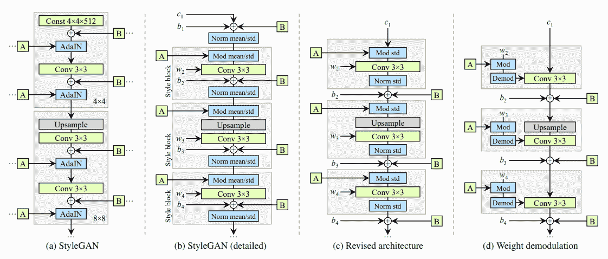

StyleGAN 合成网络改进

A 部分是相同的 StyleGAN 架构，B 部分显示了 StyleGAN 架构的详细视图。在 C 部分中，他们用调制(或因子的缩放)和归一化替换了 AdaIN(自适应实例归一化)。下面你可以看到调制(左侧)和正常化(右侧)方程。

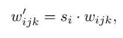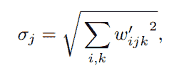

调制和标准化

此外，在 C 部分，他们将噪声和偏置转移到模块之外。最后，在 D 部分中，你可以看到权重随着样式而调整，归一化被“解调”操作所取代，组合操作被称为“权重解调”。参见下面的公式。

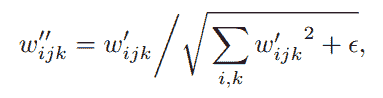

权重解调

可以看到，这个方程似乎是上述两个调制和归一化方程的组合(ε是一个小的常数值，用于防止被零除之类的数值问题)。结果可以在下面的输出中看到，在用解调代替归一化之后，消除了液滴状伪像。

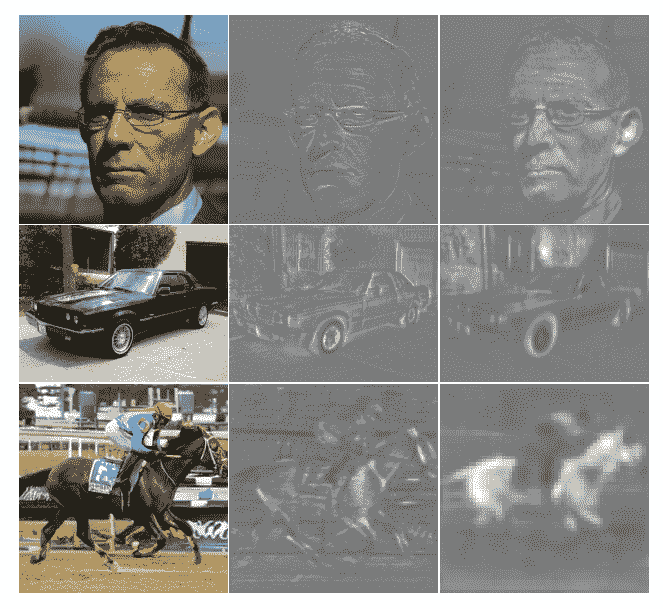

权重解调后生成的图像

现在，我们已经看到了生成图像形式的改进。让我们看看使用 FID、感知路径长度(在 StyleGAN 的论文中介绍，PPL 越低，生成的图像越好)等指标测量的改进。

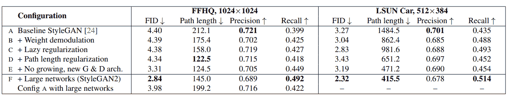

最终样式 GAN 2 网络的主要结果

从上表可以看出，采用不同方法后，配置有所改善。路径长度正则化和惰性正则化用于保持 PPL 分数较低，表明生成的图像更清晰或平滑。

网络的逐步发展产生了高质量的图像，但也导致了特征伪影(或相位伪影)，即无论人脸移动到哪里，人的眼睛和牙齿似乎都停留在一个地方，这在官方 StyleGAN2 视频中显示(视频链接附在下面的参考资料部分)。

为了解决这个问题，他们尝试了发生器和鉴别器网络上的其他连接(跳过连接、剩余网络等),发现跳过连接最适合发生器，剩余网络在鉴别器上给出更好的结果。

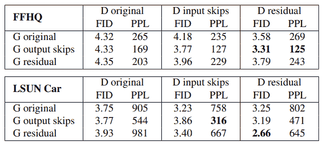

无递增的发生器和鉴别器结构的比较。(G 发生器、D 鉴别器)

上表显示了各种连接组合的结果。此外，在上面的主结果表中，配置 E 和 F 显示了跳过连接类型发生器和剩余鉴别器网络的结果。

下图中， **b** 中突出显示的部分是一个发生器， **c** 中突出显示的部分是一个没有渐进增长的鉴别器。

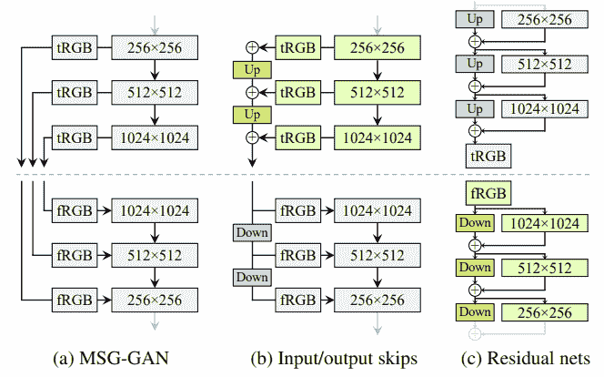

虚线上方是发生器，下方是鉴别器。在上述主结果表的配置 E 和 F 中使用了突出显示的零件。

几乎所有的图片都来自 StyleGAN 和 StyleGAN 2 的官方论文，它们的链接在下面的参考资料部分给出。

# 资源:

1.  [用 StyleGAN 2 合成高分辨率图像——YouTube](https://www.youtube.com/watch?v=9QuDh3W3lOY)
2.  [基于风格的生成性对抗网络生成器架构——YouTube](https://www.youtube.com/watch?v=kSLJriaOumA)
3.  [分析并改善 StyleGAN](https://arxiv.org/pdf/1912.04958.pdf) (StyleGAN 2)的图像质量
4.  用于生成式对抗网络的基于风格的生成器架构
5.  [NVlabs/stylegan2: StyleGAN2 —官方 TensorFlow 实现(github.com)](https://github.com/NVlabs/stylegan2)
6.  [NVlabs/stylegan: StyleGAN —官方 TensorFlow 实现(github.com)](https://github.com/NVlabs/stylegan)