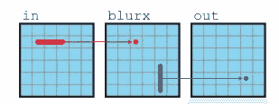
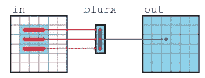
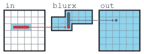
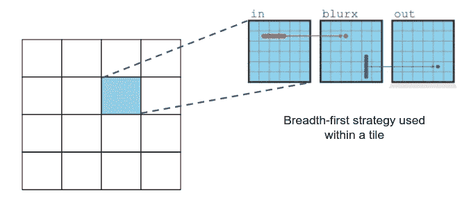
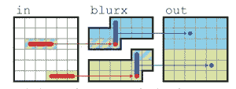
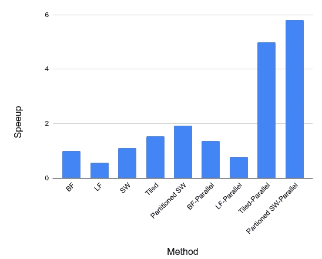

# 论文综述——如何用 C++写一个快速的图像模糊内核？

> 原文：<https://medium.com/analytics-vidhya/understanding-the-trade-offs-between-locality-parallelism-and-redundant-re-computation-de834a2221e?source=collection_archive---------15----------------------->

大家好！今天，我想和大家分享我从阅读[这篇](https://people.csail.mit.edu/jrk/halide-pldi13.pdf)精彩论文 *Halide:一种用于优化图像处理流水线中的并行性、局部性和重新计算的语言和编译器中所学到的东西。*

本文的主要观点(至少对我来说)是，在优化对常规 2D 或 3D 网格状数据结构(例如图像处理流水线、模板计算)进行操作的程序时，您必须在局部性、并行性和冗余重新计算之间做出复杂的权衡。我不想扔给你一堆技术术语，也不想用这篇论文的每一个细节来烦你。因此，让我们深入研究本文中使用的运行示例，并理解为什么我们需要担心局部性、并行性和冗余重新计算。

# 两阶段模糊核

两阶段模糊算法在两个过程中对 2D 图像应用 3×3 平均滤波器。在第一步中，我们在图像上应用 1×3 平均滤波器，这给我们提供了输入的水平模糊。然后在第二遍中，我们对结果应用 3×1 平均滤波器来获得垂直模糊。

实现这种模糊算法的简单方法是首先计算中间图像 *blurx* ，这是对整个图像应用 1×3 水平模糊的结果，然后对 *blurx* 应用 3×1 垂直模糊以计算最终输出(图 1)。注意，我们在计算出*中的任何元素之前，先计算出 *blurx* 的所有元素。*所以这个策略叫做*广度优先*策略。

图 1:广度优先策略([来源](https://people.csail.mit.edu/jrk/halide-pldi13.pdf))

下面给出的(清单 1)是广度优先策略的 C++实现。第一个循环嵌套计算 *blurx* ，第二个循环嵌套使用 *blurx* 计算输出。在此实现中没有应用显式并行化或矢量化优化。对于大小为 8192×8192 的输入图像，这个版本用 *gcc-9.3.0* (用-O3)编译，在我的笔记本电脑上用了 279 毫秒(5 次运行的中值),它采用了英特尔 i5–8250 u(1.60 GHz)CPU。

清单 1:广度优先策略的 C++代码

在 *blurx c* 计算中，内循环和外循环的所有迭代都是独立的。通常在这种情况下，并行化外部循环和矢量化内部循环可以获得良好的性能。这可以对两个循环嵌套进行。我使用 OpenMP 编译指令来并行化外部循环和矢量化内部循环。并行宽度优先版本运行时间为 204 毫秒，仅比非并行宽度优先版本提高 1.37 倍！不是很好，对吧？

# 环路融合

在广度优先策略中，我们先计算整个*模糊*网格，然后将其用于计算 *o* ut。因此，生产者-消费者的位置很低。例如，我们在 *blurx* 计算的第一次迭代中计算 *blurx(0，0)* ，并在 *out* 计算的第一次迭代中使用它。中间有 8192×8192 次循环迭代！所以当我们需要使用它时， *blurx(0，0)* 不太可能在一级缓存中。本地性对于从现代硬件中获得良好性能非常重要，而我们在广度优先战略中却忽略了这一点。

好吧，*计算 blurx* 并立即用它来计算*怎么样？*这就是循环融合的思想(图 2)。对于*或*中的每个点，我们需要 3 个*模糊值。*这些值在我们需要的时候被计算出来并立即使用。实现这一点需要融合两个循环嵌套。基本上，我们保留了广度优先策略中的 *out* 计算，并加入了一个新的循环来计算所需的 3 个 *blurx* 值(清单 2)。这个实现具有高度的局部性，因为我们直接使用了 *blurx* 值。也没有循环携带依赖！因此，外循环可以并行化，内循环可以矢量化以提高性能。

图 2:回路融合([来源](https://people.csail.mit.edu/jrk/halide-pldi13.pdf))

好极了，那么它能跑多快？非并行版 loop fusion 耗时 489ms (0.43x 减速)，并行版耗时 354ms (0.21x 减速)。刚刚发生了什么？我们成功地让代码运行得更慢了！

清单 2:循环融合的 C++代码

循环融合改进了数据局部性，但是我们引入了冗余的重新计算来实现这一点。在迭代中没有重复使用 *blurx* ，并且由于 1×3 平均窗口中的重叠，我们计算 *blurx* 的任何给定点 3 次。这是很多多余的工作，导致速度变慢。

有没有一种方法既能避免重新计算，又能获得良好的数据局部性？

是的…

# 推拉窗

为了计算任何给定的 *out* 值，我们需要沿着 *y* 维度的 3 个 *blurx* 值。因此，我们可以只保留一个 *blurx* 值的缓冲区，并使用滑动窗口更新缓冲区，而不是将 *blurx* 的所有值存储在一个全尺寸的网格中(图 3)。缓冲区必须至少有 3 个× *image_width* 元素的空间，因为我们需要 3 个 *blurx 的水平值。*滑动窗口比原始网格小得多，因此我们得到了很好的局部性。另请注意，没有冗余的重新计算，即每个 *blurx* 值只计算一次。为了计算 *out(x，y)* 我们只需要计算 *blurx(x+1，y)* 并将其存储在缓冲区中。我们需要的所有其他值都已经在滑动窗口中了。

图 3:滑动窗口([来源](https://people.csail.mit.edu/jrk/halide-pldi13.pdf)

滑动窗口策略实现需要两个嵌套循环(清单 3)。在清单 3 中，您可以注意到在 *blurx* 中有一个循环携带的依赖。我们不得不引入循环相关来消除冗余的重新计算。所以这个循环不能并行化！我的滑动窗口实现需要 252 毫秒(1.11 倍的改进)，它仍然比并行宽度优先策略慢。

清单 3:滑动窗口的 C++代码

到目前为止讨论的 3 个策略都是极端情况。广度优先没有冗余的重新计算，但是具有最差的局部性。循环融合具有最好的局部性，但是伴随着最大量的冗余重新计算。滑动窗口具有良好的局部性和零重计算，但不能并行化。

显然，最好的策略应该介于这两个极端之间，对吗？

# 盖瓦

我们在宽度优先策略中得到了较差的局部性，因为对整个图像网格相继计算了 *blurx* 和 *out* 。平铺基本上是将网格分割成多个矩形块。现在，您可以将平铺视为多个较小的图像。对于每个较小的图块，您可以应用广度优先策略(图 4)。因为拼贴比原始图像小得多(通常为 32×32 ),所以可以获得很好的局部性。然而，在分块边界会有一些冗余的重新计算。但是与环路融合相比，冗余量要低得多。我们只是注入了一些多余的工作，并大大改善了局部性，即良好的权衡。

图 4:平铺

平铺策略的实现(清单 4)有一个双重嵌套的循环，它在 *x* 和 *y* 维度上迭代所有的平铺块。为了处理每个瓦片，我们应用宽度优先策略。注意，在 *blurx* 的任何读和写操作之间只有 32×32 次循环迭代(清单 4 中的第 14 行和第 23 行)。相当不错的地方，对不对？这段代码需要 182 毫秒才能完成。这比广度优先策略提高了 1.53 倍。

平铺的好处是我们可以独立处理每个平铺，这意味着我们可以并行处理它。我们也可以向量化最里面的循环。我通过并行化外部循环( *t* i *l* oop)和最内部两个循环( *j l* oops)获得了最佳性能。性能最佳的并行平铺版本仅需 56 毫秒(性能提升 4.98 倍)。这很棒，对吧？

清单 4:平铺的 C++代码

相同的原理可以应用于滑动窗口策略，以便将其并行化。

# 分区滑动窗口

请记住，我们不能并行滑动窗口策略，因为有一个循环携带的依赖。然而，我们可以沿着 *y* 维度对图像进行分区，并对每个分区并行应用滑动窗口策略(图 5)。原始滑动窗口策略具有零冗余重新计算。分区滑动窗口策略沿分区边界有一些重新计算(类似于平铺)，但我们可以并行化并提高性能。因此，我们放弃了一些冗余的重新计算，以换取高并行性。

图 5:分区滑动窗口([来源](https://people.csail.mit.edu/jrk/halide-pldi13.pdf))

清单 5 展示了分区滑动窗口策略的非并行 C++实现。这需要 145 毫秒(提高 1.92 倍)才能完成。我通过并行化外部循环(分区)和矢量化内部循环( *j 循环)获得了最佳性能。*水货版只需要 48 ms(5.81 倍提升)，这是我拿到的最快的版本。

清单 5:分区滑动窗口的 C++代码

# 一些想法

*   我们通过 5 种不同的方法(以及 4 种平行的变体)来计算同一件事情，一个简单的 3×3 图像模糊。计算什么(即算法)和如何计算(即时间表)之间有明显的区别。这是 Halide 或任何像 DSL 这样的海德的核心思想之一。
*   找到一个有效的时间表是非常具有挑战性的。这是由多重原因造成的。首先，这些算法可能具有复杂的数据访问模式和计算阶段之间的依赖性。其次，我们用来运行它们的硬件也很复杂(深度缓存层次、多核、矢量单元等等！).
*   仅在一个维度上进行优化几乎肯定不会产生最佳性能。您将不得不在局部性、并行性和重新计算之间进行复杂的多维权衡，以找到一个好的计算调度。这意味着最佳时间表可能是无限多个有效时间表中的一个。
*   [Halide](https://github.com/halide/Halide) ，通过允许我们从它的调度中单独指定算法，解决了这个难题。它允许用户在短时间内为给定的算法尝试大量有效的时间表(几天内，而如果您必须手动完成，则需要几周时间！)然后挑一个最好的！

本文中报告的所有性能改进都与非并行宽度优先策略有关。图 6 显示了我得到的所有版本的加速。

图 6:加速

今天到此为止！如果你想试试我的代码，这里有。我很想收到你的回复，所以别忘了评论。