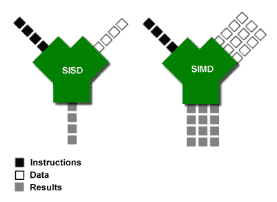

# 理解 NumPy 和 Pandas 中的矢量化

> 原文：<https://medium.com/analytics-vidhya/understanding-vectorization-in-numpy-and-pandas-188b6ebc5398?source=collection_archive---------0----------------------->

米尔扎·巴比奇在 [Unsplash](https://unsplash.com/s/photos/prism?utm_source=unsplash&utm_medium=referral&utm_content=creditCopyText) 上的照片

仅仅几天前，我的导师停下来说明了一点。“帮你自己一个忙，”他带着前所未有的热情对全班说，“在深入学习熊猫之前，先看看[这个关于矢量化的演讲](https://www.youtube.com/watch?v=nxWginnBklU)”

矢量化的价值似乎是显而易见的，无论是从我们的讲师在指导我们观看该剪辑时的影响，还是从演示者在该剪辑中提出的主张来看——将您的代码矢量化以将数据处理速度提高 1000 倍。该视频分解了使用各种操作操作的几个示例(Python for-loops、NumPy 数组矢量化和各种 Pandas 方法),并比较了这些方法的输出返回速度。结果是显而易见的:正如视频吸引点击的标题所暗示的那样，在熊猫中使用利用矢量化的技术将导致惊人的更快的数据操作。

作为一个喜欢学习任何新技能的最佳技术的人，我立即知道我需要调整我的方法。我对 Python for-loops 的迷恋需要让位于这些诱人的向量方法。但是首先…

# 向量到底是什么？

有了动画的背景，我最初理解向量不是在数学或编程的背景下，而是在创建数字图像中。设计程序 Adobe Illustrator 和 Adobe Animate 是基于矢量的，您在这些程序中创建的图稿是由一系列点、线、曲线和形状组成的，这使得图稿可以在不降低质量的情况下进行缩放，并具有保持文件较小的额外好处。

相比之下，Adobe Photoshop 是基于光栅的——一系列小像素创建图像。在 Photoshop 中绘画感觉很自然，不像用形状构建图像。当然，在这样的程序中创作艺术有其缺点:处理细节丰富的大幅面艺术的能力严重依赖于计算机，以降低质量为代价将艺术放大对大多数艺术家来说是不可接受的。

这几乎没有解释清楚矢量化*是什么*。上面的视频描述了 vectors 做什么——一次对数组或系列数据类型的元素进行操作，还表明 NumPy 依赖于编程语言 C 来完成其矢量化操作。在数学中，向量是有大小和方向的东西。在编程和计算机科学中，向量化是一次将运算应用于整个值集的过程。

这些定义仍然没有为*如何*发生这种情况提供清晰的解释，这是值得研究的，以便更深入地了解这一过程。

# 为什么它更快

虽然 Python 中的 for-loop 语法很灵活，并且提供了很好的实用性，但是对一个元素的每次迭代本质上是遍历容器对象的所有元素的一个步骤。当操作顺序很重要时，这个分步处理*很有用(例如，返回满足特定条件的列表中的第一项)。*

相反，当处理的顺序与*无关时，可以应用矢量化处理。如上所述，NumPy 和 Pandas 中的内置方法是用 C 构建的，这允许向量化。由于执行时间要么是恒定的，要么随着元素数量的增加而以慢得多的速度增长，因此矢量化的工作速度几乎总是更快。*

## 并行处理

*   在 NumPy 和 Pandas 中，单独的数组段在计算机的所有处理核心中进行处理。NumPy 和 Pandas 并行操作它们的阵列和系列，每个阵列的一部分由计算机处理器的不同核心处理。

## 相似数据类型

*   NumPy 数组被设置为单一数据类型。Pandas 中的 series 也是如此——每一列都是 int、float、str 或 datetime 类型。这允许优化数据处理，因为这些容器的内容肯定能够以类似的方式被操纵。
    对于 Python 的内置容器数据类型，如列表、集合和字典，情况并非如此。这些类型允许您同时在其中存储各种类型。一个列表可以包含字符串、整型、浮点型、其他列表等。

## 位置

*   NumPy 获取你的数组矩阵，并把它存储在内存的一个区域中。彼此本地的内容允许它们被更快地操作。
    相比之下，Python 列表的内容可能存储在内存中彼此相距很远的地方。

## 矢量化背后的机制——SISD vs SIMD

现代计算机处理器包含具有与理解矢量化相关的特定计算机架构分类的组件:

> SISD —单一指令、单一数据
> 
> SIMD—单指令、多数据

可视化 SISD 与 SIMD 组件流程

*   SISD:这是 Python for-loops 的处理结构——每一个指令，每一个数据元素，每一个时刻，为了产生一个结果。这种方法的优点在于它很灵活——您可以对数据执行任何操作。缺点是它不是处理大量数据的最佳选择。
*   SIMD:这是如何处理 NumPy 和 Pandas 矢量化的结构——每一时刻每*任意数量的*数据元素一条指令，以便产生*多个*结果。当代的 CPU 有一个组件在*的每个内核中处理 SIMD 运算，*允许并行处理。

现在我们已经知道了矢量化速度背后的机制和概念，理解如何使用 Pandas 处理数据可能需要一些指导。Sofia Heisler 在 Pycon 2017 的演讲中提到了熊猫优化的禅，提供了一种简洁的方法:

## 熊猫优化之禅

> -尽可能避免循环
> 
> -如果必须循环，请使用 apply，而不是迭代函数
> 
> -如果您必须申请，请使用 Cython 加快速度
> 
> -矢量化通常比标量操作更好
> 
> NumPy 阵列上的向量运算比本机 Pandas 系列更高效

# 参考资料和其他资源

Nathan Cheever，PyGotham 2019— [数据处理速度提高 1000 倍:使用 Pandas 和 Numpy 进行矢量化](https://www.youtube.com/watch?v=nxWginnBklU&t=7s)

Sofia Heisler，PyCon 2017— [不再有悲伤的熊猫:优化熊猫代码以提高速度和效率](https://www.youtube.com/watch?v=HN5d490_KKk)

ritvikmath—[pandas 和 numpy 中的矢量化](https://www.youtube.com/watch?v=9z_-9vrRgYA)

深度学习—[Python 中的矢量化:数据科学代码](https://www.youtube.com/watch?v=9z_-9vrRgYA)

3blue1brown — [向量，它们到底是什么？|线性代数精要，第 1 章](https://www.youtube.com/watch?v=fNk_zzaMoSs)

迈克尔·j·弗林，*弗林分类法*——[一些计算机组织及其有效性](https://ieeexplore.ieee.org/document/5009071)