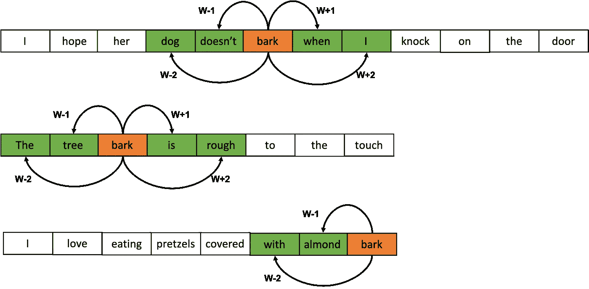
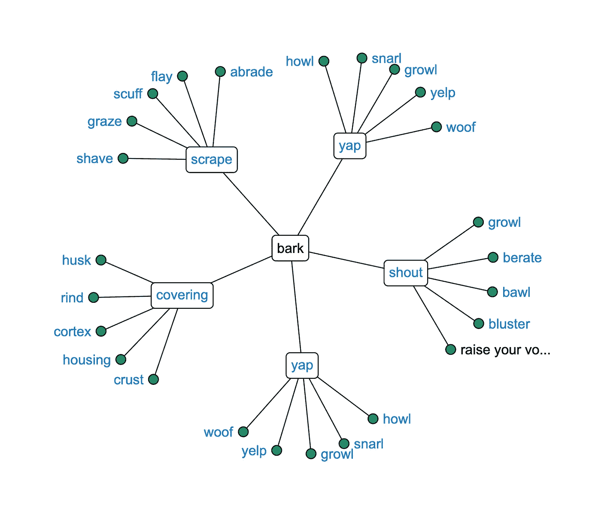
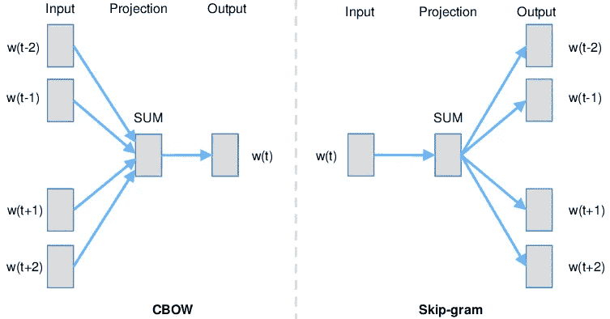

# 理解 Word2Vec

> 原文：<https://medium.com/analytics-vidhya/understanding-word2vec-39fabe660705?source=collection_archive---------3----------------------->

*“从一个人交的朋友就可以知道一个字”——(*[*弗斯，J. R. 1957:11*](https://en.wikipedia.org/wiki/John_Rupert_Firth) *)*

这是英国语言学家约翰·鲁伯特·弗斯的一句名言。他广为人知的是让人们注意到这样一个事实，即你可以通过在任何给定的句子中查看相同上下文中的其他单词来判断一个单词的意思。这意味着在一个句子中可以互换使用的单词有相似的意思。

当你看到 ***同音异义词时，单词的“上下文相关”含义的想法更有意义。*** 这些是在不同语境下有不同含义的词。下面句子中的“树皮”就是一个例子；

我希望她的狗不会在我敲门的时候叫 **树* ***树皮*** *摸起来很粗糙。
我爱吃裹着杏仁* ***树皮*** *的椒盐卷饼。**

*在这三句话中，你可以通过观察树皮周围的单词立即判断出树皮的意思。在实践中，你通常会选择一个周围单词的窗口，并通过查看所选单词来推断原始单词的意思。例如，在上面的句子中，我们可以看到树皮的意思因周围的词而异，这些词被称为**【上下文词】**，我们将“树皮”称为**【中心词】***

**

*下面的同义词库图像显示了单词“bark”在不同上下文中的同义词。这意味着在上面的第一句话中；我们可以很容易地用*、*、*、*、**来代替*、*这个词，但不能用**、*、【外壳】、*来代替，因为尽管它们是*、【树皮】的同义词，但意思却完全不同。**

**

*[https://www.freethesaurus.com/bark](https://www.freethesaurus.com/bark)中“树皮”的词库*

*因此*，*当将单词建模为向量时，以反映单词出现的上下文中的含义的方式对它们进行编码是很重要的，这就是 **Word2Vec** 算法背后的直觉。*

*W ord2Vec 是一种 NLP 算法，它将单词的含义编码成简短、密集的向量(单词嵌入),可用于下游 NLP 任务，如问答、信息检索、机器翻译、语言建模等。该向量通过查看语料库中单词周围的单词，将任何给定语料库中单词的含义置于上下文中。该算法由 Mikolov 等人于 2013 年在他们的论文(“ [*向量空间中单词表示的有效估计*](https://arxiv.org/abs/1301.3781) ”)中引入。*

*在引入 word2vec 之前，单词被表示为**稀疏长向量**，其维数为训练语料库中存在的整个词汇的大小(*单词总数*)。这些传统向量的示例包括 *one-hot 向量、count 向量、Tf-Idf 向量、* e.t.c。将单词表示为稀疏向量的主要缺点之一是在单词之间建立任何形式的关系。这是因为这些向量不包含足够的关于单词的信息来证明这种句法或语义关系，例如，独热向量是正交的(*垂直并且具有 0* 的点积)，因此不能用于测量任何形式的相似性。*

*如前所述，word2vec 背后的直觉是确保句子中存在于相似上下文中的单词被映射到同一个向量空间。这意味着语料库中具有相似邻近/周围/上下文词的词具有相似的向量(*具有高余弦相似度*)。更令人印象深刻的是，单词嵌入的相似性超越了句法规则；使用简单的代数运算，我们可以显示单词之间更复杂的关系。例如，作者能够确定**向量(' King') —向量(' Man') +向量(' Woman')** 产生具有最接近“Queen”的向量表示的相似性的向量(**矢(**皇后) **)** )。*

*我们可以使用谷歌的 G [ensim](https://github.com/RaRe-Technologies/gensim) 库和[预训练单词嵌入](https://drive.google.com/u/0/uc?id=0B7XkCwpI5KDYNlNUTTlSS21pQmM&export=download)来展示这一点。*

```
*from gendim.models import KeyedVectors**# load the google Word2Vec model**
filename = 'GoogleNews-vectors-negative300.bin'
model = KeyedVectors.load_word2vec_format(filename, binary=True)**# vector algebra**
result = model.most_similar(positive=['woman', 'king'], negative= ['man'], topn=1)print(result)*
```

***结果** : *[('queen '，0.7118192315101624)]**

*本文作者提出了两种学习单词表征的体系结构。**连续字包**和**跳格图，下面的**是用于训练 word2vec 嵌入的两种架构。*

**

*[https://www . researchgate . net/figure/Continuous-Bag-of-words-CBOW-CB-and-Skip-gram-SG-training-model-illustrations _ fig 1 _ 326588219](https://www.researchgate.net/figure/Continuous-Bag-of-words-CBOW-CB-and-Skip-gram-SG-training-model-illustrations_fig1_326588219)*

*C 连续单词包通过从选择的上下文单词窗口中预测中心单词来学习单词表示。在 CBOW 中，我们对特定单词周围的上下文单词窗口进行采样，将其提供给模型，并预测中心单词。在这个特定的架构中，输入和投影层之间的权重矩阵在所有单词之间共享。我们将输入单词**(上下文单词)**的一键向量映射到投影层**(嵌入层)。n 维的**嵌入层乘以另一个权重矩阵得到输出层。我们在输出层运行 softmax 操作，以获得词汇表中单词的概率分布。*

*S kip gram 是 word2vec 的不同变体。与 CBOW 不同，在 CBOW 中，我们基于词汇表中的上下文单词来预测中心单词，在这里，我们试图通过预测特定单词周围的上下文单词来学习单词向量表示。该模型试图基于句子中的另一个单词来最大化一个单词的分类。理想情况下，依存窗口越长，单词向量的质量越好。作者还发现，这增加了复杂性，有时遥远的单词与正在建模的当前单词不太相关。作者在他们的原始论文中使用 10 的窗口大小进行训练，结果显示 skip-gram 模型在几个实验中优于 CBOW。*

*在另一篇名为 [*“单词和短语的分布式表示及其组合性*](https://papers.nips.cc/paper/2013/file/9aa42b31882ec039965f3c4923ce901b-Paper.pdf) *”的论文中，* Mikolov 等人介绍了一种不同的方法来训练 skip-gram 模型，这显著提高了单词向量表示的训练速度&质量。俗称**负抽样。**最初的 skip-gram 模型在 3.2 亿单词和 82k 词汇量的语料库上训练了 8 周！但是有了负采样，训练时间和计算复杂度就大大减少了。*

*那么什么是负抽样呢？*

*在原始模型中，我们有维数为(vocab_size x word_vector_dim)的训练权重；这意味着根据词汇表的大小，模型的大小会以十亿计。因此，我们将在每个训练步骤期间更新这些参数中的每一个，这在计算上是昂贵的。使用否定采样，对于每个**训练示例(输入单词)，**我们将采样否定单词列表**(例如，在所选输入单词的上下文中不存在的 5 个词汇单词)。***

*然后，我们在输出单词旁边使用这“5”个否定单词来学习分类器，该分类器为输出单词输出 1，为否定单词输出 0。这样，我们只更新这 6 个单词的训练权重，同时在每次迭代期间学习输入单词的单词向量。*

## *摘要*

*虽然 Word2Vec 在 NLP 方面已经取得了很大的成功，但还有更近的架构，如 **ELMo、** [*“深度上下文化的单词表示*](https://arxiv.org/abs/1802.05365) ”和 **BERT** 、[*BERT:用于语言理解的深度双向变形金刚前期训练*](https://arxiv.org/abs/1810.04805)；这些模型能够创建高度特定于上下文的单词表示，使得可以为存在于同一语料库中的多个上下文中的单词生成适当的表示，而不是像 word2vec 那样的静态单词向量。*

*接下来是一个 PyTorch 实现，使用负采样的 skip-gram…*

## *参考资料:*

1.  *[*对向量空间中单词表示的高效估计*](https://arxiv.org/pdf/1301.3781.pdf)*
2.  *[*https://www . research gate . net/figure/Continuous-Bag-of-words-CBOW-CB-and-Skip-gram-SG-training-model-illustrations _ fig 1 _ 326588219*](https://www.researchgate.net/figure/Continuous-Bag-of-words-CBOW-CB-and-Skip-gram-SG-training-model-illustrations_fig1_326588219)*
3.  *[*https://www.freethesaurus.com*](https://www.freethesaurus.com/bark)*