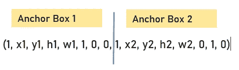
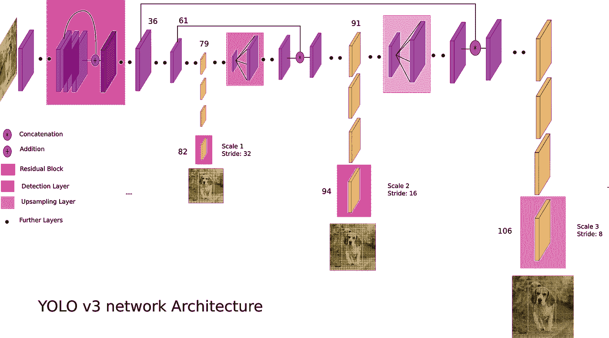

# YOLO 为对象检测，架构解释！

> 原文：<https://medium.com/analytics-vidhya/understanding-yolo-and-implementing-yolov3-for-object-detection-5f1f748cc63a?source=collection_archive---------0----------------------->

使用 YOLOv3 进行检测

在上一篇文章 [**介绍 RCNN 系列模型的对象检测**](/@sairajneelam/introduction-to-object-detection-with-rcnn-family-models-310558ce2033) 中，我们看到了 RCNN 系列模型，它为我们提供了单级对象检测器的方法。

1.  YOLO(你只看一眼)
2.  单发多盒探测器

读完这篇文章你会知道:

*   YOLO 是如何运作的
*   YOLO 的挑战
*   YOLO 的局限性
*   YOLOv3 架构
*   如何在 python 中使用 OpenCV 实现 YOLOv3

我们开始吧。

# ***你只看一次(YOLO):***

***(***[***你只看一次:统一的、实时的物体检测***](https://arxiv.org/abs/1506.02640) ***)由*** [约瑟夫·雷德蒙](https://arxiv.org/search/cs?searchtype=author&query=Redmon%2C+J)、[桑托什·迪瓦拉](https://arxiv.org/search/cs?searchtype=author&query=Divvala%2C+S)、[罗斯·吉尔希克](https://arxiv.org/search/cs?searchtype=author&query=Girshick%2C+R)、[阿里·法尔哈迪](https://arxiv.org/search/cs?searchtype=author&query=Farhadi%2C+A)于 2016 年。

以前的对象检测方法，如 R-CNN 及其变体，使用流水线在多个步骤中执行这项任务。这可能运行缓慢，也很难优化，因为每个单独的组件必须单独训练。

就 YOLO 而言，它的名字本身就说明了很多，它只在整个图像中出现一次。因此，我们将探索 YOLO 是如何工作的。

## 让我们首先了解 YOLO 是如何对其输出进行编码的，

1.输入图像被分成 n×n 个网格单元。对于图像上出现的每个对象，一个网格单元负责预测对象。

2.每个网格预测“B”边界框和“C”类概率。边界框由 5 个部分组成(x，y，w，h，置信度)

(x，y) =代表盒子中心的坐标

(w，h) =盒子的宽度和高度

置信度=表示任何对象的存在/不存在

*让我们用一个例子来看看这些，*

具有对象中心的单元，该单元确定或负责检测对象。

## **YOLO 的挑战:**

> ***问题 1。我们如何判断对象检测算法是否运行良好？***

解决方案:我们已经在以前的文章中看到了这一点，在那里我们讨论了 R-CNN 家族模型，我们如何评估对象定位，这是通过称为交集并集(IOU)的度量

IOU =相交面积/并集面积

> ***问题 2。一个图像中每个物体可以有多个包围盒，那么如何处理呢？***

解决方案:我们使用非最大抑制(NMS)，这是确保你的算法只检测你的对象一次的方法。

我们将看到这是如何工作的，

因为，你在每个网格单元上运行图像分类和定位算法，可能许多单元说它们的“Pc”类概率或在该单元中有物体的机会是最高的。

因此，当我们运行算法时，我们可能会对同一对象进行多次检测。

因此，NMS 所做的是，它清除其他不需要的检测，所以我们最终只检测到一个特定的对象。

*这个 NMS 是怎么运作的？*

1.首先，它寻找与特定对象的每个检测相关联的概率(Pc)

2.它采用最大的“Pc ”,这是对物体最有把握的检测

3.完成后，NMS 部分寻找所有剩余的边界框，并选择所有那些与最高“Pc”的边界框具有高交集(IOU)的边界框，并抑制它们。

4.然后，我们寻找剩余的边界框，并找到最高的“Pc ”, NMS 再次寻找具有高 IOU 的剩余边界框，其中边界框具有高“Pc ”,然后它们将被抑制。

通过对每个对象这样做，我们只为每个对象得到一个边界框。

对于这个例子:

1.它需要最大的 Pc，在这种情况下是 0.9

2.它检查所有剩余边界框的 IOU(即汽车 1 的 0.6，0.7 和汽车 2 的 0.8，0.7)

3.现在，NMS 将取消汽车 1 的 0.6 和 0.7，因为它们相对于 Pc=0.9 的边界框具有较高的 IOU，所以像这样，我们只获得汽车 1 的一个边界框，它在图像中高亮显示。

4.接下来，对于剩余的边界框，car2 的 Pc 最高=0.8，我们再次检查剩余框的 IOU(即 car1 的 0.9 和 car2 的 0.7)

5.现在，NMS 将抑制 0.7，因为它相对于 Pc=0.8 的边界框具有高 IOU。汽车 2 也只有一个包围盒。

> ***问题 3。如果我们在一个单元格中有多个对象呢？也就是说，如果我们有重叠的对象，并且两个对象的中点都在单个网格单元中，该怎么办？***

解决方案:我们使用多个锚盒来解决这个问题，

每个单元表示这个输出(Pc，x，y，h，w，c1，c2，c3 ),它是形状(8，1)的向量，即 8 行 1 列。c1，c2，c3 是不同的类别，比如人，汽车，自行车。

因此，边界框的形状可以根据类的数量而改变。

现在，每个单元将不能输出 2 个检测，因此必须选择两个检测中的任何一个来输出。

有了锚框的概念，你要做的是预定义两个不同的形状，分别叫做锚框 1 和锚框 2。这样我们可以用两个锚盒做两个预测。

一般来说，我们可以使用更多的定位框来捕捉物体的各种形状。

因此，对于两个锚盒，我们的输出在 3 个类的情况下是怎样的，

输出将是大小为(16，1)的向量，该向量包含(Pc1，x1，y1，h1，w1，c1，c2，c3，Pc2，x2，y2，h2，w2，c1，c2，c3)

假设 c1 =人，c2 =汽车，c3 =自行车

在我们的例子中，因为我们有人员和汽车，所以输出将是，

结合所有这些步骤，我们得到了我们的 YOLO 算法:

**YOLO 的局限性:**

在最初的研究论文中，YOLO 只能预测每个网格单元的有限数量的边界框，2 个。虽然该数量可以增加，但是每个单元只能进行一个类别预测，这限制了当多个对象出现在单个网格单元中时的检测。因此，它与小对象的边界组进行斗争，例如一群鸟，或者不同类别的多个小对象。

# **约洛夫 3 的建筑:**

YOLO v3 使用了 Darknet 的一个变种，它原本有在 ImageNet 上训练的 **53 层网络。对于检测任务，其上堆叠了 53 层，为我们提供了 106 层的 YOLO v3 完全卷积底层架构。**

检测分三层进行**第 82 层、第 94 层、第 106 层。**

## YOLOv3 中的卷积层

*   它包含 53 个卷积层，每个卷积层之后是批量归一化层和泄漏 ReLU 激活。
*   卷积层用于卷积图像上的多个滤波器，并产生多个特征图
*   不使用任何形式的汇集，并且使用步长为 2 的卷积层来对特征图进行下采样。
*   它有助于防止通常归因于池化的低级特性的丢失。

现在让我们看看输入，它看起来怎么样，

输入是一批形状为(n，416，416，3)的图像，其中，

n =图像数量，(416，416) =(宽度，高度)和 3 个通道(RGB)。

宽度和高度可以被 32 整除。这些数字(宽度、高度)也称为输入网络大小。

**为什么能被 32 整除？**

我们一会儿就会看到这一点。

输入分辨率的提高可能会提高训练后的准确性。输入图像可以是任何大小，我们不需要在将它们输入网络之前调整它们的大小，它们都将根据输入网络的大小调整大小。

**网络如何检测物体？**

YOLOv3 在网络中的 3 个不同位置进行检测。这些是第 82 层，第 94 层和第 106 层。网络通过在第 82 层、第 94 层、第 106 层的以下因子 **32、16 和 8 对输入图像进行下采样。相应地，这些数字被称为网络步长，它们显示了网络中 3 个位置的输出如何小于网络输入。**

对于网络输入(416，416)，

对于第 82 层，步距为 32，输出大小为 13×13，负责**检测大物体**

对于第 94 层，步幅为 16，输出大小为 26×26，负责**检测中等物体**

对于第 106 层，步幅为 8，输出大小为 52×52，它负责**检测小物体**

这就是网络输入必须能被 32 整除的原因，因为如果它能被 32 整除，那么它也能被 16 和 8 整除。

这里我们可以看到，为什么 13x13，26x26，52x52 检测大中小物体

现在让我们看看，什么是检测内核，

因此，为了产生输出，YOLOv3 在网络的三个输出层应用 1x1 内核(滤波器)。1x1 内核被应用于下采样图像，因此我们的输出具有相同的空间维度 13x13、26x26 和 52x52

检测核的形状也具有其深度，其通过以下公式计算，

**(b*(5+c))** 其中，b =包围盒的数量，c =类的数量，80(对于 COCO 数据集)

每个边界框有(5+c 个属性)

对于 **YOLOv3，它为这 3 个特征图的每一个的每个单元**预测 3 个边界框(即，对于 13x13、26x26、52x52 特征图)

由于，b = 3，c = 80，我们得到(3*(5+80)) = 255 个属性。

现在，我们可以说由检测核在网络中的 3 个独立位置(输出层)产生的每个特征图具有一个以上的维度深度，其结合了 COCO 数据集的边界框的 255 个属性，并且这些特征图的形状如下，(13×13×255)，(26×26×255)，(52×52×255)。

现在让我们看看，网格细胞，简单地说，它们是检测细胞。

我们已经知道 YOLOv3 为特征图的每个单元预测了 3 个边界框。因此 YOLOv3 的任务是识别包含对象中心的单元。

训练 YOLOv3，

当它训练时，它有一个地面真实包围盒，负责检测一个对象。因此，我们需要知道这些边界框属于哪个单元。

对于这个 YOLOv3，以 3 种比例对步幅 32、16 和 8 进行预测。

因此，以该物体为中心的细胞负责检测该物体。

**锚框**用于预测边界框，YOLOv3 使用预定义的边界框，称为锚/先验，这些锚/先验**也用于计算预测边界框的实际宽度和实际高度。**

总共使用 9 个锚盒，每个音阶使用 3 个锚盒，第一个音阶使用 3 个最大的锚，第二个音阶使用接下来的 3 个，第三个音阶使用最后的 3 个。这意味着在每个输出图层，要素地图的每个格网比例都可以使用 3 个定位框预测 3 个边界框。

为了计算这些锚点，在 YOLOv3 中应用了 K-Means 聚类。

锚的宽度和高度，

对于，比例 1: (116x90)，(156x198)，(373x326)

比例 2: (30x61)，(62x45)，(59x119)

比例 3: (10x13)，(16x30)，(33x23)

因此，对于比例 1:我们有 13x13x3 = **507 个边界框**

比例尺 2:我们有，26x26x3 = **2028 包围盒**

比例尺 3:我们有，52x52x3 = **8112 边框**

总共， **YOLOv3 预测 10，847 箱。**

为了预测边界框的实际高度和宽度，YOLOv3 计算偏移量，也称为对数空间变换。现在让我们看看，

因此，为了预测边界框的中心坐标(bx，by ), yolo v3 通过 sigmoid 函数传递输出(tx，ty)。

因此，基于图中给出的上述等式，我们得到了边界框的中心坐标、宽度和高度。

并且使用 NMS 抑制来自 10，847 个框的所有冗余边界框。

# 实现 YOLOv3 进行对象检测

我们将使用开源计算机视觉库(OpenCV)

#我们将首先导入所需的库

#(第 06 行)我们将使用此函数 **"cv.dnn.readNet()"** 来读取我们的权重文件和配置文件(权重文件包含已在 [coco 数据集](https://cocodataset.org/#home)上训练的预训练权重，以及被称为配置文件的 cfg 文件，该配置文件具有 YOLOv3 网络架构)

#(第 08，09 行)我们将置信度阈值和非最大抑制阈值存储为常量，并(第 11–13 行)读取 coco.names 文件以提取对象名称并将其放入列表中，我们总共有 80 个类

#(第 16 行)使用 **"cv。VideoCapture()"** 我们阅读我们的视频

#(第 18 行)现在我们将循环读取捕获的视频并执行对象检测任务

#(第 19 行)现在“cap.read()”正在读取视频，它将被读取为帧，该函数基本上返回两个输出，首先是基于“视频读取/未读取”的布尔值“真/假”,第二个是帧

#(第 23 行)我们不能将帧直接传递到我们的网络，我们需要标准化帧，我们还需要将帧的大小调整为 **(416，416)** ，因为 YOLOv3 采用这个输入大小，OpenCV 读取的图像是**“BGR”格式**，所以我们也需要交换蓝色和红色通道，然后将帧传递到网络

#(第 26–27 行)我们还需要获取输出层名称，并在正向传递中传递这些名称

#但是我们在这里还没有完成，因为我们需要可视化结果，为此我们需要提取边界框，我们以什么样的置信度预测对象以及对象是什么类

#(第 34 -35 行)我们使用两个 for 循环来提取边界框、置信度和类 id。(第 35-37 行)因此，对于每个检测到的对象，检测包含 85 个参数，其中前 5 个参数是边界框和置信度，之后我们有 80 类预测的概率

#第一个循环从总共 3 个输出层中提取每个输出层，在第二个循环中，我们将在每个输出层中找到检测到的对象

#(第 38–49 行)基于置信度阈值，我们提取边界框的中心及其宽度和高度，并将它们添加到我们创建的空列表中

#在第 44–45 行，我们提取边界框的左上角坐标

#现在我们已经得到了所有的边界框，但是我们只需要每个对象一个边界框，所以我们把边界框从 OpenCV 传递给 NMS 函数

#(第 51 行)基于置信度阈值和 nms 阈值，框将被抑制，并且我们将得到正确检测对象的框

#(第 52–58 行)我们只是获取边界框及其置信度和标签所需的坐标，并为其分配颜色

#(第 60–61 行)我们正在为检测到的对象绘制矩形边界框，并在边界框上方放置文本

#这里我们使用 cv.imshow()显示检测到的对象

# 摘要

在这篇文章中，你发现了一个关于 YOLO 的简单介绍，以及我们如何实现 YOLOv3 来检测物体。

具体来说，您学到了:

*   你学习了 YOLO 如何运作，如何应对 YOLO 的挑战及其局限性。
*   还有 YOLOv3 的架构。
*   和使用 OpenCV 库的对象检测任务的代码。

# 参考

[https://arxiv.org/abs/1506.02640](https://arxiv.org/abs/1506.02640)————>给 YOLO 的纸

Andrew NG 的 YOLO 物体探测 YouTube 视频