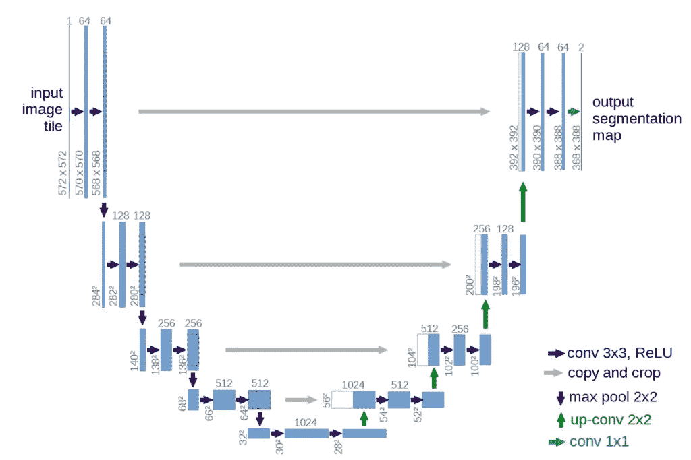

# PyTorch 中的 UNET 实现——白痴开发者

> 原文：<https://medium.com/analytics-vidhya/unet-implementation-in-pytorch-idiot-developer-da40d955f201?source=collection_archive---------1----------------------->

本教程重点介绍 PyTorch 框架中名为 **UNET** 的图像分割架构的实现。这是一个简单的编码器-解码器架构，由 Olaf Ronneberger 等人于 2015 年在德国弗莱堡大学开发，用于生物医学图像分割。

> **获取代码**:[https://github . com/nikhilroxtomar/Semantic-Segmentation-Architecture/blob/main/py torch/unet . py](https://github.com/nikhilroxtomar/Semantic-Segmentation-Architecture/blob/main/PyTorch/unet.py)

# 什么是图像分割？

一幅图像由多个物体组成，比如人、汽车、动物或任何其他物体。为了对图像进行分类，我们使用图像分类，其中任务是预测输入图像的标签或类别。现在想象一下，我们需要找到对象的确切位置，即哪个像素属于哪个对象。在这种情况下，我们需要像素级分类，也就是说，我们需要分割图像。

因此，图像分割是网络将图像作为输入并输出逐像素掩码的过程。这有助于在像素级别更好地理解图像中的场景。图像分割广泛应用于医学成像、自主车辆、卫星成像等等。

# UNET —网络架构

UNET 是一种 U 形编码器-解码器网络架构，它由四个编码器模块和四个解码器模块组成，通过一个桥连接。编码器网络(收缩路径)将空间维度减半，并将每个编码器块的滤波器(特征通道)数量加倍。同样，解码器网络使空间维度加倍，特征通道的数量减半。



摘自原始论文的 UNET 架构框图。

阅读更多:[什么是 UNET？](https://idiotdeveloper.com/what-is-unet/)

# 进口火炬

```
import torch import 
torch.nn as nn
```

# 卷积块

整个 UNET 架构使用两个 3×3 卷积层，每个卷积层后面都有一个 ReLU 激活。

这里我们创建一个简单的类，名为*conv _ 布洛克*。

```
class conv_block(nn.Module):
    def __init__(self, in_c, out_c):
        super().__init__()
        self.conv1 = nn.Conv2d(in_c, out_c, kernel_size=3, padding=1)
        self.bn1 = nn.BatchNorm2d(out_c) self.conv2 = nn.Conv2d(out_c, out_c, kernel_size=3, padding=1)
        self.bn2 = nn.BatchNorm2d(out_c) self.relu = nn.ReLU() def forward(self, inputs):
        x = self.conv1(inputs)
        x = self.bn1(x)
        x = self.relu(x) x = self.conv2(x)
        x = self.bn2(x)
        x = self.relu(x)
         return x
```

原始 UNET 在卷积层和 ReLU 之间不使用批规格化。在这里，我们在它们之间插入批处理规范化。它有助于网络减少内部协方差漂移，使网络在训练时更加稳定。

# 编码器模块

从最初的论文

> *收缩路径遵循卷积网络的典型架构。它由两个 3×3 卷积(无填充卷积)的重复应用组成，每个卷积后跟一个整流线性单元(ReLU)和一个 2×2 最大合并操作，跨距为 2，用于下采样。在每个下采样步骤，我们将特征通道的数量增加一倍。*

```
class encoder_block(nn.Module):
    def __init__(self, in_c, out_c):
        super().__init__()
        self.conv = conv_block(in_c, out_c)
        self.pool = nn.MaxPool2d((2, 2)) def forward(self, inputs):
        x = self.conv(inputs)
        p = self.pool(x)
        return x, p
```

在 *encoder_block* 中，我们使用了填充来确保输出特征图的形状(高度和宽度)与输入特征图保持一致。

*编码器 _ 模块*由一个*conv _ 模块*和一个 2×2 最大池组成。每经过一个区块，过滤器的数量增加一倍，高度和宽度减少一半。

编码器块返回两个输出:

*   x:它是*conv _ 块*的输出，并作为汇集层的输入和解码器块的跳过连接特征映射。
*   p:它是池层的输出。

# 解码器块

从最初的论文

> *扩展路径中的每一步都包括特征图的上采样，随后是将特征通道数量减半的 2×2 卷积(“上卷积”)，与收缩路径中相应裁剪的特征图的连接，以及两个 3×3 卷积，每个卷积之后是 ReLU*

在上面的行中，上卷积被称为转置卷积。

```
class decoder_block(nn.Module):
    def __init__(self, in_c, out_c):
        super().__init__()
        self.up = nn.ConvTranspose2d(in_c, out_c, kernel_size=2, stride=2, padding=0)
        self.conv = conv_block(out_c+out_c, out_c) def forward(self, inputs, skip):
        x = self.up(inputs)
        x = torch.cat([x, skip], axis=1)
        x = self.conv(x)
        return x
```

# UNET 建筑

```
class build_unet(nn.Module):
    def __init__(self):
        super().__init__()
         """ Encoder """
        self.e1 = encoder_block(3, 64)
        self.e2 = encoder_block(64, 128)
        self.e3 = encoder_block(128, 256)
        self.e4 = encoder_block(256, 512) """ Bottleneck """
        self.b = conv_block(512, 1024) """ Decoder """
        self.d1 = decoder_block(1024, 512)
        self.d2 = decoder_block(512, 256)
        self.d3 = decoder_block(256, 128)
        self.d4 = decoder_block(128, 64) """ Classifier """
        self.outputs = nn.Conv2d(64, 1, kernel_size=1, padding=0) def forward(self, inputs):
        """ Encoder """
        s1, p1 = self.e1(inputs)
        s2, p2 = self.e2(p1)
        s3, p3 = self.e3(p2)
        s4, p4 = self.e4(p3) """ Bottleneck """
        b = self.b(p4) """ Decoder """
        d1 = self.d1(b, s4)
        d2 = self.d2(d1, s3)
        d3 = self.d3(d2, s2)
        d4 = self.d4(d3, s1) """ Classifier """
        outputs = self.outputs(d4) return outputs
```

上面的代码完全实现了 PyTorch 框架中的 UNET 架构。

# 阅读更多

1.  [U-Net:用于生物医学图像分割的卷积网络](https://arxiv.org/pdf/1505.04597.pdf)
2.  [U-Net:用 60 行代码实现 py torch](https://amaarora.github.io/2020/09/13/unet.html)

*原载于 2021 年 5 月 22 日 https://idiotdeveloper.com*[](https://idiotdeveloper.com/unet-implementation-in-pytorch/)**。**