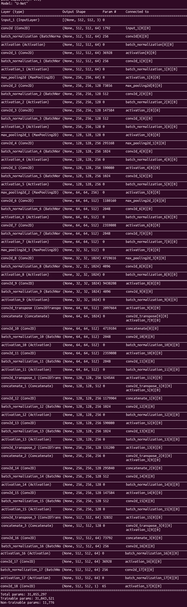

# 使用 Keras API(白痴开发者)在 TensorFlow 中实现 UNET

> 原文：<https://medium.com/analytics-vidhya/unet-implementation-in-tensorflow-using-keras-api-idiot-developer-bc3504e9ca69?source=collection_archive---------8----------------------->

在本帖中，您将学习如何使用 Keras API 在 TensorFlow 中实现 UNET 架构。这篇文章帮助你了解 UNET，以及如何在你的研究中使用它。

UNET 是最流行的语义分割架构之一。Olaf Ronneberger 等人在 2015 年开发了这个用于生物医学图像分割的网络。


原始 UNET 建筑的方块图

要了解更多，请阅读文章:[什么是 UNET？](https://idiotdeveloper.com/what-is-unet/)

# 导入

在本文的第一部分，您需要导入实现 UNET 架构所需的所有类。

```
from tensorflow.keras.layers import Conv2D, BatchNormalization, Activation, MaxPool2D, Conv2DTranspose, Concatenate, Input
from tensorflow.keras.models import Model
```

这里，我们已经从 TensorFlow 导入了所有需要的图层类。这些层类包括 *Conv2D* 、*批处理规范化*、 *ReLU* 等等。

为了连接 UNET 架构的输入和输出层，我们引入了*模型*类。

# 卷积块

整个 UNET 体系结构由两个 3×3 卷积的重复使用组成，每个卷积之后是一个 ReLU 激活。

这里，我们编写构建卷积模块的代码。

```
def conv_block(input, num_filters):
    x = Conv2D(num_filters, 3, padding="same")(input)
    x = BatchNormalization()(x)
    x = Activation("relu")(x)

    x = Conv2D(num_filters, 3, padding="same")(x)
    x = BatchNormalization()(x)
    x = Activation("relu")(x)

    return x
```

卷积块或*conv _ 块*函数有两个参数:

1.  **输入:***输入*表示来自前一块的特征图。
2.  **num _ filters:***num _ filters*指的是*conv _ 布洛克*函数中出现的卷积层的输出特征通道的数量。

在最初的 UNET 架构中，两个 3×3 卷积之后是一个 ReLU 激活函数。这里，我们在卷积层和 ReLU 层之间引入了批量归一化。

批量归一化通过归一化输入层，有助于使深度神经网络更快、更稳定。

# 编码器模块

```
def encoder_block(input, num_filters):
    x = conv_block(input, num_filters)
    p = MaxPool2D((2, 2))(x)
    return x, p
```

*编码器 _ 模块*函数有两个参数:

1.  **输入:***输入*表示来自前一块的特征图。
2.  **num _ filters:***num _ filters*表示输出特征通道的数量。

*编码器 _ 块*由一个 conv _ 块和一个 2×2 最大池层组成。 *encoder_block* 返回两个特征图:

1.  **x:** 表示 conv _ 块的输出。它充当相应解码器块的跳过连接。
2.  **p:** 表示传递给下一个块作为输入的缩减特征图。

*encoder_block* 获取 num_filters = 64 的大小为(128 x 128 x 32)的输入，然后返回输出 x = (128 x 128 x 64)和 p = (64 x 64 x 64)

# 解码器块

```
def decoder_block(input, skip_features, num_filters):
    x = Conv2DTranspose(num_filters, (2, 2), strides=2, padding="same")(input)
    x = Concatenate()([x, skip_features])
    x = conv_block(x, num_filters)
    return x
```

*解码器 _ 模块*采用三个参数:

1.  **输入:***输入*表示来自前一块的特征地图。
2.  **skip _ features:**skip _ features 表示通过 skip 连接从编码器模块获取的特征映射。
3.  **num _ filters:**num _ filters 表示输出特征通道的数量。

*decoder_block* 函数开始一个 2×2 转置卷积，该卷积将输入特征图的空间维度(高度和宽度)加倍。

如果输入大小是(16 x 16 x 32)并且 num_filters 是 64，则转置卷积的输出是(32 x 32 x 64)。

接下来，我们将二次抽样特征映射与跳过连接特征映射连接起来。这些跳跃连接带来了早期层的特征图，帮助网络生成更好的语义特征图。

在连接之后，使用 conv 块。

到目前为止，我们已经研究了 UNET 结构的编码器和解码器模块。现在，我们开始建造完整的 UNET 建筑。

# UNET 建筑

```
def build_unet(input_shape):
    inputs = Input(input_shape)

    s1, p1 = encoder_block(inputs, 64)
    s2, p2 = encoder_block(p1, 128)
    s3, p3 = encoder_block(p2, 256)
    s4, p4 = encoder_block(p3, 512)

    b1 = conv_block(p4, 1024)

    d1 = decoder_block(b1, s4, 512)
    d2 = decoder_block(d1, s3, 256)
    d3 = decoder_block(d2, s2, 128)
    d4 = decoder_block(d3, s1, 64)

    outputs = Conv2D(1, 1, padding="same", activation="sigmoid")(d4)

    model = Model(inputs, outputs, name="U-Net")
    return model
```

build_unet 函数接受一个参数:

*build_unet* 函数返回包含所有层的*模型*对象。

```
inputs = Input(input_shape)
```

*build_unet* 函数从一个输入层开始，该输入层具有作为函数参数提供的指定输入形状。

```
s1, p1 = encoder_block(inputs, 64) 
s2, p2 = encoder_block(p1, 128) 
s3, p3 = encoder_block(p2, 256) 
s4, p4 = encoder_block(p3, 512)
```

接下来是四个编码器模块，这里每个编码器模块使用前一层作为输入。除了输入，它还接受输出特征通道的数量。滤波器的数量从 64 开始，随后对于编码器模块加倍。

```
b1 = conv_block(p4, 1024)
```

第 4 个编码器模块的输出充当电桥的输入。该桥是一个简单的 conv 模块，具有 1024 个输出特征通道。

```
d1 = decoder_block(b1, s4, 512) 
d2 = decoder_block(d1, s3, 256) 
d3 = decoder_block(d2, s2, 128) 
d4 = decoder_block(d3, s1, 64)
```

接下来是解码器，由四个解码器模块组成。每个解码器模块使用先前的特征映射作为输入和输出声道的数量。首先使用转置卷积对输入进行上采样。这些上采样的特征映射与来自编码器块的适当的跳过连接连接在一起。之后，紧接着是一个*conv _ 区块*。

```
outputs = Conv2D(1, 1, padding="same", activation="sigmoid")(d4)
```

第 4 个解码器模块的输出通过具有 sigmoid 激活函数的 1×1 卷积层。

对于二进制分割，我们使用 1 个具有 sigmoid 激活的输出特征通道。在多类分割中，我们使用 softmax 激活函数将类的数量作为输出特征通道。

```
model = Model(inputs, outputs, name="U-Net") 
return model
```

最后，我们将 UNET 架构的输入和输出都交给了*模型*类。现在我们有了一个包含所有层的模型对象。

# 跑 UNET

```
if __name__ == "__main__":
    input_shape = (512, 512, 3)
    model = build_unet(input_shape)
    model.summary()
```

现在，我们已经使用 Keras API 在 TensorFlow 中实现了 UNET 架构。我们用(512 x 512 x 3)的*输入形状*调用*构建 _unet* 函数

这是 UNET 建筑的概要。



UNET 建筑概述

*原载于 2021 年 2 月 15 日*[*【https://idiotdeveloper.com】*](https://idiotdeveloper.com/unet-implementation-in-tensorflow-using-keras-api/)*。*