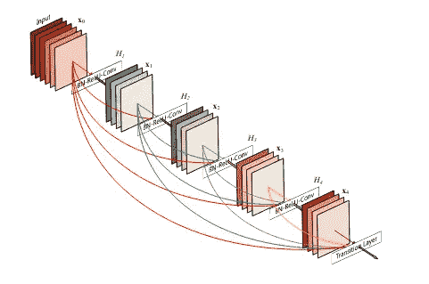
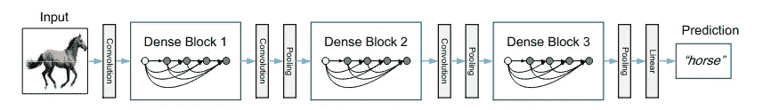
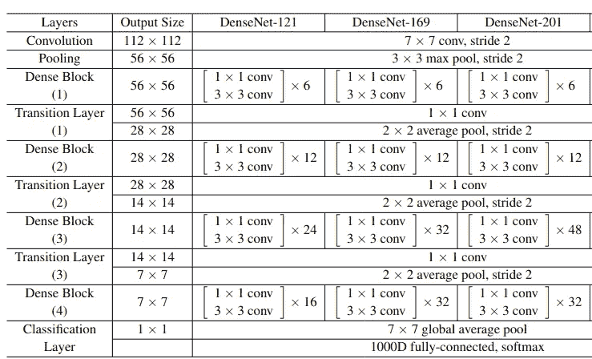
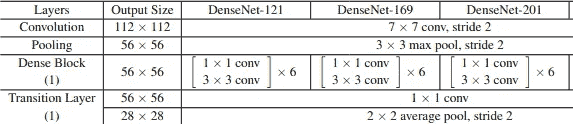
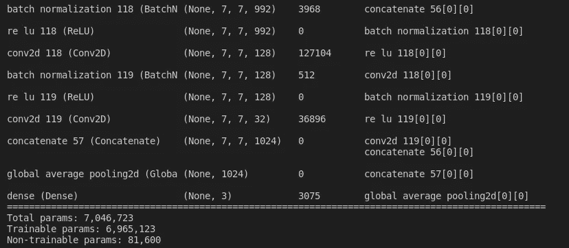

# 解包 DenseNet 以了解，然后使用 TensorFlow 创建

> 原文：<https://medium.com/analytics-vidhya/unpacking-densenet-to-understand-and-then-creating-using-tensorflow-670d88aace5c?source=collection_archive---------5----------------------->



图 1:一个 5 层的致密块(来源:DenseNet 原始文件)

DenseNet 是什么？这是一个密集的网络。就这样结束了，再见。

开玩笑的。但事实离它并不遥远。Densenet 是密集连接卷积网络的缩写。Densenet 具有其中多个卷积层相互连接的块。块中的每一个 **i** 层都连接到它的所有连续层，即 **i+1，i+2，…** 直到最后。这种类型的连接称为剩余网络。



图 2:Densenet 中致密嵌段的表示(来源:Dense net 原始论文)

该论文的作者在块中使用了剩余网络，但是为了进一步改善层之间的信息流，我们提出了一种不同的连接模式:从任何层到所有后续层引入直接连接。背后的核心思想是**特征重用**，这导致非常紧凑的模型。因此，它比其他 CNN 需要更少的参数，因为没有重复的特征映射。挤奶直到特征变干！！！



图 3:密集网层结构

第一卷积块有 64 个大小为 7×7 的滤波器，跨距为 2。接下来是最大池层，最大池为 3×3，跨距为 2。这两行可以用 python 中的以下代码来表示。

Densenet 有两个主要的嵌段—致密嵌段和过渡层。

```
 input = Input(input_shape)
    x = Conv2D(64, 7, strides=2, padding="same")(input)
    x = BatchNormalization()(x)
    x = ReLU()(x)
    x = MaxPool2D(3, strides=2, padding="same")(x)
```



图 4:密集块和过渡层

致密块有两部分。1×1 卷积块和 3×3 卷积块。与所有以前的特征映射连接可能会导致内存爆炸。1x1 卷积可以抑制内存爆炸。

首先让我们在 Python 中定义卷积块。

```
**def** conv_layer(x, filters, kernel=1, strides=1): x = BatchNormalization()(x)
    x = ReLU()(x)
    x = Conv2D(filters, kernel, strides=strides, padding="same")(x)
    **return** x
```

现在来到密集街区。在这个块中，有一个参数决定了块的深度。叫做**成长** **因子**。增长因子是可调的，默认值是 32。增长因子只是过滤器的数量。1x1 模块的滤波器数量是 4 倍。紧随其后的是 3x3 卷积。然后是论文的主要亮点，每一层都连接到它的下一层。这里，使用张量流函数将输出连接到输入。

根据图像大小，每个密集块重复 n 次。为了实现这一点，我们将创建一个重复列表，并对其应用 for 循环。重复次数为[6，12，24，16]。

```
**def** dense_block(x, repetition,filters):
    **for** _ in range(repetition):
      y = conv_layer(x, 4 * filters)
      y = conv_layer(y, filters, 3)
      x = concatenate([y, x])
    **return** x
```

密集块的输出被传递到过渡块。有一个 1x1 卷积层和一个 2x2 平均池层，步长为 2(缩小图像)。1x1 的内核大小已经在函数中设置好了，所以我们不需要明确地再次定义它。在过渡层中，我们必须将通道减少到现有通道的一半。

```
**def** transition_layer(x):
    x = conv_layer(x, x.shape[-1]/ 2)
    x = AvgPool2D(2, strides=2, padding="same")(x)
    **return** x
```

**完整的 DenseNet 121 架构:**

现在，我们已经将所有模块放在一起，让我们将它们合并，以查看整个 Densenet 121 架构。

**完整的 DenseNet 121 架构:**

```
**def** conv_layer(x, filters, kernel=1, strides=1): x = BatchNormalization()(x)
    x = ReLU()(x)
    x = Conv2D(filters, kernel, strides=strides, padding="same")(x)
    **return** x**def** dense_block(x, repetition, filters):
    **for** _ in range(repetition):
      y = conv_layer(x, 4 * filters)
      y = conv_layer(y, filters, 3)
      x = concatenate([y, x])
    **return** x**def** transition_layer(x):
    x = conv_layer(x, x.shape[-1]/ 2)
    x = AvgPool2D(2, strides=2, padding="same")(x)
    **return** x**def** densenet(input_shape, n_classes, filters=32): input = Input(input_shape)
    x = Conv2D(64, 7, strides=2, padding="same")(input)
    x = BatchNormalization()(x)
    x = ReLU()(x)
    x = MaxPool2D(3, strides=2, padding="same")(x) **for** repetition in [6, 12, 24, 16]:
       d = dense_block(x, repetition,filters)
       x = transition_layer(d) x = GlobalAveragePooling2D()(d)
     output = Dense(n_classes, activation="softmax")(x) model = Model(input, output)
     **return** model
```



图 5:模型总结

这就是我们如何使用 TensorFlow 实现 Densenet 121 架构。

要以更好的方式查看代码，请查看 github 上的[代码。](https://github.com/Haikoitoh/paper-implementation/blob/main/Densenet%20121.py)

**参考文献:**

黄高和刘庄以及劳伦斯·范德马腾和基利安·q·温伯格，密集连接的卷积网络，arXiv 1608.06993 (2016 年)