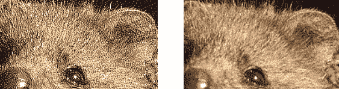
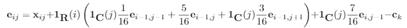
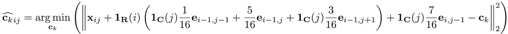
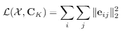
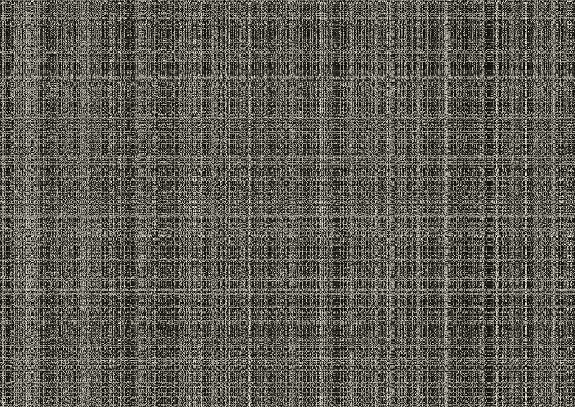
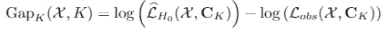
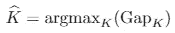
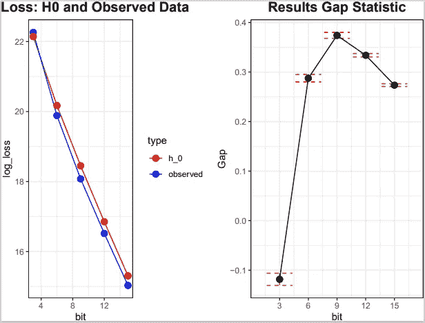

# 揭开弗洛伊德-斯坦伯格抖动背后的统计数字

> 原文：<https://medium.com/analytics-vidhya/unraveling-statistics-behind-floyd-steinberg-dithering-in-r-ca4467cbde3f?source=collection_archive---------18----------------------->

巴德·赫利松在 [Unsplash](https://unsplash.com?utm_source=medium&utm_medium=referral) 上的照片

> *un***rav***El*(ŭn-răv'əl)v .***un rav eled un rav El ing un rav els****~***阐明神秘或令人困惑的事物的要素****

**自从我的第一篇[文章](/swlh/exploiting-the-floyd-steinberg-algorithm-for-image-dithering-in-r-c19c8008fc99)以来，我已经有一段时间了，我选择写关于相对不熟悉的弗洛伊德-斯坦伯格抖动算法。如果我的帖子叫做*我如何利用深度学习成为一名成功的投资者*之类的话，很可能会有更多的人阅读我的帖子……为了吸引至少一些读者，我决定尽可能地让《抖动》面向实际、易于理解，这似乎奏效了！观众统计远远好于预期，所以可能我的下一篇文章应该是贝叶斯的东西。然而，在我真诚地热情向你们展示罗伯特·w·弗洛伊德和路易斯·斯坦伯格算法的优雅时，我确实跳过了一些非常有趣的统计细节。太可惜了！在这篇文章中，我真的希望通过解释排列以及我们如何利用它们来挑选最佳调色板来弥补这一缺陷。让我们来揭开谜底！**

## **图像抖动:快速回顾**

**概括来说，这里是我之前帖子的一个超级小总结:我们利用弗洛伊德-斯坦伯格算法创建了一个有吸引力的 Quokka Quinten 表示，尽管只使用了 3 位调色板。从图形上看，结果是这样的:**

****

**完整与 3 位与 3 位抖动 Quokka Quinten。多酷啊！**

**毫无疑问，抖动算法提供了一种极大地改善普通 3 位表示的方法。尤其是表面看的时候，结果还挺刺眼的！然而，仔细观察会发现相当多的人工制品，我们甚至可以看到一些绿色和红色的点。一个可能的解决方案是将我们的调色板扩展到例如 6 位，这意味着能够从 2⁶ = 64 种颜色中进行选择。毫无疑问，我们极大地改善了图像，因为我们有八倍多的颜色可以使用。既然一张图胜过千言万语，下面就用图形来描绘这个故事:**

****

**3 位抖动与 6 位抖动**

**不言而喻，使用越来越广泛的调色板也会产生越来越漂亮的图像，但它以一定的成本(例如，计算时间、数据存储)为代价，这不会让你感到惊讶。嗯，听起来我们遇到了一个有趣的交易！一种可能的策略是，只观察一些使用不同大小调色板抖动的图像，查看它们的存储大小，并决定要使用的最佳颜色数量。当然有更好的——也是最重要的:统计上更合理的——方法来解决这个问题。为此，我们利用了对三个概念的基本理解:损失函数、排列和“成本”的客观标准——缺口统计量。**

## **构建损失函数**

**当我们谈论任何优化问题时，首先想到的是损失函数的概念。机器学习中最著名的损失函数之一是回归问题的均方误差(MSE)和分类任务的交叉熵。对于 Floyd-Steinberg 算法，我们不能使用现有的函数，所以我们必须更有创造性。振作起来…**

**设 **R** 为一幅图像的行指示符集合(除第一行外) **C** 为列指示符集合(除第一列和最后一列外)。像素 **x** ᵢⱼ的扩散误差 **e** ᵢⱼ 现在可以定义为**

****

**用 **1** ( *ij* )指示器功能对行( **R** )或列( **C** )和 **c** ₖ从 *K* 调色板中选择一种特定颜色。现在，随着扩散误差 **e** ᵢⱼ变得显式，我们将 **ĉ** ₖᵢⱼ定义为像素 **x** ᵢⱼ的对应颜色，其最小化了 **e** ᵢⱼ.的欧几里德范数在公式中:**

****

**如果你不遵循数学，不要担心！到目前为止，我们只是用一种奇特的方式写下了 **ĉ** ₖᵢⱼ是调色板中像素 **x** ᵢⱼ.最接近的颜色这种形式化，再加上我们可以在计算 **e** ᵢⱼ的公式中使用 **ĉ** ₖᵢⱼ而不是 **c** ₖ的事实，产生了我们的损失函数:**

****

**其中 x 代表所有像素的集合，c 代表 ₖ，a 代表 *K* ×3 矩阵，其中每行存储一个 *K* 颜色向量。换句话说，总损耗定义为误差平方和！**

**好了，现在让我们休息一下，让数学沉淀下来……是时候把我们的注意力转向一个更容易理解的话题了:排列。**

## **排列**

**从全局意义上来说，排列是对象的(随机)重新排列，在统计学中广泛用于执行例如显著性测试。现在，在这个特定的图像抖动上下文中，我们可以假设 Quokka Quinten 是像素的随机重排。这导致了相当嘈杂的画面:**

****

**阔卡昆腾图像的置换版本。**

**这种图像可能有用的原因是，它作为另一种工具，将优化形式化为统计上明确定义的问题。假设我们将这个随机的像素集合称为零假设( *H₀* )。在这种假设下，我们闪闪发光的昆腾图片就像所有其他 *N* 一样有可能！图片的置换版本，像素数量为 *N* 。对于我们选择的任何调色板，我们也可以在 *H₀* 下的置换图片上应用弗洛伊德-斯坦伯格算法，并计算损失函数的值。通过重复这个过程数百次并对结果取平均，我们获得了平均损失价值的估计，或者像统计学家喜欢说的:我们获得了在 *H₀.下**预期** 损失的估计*现在我们真的有所进展了，所以让我们把最后缺失的部分放回原位，完成我们的拼图吧！**

## **差距统计**

**排列允许我们获得不同调色板在 *H₀* 下的预期损失的估计值。问题的关键在于这一预期损失与我们观察到的 Quokka Quinten 图像的损失值的比较。对于更大的 *K* (记住， *K* 是我们调色板中的颜色数量)，损失值会降低，这并不奇怪，但是对于预期损失和观察到的损失之间的*差异*来说，这不一定是真的。正是这种差异定义了差距统计:**

****

## **选择最佳调色板**

**有了这个间隙统计，在调色板中选择最佳颜色数量的问题可以公式化为使这个间隙统计最大化的 *K* 的值:**

****

**唯一剩下的事情是通过绘制损失值和差距统计数据与调色板中的颜色数量来可视化结果。下图展示了这个想法。我们清楚地看到损失值的下降趋势(左窗格)，以及缺口统计的非线性曲线。显然，Floyd-Steinberg 抖动算法比相同像素的随机重新排列更好地表现了结构化的图片，如我们的 Quokka Quinten。**

****

**pfieuw……重新表述我们的问题是一个艰难的过程，这样我们就能够选择最佳的颜色数量。我真诚地希望它没有分散我们的注意力，我们可以用这种迷人的方式将统计数据应用到工作中，并帮助我们解决复杂的问题！**

**完整源代码:[https://github.com/justinkraaijenbrink/imagedithering](https://github.com/justinkraaijenbrink/imagedithering)**