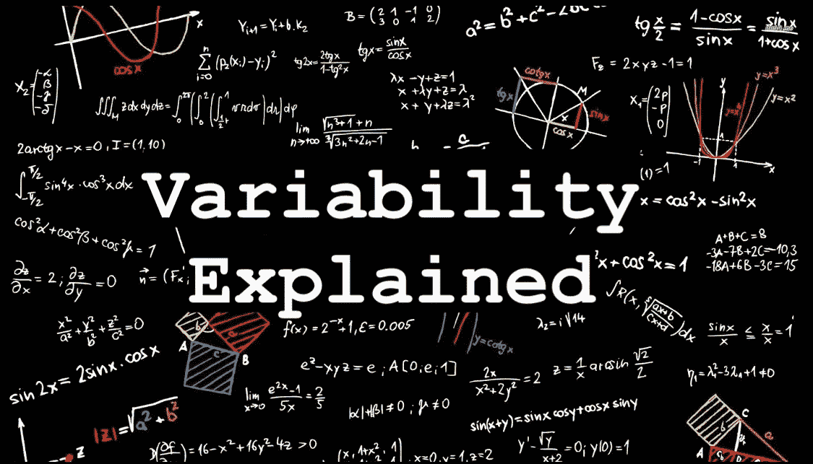
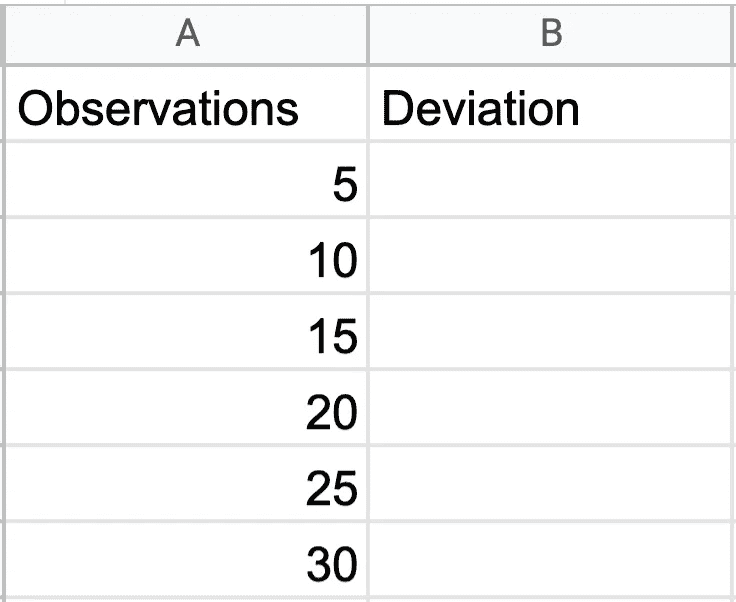
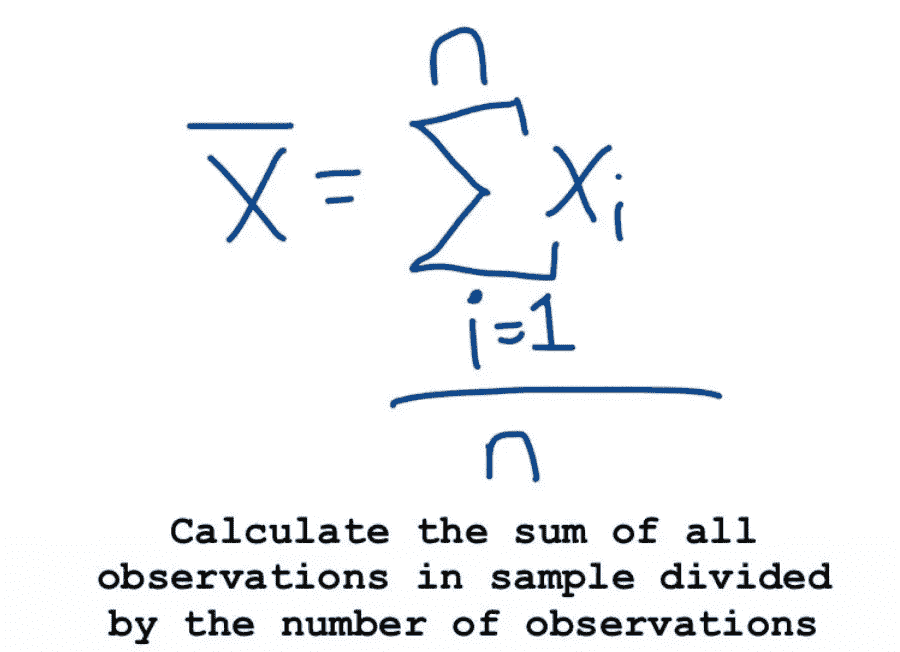
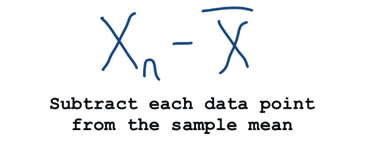
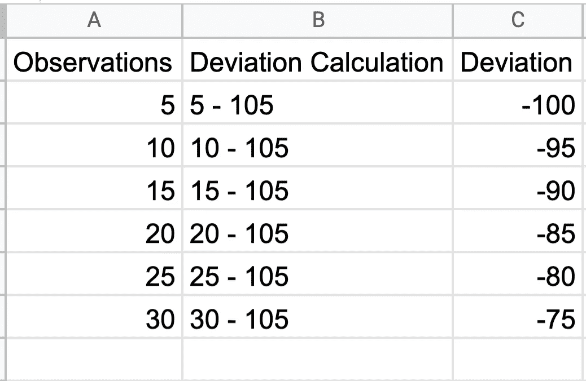
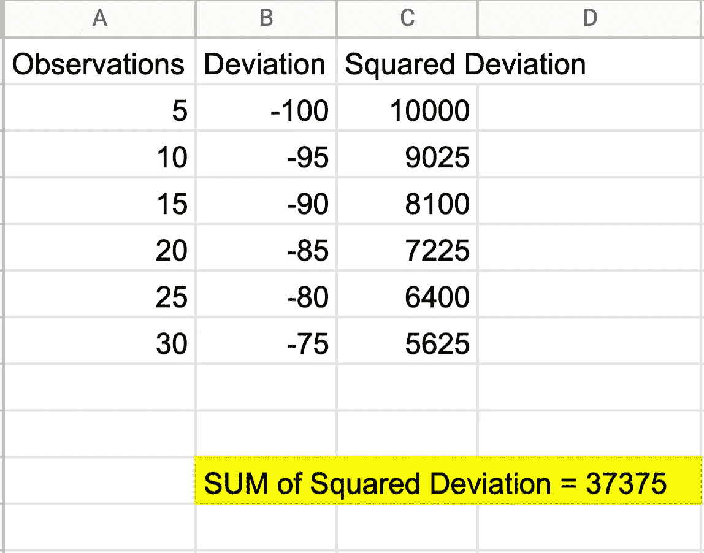

# 解开可变性的概念

> 原文：<https://medium.com/analytics-vidhya/unraveling-the-concept-of-variability-4324dec73716?source=collection_archive---------0----------------------->

当我开始学习数据科学时，人们首先强调的事情之一是描述给定数据集的**中心**(平均值和中值)的重要性。虽然报告中心对数据分析至关重要，但同样重要的是要记住平均值和中值并不能描述任何给定数据集的分布。嗯如果是这样的话，那么什么是度量呢？

最常见的**可变性测量**描述了样本观测值**偏离样本平均 x̄.的程度****这些措施包括:**

1.  **范围**
2.  **偏差/平方偏差**
3.  **标准差(** σ)
4.  **方差(** σ)

# **范围**

可变性通常被称为最简单的数值测量，定义为最大和最小观察值之间的差异。尽管范围被认为是最简单的，但它并不是描述数据集分散性的理想方式。**记住:可变性是一种用于描述样本均值的观察值分布的方法(** x̄)，为了准确量化数据集的分布，必须使用每个观察值，而不仅仅是最大值和最小值。

# **偏差**

是许多人在研究统计学时忽略的指标，因为它与数据科学有关。与其记忆术语:*标准差*倒不如退一步，在把这些术语放在一起之前，单独定义和理解它们要容易得多。

记住:可变性是一种用于描述样本均值的观察值的分布的方法 **(** x̄).**与范围不同，****偏差度量通过计算每个数据点到样本平均值(x̄).)的距离来利用每个观察值**让我们做一个简单的例子:

# 通过计算 D **偏差**度量来确定可变性:

x̄ = 105

## 首先我们需要确定样本均值

**现在我们可以计算每个观察值的偏差:**

# 结果:

注意否定的答案。

# 我们的回答有意义吗？

根据数学，这是有道理的。这似乎是一个简单的过程。首先，我们通过对观察值求和来计算样本平均值，然后除以观察值的数量。然后我们从样本均值中减去每个观察值，得到一个负数的输出。从这一点出发，有两个问题需要解决:

> **1。我们如何将数据组合成一个单一的数字测量，并呈现给**利益相关者？
> 
> 2.我们如何评估负号？

你可能在想:我们不能计算偏离列的平均值吗？不，很遗憾没有。虽然这将有助于第一个问题提供一个单一的数字测量，但它没有删除负运算符。因此我们必须退而求其次:**计算离差的平方并求和。**

**嗯，这回答了我们两个的问题，但是有什么意义呢？**看一下**平方偏差公式**。现在将该公式与**样本方差公式**进行比较。看到类似的东西了吗？多刺激啊！慢慢走到一起了！

如果你看不出两者的相似之处，也不要难过。欢迎发表评论，我很乐意帮忙！

感谢阅读！下一篇文章将讨论方差和标准差。