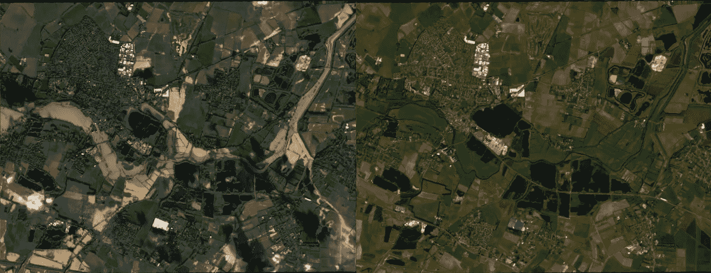
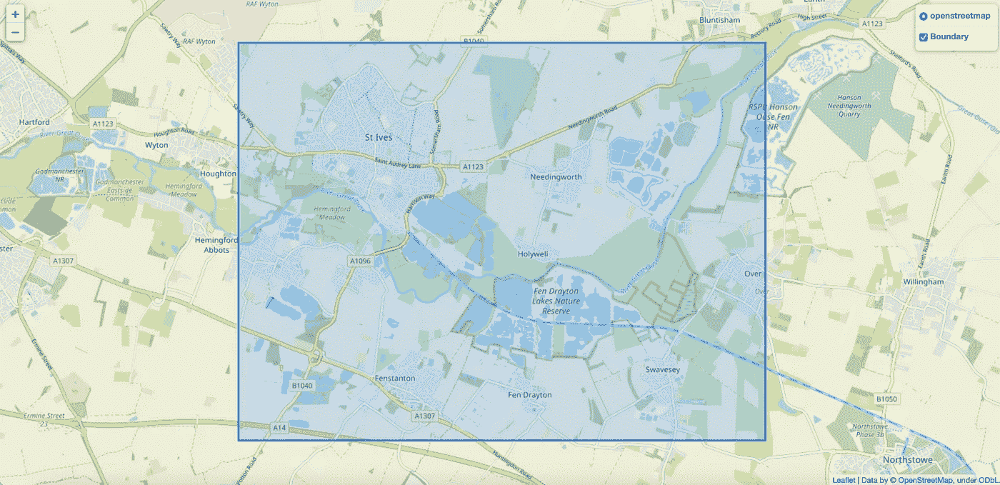
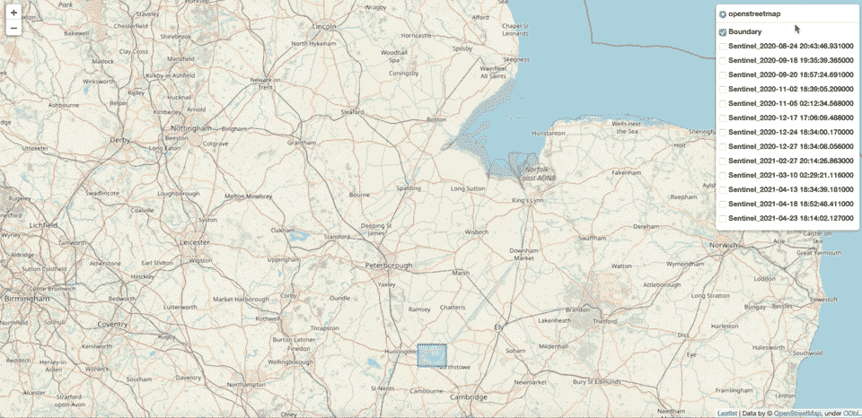
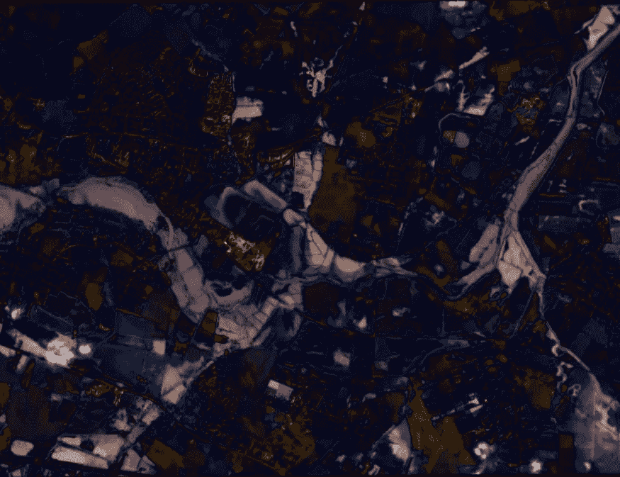
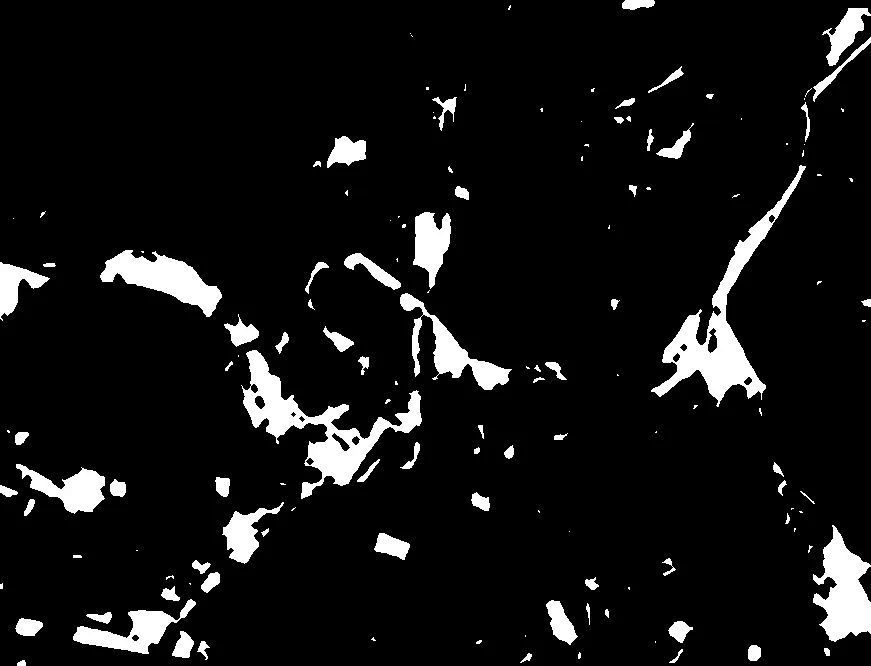
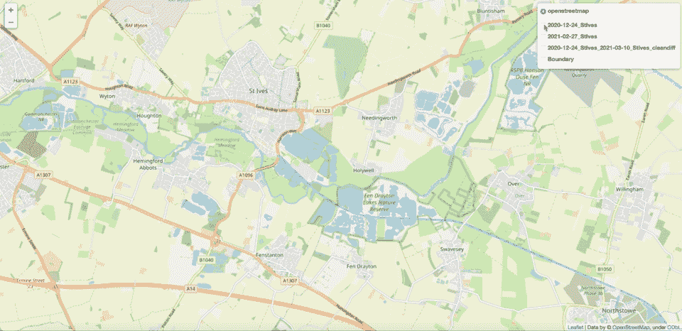

# 利用 Sentinel 2 卫星图像进行无监督洪水探测

> 原文：<https://medium.com/analytics-vidhya/unsupervised-flood-detection-with-sentinel-2-satellite-imagery-7a254dc2be2e?source=collection_archive---------6----------------------->

## 使用 Python 使用 Sentinel 2 卫星影像检测景观变化的快速入门。

2020 年 12 月 24 日剑桥圣艾夫斯(左)，2021 年 2 月 27 日(右)

> SENTINEL-2 是一项欧洲宽测绘带、高分辨率、多光谱成像任务。在同一轨道上飞行但相位相差 180°的两颗卫星的完整任务规范旨在给出赤道上 5 天的高重访频率。SENTINEL-2 携带一个光学仪器有效载荷，对 13 个光谱带进行采样:4 个 10 米波段、6 个 20 米波段和 3 个 60 米空间分辨率波段。轨道条带宽度为 290 公里。”

任何感兴趣的人都可以获得高频率和高分辨率的卫星图像。随着创新的步伐带来更快更清晰的图像，有一些有意义的新问题可以从一个新的角度来解决或处理:从高处。

泛滥就是这样一个问题，今天可以对其进行监控，我们试图用几行 python 代码来证明这一点！

## 1.在哪里？

首先，我们应该决定我们想看哪里。我选择了离剑桥不远的英国洪水易发区。

我们可以创建一个地理数据框架，根据相关的纬度和经度坐标来表示所选的位置边界。

让我们用叶子来观想和检查我们的边界。

位置边界从我们的纬度和经度坐标。

## 2.访问数据

我们将利用 [Sentinelsat](https://sentinelsat.readthedocs.io/en/master/index.html) ，一个查询哨兵任务数据的 python 库。首先我们需要注册一个用户名+密码，然后当然 *pip 安装 sentinelsat。*

这个图书馆连接到哥白尼开放存取中心，在那里图像被存档。我们提供多边形并搜索与该区域重叠的卫星图像。然后，我们还过滤我们的结果，以搜索包含 100%我们定义的边界的图像。

我们可以检查卫星图像的边界，看看它们是否与我们定义的边界完全重叠，再次使用 follow。

哨兵图像边界覆盖

在上面的代码中，我们通过日期、云覆盖和区域缩小了搜索范围，但是 API 提供了一些我们可能感兴趣的其他指标。

我们可以通过 API 查询各种返回图像的景观构成。虽然下面的分类并不完美，但我们可以看到，随着时间的推移，观察到的景观发生了重大变化。例如，2020 年 12 月 24 日的未分类地形比例最大。我们将比较这一天的卫星图像和两个月后的 2021 年 2 月 27 日的图像，看看有什么变化。

特定区域景观构成随时间的变化

让我们下载选定的图像，并裁剪它们以适应我们定义的区域。

您可能还希望对图像应用一些进一步的裁剪和旋转，因为它们可能会倾斜。我对 stackoverflow 用户 aaronnoswell 提供的一大组函数做了轻微的修改，以实现没有黑边的拉直图像，[见线程](https://stackoverflow.com/questions/16702966/rotate-image-and-crop-out-black-borders)。

所以我们已经定义了一个我们想要卫星图像的区域，并且相隔两个月下载了两张图像。让我们看看发生了什么，为什么地形成分会有明显的变化。

我们在 2020 年 12 月 24 日(左)和 2021 年 2 月 27 日(右)划定的区域

我们可以清楚地看到，2020 年 12 月 24 日发生了一次大洪水。让我们看看是否可以通过隔离图像中发生变化的区域来使其更加清晰。

## 3.基于 PCA 和 K-Means 的无监督变化检测

图像基本上是包含像素的数据集。像素包含 RGB 颜色信息，垂直和水平组合像素给我们图像。这个信息可以用一个向量来表示，在我们的例子中，我们有两个形状向量(高度、宽度、RGB)的图像，其中高度= 670，宽度= 875，RGB = 3。

如果我们的图像大小相同，我们可以通过计算每个对应像素之间的差异来创建一个新的矢量。如果我们的图像是正确对齐的，像素将是相似的，RBG 值应该接近(0，0，0)，当可视化时显示为黑色。如果没有，我们会在出现差异的地方看到一个彩色的高亮显示。

差异图像，最暗的部分是最相似的，反之亦然。

这是一个开始，但还可以更清楚。下一步是使用 PCA & K-Means 来产生两幅图像之间的显著变化的二元分类。我认为下面这篇文章很好地实现了这种变化检测。

 [## 使用 PCA 和 K-Means 的多时相卫星图像的无监督变化检测:Python 代码…

### 自动检测一个区域在不同时间获得的图像中的变化是一个非常有趣的课题

appliedmachinehlearning . blog](https://appliedmachinelearning.blog/2017/11/25/unsupervised-changed-detection-in-multi-temporal-satellite-images-using-pca-k-means-python-code/) 

无监督图像变化分类，白色区域属于“变化”类。

> 现在，如果我们叠加我们的源图像和它们的差异来检查我们已经分类的内容，看起来我们做得很好！

叠加我们的两张卫星图像和它们的聚类差异图像