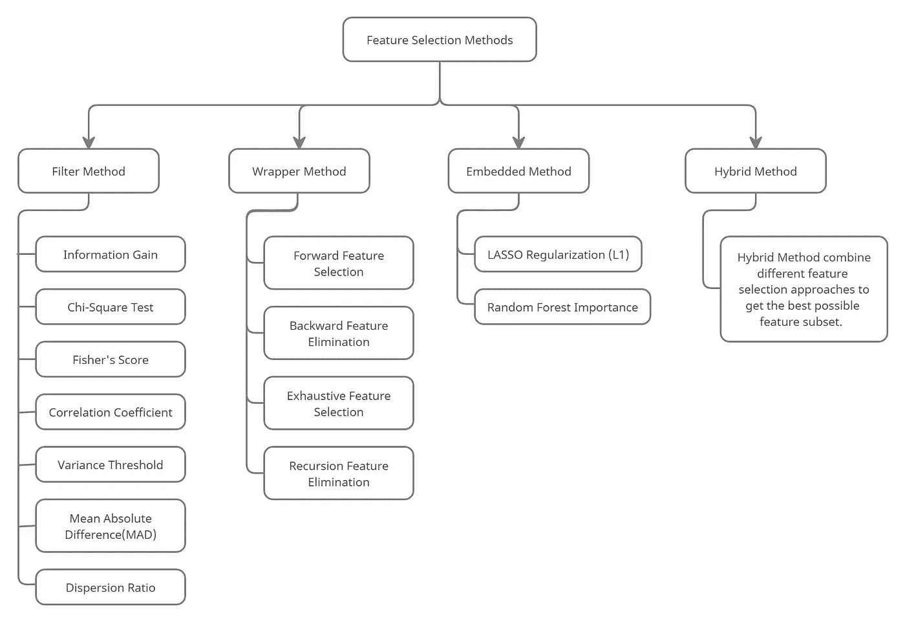

# 无监督学习——全面概述

> 原文：<https://medium.com/analytics-vidhya/unsupervised-learning-a-complete-overview-b433267e1c2a?source=collection_archive---------9----------------------->

## 无监督机器学习的完整概述

[作者](http://www.linkedin.com/in/ronil08)

# 介绍

> 这是一种机器学习技术，其中模型本身从数据中找到隐藏的模式和见解，而不是从训练数据集学习(如在监督学习中)。它基于一些相似性创建组，甚至不知道每个组代表什么。在这篇文章中，我不会简单地解释每一件事情，我只会给出一个关于不同类型的无监督学习的简短概述。大多数时候人们问我什么是无监督学习，有多少种类型，我谷歌了一下，但没有得到这个问题的完美答案，这只是我写这篇文章的座右铭。
> 
> **例如:**假设我们有一组学生属于不同的大学，我们必须根据一些特征对他们进行分组，现在我们将这一职责交给无监督算法。现在我们不知道无监督学习算法到时会如何分组。它可能会根据他们的制服、身高或发型对他们进行分组。以同样的方式，无监督算法寻找隐藏的模式或相似性，并将它们分组。

## 无监督学习的类型:

*   **聚类**
*   **关联**
*   **降维**

现在让我们看一下它的概况。

1.  **聚类:**在这种类型的无监督学习中，使用不同的算法，我们可以根据数据中存在的一些相似性或隐藏模式将数据分组为聚类。一些聚类算法是:

*   **K 均值聚类**
*   **数据库扫描**
*   **层次聚类**
*   **桦树**
*   **亲和繁殖**
*   **凝聚聚类**
*   **小批量 K 均值**
*   **光学**
*   **均值漂移**
*   **光谱聚类**
*   **高斯混合**

2.**关联:**它是机器学习的一个重要概念，也是另一种类型的无监督学习，在这种学习中，它发现我们数据中的特征或变量之间的关系，或者我们可以说，它检查我们数据中一个特征对另一个特征的依赖性。它主要用于购物篮数据分析、交叉营销、Web 使用挖掘和入侵检测等。一些关联算法是:

*   **Apriori 算法**
*   **F-P 增长算法**
*   **Eclat 算法**

3.维度缩减:这是另一种无监督学习，我们的任务是简化我们的数据，用更少的特征来描述它，同时又不失一般性。这是一个非常有用的预处理步骤，我们可以在应用不同的算法之前应用它来简化我们的数据，从而提高我们模型的精度。降维技术在不损失太多信息的情况下移除冗余和不相关的特征，因为更多的输入特征使得我们的模型的预测任务更具挑战性，这导致大规模过拟合的风险。降维有两个组成部分:

1.  **功能选择**
2.  **特征提取**

一些**特征选择方法**(不同的技术在该方法下分类)是:

*   **过滤方法**
*   **包装方法**
*   **混合方法**
*   **嵌入方法**

***特征选择方法中可用的不同技术:***

特征选择方法

一些**特征提取方法**有:

*   **主成分分析**
*   **线性判别分析**
*   **广义判别分析**
*   **随机投影**
*   **独立成分分析**
*   **局部线性嵌入(LLE)**
*   **t 分布随机邻居嵌入(t-SNE)**

# 摘要

在本文中，我们讨论了不同类型的无监督学习及其类型。假设你想学习无监督学习的概念，那么这篇文章肯定会帮助你以循序渐进的方式涵盖无监督学习的概念。

感谢您的阅读！如果您有任何建议或问题，请不要犹豫，在下面评论或在 LinkedIn 上 ping 我。请在 LinkedIn 上联系我，如果您有任何疑问，请随时提问。