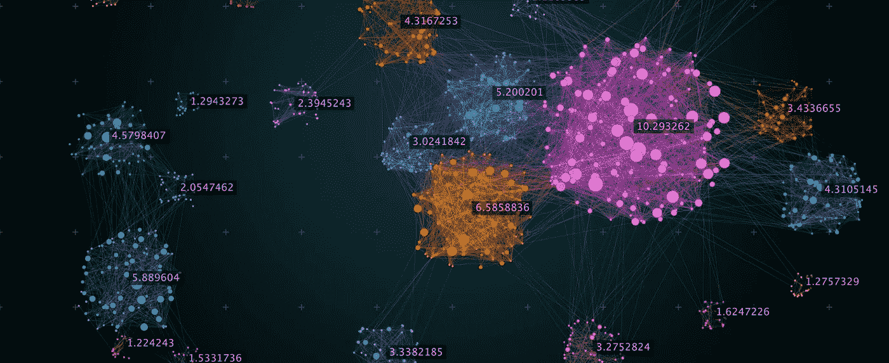
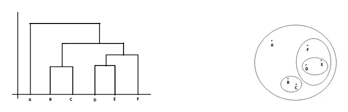
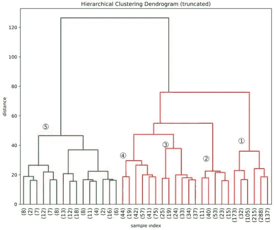
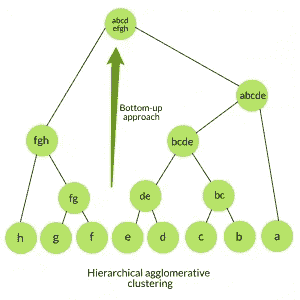
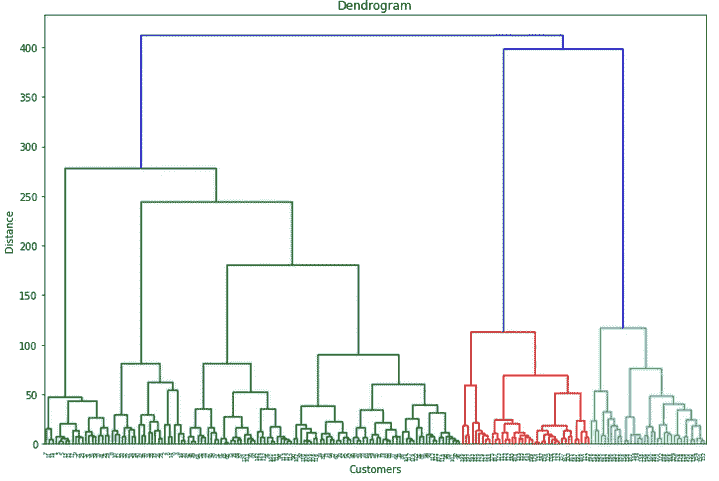
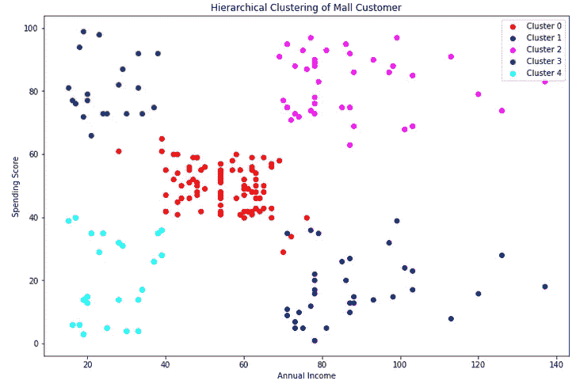
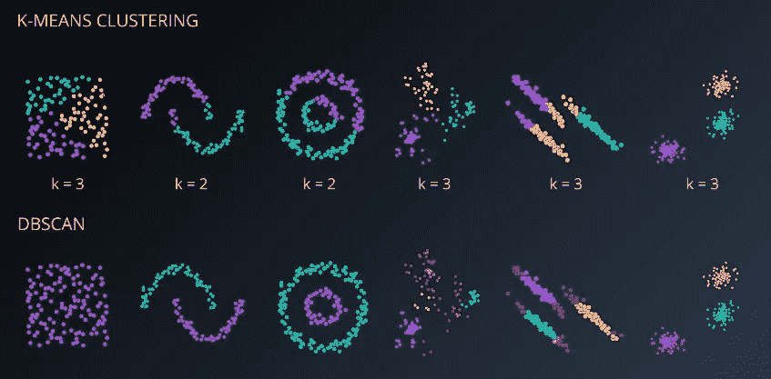
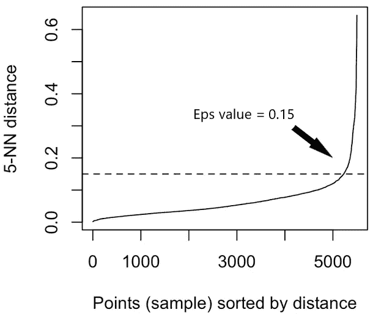
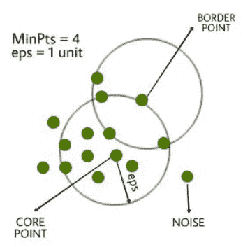
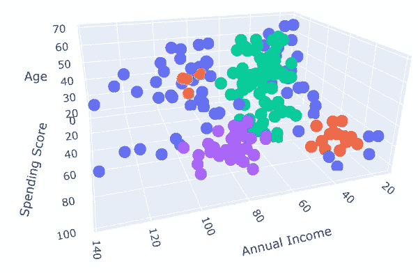

# 无监督学习:层次聚类和 DBSCAN

> 原文：<https://medium.com/analytics-vidhya/unsupervised-learning-hierarchical-clustering-and-dbscan-c38ffd8273d2?source=collection_archive---------1----------------------->

## **在客户数据集中实施的温和介绍**



来源:谷歌图片

在机器学习中，有很多方法可以将我们的数据点分组，以便基于相似性进行进一步分析。作为数据科学家或数据分析师，我们知道这种方法叫做聚类。最常用的聚类算法是 **K-means 聚类算法**。它如此受欢迎是因为这个算法如此简单和强大。它计算质心并迭代，直到我们找到一个最佳质心来分组数据点，组的数量由 **K** 表示。

然而，我不打算讨论 K-means。我将解释其他聚类算法，如**层次聚类**和 **DBSCAN** 。你们中的一些人可能已经知道这两种算法，但对我来说，这是新的东西，我对它很着迷。无论如何，让我们开始第一个！！

# **层次聚类**

这种算法也像 K-means 算法一样流行。在 K-means 聚类中，我们需要在进行聚类之前定义聚类的数量或 K，而在层次聚类中，是算法本身通过使用称为树状图的树形来自动找到潜在的聚类数量供我们决定。

***什么是树状图？***

*树状图*是显示对象之间层次关系的图表。通过使用它，我们可以看到我们将在接下来的步骤中使用的集群数量。



来源:走向数据科学



来源:谷歌图片

我们可以看到最后一张图中有两个变量。第一个是数据点本身(样本索引)，第二个是距离。这个图中的距离是欧几里德距离的表示。从图中，我们可以看到总体上有一个大的集群。然而，如果我们将距离缩短为 60，那么将只有三个集群(绿色集群、红色集群(数字 3、4 和 2)以及最后一个红色集群)。我们应该缩短距离，因为如果距离太大，聚类中的数据点可能没有一定的相似性。

**有两种层次聚类技术:**

**1。凝聚层次聚类**

这是一种自下而上的方法，最初，每个数据点被认为是一个自己的聚类，相似的数据点或聚类合并为一个，在进一步迭代寻找聚类，直到一个聚类或 K 个聚类形成。



来源:极客中的极客

**2。分裂层次聚类(DIANA)**

相比之下，DIANA 是一种自上而下的方法，它将所有的数据点分配到一个聚类中，然后将该聚类分成两个最不相似的聚类。我们递归地处理每个聚类，直到每个观察都有一个聚类。


来源:极客为极客

**实施**

1.  可视化我们数据的树状图

```
#Check the dendrogram 
plt.figure(figsize = (12, 8))
dendogram = sch.dendrogram(sch.linkage(X_pc, method = 'ward'))
plt.title('Dendrogram')
plt.xlabel('Customers')
plt.ylabel('Distance')
plt.show()
```



树状图

2.使用聚集聚类对数据进行聚类

3.将聚类结果追加到新数据集中

结果:



聚类可视化

**为什么要分层聚类？**

它的一个优点是不必预先定义聚类数，这使它比 K-Means 等算法更有优势。然而，当我们有大量的数据时，它并不能很好地工作。

# **DBSCAN(带噪声的应用程序的基于密度的空间聚类)**

现在，我们已经讨论了分区方法(K-means)和分层聚类，我们将讨论**基于密度的带噪声应用空间聚类(DBSCAN)方法**。大多数情况下，聚类算法的工作是寻找球形聚类，并受到数据中存在的噪声和异常值的严重影响。因此，对于包含大量噪声的真实生活数据，聚类的结果有时不是很好。



来源:瑞安·温盖特

在这里，数据库可以解决这个问题。聚类是数据空间中的密集区域，由点密度较低的区域分隔开。DBSCAN 基于“簇”和“噪声”的直观概念。关键思想是，对于一个聚类中的每个点，给定半径的邻域必须至少包含最小数量的点。

**DBSCAN 参数**

**1。Eps**

Eps 是邻域的最大半径。它定义了数据点周围的邻域，即如果两点之间的距离小于或等于“eps ”,则它们被视为邻居。找到 eps 值的一种方法是基于**k-距离图**。



来源:谷歌图片，作者做了一些编辑

如果 **eps 值太小**，那么**数据的大部分将被视为**异常值。如果**非常大**，那么聚类**将合并**，并且大多数数据点将**在相同的聚类中。**

**2。MinPts**

MinPts 是该点的 eps 邻域(Eps 半径内)中的最小点数。数据集越大，必须选择越大的 MinPts 值。一个简单的方法是从数据集中的维数 D 中导出 minPts。 **minPts > = D + 1** 。对于 2D 数据，取 minPts = 4。



来源:极客为极客

**核心**:距离自身 *n* 以内至少有 *m* 个点的点。

**边界**:在距离 *n* 处至少有一个核心点的点。

**噪点**:既不是核心也不是边界的点。它就像一个离群值。它与自身的距离 *n* 内少于 *m* 个点。

这就是我们在这个算法中的 3 种数据点。

**实施**

1.  使数据符合 DBSCAN 算法

```
#Use DBSCAN, -1 value means outliers
dbscan = DBSCAN(eps = 10, min_samples = 5)
y_pc_db = dbscan.fit_predict(X_pc)
y_pc_db
```

结果:

```
array([-1,  0, -1,  0, -1,  0, -1, -1, -1,  0, -1, -1, -1,  0, -1,  0, -1,
        0, -1, -1, -1,  0, -1,  0, -1,  0, -1, -1, -1,  0, -1,  0, -1, -1,
       -1,  0, -1,  0, -1,  0, -1, -1,  1,  1, -1, -1,  1,  1,  1,  1,  1,
        1,  1,  1,  1,  1,  1,  1,  1,  1,  1,  1,  1,  1,  1,  1,  1,  1,
        1,  1,  1,  1,  1,  1,  1,  1,  1,  1,  1,  1,  1,  1,  1,  1,  1,
        1,  1,  1,  1,  1,  1,  1,  1,  1,  1,  1,  1,  1,  1,  1,  1,  1,
        1,  1,  1,  1,  1,  1,  1,  1,  1,  1,  1,  1,  1,  1,  1,  1,  1,
        1,  1,  1, -1,  2, -1,  2,  1,  2, -1,  2, -1,  2, -1,  2, -1,  2,
       -1,  2, -1,  2, -1,  2, -1,  2, -1,  2, -1,  2, -1,  2,  3,  2,  3,
        2, -1,  2, -1,  2, -1,  2, -1,  2, -1,  2, -1,  2,  3,  2,  3, -1,
        3,  2, -1,  2, -1,  2, -1,  2, -1,  2, -1,  2, -1,  2, -1,  2, -1,
       -1, -1,  2, -1, -1, -1, -1, -1, -1, -1, -1, -1, -1])
```

您可以注意到聚类结果的值为-1。这些值是数据集中的噪声。

2.将聚类结果追加到新数据集中

结果:



3D 聚类可视化

记得以前，我们有-1 值，那些蓝色点是-1 值(噪声)。这里，我们有四个集群。我们可以使用下面的代码来检查这是不是真的。

```
target = X_pc_db['cluster']
print(target.nunique()) # number of clusters
```

结果:

```
4
```

**为什么选择 DBSCAN？**

它可以根据您的输入数据
和参数自动检测集群的数量。DBSCAN 可以处理噪声和异常值。所有离群值将被识别和标记，而不被分类到任何聚类中。因此，DBSCAN 也可以用于异常检测(异常值检测)。然而，这种算法对于大量杂乱的数据集仍然是困难的。

我打算解释另一种结合这两种方法的聚类算法，层次聚类和 DBSCAN 聚类。你能想象这些算法有多强大吗？

给你个提示，这个算法的名字是以 H 开头的，里面有 DBSCAN 这个词。h 代表分级，DBSCAN 代表 DBSCAN 算法。所以，它不会很快出版，因为我需要有心情来写它。但是希望在阅读了关于层次集群和 DBSCAN 的解释之后，您能有所收获。