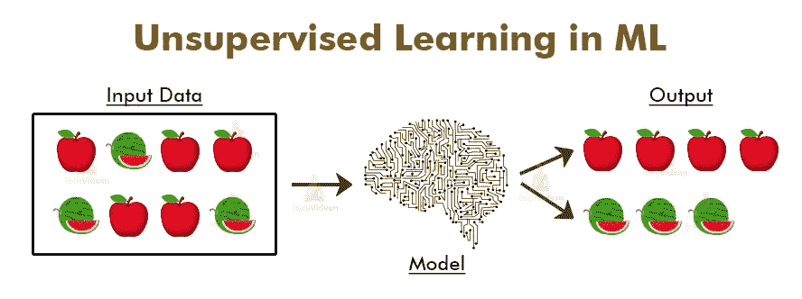
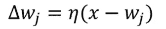
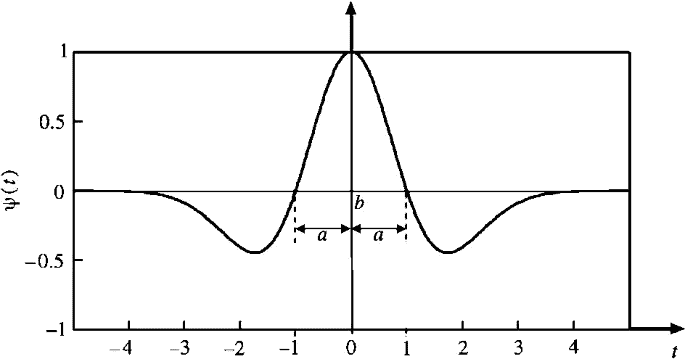
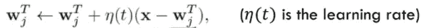
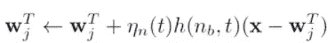

# 无监督机器学习

> 原文：<https://medium.com/analytics-vidhya/unsupervised-machine-learning-e0b73b91eb28?source=collection_archive---------22----------------------->

图片来源— TechVidvan

# **那么什么是无监督机器学习呢？**

在无监督学习中，没有提供正确的响应，因此我们试图找到输入之间的相似性，并将相似的输入分组在一起。

**不同类型的无监督机器学习算法:**

# k 均值聚类

当我们尝试使用 KMeansClustering 将相似类型的输入分组在一起时，这里指定了聚类的数量，并且模型将数据分成这些聚类。

## **k 均值聚类遵循的步骤有:**

1.  选择 k 的值(聚类数)。
2.  从输入空间中选择 k 个随机位置，并将聚类中心分配给这些位置。
3.  现在是学习部分，我们将重复下面的步骤直到步骤 6，直到所有的聚类中心停止改变它们的位置。
4.  将选择一个数据点，找出其与所有聚类中心的距离，并将其分配给聚类中心距离最小的聚类。
5.  对所有数据点重复步骤 4。
6.  在将数据点分配给聚类之后，它计算该聚类的所有数据点的位置的平均值，并将聚类中心分配给计算出的平均值。
7.  在模型完成了对任何新数据点的学习之后，我们将把它分配到一个聚类中心距离最小的聚类中。

## 【KMeansClustering 面临的挑战:

1.  它容易陷入局部最小值，这可以通过执行多次运行来防止。
2.  如何选择正确的聚类数，因为 k 值非常低会导致**过度泛化**，而 k 值非常高会导致**过度拟合。*(将误差平方和乘以 k 值可以防止过拟合)***
3.  为了处理噪声而不是计算用于决定聚类中心的平均值，它计算中值以不包括极值点，然而它在计算上更昂贵。

# k 均值神经网络:

这里 k 个聚类中心由神经网络单层中的 k 个神经元表示。最接近当前输入的聚类中心被激活。神经元(聚类中心)和当前输入之间的距离使用以下公式计算。

`Location of neuron in weight space -Location of the current input.`

**竞争学习**即神经元竞相被激活，最接近当前输入的神经元获胜(被激活)。

## KMeans 神经网络遵循的步骤是:

1.  选择 k 值(聚类数)。
2.  从输入空间中选择 k 个随机权重或根据给定的条件，这些将作为输出节点，即(聚类中心)。
3.  将输入向量归一化为两个归一化向量的点积，可以得到它们之间的距离。
4.  学习部分:对于每个输入，计算其与聚类中心(神经元)的权重的点积，点积最大的那个将是该输入的获胜者神经元。
5.  现在按照这个等式更新那个**赢家神经元**的权重:

winner 神经元方程的权重更新

继续重复步骤 4 和 5，直到神经元的权重停止变化。

6.现在，对于任何新的输入，我们可以使用两个聚类中心的权重计算其点积，并将其分配给点积最大的聚类。

# 自组织特征映射:

→它基于这样一个事实，即由相似类型的输入所激发的神经元被放置在一起，反之亦然。也就是说，靠近的神经元代表靠近的输入，而远离的神经元代表远离的输入。

→因此，神经元以网格状结构存在，具有接近的概念，即，被相似类型的输入激发的那些神经元靠近在一起。如果一个输入刺激了一个神经元，那么在一定范围内，它一定也刺激了它相邻的神经元。

→在这里，获胜的神经元试图组织其邻域来响应特定的输入。这里，我们不仅更新受激神经元的权重，还更新其邻居的权重。

获胜的神经元试图在权重空间中将它的具有正连接的相邻神经元拉向它自己，并将在该范围之外的神经元从权重空间推出/排斥。而它只是忽略了那些完全远离的神经元。这种行为可以用下图来描述:

要素映射的横向连接强度(墨西哥帽)

## Kohonen 的 SOM 算法:

它遵循以下步骤:

步骤 1 我们有一个神经元的权重向量和一个输入向量。

步骤 2 计算每个输入和神经元权重之间的欧几里德距离。然后选择获胜的神经元，即权重最小的神经元。

`nb = min |x-wj|`

步骤 3 现在使用下面的等式更新获胜神经元的权重:

获胜神经元的权值更新公式

步骤 4 更新获胜神经元的邻居的权重。

邻居权重更新公式

附近神经元的 h(nb，t) → 1

远处神经元的 h(nb，t) → -1

对于非常远的神经元，h(nb，t) → 0。

通过迭代，我们将继续降低学习率和邻域函数。所以用这种方法，我们会为每个输入更新神经元的权重。

文章结束。

希望有帮助:)

谢谢，祝你愉快。