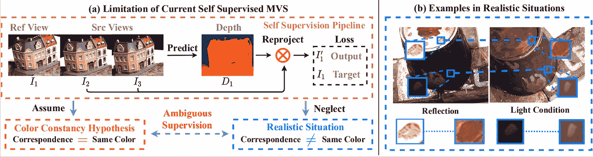

# 无监督多视图立体——一种新兴趋势

> 原文：<https://medium.com/analytics-vidhya/unsupervised-multi-view-stereo-an-emerging-trend-4d3034e23e9e?source=collection_archive---------9----------------------->

多视图立体(MVS)算法旨在利用给定的内在参数和已知的姿态，从一组校准的图像中计算场景的密集 3D 点云。虽然经典几何方法仍然是该领域中性能最好的方法(例如在[高分辨率 ETH 基准](https://www.eth3d.net/high_res_multi_view)上)，但近年来越来越多的深度神经网络开始出现，并取得了令人难以置信的结果。然而，这些工作中的大部分依赖于地面真实深度进行训练，这既难以获得，也不能扩展到真实世界的情况。基于学习的 MVS 研究的一个新兴趋势是在没有监督的情况下训练深度网络，借鉴自监督单目深度估计文献的思想。幸运的是，现有的无人监管的 MVS 框架非常少，以至于它们完全适合发表在一篇博客文章中。

## 基于鲁棒光度一致性的无监督多视图立体视觉学习

在没有监督的情况下学习 MVS 的第一次尝试出现在 CVPR 2019 年的一个研讨会上[1]，它立即解决了一个相当明显的问题:对于单目情况，用无监督的损失函数代替有监督的损失函数是否足够？由于 MVS 数据的性质，答案是否定的。由于单目深度网络通常是在视频上训练的，因此基线较窄，照明大多相似，并且存在有限的遮挡或视点变化。另一方面，MVS 算法的输入通常是一组图像，这些图像之间具有显著的视觉变化，应当被鲁棒地处理。

典型 MVS 数据中的遮挡。图片来自[1]。

为此，提出并评估了稳健的光度一致性损失。具体来说，他们基于两个简单的观察:

*   与亮度相比，图像梯度对于光照变化更加不变，因此原始梯度和扭曲梯度之间的差异应该被明确地惩罚。
*   给定像素的光度一致性应该在某些视图中实施，但不是所有视图。从实用的角度来看，通过计算所有的损失图并从它们的堆栈中选择最少的条目，只选择最好的相机。

[1]中的稳健光度损失。

总损失函数补充了平滑项和来自单目文献的相同 SSIM 项，然后用于在 DTU 数据集上训练 MVSNet [2]的相同架构。尽管提供的结果比受监督的同行更差，但这篇开创性的论文开创了一个新趋势。

## MVS2:具有多视图对称性的深度无监督多视图立体

另一个作品同时出现在 3DV 2019 上，号称是第一个无监督的 MVS 网络[3]。即使这可能不是真的，这种方法本身是非常聪明和新颖的。网络架构再次从 MVSNet 借用，但该框架建立在以下关键见解上:现有网络是不对称的，这意味着它们使用来自源图像的信息来估计参考视图的深度图，但源视图的深度图是独立估计的。由于这个原因，提出了一种对称框架，其中所有的深度图用共享的权重同时估计，并且明确地加强了跨视图一致性，因为所有的图像都在观察相同的 3D 几何形状。

在[3]中提出的对称 MVS 框架。

本文的主要创新点是提出了由三项组成的跨视图一致性损失:

*   成对图像一致性是通过惩罚图像和二阶合成邻居之间的差异(即，原始视图扭曲到另一个视图中，然后再次扭曲回来)来制定的。
*   成对深度一致性迫使特定视点的深度与扭曲到相邻视点的深度一致。
*   多视图亮度一致性将损失扩展到三个一组的图像。

此外，通过对图像的深度图和其二阶扭曲深度之间的差进行阈值化来计算多视图遮挡掩模，从而掩蔽损失函数。这些贡献导致了比以前的开创性方法更好的结果，大大缩小了与 MVSNet 监督版本的差距。

## M3VSNET:无监督的多度量多视图立体网络

一年后，这两项首次试验都被一种名为 M3VSNet [4]的新方法消化和提炼，这种方法在无监督的 MVS 中创造了新的艺术水平，同时比 M2VS 更有效。网络架构再次模仿 MVSNet，但有两个关键贡献:

*   首先，损失函数也是通过扭曲特征而不仅仅是图像来计算的。这在单目深度估计文献中也被证明是成功的[5]。
*   其次，受[6]的启发，增加了新的正常深度一致性改进。

这个想法相当简单:将每个点的法线估计为每个像素的成对邻居提供的法线之间的平均值，如下所示。

每个像素的正常估计程序。图片来自[4]。

为了使深度法线对一致，法线应该正交于给定像素周围的局部表面。这可以通过计算法线本身与连接对应于像素及其每个邻居的 3D 点的向量之间的角度来容易地确保。每个邻居被充分加权以适应场景的局部几何形状(即，通过简单地惩罚具有大图像梯度的邻居),并且邻居的细化深度作为对先前正交性约束的解的加权平均来获得。这种正则化项，结合多尺度特征度量损失，允许在所有度量上胜过 M2VS，甚至在 DTU 数据集上胜过监督 MVSNet。

## 通过有效的共同分割和数据增强的自我监督的多视图立体

AAAI 2021 的另一项最新工作[7](你可以在本次会议上找到我的外卖[这里](/analytics-vidhya/3d-reconstruction-news-aaai-2021-5f435cba6718))通过建立在以下观察之上，设立了一个更高的标准:以前的无监督 MVS 网络强烈依赖于来自不同视图的点之间的颜色恒常性，这导致了模糊的监督(见下图)。具体地说，迄今为止，语义信息从未被考虑过，并且对不同照明条件的鲁棒性也没有被明确地实施。

现有无监督 MVS 网络中模糊监督的例子。图片来自[7]。

为了缓解这个问题，他们提出用两个先验来指导自我监督:

*   多视图中的对应点应该语义一致。他们使用基于非负矩阵分解的无监督共同分割方法来实现这一想法，但在更具体的场景中(如自动驾驶)，来自预训练网络的语义地图将做得很好。语义损失项仅仅是给定分割图和扭曲分割图之间的每像素交叉熵损失。
*   该网络应该足够健壮，以便从具有不同颜色、照明和模糊的数据中学习。为此，对输入图像应用随机变换并将其投影到源视图，然后计算原始深度图和受损深度图之间的差异。这是一个正则项。

这两项以及常见的光度损失和平滑度损失都有助于训练 MVSNet。总体框架在该领域建立了一个新的艺术状态，并且比许多其他监督方法(不仅仅是 MVSNet)执行得更好。

## 额外收获:作为模型改进的自我监督的多视图立体

虽然以前的方法侧重于从零开始训练无监督的 MVS 网络，但最近的一系列研究建议使用自我监督来完善现有模型，即要么在没有监督的情况下进行训练，要么在其他数据集上用地面真理进行训练。目前有两种现有的方法:

*   第一个在 BMVC 2020 上展示[8]，包括使用模型不可知的元学习(MAML) [9]来训练具有地面真理的网络，然后根据需要通过对新数据集的自我监督来完善网络。MVSNet 也是这项工作的架构选择。
*   第二篇论文将在 2021 年 CVPR 会议上发表[10]，它是完全无监督的，这意味着输入数据用于在无监督的情况下生成伪标签，然后这些粗略的深度估计通过自我监督进行细化。具体而言，在自监督框架的每次迭代中，生成深度图，用简单的融合方案将其投影到 3D 中，网格化，然后再次观察以建立自训练损失。这种迭代过程可以实现令人印象深刻的结果，并与监督网络的性能相当。

在[10]中形成的迭代自我监督训练方案。

## 参考

[1] Khot 等人，*通过鲁棒光度一致性学习无监督多视图立体视觉*，CVPR 研讨会 2019

[2]姚等， *MVSNet:面向非结构化多视点立体的深度推理*，2018

[3]戴等， *MVS2:多视点对称的深度无监督多视点立体*，3DV 2019

[4]黄等， *M3VSNet:无监督多度量多视点立体网络*，ArXiV 2020

[5]舒等，*深度和自我运动自监督学习的特征度量损失*，2020

[6]杨等，*边缘感知深度法线一致性几何的无监督学习*，ArXiV 2017

[7]徐等，*基于有效共分割和数据增强的自监督多视点立体视觉*，2021

[8] Mallick 等人，*通过自我监督学习适应多视点立体视觉*，BMVC 2020

[9] Finn 等人，*用于深度网络快速适应的模型不可知元学习*，ICML 2017

[10]杨等.*多视点立体深度推理的自监督学习*，2021