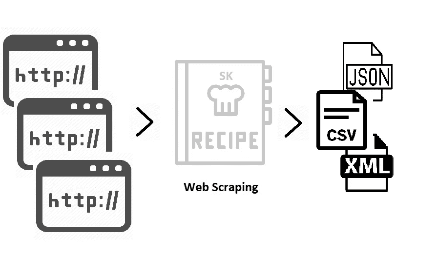
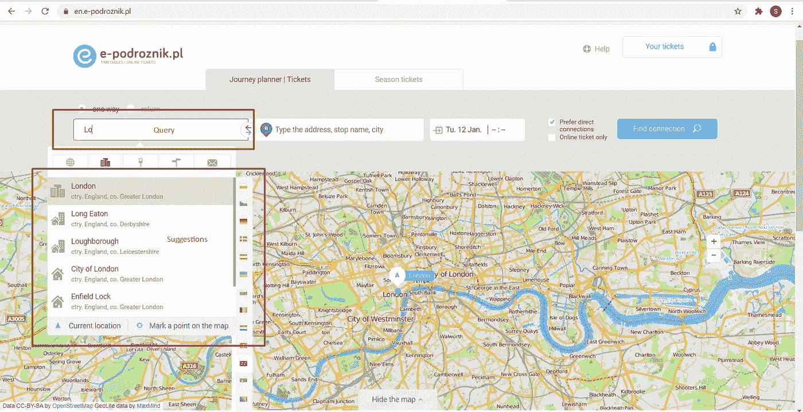
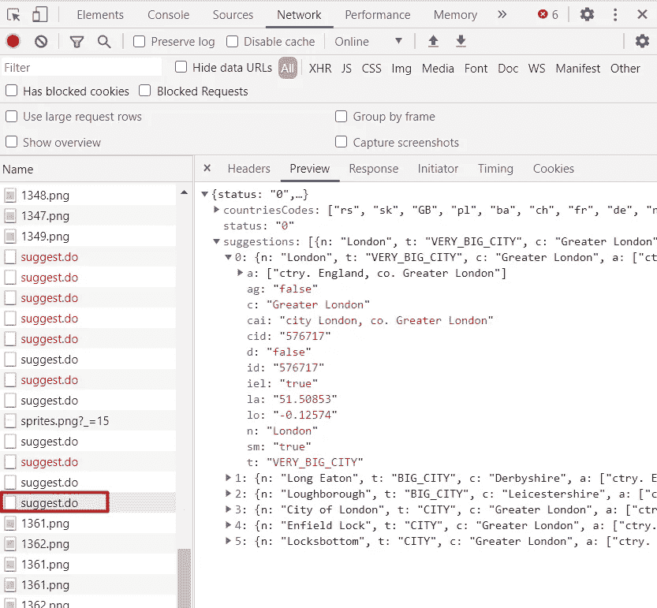
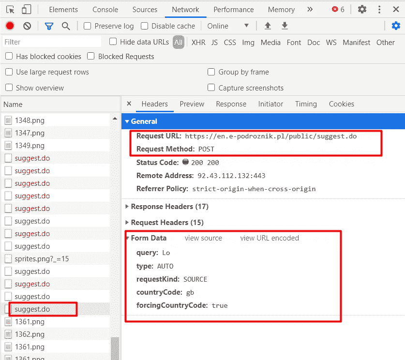
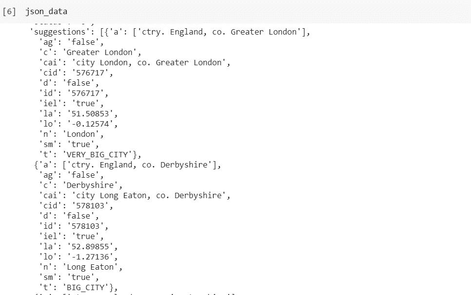

# 网络抓取的未知配方

> 原文：<https://medium.com/analytics-vidhya/untold-recipe-for-web-scraping-77493e4213c4?source=collection_archive---------25----------------------->

出于本教程的目的，我们将跟随 [en.e-podroznik.pl](https://en.e-podroznik.pl/) 网站进行演示。本文展示的技术是独立于编程语言的，可以在任何支持 Web 抓取的编程语言中使用。

很多时候，你要寻找的数据已经摆在面前，你不需要进入 HTML xpaths、CSS 选择器来提取这些数据。



网页抓取配方

首先，让我们快速浏览一下我们今天的目标网站及其数据。



今天大多数网站都有搜索栏或其他输入栏的自动完成功能。

假设我们对 Autocomplete 中作为建议返回的数据感兴趣，就像上面的例子一样。

**在很多情况下，你所要做的就是检查 Inspect 下的 Network 选项卡，查看网站发出的请求，以获取你想要的数据。**



分析网络选项卡

要遵循的步骤:

1.  按 Ctrl + Shift + I 或 F12 在浏览器中输入 Inspect。
2.  切换到 Inspect 中的 Networks 选项卡，然后刷新页面。

您会注意到在页面加载时有很多请求。

分析每个请求的预览，以检查任何这些请求中是否存在感兴趣的数据。为了避免在分析每个请求时浪费大量时间，试着过滤掉明显的请求，如广告、图像文件、谷歌跟踪请求等。

最好的情况是数据是 JSON 格式，就像上面的例子一样。

现在分析 Headers 选项卡，在我们的程序中复制请求。



请求标题

这里复制请求的要点是。

1.  请求 URL
2.  请求方法
3.  格式数据

这种提取有用数据的技术并不局限于这个自动完成的例子，还可以用于其他各种实例，我们将在后续的文章中讨论这些实例。

我最喜欢的编程语言中的请求复制如下所示。

# 计算机编程语言

代码:

```
#importing modules
import requests
import json#url and form_data here are as per the above example.
url = 'https://www.e-podroznik.pl/public/suggest.do'
form_data = {"query" : "Lo", "type" : "AUTO", "requestKind" : "SOURCE", "countryCode" : "gb", "forcingCountryCode" : "true"} response = requests.post(url, data = form_data)

json_data = json.loads(response.text)
#json_data holds the data in Dictionary for our use.
```

输出:



JSON 格式的必需数据。