# UP-DETR:用变形金刚进行目标检测的无监督预训练(综述)

> 原文：<https://medium.com/analytics-vidhya/up-detr-unsupervised-pre-training-for-object-detection-with-transformers-a-review-c4b996e12a9c?source=collection_archive---------3----------------------->

无人监管的预训练，拯救世界！

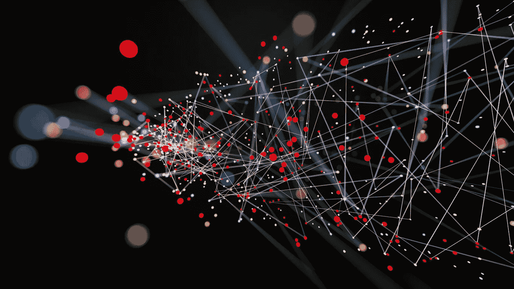

[来源](https://towardsdatascience.com/explained-deep-learning-in-tensorflow-chapter-0-acae8112a98)

来自 SCTU*和中国腾讯微信人工智能*的研究人员提出了 [**UP-DETR**](https://arxiv.org/abs/2011.09094) ，这是一种用于物体检测的无监督学习方法，将在本文中进行探索。它是由*脸书艾提出的**物体检测方法的一个进步。***

****受自然语言处理中预训练变形金刚**的巨大成功的启发，UP-DETR 的作者提出了一个名为随机查询补丁检测的托词任务来无监督地预训练 DETR (UP-DETR)用于对象检测。**

> **在深入研究 UP-DETR 的内部工作原理之前，理解变形金刚在深度学习中的作用以及为什么计算机视觉任务需要它们是很重要的。**

# ****1。你需要的只是关注****

**2017 年，Vaswani 等人(*来自谷歌*)提出了一种网络架构， [**变压器**](https://arxiv.org/abs/1706.03762) ，完全基于注意力机制，完全免除了递归和卷积。该模型在机器翻译任务中表现出色，同时还确保了促进更快训练的并行化能力。**

**对于捕获长期相关性，在序列到序列任务中，如 NLP 递归神经网络工作良好，但由于顺序计算，它们很慢，并且容易遭受消失/爆炸梯度问题。**

> **即使变形金刚不使用任何循环单元，它们实际上是如何捕捉长期依赖模式的，你可能想知道！在 1.2 中回答..3…**
> 
> **“注意”机制。**

**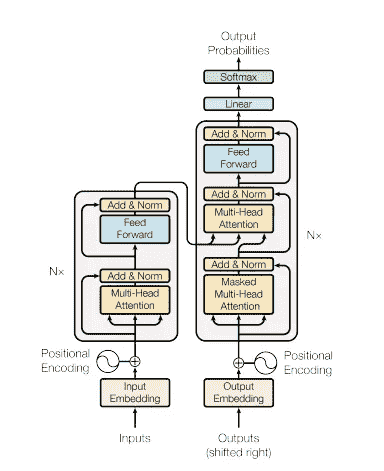**

**来源:[链接](https://arxiv.org/pdf/1706.03762.pdf)**

**不能告诉你把注意力机制当作一个黑匣子来深入理解变压器的工作，我强烈推荐你阅读 **Jay Alammar** [**文章**](http://jalammar.github.io/illustrated-transformer/) (用直观教具很好地解释)**

**了解**查询(Q)、键(K)和值(V)** 向量的作用是很重要的。**

**要进一步了解《注意力是你所需要的全部》一文，请观看视频。**

# **2.为什么视觉任务需要变形金刚？**

**与 RNNs 相比，转换器允许对输入序列元素之间的长相关性进行建模，并支持序列的**并行处理**。变形金刚的**简单的设计**允许它们使用类似的处理模块处理多种模态(例如，图像、视频、文本和语音),并展示了**对超大容量网络和海量数据集的卓越可扩展性**。这些优势已经在涉及变压器网络的各种视觉任务上取得了令人兴奋的进展。— [链接](https://arxiv.org/abs/2101.01169)**

# ****3。DETR(简单回顾)****

**2020 年提出的方法使用变换器编码器-解码器架构将对象检测作为集合预测问题来处理。它利用全局损失，通过二分匹配强制进行唯一的预测-给定固定的一小组学习对象查询，DETR 推理关于对象和全局图像上下文的关系，以直接并行输出最终的预测集。**

**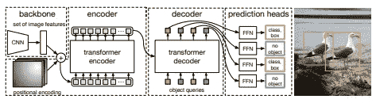**

**[图二:DETR](https://arxiv.org/pdf/2005.12872.pdf)**

**DETR 是一种监督学习方法，它给出 n 组预测作为输出。这里[二分匹配](https://www.geeksforgeeks.org/maximum-bipartite-matching/)损失在确保单个对象不会在单个图像输入中被多次检测到方面起着关键作用。**

> *****值得注意的是，该损失函数考虑了边界框的分类损失和回归损失。*****
> 
> **1.假设给定的输入图像具有 **2** 标记的地面实况对象。2.假设 DETR 的总预测数(N)为 **4****
> 
> **这个**损失函数**将试图鼓励模型进行预测，使得它给出两个具有它们的类和边界框的预测以及两个没有类的预测。否则会受到惩罚。**

# **4.无监督预训练**

**由于目标函数的局部最优和复杂模型的过拟合倾向，深度前馈神经网络训练可能是困难的。无监督预训练是从使用无监督标准(如深度信任网络或深度自动编码器)训练的神经网络开始辨别神经网络的过程。这种方法有时有助于优化。**

**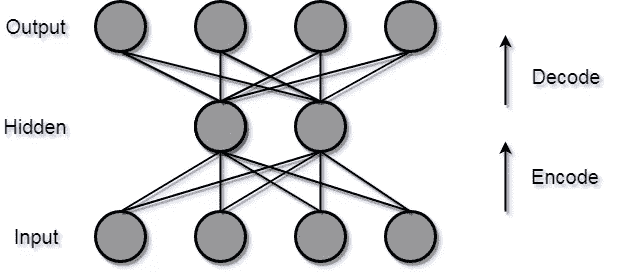**

**来源:[链接](https://iq.opengenus.org/applications-of-autoencoders/)**

**这个想法简单明了。我们不是随机初始化权重，而是针对某项任务对它们进行预训练(通常是自动编码器中的特征重构)，然后固定权重。然后，我们针对下游任务对其进行微调(**从特征空间中更有利的区域开始，以便模型比随机初始化其权重时学习得更快****

# **4.上 DETR**

> **主图开始…**

**UPDETR 方法，从给定的图像中随机裁剪面片，然后将它们作为查询提供给解码器。该模型被预先训练以从原始图像中检测这些查询补丁。预处理中的两个关键问题如下。**

1.  **多任务学习。**
2.  **多查询本地化。**

**UP-DETR 认为，尽管 DETR 在目标检测任务上表现良好，但它在训练和优化方面存在障碍，这需要大规模的训练数据和相对较长的训练时间表。**

**您可以从下图中推断出，UP-DETR 需要更少的时间来收敛，并且从长远来看表现良好，很明显，DETR 在 PASCAL VOC [ [link](https://cv.gluon.ai/build/examples_datasets/pascal_voc.html#:~:text=Pascal%20VOC%20is%20a%20collection,and%202007%20test%20for%20validation.&text=The%20total%20time%20to%20prepare,Internet%20speed%20and%20disk%20performance.) 中表现不佳，其训练数据和实例相对少于 COCO [ [link](https://cocodataset.org/#home)**

**这表明在训练数据不足的情况下，变压器的预训练是必不可少的**

**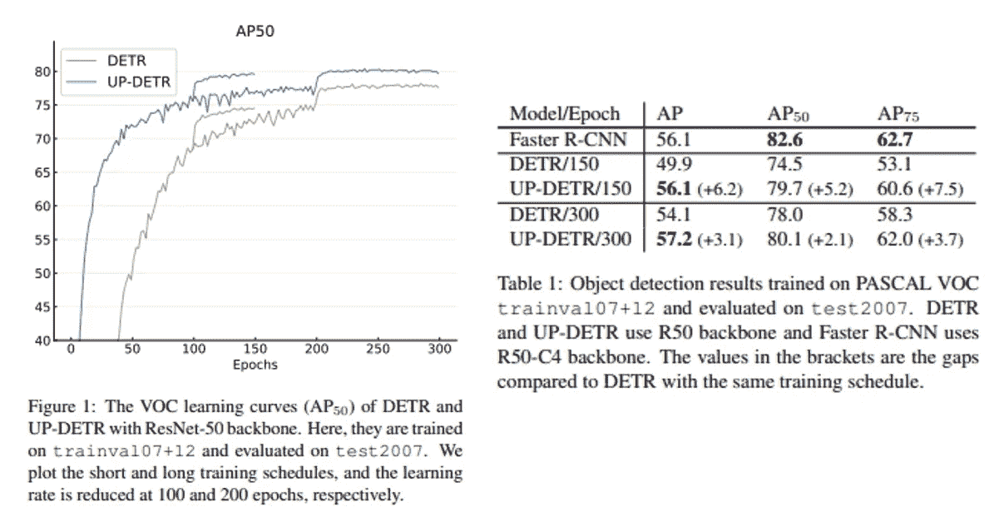**

> **多任务学习**

**简单地说，目标分类和定位的结合称为目标检测。**

**为了防止查询补丁检测破坏分类特征，引入了保持变压器特征区分的 ***冻结预训练骨干*** 和 ***补丁特征重构*** 。**

**此外，消融研究表明**冻结 CNN 主干**在预训练阶段对特征辨别起着重要作用。**

> **多查询本地化**

**不同的对象查询集中于不同的位置区域和盒子大小。提出了一个简单的单查询预训练，并扩展到多查询版本，以证明这一性质。**

**引入对象查询混洗和注意屏蔽来解决多查询补丁中查询补丁和对象查询之间的分配问题。**

# ****两阶段攻击！****

**以无人监管的方式对变压器进行预处理。**

**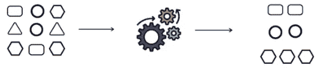**

**[来源](https://www.enjoyalgorithms.com/blogs/supervised-unsupervised-and-semisupervised-learning)**

**UP-DETR 在没有任何标签的 **ImageNet** 训练集上进行了预训练。CNN 骨干网(ResNet-50)是用 SwAV 预先训练的**

****II)** **微调****

**该模型通过预训练上行 DETR 参数进行初始化，并利用标记数据针对 VOC 和 COCO 上的所有参数(包括 CNN)进行微调。**

**如前所述，这个阶段从一个有利的特征空间开始，因此它表现良好，收敛良好。**

**该模型用 150/300 个时期的短/长时间表进行微调，学习率分别在 100/200 个时期乘以 0.1。**

****

**[来源](https://g-stat.com/optimization-gradients-overview/)**

# **架构细节**

**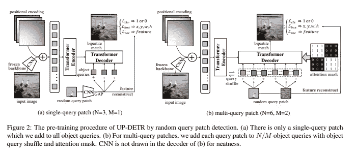**

**来源:[链接](https://arxiv.org/pdf/2011.09094.pdf)**

**如您所见，输入图像首先通过 CNN 主干网，以提取特征映射(f ),该映射被添加到位置编码中，并被送入多个 transformer 编码器层。编码器的输出馈入解码器。**

**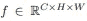**

**c =通道；h =高度；w =宽度**

**来自相同输入图像的随机裁剪的查询补丁被馈送到具有 GAP(全局平均池)的 CNN 主干中，使得它给出补丁特征(p ),该特征然后与相同维度的对象查询相加，以馈送到解码器中。**

**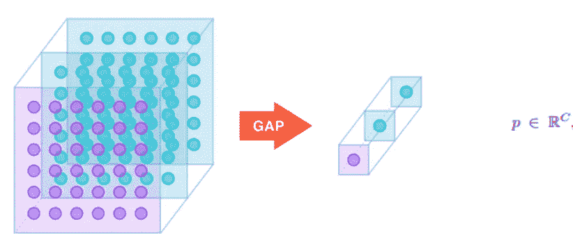**

**[来源](https://alexisbcook.github.io/2017/global-average-pooling-layers-for-object-localization/)**

**有 N 个对象查询。当模型被训练时，这些是可学习的。**

> **"对象查询的作用就像是一群人**"****
> 
> ****这些家伙将负责询问某个位置和盒子大小[这反过来将有助于模型]根据它给出预测。****

****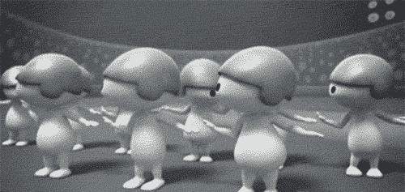****

****😆对象查询-动物园动物园****

****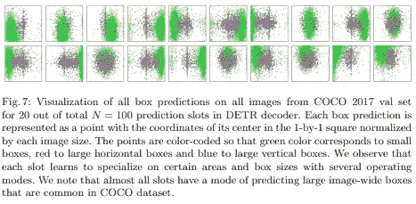****

****[摘自 DETR 论文](https://arxiv.org/pdf/2005.12872v3.pdf)****

******损失函数******

********

> ****对于训练前阶段的损失计算；预测结果由三个要素组成。****
> 
> ******cˇI**= =>对每个对象查询的**匹配或不匹配**的二元分类****
> 
> ******b\i**= =>定义框中心坐标的向量 **{x，y，w，h }**
> 
> **p\i**= =>ResNet-50 主干的 C = 2048 的重构特征****

****L rec 分量是本文提出的重建损失，用于在无监督预训练期间平衡分类和定位。保持特征区分的 L2 归一化面片特征之间的均方误差。****

****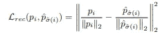****

****对于多查询补丁，****

****如果我们有**“M”**个查询片和**“N”**个对象查询，那么我们将 N 个对象查询分成 M 个组，其中每个查询片被分配给 N/M 个对象查询。****

****作者假设了更好的泛化的两个要求
**i)查询补丁的独立性(注意力屏蔽)ii)对象查询的多样性(对象查询混洗)******

****为了满足查询补丁的独立性，我们利用注意屏蔽矩阵来控制不同对象查询之间的交互。****

****为了模拟对象查询之间的隐式组分配，我们在预训练期间随机打乱所有对象查询嵌入的排列。10%的查询补丁在预训练期间被屏蔽为零，类似于退出。在他们的进一步研究中，“对象查询混洗是没有帮助的”****

****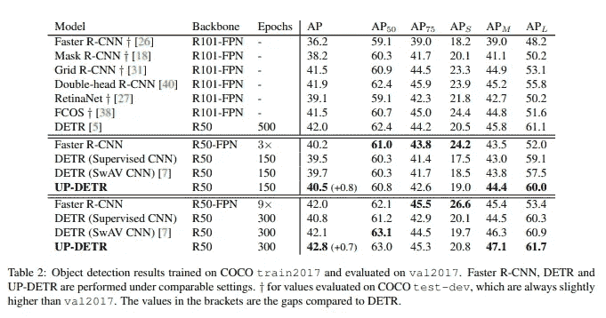********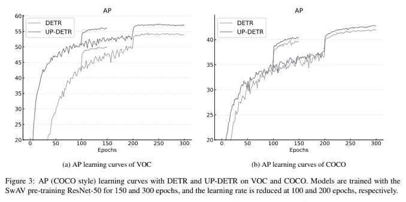****

******结果表明，即使有足够的训练数据(即 COCO 上的 18K 图像),预训练变压器仍然是不可或缺的******

****UP-DETR 的结果被进一步扩展用于单镜头检测和全景分割，并且它似乎也在这些任务中全面地执行。****

****以下曲线和结果总结了无监督方法的重要性。****

****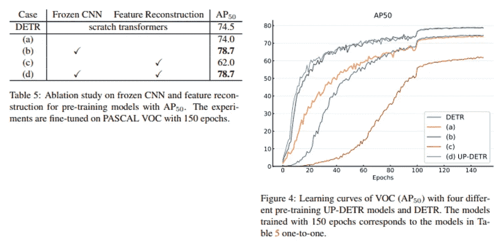********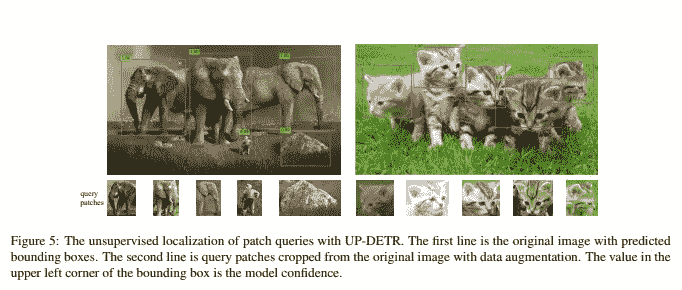****

****通过无监督的预训练，UP-DETR 在对象检测、单镜头检测和全景分割方面明显优于 DETR。****

# ****参考****

1.  ****[图解变压器——杰伊·阿拉玛](https://jalammar.github.io/illustrated-transformer/)****
2.  ****[使用变压器的端到端物体检测](https://arxiv.org/abs/2005.12872)****
3.  ****[上 DETR:用变形金刚进行物体检测的无监督预训练](https://arxiv.org/abs/2011.09094)****
4.  ****[最大二部匹配— Geeksforgeeks](https://www.geeksforgeeks.org/maximum-bipartite-matching/)****

> ****下次见！****

> ******在 LinkedIn 上联系我** linkedin.com/in/praveenkumar-rajendran/****