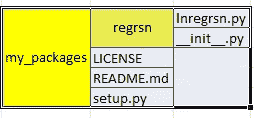

# 使用 pip 上传自定义软件包并安装

> 原文：<https://medium.com/analytics-vidhya/uploading-custom-packages-install-using-pip-338bec5c6c3d?source=collection_archive---------16----------------------->

到目前为止，您一定已经使用像**pip 3 install<package _ name>这样的单一命令安装了 python 包。**但是你有没有想过软件包是如何上传的，我们可以远程安装它们。如果你不完全了解这些过程，那么这就是适合你的地方。

在继续之前，请在 https://pypi.org/account/register/的[创建一个账户。pypi 充当一个存储库，所有的 python 包都实际上传到这里。](https://pypi.org/account/register/)

在这篇博客中，我们将准备自定义模块来执行带有一些准确性指标的基本线性回归，并最终将其上传到 pypi 中。我们将不详细讨论线性回归，因为这不是我们的目标，但是我们将简要讨论它。

在线性回归的情况下，模型试图在平面上为所有数据点画一条最合适的线。这是维基百科上的一张图片

来源:维基百科

如上所述，红线是模型试图根据可用数据点绘制的实际线条。显然，这条线并不完美，所以我们考虑最合适的一条。

如果我们从数学角度来考虑，最简单的等式应该是 **y=wx+b** ，其中“x”是独立变量，“w”是权重，“b”是偏差。类似地，如果 x 有多个特征，等式将被稍微修改。所以对于'iᵗʰ-维来说，
y =w₁x₁+w₂x₂+w₃x₃+……w+b ᵢxᵢ

为了找出最佳的“W”和“B ”,优化方程应该是
w = w - r*(dL/dw ),其中“r”是学习率，L =损失函数
和，b= b - r*(dL/dw)

现在，实际值是**‘y’**对应的预测值是’***ŷ'****其中
ŷ = W*X + B.
误差= y - (W*X + B)。*为了避免-ve 值，我们可以取平方值。
L = ( *y — (W*X + B)* )。
and，dL/dW = 2 *(T23)y—(W * X+B)【T24)*(-X)
and，dL/dB = 2 *(T26)y—(W * X+B)【T27)*(-1)

我们将应用相同的概念并写下 python 代码。

黄色 bg 实际上是目录

首先准备目录结构，
I)’**my _ packages’**是的父目录。ii)在' **my_packages'** 中，我们有另一个目录，名为 **'regrsn '。**为了清楚起见，我们也将保留最终的包名为‘reg rsn’。您可以选择不同的名称，但在导入包时可能会造成混淆。包名也必须是唯一的。
iii)在“**my _ packages”**下，我们还有许可证& README 文件和 setup.py
iv)在“ **my_packages/regrsn/** 内，我们有实际的 python 文件**‘lnregrsn . py’**和空的**’_ _ init _ _。py'** 文件。
我们将逐一讨论

在' **lnregrsn.py '，**中，我们有用于线性回归的 python 代码。

每当使用软件包时，每个目录中都需要 __init.py__。虽然可以保持为空。因为在我们的例子中，我们只有一个模块，所以我们需要保存在目录中。

在 setup.py 中应该写入所有与包相关的信息，这里不要忘记更新 name 字段。

在许可证文件中，应提及所有与许可证相关的信息，并在 README.md 文件中提及自定义消息。

现在我们差不多完成了，是时候准备最后的包了。为此从
终端执行，`python setup.py sdist bdist_wheel`

通过执行此操作，将自动创建 dist 目录，因此使用
`twine upload dist/*`将其上传到 pypi 中

它会询问用户名和密码，输入您的详细信息，然后我们就完成了。如果没有安装密匙环，上传将无法进行。在这种情况下安装，
pip 安装键环==21.4.0

如果一切顺利，在你的 pypi 账户中会显示这个包。在我们的例子中，我们可以手动安装为 pip3 install regrsn，这是我们的包名。

要使用这个包，我们可以如下导入，
从 regrsn.lnregrsn 导入线性回归作为 lnr

并且这些方法可以被访问为，
lnr.calculate_weight(x，y)。

**注意:**强烈建议不要使用 pypi 上传用于测试目的。为此，请使用[https://pypi.org/project/testPy/](https://pypi.org/project/testPy/)。

参考资料:
【1】[https://www . freecodecamp . org/news/build-your-first-python-package/](https://www.freecodecamp.org/news/build-your-first-python-package/)