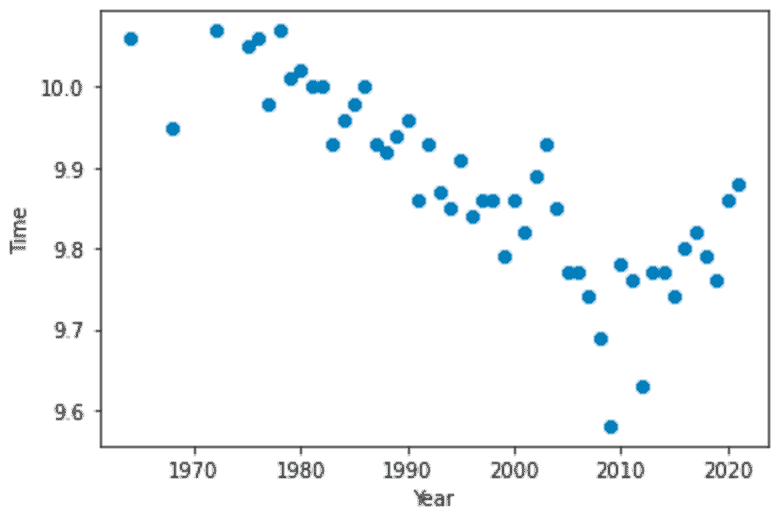
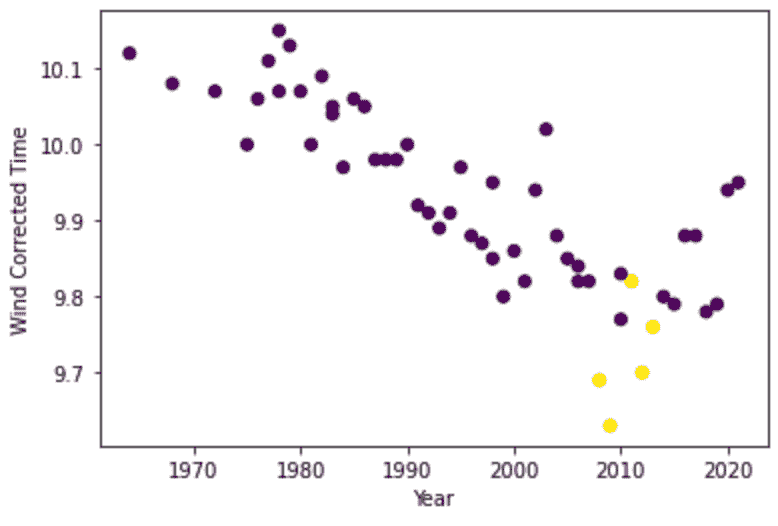
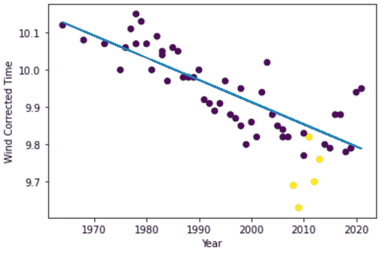
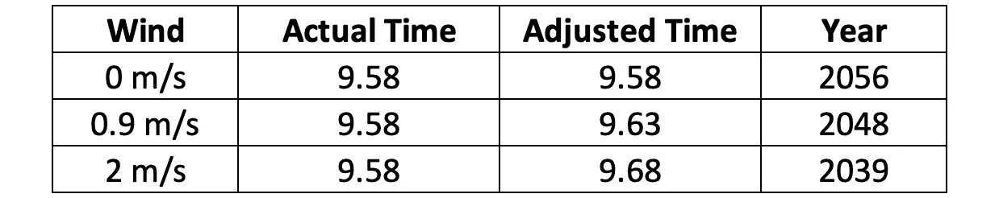

# 乌塞恩·博尔特:来自 2048 年的人

> 原文：<https://medium.com/analytics-vidhya/usain-bolt-the-man-from-2048-c85f6ad0ada3?source=collection_archive---------15----------------------->

月亮上的人。柏林墙的倒塌。我们都听说过，也经历过一些“你在哪里”的时刻。其中一些，为什么不呢，与体育有关(只要问问任何一个巴西人关于 2014 年世界杯 7 比 1 输给德国的事就知道了)。

我还记得 2009 年 8 月 16 日。我那时才 17 岁，可以花一整个下午在房间里看世界田径锦标赛。那天最精彩的当然是男子 100 米决赛。已经是世界纪录保持者的尤塞恩·博尔特承诺要表演一场。我们看了一场精彩的演出。

Salih Zeki Fazlioglu |阿纳多卢通讯社|盖蒂图片社

## 历史在冲刺

有 9.58 秒，我没有呼吸。他一年前创下的 9.69 秒的纪录似乎已经不可思议了。他领先了 0.11 秒。这可能看起来没什么，但想想自 1999 年以来，世界纪录只提高了 0.10 秒。他只需要一年时间就可以做到。

最终，年龄来了，博尔特遗憾地没有完成最后一场比赛就退役了，一开始就伤了自己。然后，除了加特林和科尔曼的一些火花之外，没有人能接近他的表演(公平地说，他的惊人的竞争对手鲍威尔、布莱克和盖伊)。当尘埃落定，一个问题出现了:我们什么时候会看到一个新的世界纪录保持者？什么时候有人能够重复这样的明星表演？

我最近解决了这个问题，基于一个非常非常简单的线性回归模型，我估计博尔特的记录至少在 2039 年之前不会出现！考虑到自博尔特退役以来的最好成绩仅仅是柏林之夜 10 年后的 9.76 秒，这个成绩似乎并不遥远。

## 我们说的有多简单？

从现在开始，我会展示我所做的。我收集了自 1968 年以来的年度男子 100 米最佳记录，并制作了下面的散点图，来感受一下这些数据。

记录的时间和年份之间存在明显的负相关关系，有些人可能会惊讶于这种关系似乎相当线性！

尽管如此，我们在 2010 年左右还是有一小群极好的年份。即使考虑到风速(基于 Mureika 的研究)，这一趋势依然存在。由于博尔特是这里的主要焦点，下一步是用黄色突出他的标记。

博尔特保持最佳记录的五年中，有三年是明显的负面异常值，只是表现惊人。给定数据行为，我选择 next 用简单的线性回归器对其建模，将 Bolt 的标记全部排除在外，并从 5 重交叉验证评估中获得非常合理的 r2 分数 0.60 和均方误差 0.0040s 有着相当不错的图形匹配。

因为我们只是在寻找一个粗略的估计，这个 ok-to-good 模型应该足够了。现在是容易的部分。有了回归系数和截距，我们就可以预测什么时候可以见证新的世界纪录。这是在三种风力条件下估计的:无风(预期结果为 9.58)，博尔特记录中的 1.3 米/秒的风速(这将给我们一个类似博尔特的性能)，以及最大允许的 2 米/秒(更快的风速产生的记录在给予额外帮助的情况下没有记录)。

## 我们将何去何从？

尽管这个模型并不完美，2048 年可能有点长，但它足够合适，可以得出结论，在 2030 年之前的任何时候达到 9.58 秒都是非常壮观的，即使考虑到我们的模型平均误差为 0.06 秒(我们的 MSE 的平方根)。

那么，他是怎么做到的呢？嗯，我认为他实际上是来自未来的访客。这是最简单的解释(虽然，我承认，不是最有可能的)。

此外，这些结果显然没有说随着时间的推移，人们变得更快。正如我前面提到的，这里时间是一个单一的变量，它包含了过去 40 年中在营养和训练等领域取得的所有进展，可以相当准确地描述这些特征对表现的综合影响。

因此，在这个项目中，下一步可以采取一些改进措施。例如，可以尝试分离这些影响，并正确建模。此外，可以考虑更多的分数，而不仅仅是年度最佳分数。最后，线性模型最终预测 0.00 秒的不可行记录，因此可以考虑更好地考虑人类身体限制的模型。

但是，我的工作已经完成了。没有必要把事情复杂化，因为我们已经自信地回答了这个问题:尤塞恩·博尔特到底有多棒？嗯，我们差不多已经知道了，但是，现在我们可以用数学方法说:很多。

## 资源

穆雷卡的风修正计算器:[https://jmureika.lmu.build/track/wind/index.html](https://jmureika.lmu.build/track/wind/index.html)

男子 100 米短跑数据:【https://www.alltime-athletics.com 

我的代号:【https://github.com/fonseca-carlos/100mdash 