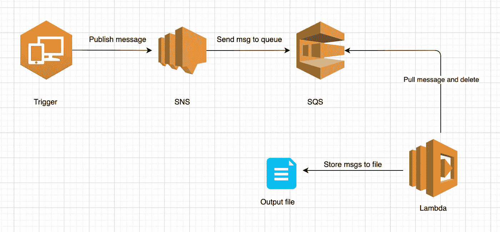

# 在本地环境中使用 AWS 服务

> 原文：<https://medium.com/analytics-vidhya/use-aws-services-in-a-local-environment-cb3c5afa7b43?source=collection_archive---------3----------------------->

**问:**我们是否可以使用 AWS 服务，无需订阅，无需支付服务费用，完全离线模式？
**答:**是的，我们可以通过使用 [localstack](https://github.com/localstack/localstack) 来做到这一点。我们可以使用几乎所有的 AWS 服务，而无需支付和完全离线模式，这听起来很疯狂，对吗？让我们详细了解一下如何设置和使用服务。

**关键词:** Localstack，AWS，SNS，SQS，Lambda，AWS CLI，免费 AWS 服务

**简介:**开发完成后，我们在 AWS 或任何其他云服务中部署应用程序，如 Azure、GCP、阿里巴巴等。我们通常订阅并使用所需的服务，直到免费层完成，之后我们按使用付费，如果我们仔细观察这个管道，我们真的没有在部署到实际的 AWS 云之前测试 AWS 云服务的机制。如果我们在部署之前没有进行测试，那么我们可能会出现错误，需要在支付这些服务费用的同时解决这些错误。我们最终为 AWS 云中的管道的构建、测试和实验支付了巨额资金。为了避免这种情况，我们可以利用 [Localstack](https://github.com/localstack/localstack) ，它将允许我们在本地和离线模式下设置 AWS 服务，我们可以构建管道，我们可以测试管道，并在部署到实际的 AWS 云之前试验服务。

**Localstack 设置:** LocalStack 是一个基于 Python 的 dockerized 应用程序，设计为在监听特定端口时作为 HTTP 请求处理器运行。**由于这是一个 dockerized 应用程序，任何没有 python 知识的人都可以安装和使用该应用程序。**

有两种方法可以使用该应用程序:

1.将 localstack 作为 python 包安装
2。使用 docker-compose

**1。将 localstack 作为 python 包安装:**创建一个虚拟环境，因为如果可能的话，建议为每个项目创建一个虚拟环境。我们可以通过使用[蟒蛇](https://uoa-eresearch.github.io/eresearch-cookbook/recipe/2014/11/20/conda/)或者 [pip](https://packaging.python.org/guides/installing-using-pip-and-virtual-environments/) 来创建一个虚拟环境。使用下面的命令安装本地堆栈包。

pip 安装本地堆栈

然后，我们用如下所示的“start”命令启动 localstack。这将在 Docker 容器中启动 LocalStack。

本地堆栈开始

**2。使用 docker-compose:** 使用下面的链接从 Localstack 存储库中下载 docker-compose 文件，并使用命令“docker-compose up”运行

[](https://github.com/localstack/localstack) [## 本地堆栈/本地堆栈

### LocalStack 为开发云应用程序提供了一个易于使用的测试/模拟框架。目前，重点是…

github.com](https://github.com/localstack/localstack) 

docker-compose.yml 文件如下所示


docker-compose.yml

当我们启动应用程序时，所有可用的服务都将运行，如果需要，我们还可以选择特定的服务。阅读 [GitHub](https://github.com/localstack/localstack) 的文档部分，了解更多可用服务的数量。默认端口是 4566，所有服务都从 4566 端口路由。

**配置 AWS CLI:** 我们需要创建一个假的配置文件，我们可以使用 AWS CLI 来完成。所有 AWS CLI 命令也可以在 localstack 中工作，但是只需要做一些小的修改就可以将服务从实际的 AWS 指向 localstack。使用以下命令创建一个配置文件

```
aws configure --profile localstack
```

这将提示输入 AWS 访问密钥、秘密访问密钥和 AWS 区域。我们可以为凭证提供任何虚拟值和一个有效的区域名，如 us-east-1，但是不能将任何值留空。与 AWS 不同，LocalStack 不验证这些凭证，但是如果没有设置配置文件，它会报错。到目前为止，它就像我们将用来处理 LocalStack 的任何其他 AWS 概要文件一样。

到目前为止，我们已经讨论了 localstack 及其设置，让我们使用 lambda、SNS 和 SQS 等服务创建一个示例项目。

**一个示例项目:**我已经创建了一个项目，它将使用 [SNS](https://aws.amazon.com/sns/?whats-new-cards.sort-by=item.additionalFields.postDateTime&whats-new-cards.sort-order=desc) (简单通知服务) [SQS](https://aws.amazon.com/sqs/#:~:text=Amazon%20Simple%20Queue%20Service%20(SQS,distributed%20systems%2C%20and%20serverless%20applications.&text=SQS%20FIFO%20queues%20are%20designed,order%20that%20they%20are%20sent.) (简单队列服务)和 Lambda 服务。



项目流程图

SNS 是一种通知服务，可用于向接收方发布消息，如电子邮件、短信、SQS、应用程序、移动应用程序和设备的 EndpointArn 以及 lambda。我使用了 SQS，一种队列服务来接收消息并将它们存储在队列中。然后我使用 lambda 服务来拉取消息，并将它们存储在输出文件中。如果我们想详细阅读 SNS、SQS 或任何其他服务的文档，请查阅 AWS 文档。

**创建项目的步骤:**我们将使用 AWS CLI 来执行命令。我们可以使用稍加修改的 AWS CLI 命令，我们需要为每个命令提供 localstack URL 和 region。

**步骤 1:** 创建一个 SNS 话题。

AWS _ DEFAULT _ REGION = eu-east-1 AWS-endpoint-URL =[http://localhost:4566](http://localhost:4566)SNS create-topic-name SNS-publish-msgs

**第二步:**列出 SNS 话题

AWS _ DEFAULT _ REGION = eu-east-1 AWS-endpoint-URL =[http://localhost:4566](http://localhost:4566)SNS list-topics

**步骤 3:** 创建一个 SQS 队列

AWS _ DEFAULT _ REGION = eu-east-1 AWS-endpoint-URL =[http://localhost:4566](http://localhost:4566)SQS create-queue-queue-name SQS _ queue

**步骤 4:** 创建一个从 SNS 到 SQS 的订阅，这样每当 SNS 发布消息时，它们就会到达 SQS 队列。

AWS _ DEFAULT _ REGION = eu-east-1 AWS-endpoint-URL =[http://localhost:4566](http://localhost:4566)SNS subscribe-topic-arn arn:AWS:SNS:us-east-1:00000000000:SNS-publish-msgs-protocol SQS-notification-endpoint[http://localhost:4566/000000000000/SQS _ queue](http://localhost:4566/000000000000/sqs_queue)

**第五步:**从 SNS 发布消息

AWS _ DEFAULT _ REGION = eu-east-1 AWS—endpoint-URL =[http://localhost:4566](http://localhost:4566)SNS publish—Message“Test _ Message”—Subject Test _ Subject—topic-arn arn:AWS:SNS:us-east-1:00000000000:SNS-publish-msgs

**第六步:**查看 SQS 队列中的消息

AWS _ DEFAULT _ REGION = eu-east-1 AWS-endpoint-URL =[http://localhost:4566](http://localhost:4566)SQS receive-message-queue-URL[http://localhost:4566/0000000000/SQS _ queue](http://localhost:4566/000000000000/sqs_queue)—最大消息数 10

**第 7 步:**创建一个 lambda 函数来拉消息，之后删除消息。

AWS _ DEFAULT _ REGION = eu-east-1 AWS-endpoint-URL =[http://localhost:4566](http://localhost:4566)lambda create-function-function-name test _ lambda-zip-file b://python-new . zip-handler lambda-fn . lambda _ handler-runtime python 3.7-role arn:AWS:iam::0000000000:role/lambda-S3-time out 900

这里，我使用 python-new.zip 创建了一个 lambda 函数。在 zip 中，我放置了一个名为 lambda-fn.py 的 python 文件。

```
from __future__ import print_function
import json
import os
import boto3

*# Create SQS client* sqs = boto3.client(**'sqs'**,
                   endpoint_url=**"http://{}:4566"**.format(os.environ[**'LOCALSTACK_HOSTNAME'**]),
                   use_ssl=False
                   )

queue_url = **'http://{}:4566/000000000000/sqs_queue'**.format(os.environ[**'LOCALSTACK_HOSTNAME'**])

def lambda_handler(event, context):
    *# Receive message from SQS queue* response = sqs.receive_message(
        QueueUrl=queue_url,
        AttributeNames=[
            **'SentTimestamp'** ],
        MaxNumberOfMessages=7,
        MessageAttributeNames=[
            **'All'** ],
        VisibilityTimeout=0,
        WaitTimeSeconds=0
    )

    res_list = []
    if **"Messages"** in response.keys():
        for each_msg in response[**'Messages'**]:
            res_dict = {}
            res_dict[**'Message Id'**] = each_msg[**'MessageId'**]
            res_dict[**'Subject'**] = json.loads(each_msg[**'Body'**])[**'Subject'**]
            res_dict[**'Message Body'**] = json.loads(each_msg[**'Body'**])[**'Message'**]

            res_list.append(res_dict)

            receipt_handle = each_msg[**'ReceiptHandle'**]

            *# # Delete received message from queue* sqs.delete_message(
                QueueUrl=queue_url,
                ReceiptHandle=receipt_handle
            )

            print(**'Message deleted'**, each_msg[**'MessageId'**])
    else:
        return **'No message available in sqs service'** return res_dict
```

**步骤 8:** 调用 lambda 函数

AWS _ DEFAULT _ REGION = eu-east-1 AWS-endpoint-URL =[http://localhost:4566](http://localhost:4566)lambda invoke-function-name arn:AWS:lambda:us-east-1:00000000000:function:test _ lambda-invocation-type request response outfile . txt

**第九步:**查看输出。lambda 函数的输出存储在 outfile.txt 文件中。使用下面的命令查看输出

vi outfile.txt

**结论:**当我们在部署之前学习、测试和试验 AWS 服务时，Localstack 非常有用。如今，我们看到许多组织和专业人士花费大量的金钱来学习、测试和实验。Localstack 也有一个非常好的活跃的开发社区，许多服务不断被添加进来。

谷歌网站验证:google202f57a5f28bd783.html

快乐学习😊…

谷歌网站验证:google202f57a5f28bd783.html