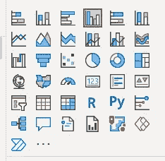
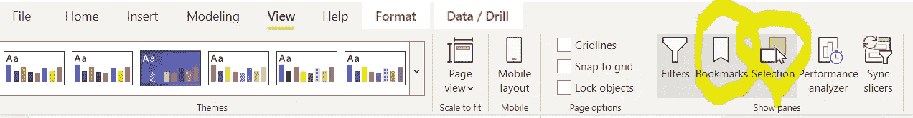
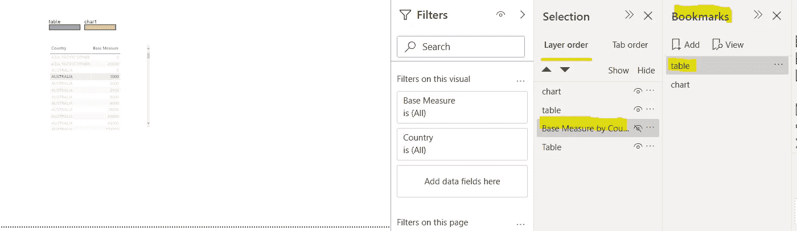
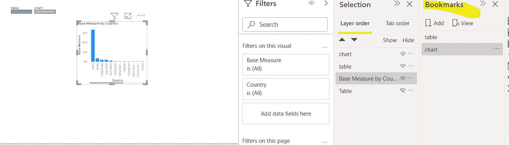
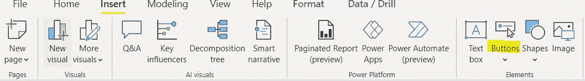
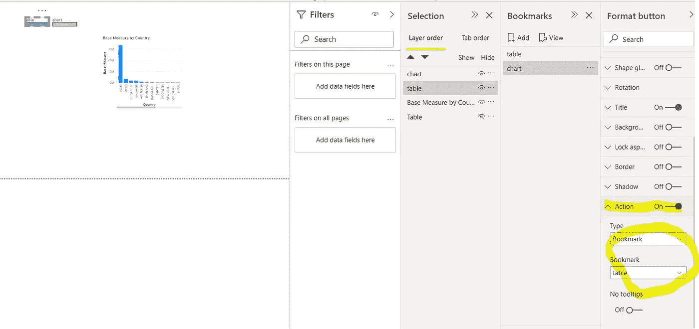
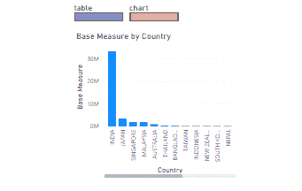

# 使用书签和选择功能在 Power BI 上创建图表和表格之间的切换。

> 原文：<https://medium.com/analytics-vidhya/use-bookmark-and-selection-functions-to-create-a-toggle-switch-between-chart-and-table-on-power-bi-43e5eb6014fc?source=collection_archive---------1----------------------->

我之前的文章里讲过数据层的数据集成，计算层的 DAX 函数，展示层的一些小技巧。今天我想谈谈一个功能，它可以让您的报告更贴近业务用户的需求。**切换开关可让您在同一页面上显示图表和表格(显示百分比和绝对数字),而无需切换标签。**这个功能对任何层次的受众都是有价值的，尤其是高层管理人员。领导团队总是先看趋势/图表，再去挖掘那些他们关注的细节，这也是这个功能能帮到你的原因。

# 创建拨动开关的四个步骤

> 构建两种组件(图表、表格)->为每个组件设置书签->设置书签可见性->放置按钮/图标

(1)构建两种组件(图表、表格)

选择要向用户显示的组件，这是有史以来最简单的一步。

(2)(3)为每个组件设置书签，并调整可见性

该功能位于 power bi 桌面工具栏中的“查看”下

我们首先使用**选择功能**来设置面板上每个组件的可见性。首先，我们在面板上有两个组件，一个用于表格(名称:下表中的表格)，另一个用于图表(名称:下图中的基本测量值 xxx)。

现在，**隐藏图表**的可见性作为第一个视图，并创建一个名为‘table’的书签来保存它。创建第二个书签的相同过程称为“图表”这一次，我们隐藏了表格的可见性。您将有一个书签只显示表格，另一个书签只显示图表。

(4)放两个按钮(或者你可以上传自己的图标)让用户做出选择

现在我们去按钮设置，启用动作功能。将按钮与书签连接起来。

将表格按钮与表格书签连接，将图表按钮与图表书签连接

这是结果

在图表和表格之间切换

利用这一设置，您可以在开始时通过图表全面了解趋势，并通过表格提供更多详细信息。快乐学习