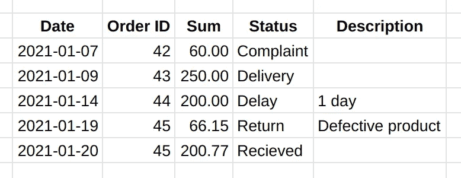
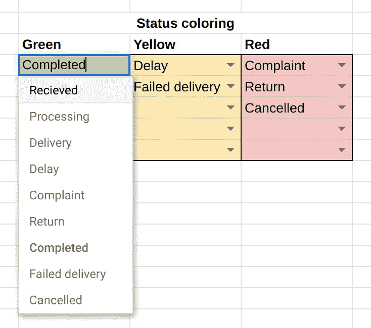
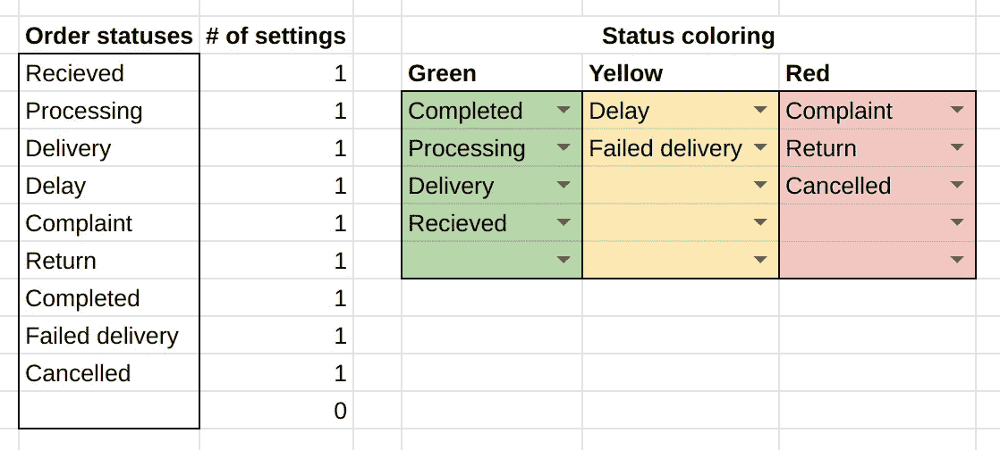
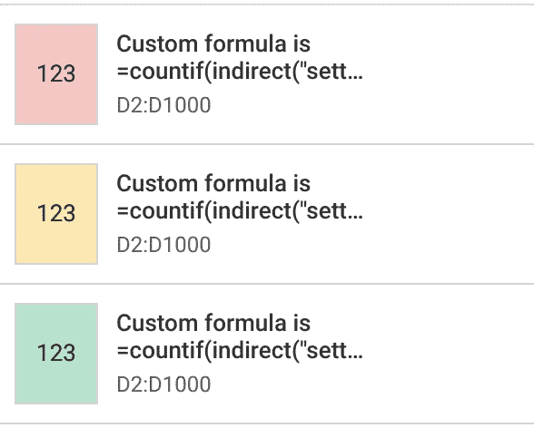
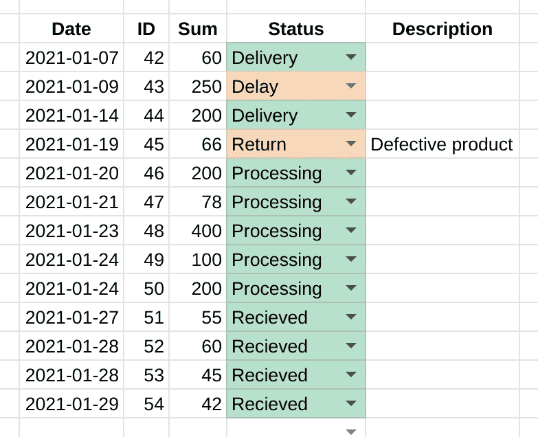
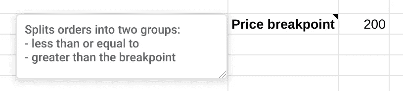
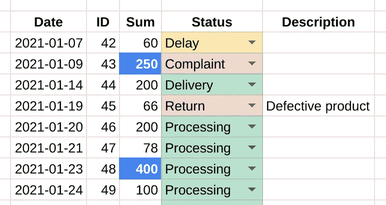

# 像专家一样在谷歌表单中使用条件格式

> 原文：<https://medium.com/analytics-vidhya/use-conditional-formatting-in-google-sheets-like-a-pro-c3a46758e8d2?source=collection_archive---------3----------------------->

## 根据内容所属的组或内容是否高于给定阈值对单元格进行着色

我们人类是一个视觉物种:与其他感官相比，我们通过视觉获得大部分信息。当我们处理大量信息时尤其如此:我们不是计算机，需要对数据进行区分和分层才能理解。

这里格式化数据很有帮助。您可以根据数据的内容(值、日期等)来更改数据的外观。然而，开箱即用，条件格式是静态的。您总是需要更改规则本身来更改阈值或其他条件。如果数据很少，并且条件仅在少数规则中使用，则相对容易。即便如此，这也很繁琐，出错的风险也很高。

有一种更好的方法:将阈值和其他规则移到单独的设置页面，并在条件格式的自定义公式中引用它们。通过这种方式，您将能够:

*   在不编辑条件格式本身的情况下动态更改格式规则，以及
*   提高文档的可读性和可维护性，降低出错的风险。

我们来看两个例子。当然，我们将使用我们最好的朋友——命名范围。

[](https://stan-t.medium.com/9-reasons-to-use-named-ranges-in-any-spreadsheet-google-sheets-and-the-like-a07581f460d7) [## 在任何电子表格、谷歌工作表等中使用命名范围的 9 个理由

### 如何以更少的错误更快地构建电子表格，并在以后轻松地修改它们

stan-t.medium.com](https://stan-t.medium.com/9-reasons-to-use-named-ranges-in-any-spreadsheet-google-sheets-and-the-like-a07581f460d7) 

# 基于组的颜色状态

在许多情况下，您有一组有限的值，可以分成几组，例如，订单、任务、项目等的状态。用交通灯做类比，可以有三种状态:

*   🔴红色:需要注意或纠正(投诉、退货、取消)
*   🟡黄色:留意防止移动到红色(延迟，交付失败)
*   🟢.格林:一切都在按计划进行(接收、预定交付、完成)

例如:



根据状态所属的组来给状态着色，并立即看到什么需要我们的注意，这不是很好吗？让我们开始吧。

首先，创建一个状态总列表，如果您还没有的话。这不是绝对必要的，但它将简化接下来的步骤。对于这些和其他设置，我通常使用专用的表。这样我们可以在一个地方跟踪所有的设置。

其次，将状态分为三组:红色、黄色和绿色，例如，通过将它们放入单独的列中(请参见下面完整的示例)。

第三，为每个组创建一个命名范围。对于这个例子，我创建了三个范围:

*   `sett_coloring_red`
*   `sett_coloring_yellow`
*   `sett_coloring_green`

## 额外内容

*   在所有状态的颜色设置中设置数据验证下拉列表



*   自动计算一种状态在着色设置中使用的次数，以避免错误地使用多次。为此，创建一个包括所有三种颜色设置的命名范围，并添加公式`=COUNTIF(sett_coloing_all, B3)`，其中`sett_coloring_all`是指所有颜色设置的命名范围，`B3`包含您要着色的状态。然后复制公式，相应地检查其他状态。

虽然这是一个很好的实践，并且有助于避免错误，但是严格来说这并不是必需的。有更好的方法来仔细检查设置，但它们超出了本文的范围。

完成的设置部分如下所示:



最后，是时候设置条件格式了:

1.  选择具有状态的范围(例如整列)
2.  右键单击➞条件格式➞添加另一个规则(这可以自动打开)
3.  如果… ➞自定义公式为，则设置单元格格式
4.  使用以下公式:

```
=COUNTIF(INDIRECT(“[RANGE_NAME]”), [STARTING_CELL])
```

其中:

*   [范围名称]是您计划使用的彩色范围的名称
*   [STARTING_CELL]对要应用条件格式的区域左上角单元格的引用。

例如，命名范围为`sett_coloring_green`，规则应用于`D2:D1000`，公式如下:

```
=COUNTIF(INDIRECT(“sett_coloring_green”), D2)
```

这就是它的工作原理。函数 COUNTIF 接受两个参数:

1.  在**范围**中查找搜索值的出现。这里我们使用函数`INDIRECT(“sett_coloring_green”)`，它返回引用中的范围。没有它，就不能在条件格式中引用命名区域(就此而言，也不能引用当前工作表之外的常规区域)。
2.  **搜索值**:我们想要着色的状态。在这里，我们设置要应用条件格式的区域的左上角单元格。在引擎盖下，Google Sheets 会相应地移动引用。

此自定义公式将计算单元格的值(包含要着色的状态)在着色设置范围内出现的次数。如果一切都设置正确，它将是 1 或 0，这反过来将被条件格式解释为真或假，打开或关闭格式。

现在我们需要为其他颜色添加两个条件格式规则。我们应该以下列规则结束:



条件的顺序在这里并不重要，因为在任何时间点都应该只有一个是活动的。

它准备好了:着色规则中提供的所有状态现在都相应地被着色。



# 突出显示高于特定阈值的订单

同样的逻辑也适用于根据数字阈值将订单分成两个(或更多)组。例如，您希望突出显示大订单，以便更加关注大客户。

逻辑是一样的。首先，我们应该在设置表上为阈值和相应的命名范围设置一个部分。我不建议跳过这个阶段:虽然您可以将值直接放入条件格式规则中，但通常情况下，阈值会发生变化，最好将它显式放在一个地方，而不是放在其他几个地方。



请注意，我们为未来的自己留下了一个关于这个阈值的目的的评论。时光飞逝，记忆失效，人变了。

然后，我们突出显示带有价格的列，并添加带有此自定义公式的条件格式规则:

```
=C2>INDIRECT(“sett_price_breakpoint”)
```

此处，C2 是范围的左上角单元格，sett_price_breakpoint 是一个命名范围，其中一个单元格包含相关阈值。



设置这些条件格式规则需要几分钟的时间，但是它们在处理数据时节省了大量的时间和精力。