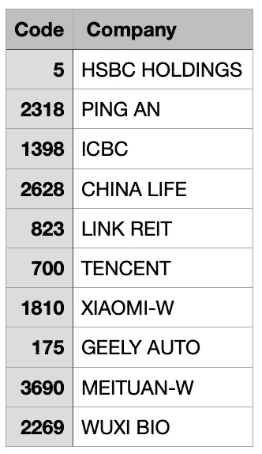

# 使用相关性预测市场指数

> 原文：<https://medium.com/analytics-vidhya/use-correlation-to-predict-market-index-dc16136bd28c?source=collection_archive---------6----------------------->

市场指数由主要公司股票价格列表组成。它们的价格之间应该有关联。这里我想用机器学习模型(LSTM)用某些股票的历史数据来预测市场指数。

# 数据收集

我使用 python 包 [yfinance](https://pypi.org/project/yfinance/) 来获取每日股票价格。我下载了 3 年的数据，包括“开盘”、“收盘”、“高点”、“低点”和“成交量”

# 数据预处理

预测的目标变量是指数 ETL 第二天的收盘价收益率，定义为

```
target(t) = ( Close(t+1) - Close(t) )/Close(t) * 100%
```

由于股票卷的价值太大，我把它转换成:

```
log-volume = log(volume+1)
```

注:添加+1 以避免对数为零。

# 特征工程

因为假设指数 ETL 的价格将取决于历史股票价格，所以我使用了数字:“开盘价”、“收盘价”、“最高价”、“最低价”和“成交量”来构建特征。

1.  对于[“开盘”、“收盘”、“高”、“低”、“成交量”]中的每一列，我计算了 5 天的滞后期，这是前一天的数据(I 的范围是 1-5)。
2.  通过下式计算滞后-i-return:

```
lag-i-return(t) = ( value(t) - value(t-i) )/ value(t-i) * 100%
```

3.为[“打开”、“关闭”、“高”、“低”、“音量”](总共 5*5 个特征)中的所有滞后值构建 PCA 变换。

4.使用前 3 个 PCA 分量作为最终特征，因为前 3 个分量已经解释了总方差的 80%以上。

# 模特培训

我将 3 个主成分分析特征和目标变量输入 LSTM 模型，这是一个用于时间序列的常见递归神经网络。我们下载了 3 年的数据，将 80%用于模型训练，20%用于模型测试。PyTorch-Lightning 是我们用来编码 LSTM 模型的 ML 包。你可以在我的 [Git](https://github.com/iwasnothing/IndexCorTrade/blob/main/lstm_stock.py) 和[笔记本](https://github.com/iwasnothing/IndexCorTrade/blob/main/makes-index-prediction-using-correlation.ipynb)里找到代码。

# 超参数调谐

我使用包[射线调整](https://pytorch.org/tutorials/beginner/hyperparameter_tuning_tutorial.html?highlight=transformer)为 pytorch 模型的超参数调整。超参数包括:

1.  时间序列的序列长度
2.  LSTM 层中隐藏状态的数量
3.  模型训练的批量大小
4.  LSTM 产出的辍学率
5.  模型训练的学习率(lr)
6.  LSTM 层数

```
"seq_len": tune.choice([5, 10]),
"hidden_size": tune.choice([10, 50, 100]),
"batch_size": tune.choice([30,60]),
"dropout": tune.choice([0.1, 0.2]),
"lr": tune.loguniform(1e-4, 1e-1),
"num_layers": tune.choice([2, 3, 4])
```

# 性能赋值

虽然模型的预测值是大盘指数的未来收益率，损失函数是 MSE，但是我们只关注精度来评价业绩。

是因为在真实的交易情况下，它只关心是否盈利或亏损。如果预测它会上涨，而它确实上涨了，交易就获利了。如果预测要跌，而且确实跌了，我们还是可以通过买入逆 ETF 获利。

但是，对于 MSE 来说，+0.1%和-0.1%的差异很小，但实际上是交易的财务损失。如果方向(上涨/下跌)预测正确，比如说预测值是+0.3%，但实际上涨刚好是+0.1%，差额和前面的情况一样(0.2%)，但交易还是盈利的。

# 为训练和测试选择的股票

由于我的计算资源有限，我只选择了 10 只股票来预测市场指数。对于 10 只股票中的每一只，我将历史价格与市场指数相结合，然后运行模型训练、测试和超参数调整。

我比较了香港市场和美国市场。

对于恒生指数，选择的股票是:



对于美国市场，选择的股票是:

' FB '，' AAPL '，' AMZN '，'谷歌'，' NFLX '，' SQ '，' MTCH '，' AYX '，' ROKU '，' TTD '

这是最终的结果。

1.  用美团(3690)来预测恒指，最高可以达到 58%的准确率。腾讯(700)和平安(2318)也能达到~56%的高准确率。
2.  对于美国市场，使用脸书(FB)和网飞(NFLX)可以分别达到约 61%和 58%的最高准确率。
3.  这里是 HSI 的测试数据(黄线)和使用美团(3960)数据的预测值(红线)的图表。


# 交易策略

一个非常简单的交易策略可以是这样的:

1.  对于 10 只选择的股票中的每一只，计算市场指数的预测未来回报率。
2.  对准确率> 50%的股票结果进行短列表。
3.  通过使用 stock-i 数据计算预测回报率的加权平均值，计算未来回报率的期望值。

```
E(Return) = Sum of { accuracy * predicted value)/ sum(accuracy)
```

4.如果预期收益>预定义的阈值(如交易费的 0.03%)，我们买入带止盈/止损(如 0.5%)的指数 ETF。

5.如果预期收益是负的，我们仍然可以用逆向 ETF 做同样的事情

6.每天用最新的每日数据重复同样的策略。

7.(可选)每天在市场结束时平仓所有头寸。

# 利润/损失回溯测试

为简单起见，我使用 ETF(7200.HK)作为目标收益率，并且也只对这个简化的交易策略进行回溯测试:

> 如果预期收益率(p[i][0])为正，我们将在开市时买入指数 ETF，然后在当天的收盘时卖出，以实际收益率(y[i][0])为损益

```
for i in range(n):
    if p[i][0] > 0:
        total = total + 1
        if y[i][0] > 0:
            hit = hit + 1
            delta = min(y[i][0],3)
        else:
            delta = max(y[i][0],-3)

        bal = bal + delta
```

上面的代码是为了计算每日损益(delta)。假设执行的订单以 3%的获利限价和止损限价为界。最后，它返回每日平均值(余额/总计)。

回溯测试的结果是:

> 日均利润 0.2% — 0.3%