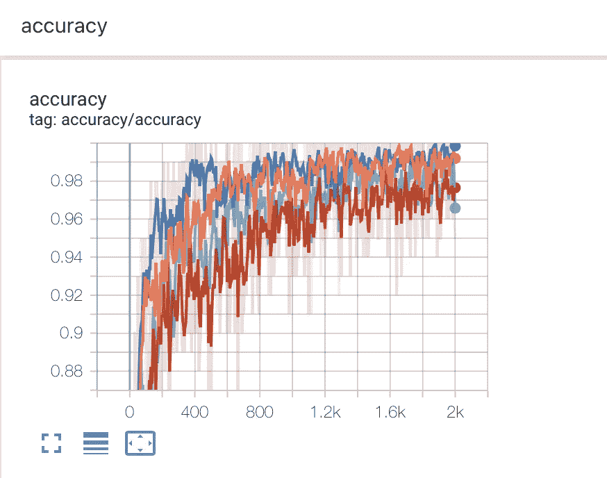
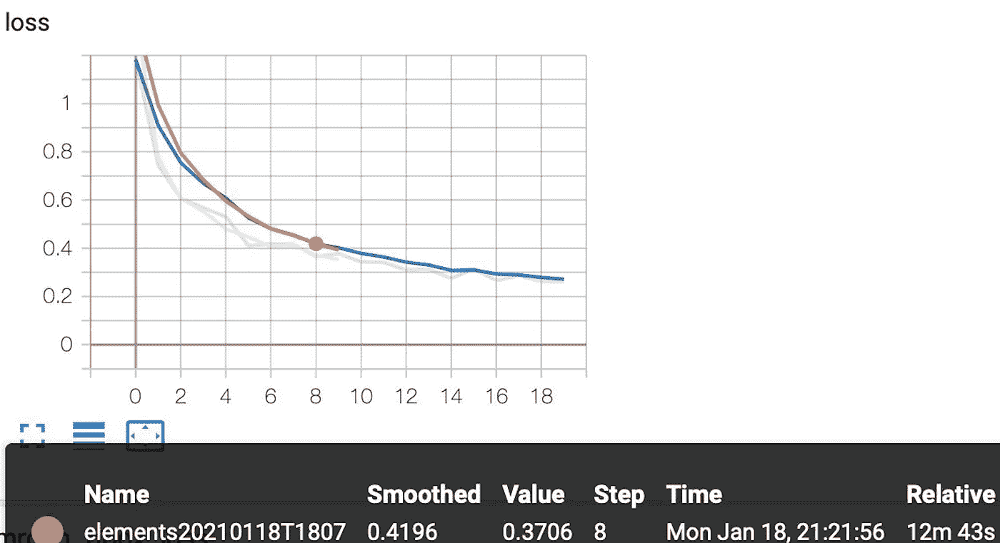

# 张量板的使用

> 原文：<https://medium.com/analytics-vidhya/use-of-tensorboard-8d3a9ec9e7ac?source=collection_archive---------14----------------------->

*轻松主持、跟踪和免费分享您的 ML 实验*

大家好，我们继续人工智能的愉快旅程。在这篇文章中，我们将谈论一个类似 TensorBoard 的祝福，我经常和你一起使用它。就其可理解性而言，你至少在阅读我的文章之前了解 TensorFlow 是非常重要的💡

参考文献[1]

在我们从事的深度学习项目中，我们经常希望了解准确性指标。以前这种情况是建立在人手多一点的基础上，而现在多亏了 TensorBoard，非常实用。TensorBoard 指的是在谈论自己时:

> 它提供了一种受管理的 TensorBoard 体验，让您上传并与每个人分享您的机器学习实验结果。

先来获取一些信息，然后就可以快速实现我们在 Colab 的经历。

对于我之前做的一个项目，我们将一步一步地安装 TensorBoard，以直观地看到准确性指标。但为此，你必须首先有一个 colab 会员。我也没有为此定义成员。相反，通过驱动器连接，我有机会在那里使用我的文件并快速练习。

## 使用 TensorBoard 和 Colab

另外，我必须要说的是，在使用 TensorFlow 时，为了确保 GPU 在后端运行，我们会在 Colab 中的运行时 步骤之后，从更改运行时类型步骤 ***中选择使用 GPU 或 TPU。***

为了安装 TensorBoard 扩展，我们需要键入下面看到的命令。运行完这一行，让我们确定 **%reload_ext** 是下一次。

在下一阶段，我们需要将使用 tensorboard 运行代码时获得的日志文件夹的路径分配给 **— logdir 变量。**

下面是我使用 TensorBoard 运行的对象识别代码的图形版本。

作者图片

因为我运行 20 个时期，所以我们在图上看到 20 个迭代和损失值。这样，我们既可以看到你的迭代次数，也可以看到你丢失的图形和总时间的变化。

# 参考

1.  [https://tensor board . dev](https://tensorboard.dev/)
2.  [https://towards data science . com/accuracy-visualization-in-deep-learning-part-1-b42d 32 b 07913](https://towardsdatascience.com/accuracy-visualisation-in-deep-learning-part-1-b42d32b07913)