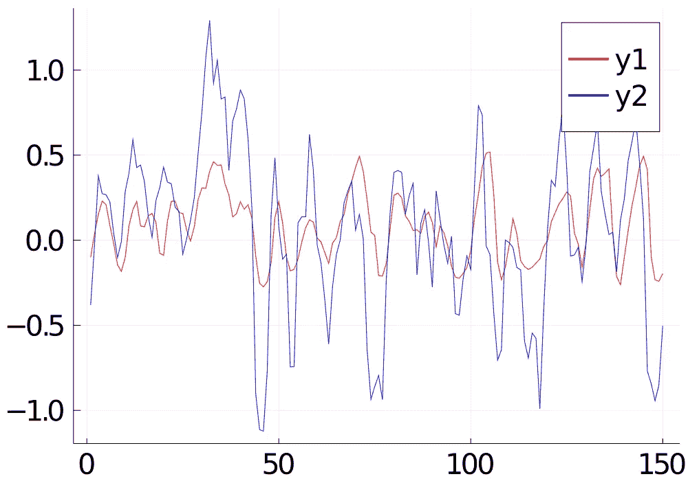

# 用 RSI 的振荡指标预测股票收益(准确率 70%以上！)

> 原文：<https://medium.com/analytics-vidhya/use-oscillator-of-rsi-in-machine-learning-prediction-of-stock-return-8de6b9543315?source=collection_archive---------5----------------------->

刚从[帖](/swlh/the-oscillator-of-moving-average-coding-and-using-it-in-trading-73e0f9bde1cc)学了均线(OsMA)和 RSI 的震荡器。RSI 是趋势和动量的有用指标。受此启发，我想尝试使用它作为机器学习功能来预测未来的股票回报。

# RSI 及其 OsMA 的计算

相对强度(RS)和相对强度指标(RSI)可以通过历史正价差(%)的移动平均线(MA)除以负价差(%)的移动平均线(MA)来计算。

> RS =(正差 MA)/(负差 MA)
> 
> RSI = 100–100/(1+RS)

这是 Julia 的计算代码。我们使用 [Julia 包时间序列](https://juliastats.org/TimeSeries.jl/latest/)。

*   percentchange(price_ts)是计算 lag-1 价格的价格差异百分比的函数。
*   时间序列“涨”和“跌”是通过设置相反符号值 0 而产生的正价差(%)和负价差(%)。
*   up_roll 和 down_roll 是“回环”期间正差和负差的移动平均值。
*   f_rsi 是应用于时间序列的每个元素的函数，用于计算 RSI = 100-(100/1+向上滚动/向下滚动)
*   TimeSeries.map 用于对时间序列的每个元素应用函数 f_rsi。对于时序操作，通常使用映射函数而不是循环。

```
using TimeSeries
function toRSI(price_ts,loopback)
    pct = percentchange(price_ts)
    upidx = findall(pct["Close"] .> 0)
    downidx = findall(pct["Close"] .< 0)
    up = map( (timestamp, values) -> (timestamp, if values < 0 ; 0 ; else ;values ;end), pct)
    down = map( (timestamp, values) -> (timestamp, if values < 0 ; abs(values) ; else ;0 ;end), pct)
    up_roll = moving(mean, up, loopback)
    down_roll = moving(mean, down, loopback)
    function f_rsi(values)
        x = values[1]
        y = values[2]
        rsi = 100 - (100 / (1 + x/y) )
        [rsi,0]
    end
    updown = TimeSeries.rename(TimeSeries.merge(up_roll,down_roll), [:up,:down])
    rsi_ts = TimeSeries.rename(TimeSeries.map((timestamp, values) -> (timestamp, f_rsi(values)), updown)[:up],Symbol("RSI-",loopback))
    return rsi_ts
end
```

RSI 的移动平均值可以很容易地通过函数“移动(平均值…)”来计算。

```
rsi_ma = TimeSeries.rename(moving(mean,rsi_ts,j),Symbol("RSIMA-",i,"-",j))
```

# 特征工程

RSI 的移动平均值的振荡器(OsRSI)可以用作模型特征。对于每个 OsRSI 计算，有 2 个移动平均线:(1)在*向上滚动*和*向下滚动*的计算中的均线，和(2)RSI 的均线。对于每个毫安，我们需要指定回送周期，设其为 *i* 和 *j，*，定义如下:

```
rsi_ts = toRSI(price_ts,i)
rsi_ma = moving(mean,rsi_ts,j)orsi = rsi_ts .- rsi_ma
```

借助计算机自动化的杠杆作用，我们可以在一个范围内循环使用 *i* 和 *j* 的值，而不是在分析中仅基于回送的单个值。

```
for i in day0:day1
        rsi_ts = toRSI(price_ts,i)
        result_rsi = merge(result_rsi,rsi_ts,method=:inner)
        for j in day0:day1
            rsi_ma = TimeSeries.rename(moving(mean,rsi_ts,j),Symbol("RSIMA-",i,"-",j))
            orsi = TimeSeries.rename(rsi_ts .- rsi_ma , Symbol("ORSI-",i,"-",j) )
            result_orsi = merge(result_orsi,orsi,method=:inner)
        end
    end
```

所有这些 *OsRMI(i，j)* 会形成一个矩阵。该矩阵可以被馈送到卷积神经网络(CNN)用于模式识别。我使用当天和之前( *seqlen* )天的 OsRSI 矩阵来形成矩阵序列，作为 CNN 层的输入。然后，叠加 2-GRU，最后的密集层，得到第二天的预测收益率。

```
function build_reg_model(Nh,seqlen)
    a = floor(Int8,Nh)
    return Chain(
    x -> Flux.unsqueeze(x,4),
# First convolution
    Conv((2, 2), seqlen=>a, pad=(1,1), relu),
    MaxPool((2,2)),# Second convolution
    Conv((2, 2), a=>Nh, pad=(1,1), relu),
    MaxPool((2,2)),# Third convolution
    Conv((2, 2), Nh=>Nh, pad=(1,1), relu),
    MaxPool((2,2)), Flux.flatten,
    Dropout(0.1),
    (x->transpose(x)), GRU(1,Nh),
    GRU(Nh,Nh),
    (x -> x[:,end]),
    Dense(Nh, 1),
    (x -> x[1])
    )
end
```

与我之前的[帖子](https://iwasnothing.medium.com/time-series-prediction-feat-introduction-of-julia-78ed6897910c)类似，为了平滑波动，我使用收盘价收益率的 5 天移动平均值作为目标变量。

```
function toReturn(price_ts)
    pct = TimeSeries.rename(percentchange(price_ts),[:return])
    pct = moving(mean,pct,5)
    return TimeSeries.map((timestamp, values) -> (timestamp, 100*values), pct)
end
```

# 结果评估

我用 2840.HK 3 年的数据进行训练和测试。我拿出最后 150 个看不见的数据点进行测试。训练的周期数是 25。

```
[@epochs](http://twitter.com/epochs) num_epoch Flux.train!(mse_loss,Flux.params(m),train_loader,RMSProp(lr,mm))
```

这是红线预测值(y1)和蓝线实际值(y2)的曲线图。



在实际交易中，预测上涨或下跌(正/负回报)的准确性在损益中比值的实际拟合更关键。我还计算了准确度和混淆矩阵。准确率 77%！这比我以前的型号要好。

```
accuracy:0.77Confusion Matrix:
[0.27, 0.093]
[0.13, 0.5]
```

以下是上述测试运行的超参数:

```
seqlen=8
Nh=20
lr=0.000129
mm=0.75
day0=8
day1=8+20
```

总之，OsRSI 在股票预测中是一个很好的特征。完整的 Julia 笔记本可以在我的 [Github](https://github.com/iwasnothing/JuliaConvGRU/blob/main/OsRSI.ipynb) 中找到。