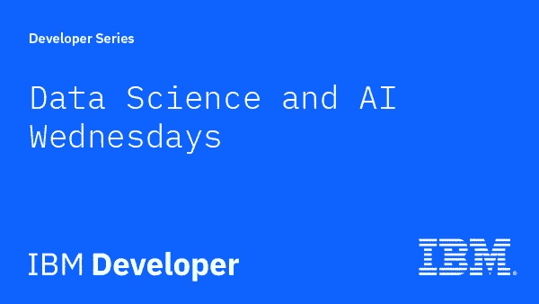

# 使用 Watson Assistant 在疫情期间自动处理在线订单

> 原文：<https://medium.com/analytics-vidhya/use-watson-assistant-to-automate-online-order-processing-during-a-pandemic-51a9950bd9a0?source=collection_archive---------21----------------------->

IBM 开发人员数据科学和人工智能星期三

人工智能(AI)指的是计算机系统像人类一样执行任务的能力，这些任务通常会与人类联系在一起，例如学习、交流、自我纠正等任务。

人工智能的一些应用包括筛选大量数据，并从这些数据中获得洞察力，从而帮助我们做出更好的决策，这些决策包括预测天气模式，预测股票市场趋势等。人工智能还可以用来创造像聊天机器人这样的工具，可以同时与 100 个人互动。人工智能的所有这些应用都是用来增强人类能力的。

2021 年 2 月 17 日，IBM 迪拜开发者倡导者 Anam Mahmood、客户技术专家 Hashim Noor 和开发和营销专家 Tosin Amuda 举办了一场网络研讨会，他们在会上展示了如何构建一个人工智能支持的后端系统，该系统可以通过在线模式接受日常必需品订单。系统通过将收到的文本请求转换成格式化的订单列表来处理它们。然后，该系统可以连接到库存数据库，以优化供应链管理。这个解决方案可以应用于各种领域，比如订购药品和食品杂货。

研讨会分为两部分，第一部分由 Hashim 主持，他首先解释了人工智能、聊天机器人的基本概念，以及我们为什么需要它们。

什么是聊天机器人？

然后，他继续解释 IBM Watson Assistant，这是一种允许您将应用程序构建为助手的用户界面的服务。或者将内置的 webchat 集成添加到您的公司网站。通过 webchat，您可以将要求与现有服务台人员通话的客户转接给代理。除了它的许多功能，沃森助手支持多达 12 种语言。

IBM 沃森助手

Hashim 然后谈到了一些使用 Watson Assistant 的客户，以及他们的公司如何从中受益。之后，他解释了 Watson Assistant 的不同构建模块，并对每个模块进行了举例说明。

助手的组件

会议的第二部分由 Anam 进行，她使用 Watson Assistant 构建了一个聊天机器人，并将其连接到前端。她首先解释了应用程序的架构流程。

应用程序的架构流程

流程是:

1.  将数据提供给沃森助手服务。
2.  将文本转换成意图、实体并进行对话。
3.  从文本中提取订单和客户详细信息。
4.  这些提取的属性存储在云上的 Db2 数据库中。
5.  从仪表板上的输入文本中可视化订单和客户详细信息。

她向观众展示了如何克隆存储库，在 IBM Cloud 上创建服务，如 DB2 数据库和 Watson Assistant。她接着创造了一个助手，然后讨论了可以创造的不同技能，如动作技能、对话技能和搜索技能。在这节课中，我们使用了对话技巧。

接下来，她详细解释了意图、实体和对话，并向观众展示了如何创建它们。

对话流和对话流中的一个节点

构建完助手后，她向他们解释了将助手和数据库连接到接受订单的应用程序的 python 代码。一旦应用程序获得了服务的凭证，就可以通过 Cloud Foundry 将应用程序部署到 IBM Cloud。

通过 Cloud Foundry 部署的应用

当您想通过应用程序下订单时

您还可以访问 URL/dashboard 来查看数据库中的订单。

包含订单列表的数据库

Anam 还向他们展示了 Watson assistant 上的分析页面，这是帮助区分 IBM Watson Assistant 的主要功能之一。分析页面概述了助理和用户之间的对话。您还可以查看用户对话，这可以帮助您了解您的助理可能需要更多培训的地方以及常见问题。这可以帮助企业提高他们的能力，以更好地迎合他们的客户。

沃森助手中的分析

IBM Watson Assistant 分析概述页

网上研讨会取得了巨大的成功，全球有 400 多人注册。观众互动性很强，能够跟上。特别感谢 Tosin 在聊天中帮忙，并回答与会者的问题。我们收到了与会者的积极反馈和对网络研讨会的赞赏，并对更多类似主题的此类网络研讨会表现出了兴趣。

资源:

*   **事件记录:**【https://www.crowdcast.io/e/automate-orders 
*   **Youtube:**[https://youtu.be/0IR0Dz86d8g](https://youtu.be/0IR0Dz86d8g)
*   **注册/登录您的 IBM Cloud 帐户:**[http://ibm.biz/order-online](http://ibm.biz/order-online)
*   **动手:**[https://github . com/Anam-Mahmood/online _ order _ processing _ during _ pandemics](https://github.com/Anam-Mahmood/online_order_processing_during_pandemics)
*   **幻灯片:**[https://www . slide share . net/anammahmood 10/use-Watson-assistant-to-automate-online-order-processing-during-a-a-疫情-2 月 17 日](https://www.slideshare.net/AnamMahmood10/use-watson-assistant-to-automate-online-order-processing-during-a-pandemic-17th-feb)