# PySpark UDF 入门(用户定义函数)

> 原文：<https://medium.com/analytics-vidhya/user-defined-functions-udf-in-pyspark-928ab1202d1c?source=collection_archive---------1----------------------->

# 什么是 UDF？

用户定义函数是一个自定义函数，用于对 Pyspark 数据帧执行转换操作。一旦定义，它就可以在多个数据帧中重复使用。它也可以用作循环的替代**，以获得更快的性能。**

# 为什么需要 UDF？

*UDF 可用于执行 Pyspark 内置功能*中没有的数据转换操作。例如，我们有一个包含字符串值的列，我们需要创建一个包含反转字符串值的新列。没有内置函数来执行这个操作，我们需要编写一个自定义函数。
*UDF 可用作 for 循环的替代，因为它们的并行处理速度更快，而不像 for 循环那样执行逐步迭代*。例如，假设您有一个 dataframe 列，其中有 100 行由字符串值组成。现在，您需要在新列中存储反向字符串值。没有内置的函数来执行这个操作，所以让我们看看如何处理这个问题。
1。 **For 循环** :-逐一迭代每 100 行，并执行所需的操作。由于迭代将一步一步地执行，所以执行起来需要很多时间。
2。 **UDF:-** 定义一个自定义函数(UDF)来执行操作。因为这 100 行中的每一行的操作都是相互独立的，所以 UDF 可以并行执行该操作，并且执行速度比 for 循环快得多。

# 在派斯帕克创造 UDF

让我们考虑一个包含客户的名和姓的 dataframe 列。我们需要创建一个新列，将两个单词的首字母转换为大写字母。让我们了解如何使用 UDF 创建一个具有所需转换的新列。

## **创建一个 PySpark 数据帧**

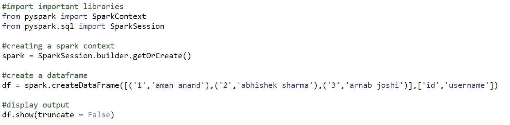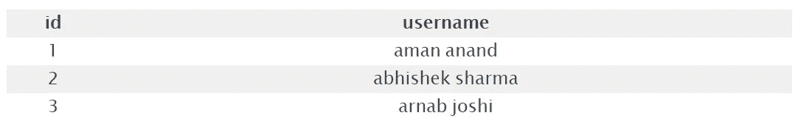

## **创建自定义功能**

让我们创建一个自定义函数，它接受客户姓名并返回转换为大写的第一个字母。

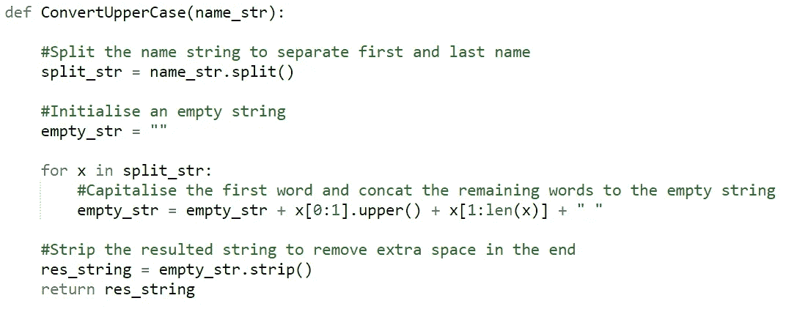

## **注册一辆 PySpark UDF**

使用*PySpark****UDF()****函数创建一个 PySpark UDF。它有两个参数，自定义函数和返回数据类型(自定义函数返回值的数据类型)。默认情况下是 StringType()。*

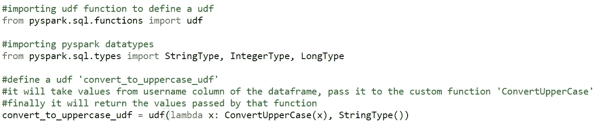

## 称 PySpark 为 UDF

最后创建一个新列，并通过调用 UDF 来执行所需的转换(****)with column()****函数用于创建一个新列或转换现有的列值*)。*

*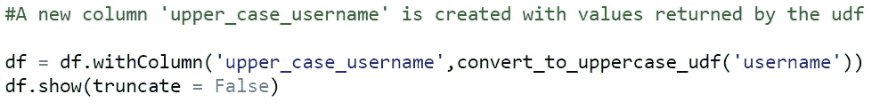**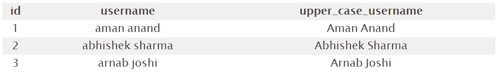*

*最后，我们有了一个具有预期结果的新列。这样，您可以通过定义 UDF 来执行任何自定义操作。让我们看一些更有趣的用例。*

# *PySpark UDF 的更多使用案例*

*让我们再看几个 UDF 非常有用的例子。*

## *时区转换*

*考虑一个场景，其中一个数据帧有两列，一列包含本地时间戳，另一列包含本地时区。*

*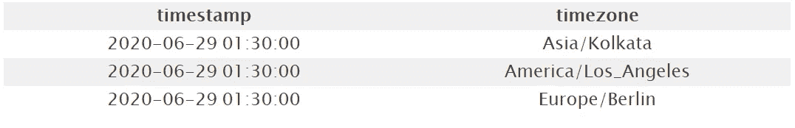*

*让我们创建一个自定义函数，根据时区将时间戳转换为 UTC。*

*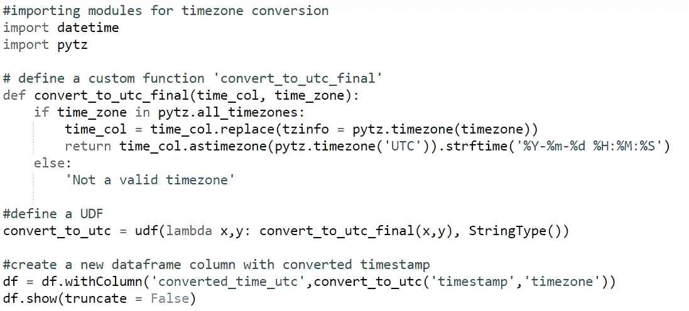**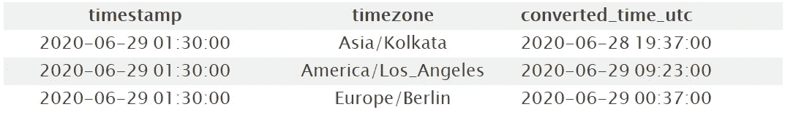*

**注意，在上面的例子中，我们将不止 1 列作为参数传递给了 UDF。这样，我们可以通过使用多个列来创建一个新列。**

## *用平均值输入缺失值*

*考虑一个列中有一些缺失值的数据帧。我们需要用各列的平均值来估算缺失值。*

*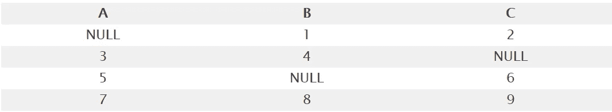*

*在到目前为止的例子中，我们已经看到我们使用 UDF 一次创建/更新一列。现在，由于我们需要用每一列的平均值来估算空值，我们将创建一个 UDF 并在数据帧的每一列上运行它。*

*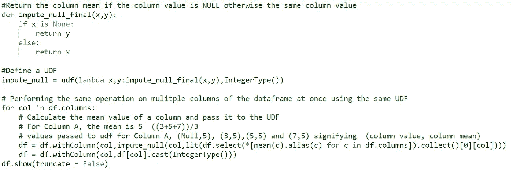**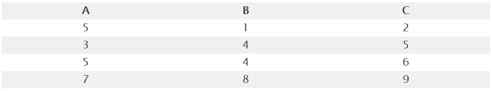*

*每一列的空值用该列的平均值进行估算。*

# *结论*

*在这篇文章中，我们了解了以下
1。当我们需要在 PySpark 数据帧上执行转换时，UDF 非常方便。
2。一旦定义，就可以在多个数据帧中重复使用。
3。比 for 循环在数据帧上执行迭代更快。*