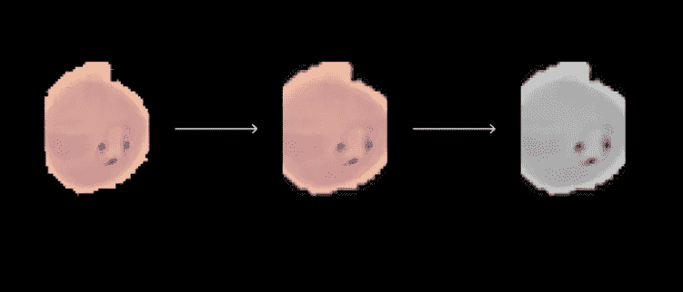
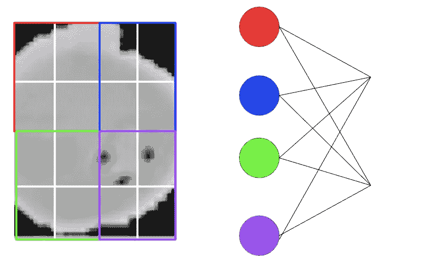
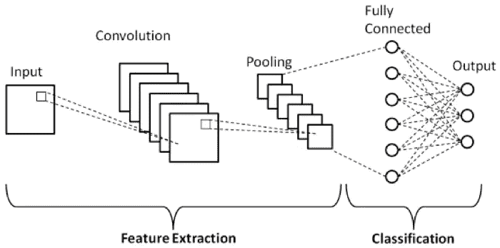
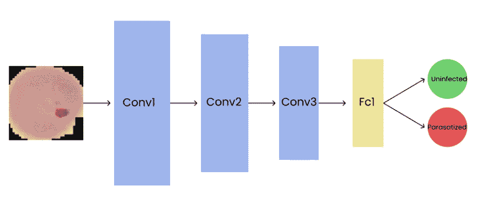

# 使用卷积神经网络(CNN)诊断疟疾

> 原文：<https://medium.com/analytics-vidhya/using-a-convolutional-neural-network-cnn-to-diagnose-malaria-589489e739ca?source=collection_archive---------13----------------------->

我相信你可能听说过计算机视觉，这是一个不言自明的术语:赋予计算机“看”的能力。然而，一个更技术性的定义应该是这样的:赋予计算机分析图像并将图像正确分类的能力。

在本文中，我将使用一些我不会在本文中涉及的技术术语，因此，如果您对该主题不熟悉，我建议您在深入研究本文之前先阅读我写的这篇关于神经网络的文章:

 [## 神经网络:机器学习的基础

### 每个人都从阅读最新的科技新闻和观看科幻电影中听说过人工智能。AI 要去…

ishaana-misra.medium.com](https://ishaana-misra.medium.com/neural-networks-the-foundation-of-machine-learning-366530ab77e7) 

# 数据预处理

在机器学习中，我们将 80%的时间用于处理数据和准备数据(也称为预处理数据)，因此在我们进入卷积神经网络、训练和准确性之前，我们需要处理我们的数据。这包括收集数据，确保图像的一致性，以及进行我们认为有用的任何其他更改。

收集数据可能需要很长时间，但幸运的是，这一步可以跳过，因为已经有 27，558 个感染和未感染疟疾的细胞图像的现有数据集。

 [## 疟疾细胞图像数据集

### 用于检测疟疾的细胞图像

www.kaggle.com](https://www.kaggle.com/iarunava/cell-images-for-detecting-malaria) 

一些细胞图像；未感染(上图)和已感染(下图)

现在我们有了数据，我们可以对它进行预处理。正如你所看到的，上面的图像都是不同的维度，使得图像的这一方面相互不一致。

这成为一个问题，因为 a)如果所有的图像都是不同的维度，构建 CNN 将变得具有挑战性，b)我们希望我们的 CNN 检测图像之间的差异，这对于将图像解释为被寄生或未被感染是重要的，而不同的维度不是这些差异之一。因此，让我们将图像的大小调整为 50 x 50 像素。

此外，我们需要将这些图像转换成灰度，因为在这种情况下，颜色是不相关的。此外，将图像转换为数值要容易得多，因为计算机将灰度图像视为 0(黑色)到 255(白色)之间的像素值阵列。介于两者之间的所有值代表灰度。

调整图像大小，然后转换为灰度

现在我们可以使用 CNN 来了解计算机是如何看到的，但首先…

# 什么是卷积神经网络？

卷积神经网络是一种深度神经网络，通常用于分析图像，尽管近年来它也用于分析其他类型的数据。

出于我们的目的，我们将输入一个图像到 CNN，并期望它对图像进行分类。对图像进行分类意味着确定图像属于两个可能的类别:未感染、已感染。我们将图像转换成像素值的数组，因此该数组也可以被视为 CNN 的输入。

# CNN 是如何工作的？

CNN 与其他类型的神经网络的不同之处在于它能够提取图像的独特特征，包括边缘和纹理。但是，是什么让 CNN 如此独特呢？

典型的神经网络接受多个数值作为输入，下一层的每个节点(参考我之前提到的文章)查看这些输入中的每一个。我们可以将我们的像素值数组通过这个神经网络，每个像素值作为一个输入，但这将变得多余和不必要。

如果你想到人类是如何看待图像或任何相关事物的，我们不会一个像素一个像素地看，然后试图把它们拼凑在一起并理解它们。我们观察边缘和纹理，这是一种更快理解图像的方法。问题是，我们如何用计算机复制这个？

有了 CNN，我们不再单独查看每个像素，而是一次查看一组像素。这可能很难想象，所以看看下面的图表。

以上是一个过于简化的例子。我们把这张图片分成了一个 4x4 的网格。我们用一种叫做内核的东西来观察这个图像的特定部分。内核对图像进行卷积，查看某些部分，也称为图块。上面的每个节点对应于图像的某一部分。对应于红色区块的红色节点、对应于蓝色区块的蓝色节点等等。

这有助于我们消除冗余，如果我们使用深度神经网络，因为这里每个节点只负责图像的某个部分，而不是整个图像。

现在，看看下面稍微复杂一点的图表。

Van Hiep Phung 等人。艾尔

我们有输入(我们的图像),内核对其进行卷积以识别特征，然后我们使用完全连接的神经网络来比较这些特征。完全连接的神经网络基本上只是一种神经网络，其中一层中的每个节点都考虑到前一层中的每个节点，如上面的分类部分所示。

最后，输出层将数据分类到各自的类中。

# 制作我们的 CNN

在制作我们的 CNN 时，我们不需要把自己限制在仅仅一个卷积层。我们可以有多个，这意味着我们要经历多次对图像进行核卷积的过程。

事实上，拥有更多卷积层意味着我们可以更好地检测图像中的特征。在我们的 CNN 中，我们将有 3 个卷积层和 2 个全连接层。

所以，我们的神经网络现在完成了！但是我们还没有完成，因为我们仍然需要使用一个叫做反向传播的过程来训练我们的模型。

简单地说，反向传播意味着每次图像经过时，根据模型在分类中的正确或错误程度，更新模型的权重和偏差。通过这个过程，我们可以提高模型的准确性。

因此，一旦我们训练了我们的模型，我们需要一种方法来测试它在分类图像时的效率和准确性。我们通过给它许多图像来测试模型，然后检查我们的模型将图像分类到的类别是否是模型的真实类别。

通过这个过程，我对模型进行了测试，发现它的准确率达到了 87.1%。

你可以在这里看到我的代码:

 [## 伊沙南/有线电视新闻网

### 通过在 GitHub 上创建帐户，为 ishaanam/CNN 的发展做出贡献。

github.com](https://github.com/ishaanam/cnns/blob/master/Malaria.ipynb) 

你也可以看看我做的这个视频:

Ishaana Misra 是一名八年级学生，她对人工智能和医疗保健感兴趣，尤其是这两者的交集。她也是知识社会的创新者。

*领英:*[*https://www.linkedin.com/in/ishaana-misra/*](https://www.linkedin.com/in/ishaana-misra/)

*查看我的简讯:*[*https://ishaana.substack.com*](https://ishaana.substack.com/)