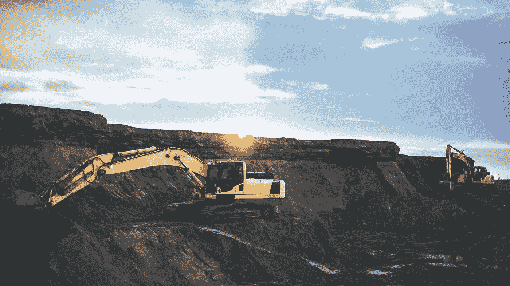
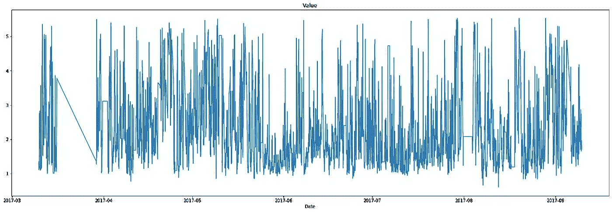
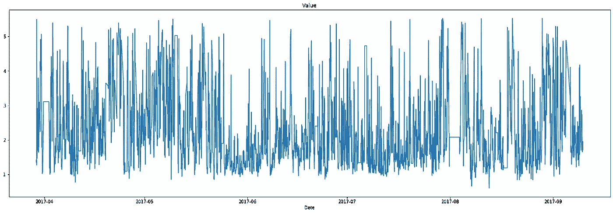
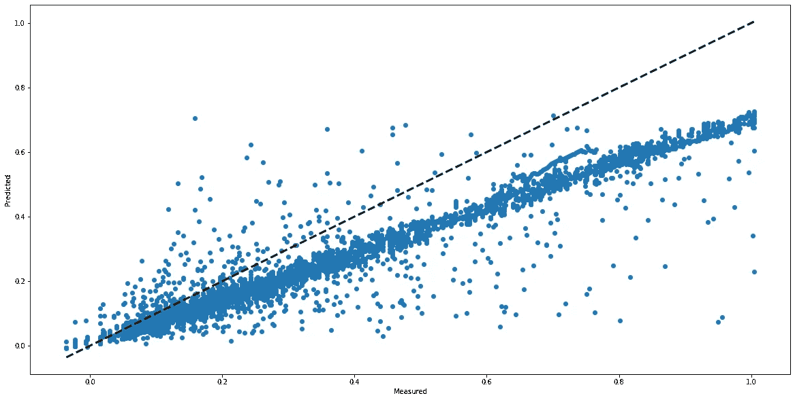
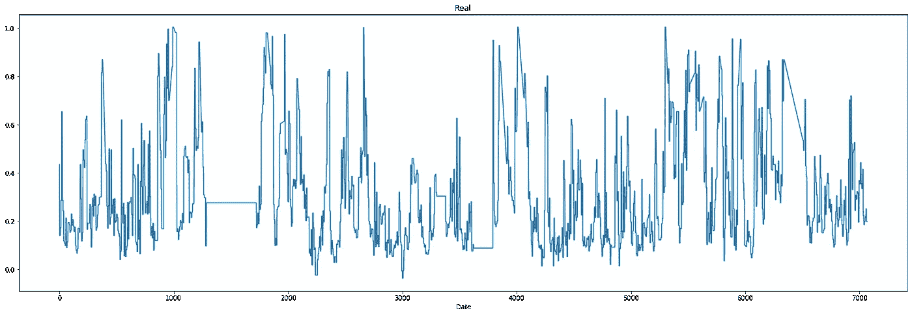
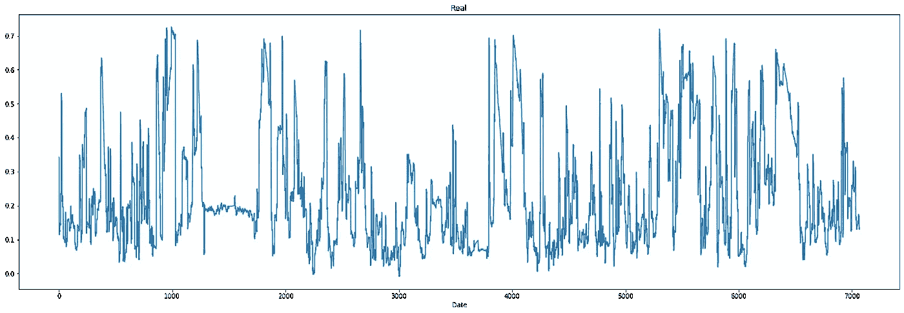

# 利用 LSTM 神经网络预测矿业过程参数

> 原文：<https://medium.com/analytics-vidhya/using-a-lstm-neural-network-to-predict-a-mining-industry-process-parameter-d91df7ffb4e?source=collection_archive---------12----------------------->

实际工业过程预测模型发展综述

Artyom Korshunov 在 [Unsplash](https://unsplash.com/s/photos/mining?utm_source=unsplash&utm_medium=referral&utm_content=creditCopyText) 上拍摄的照片

这个项目是我在工业工程学士学位的期末项目中开发的一个大型研究的摘录。主要目的是评估不同的机器学习技术，以预测工业过程的质量参数。在所研究的技术中，性能最好的是 LSTM 神经网络，这是一种因其在时间序列预测中的应用而闻名的模型。以下主题详细介绍了应用的行业背景，以及用于准备数据、训练模型和分析结果的步骤。

# 商业理解

浮选是一种采矿工业过程，用于增加提取矿石中的铁含量。化学试剂被加入到矿浆中，以改变矿浆的静电特性，并允许去除杂质，主要是二氧化硅形式的杂质，作为易于收集的泡沫。这一过程的产出是浓缩矿石，与送入浮选厂的矿石相比，其含铁量较高，二氧化硅含量较低。

在该过程中，进行并收集若干测量值，涉及原材料的质量(以铁和二氧化硅百分比的形式)和浮选设备的操作参数。测量浮选质量的一种方法是获得浓缩矿石中二氧化硅的百分比，但是这一过程是在实验室中进行的，需要长达两个小时的时间来提供结果。

> 项目目标是利用浮选过程的历史数据预测精矿中二氧化硅的百分比，从而在操作过程中进行调整，而无需等待实验室结果再采取行动。

由于过程数据被表示为时间序列，因此可以应用一些监督机器学习模型来生成高度准确和可靠的预测，使用过去的数据作为输入来训练预测模型。这个项目选择的模型是长期短期记忆神经网络，或 LSTM:在这种特殊的神经网络架构中，一种称为记忆单元的结构为网络提供了处理和存储过去数据的能力，控制哪些信息是相关的或不相关的，以产生误差更小的结果。下面的文章详细解释了 LSTM 是如何工作的:

 [## 了解 LSTM 网络

### 2015 年 8 月 27 日发布人类不是每秒钟都从零开始思考。当你读这篇文章时，你…

colah.github.io](http://colah.github.io/posts/2015-08-Understanding-LSTMs/) 

# 数据分析和预处理

这个项目是在 Scikit-learn 和 Keras 等机器学习库的帮助下用 python 语言实现的——在本文末尾可以找到完整代码的链接。

第一步是加载数据集(可在 Kaggle 上获得，链接如下)和库进行预处理。该数据集由 737453 个样本和来自浮选过程的 23 个变量组成，涵盖大约 3 个月的操作，其中每个样本代表 20 秒的测量。

加载数据并开始预处理

数据集中变量的描述:

*   `% Iron Feed`:进入浮选过程的矿石中铁的百分比
*   `% Silica Feed`:进入浮选过程的矿石中二氧化硅的百分比
*   `Starch Flow`:用于使铁矿石在浮选柱中倾析的化学试剂的流动
*   `Amina Flow`:用于使二氧化硅在浮选柱中漂浮的化学试剂的流量
*   `Ore Pulp Flow`:进入浮选过程的矿石流量
*   `Ore Pulp pH`:进入浮选过程的矿石的 pH 值
*   `Ore Pulp Density`:进入浮选过程的矿石密度
*   `Flotation Column Air Flow 1 to 7`:浮选过程的操作参数
*   `Flotation Column Level 1 to 7`:浮选过程的操作参数
*   `% Silica Concentrate`:流程结束时获得的精矿中二氧化硅的百分比。这是模型必须预测的输出变量
*   `% Iron Concentrate`:流程结束时获得的精矿中铁的百分比

对数据集进行的两个主要预处理操作是删除工厂停机维护期间的时间段，从而确保数据保持连续并尽可能代表实际过程。以下是移除维护周期后输出变量的前后结果:

`% Silica Concentrate —` 原始数据

`% Silica Concentrate —` 移除后的维护期

下一步是从数据集中删除变量`% Iron Concentrate`。其原因是该变量与输出变量`% Silica Concentrate` 高度相关，因为两者都是在相同化学分析中获得的相同矿石的元素百分比。因此，此变量的存在会对模型的训练产生负面影响，从而生成有偏差的预测。

第二个主要的预处理步骤是对数据进行分组，这大大减少了数据集的容量和随后的训练计算成本。执行此操作是因为每个输入样本代表一个涉及 20 秒过程的测量值，而输出变量保持不变，仅每两小时改变一次，这是在实验室中计算其新值所需的时间段。这样，使用每 30 个样本的中值进行分组，获得新的数据集，其中每个样本现在代表 10 分钟的过程。

在下一步中，数据被划分为训练集和验证集:最初的 16582 个样本，大约占数据的 70%，成为训练集，剩下的 30%用于验证。输入和输出数据也被标准化，范围在 0 和 1 之间。

划分和转换数据

LSTM 需要将输入数据划分为一个三维矩阵，该矩阵由输入数据、过去提供的内存大小(或时间步长)以及此期间的输出数据组成。下面是用于创建输入矩阵和选择所需时间步长大小的函数。

对于这个项目，选择的时间步长是 36，这意味着代表 6 小时处理的 36 个过去的样本(包括输出)被用于预测下一个样本，这种技术被称为滑动窗口。

为 LSTM 模型准备数据矩阵

# 训练模型

下一步是建立 LSTM 网络，并训练数据来生成预测。Keras 库允许轻松地为网络构建所需的架构，在这个项目中，该架构由包含 24 个神经元的 LSTM 层、密集层和分离层组成；此外，选择的损失函数是 MSE，优化器是 Adam。

建立 LSTM 模式

下面是已构建模型的摘要，包括层和生成的参数:

模型概述

模型准备就绪后，下一步是实现回调函数以防止过度拟合，训练模型并在训练集和验证集中进行预测。

训练模型并进行预测

# 结果

取得的结果是训练的 RMSE*0.1180*，验证达到 RMSE*0.1297*，R2*0.7082*。这些结果表明，该模型在预测产量方面取得了良好的性能，这也可以从下面的图表中看出，该图表显示了实际值和预测值之间的差异。在同一张图中，可以注意到在较高值的预测中存在偏差，如与控制线的偏差所示。避免这种行为的一种方法是通过删除变量来重新训练模型，以便评估哪个变量对性能的负面影响最大。

预测值与实际值

在下图中，可以观察到真实值`% Silica Concentrate`的变化和模型预测值的变化。再次注意到，LSTM 提供了高度准确的预测，模型生成的值遵循真实数据的所有变化模式和趋势。

实际产量

预测产量

如前所述，完整的项目涉及额外的步骤，例如与其他机器学习模型(随机森林)的比较，以及基于训练和测试新的分区数据选择多个超参数，这保证了比这里呈现的结果更好的结果。然而，由于数据预处理和所选神经网络的处理能力的组合作用，即使使用 LSTM 体系结构的适度配置也获得了良好的结果。

从 Kaggle 获得的数据集:[https://www . ka ggle . com/edumagalhaes/quality-prediction-in-a-a-mining-process](https://www.kaggle.com/edumagalhaes/quality-prediction-in-a-mining-process)

你可以在我的 github 页面上找到这个项目的完整代码:[https://github.com/gabrieltx/LSTM-Quality-Prediction](https://github.com/gabrieltx/LSTM-Quality-Prediction)