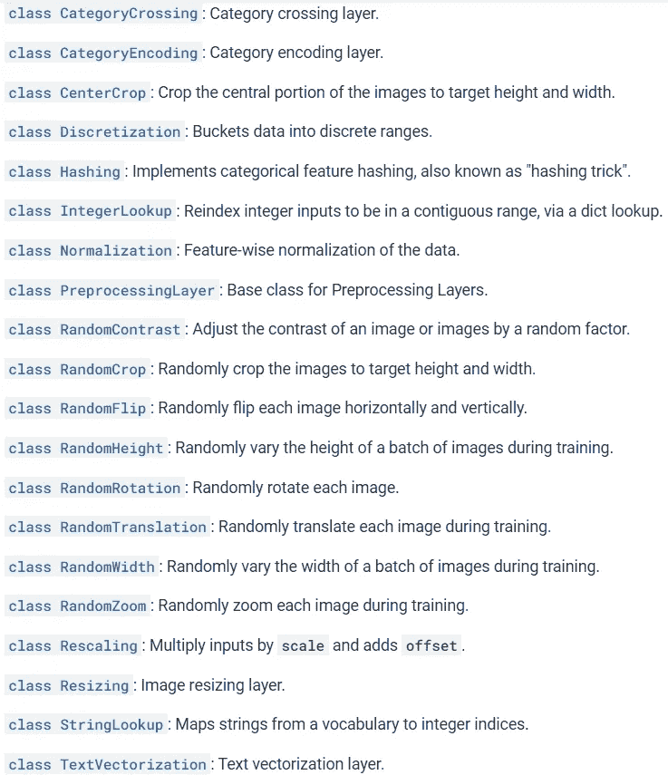

# 提升 Tensorflow API 的技巧和诀窍:子类化、数据处理、扩展

> 原文：<https://medium.com/analytics-vidhya/using-advanced-tensorflow-api-for-training-nns-subclassing-data-processing-extensions-a56a784f4084?source=collection_archive---------3----------------------->


照片由[李勇云](https://unsplash.com/@thoutbox?utm_source=medium&utm_medium=referral)在 [Unsplash](https://unsplash.com?utm_source=medium&utm_medium=referral) 上拍摄

## 张量流

TensorFlow 框架为端到端的机器学习管道提供了许多有用的类和功能。从读取数据到训练逻辑，所提供功能的大多数方面都是高度可定制的。我们将探索 Tensorflow 的许多功能，以实现复杂的深度学习算法或加速深度学习应用程序的开发进程，重点是图像数据和 CNN。

这篇文章不是对某些主题的深入解释，而是对低级的 TF 和有用的 TF 类的一般性介绍，同时我将链接参考文档和有用的资源以获得进一步的信息和例子。我的目标是在开发机器学习项目时，使用 TensorFlow 为介绍*我的技术*。欢迎通过评论讨论利用 TensorFlow 训练模型的更好方法。

在本帖中，我们将讨论张量流的各个方面:

*   tf.data .数据集
*   预处理数据
*   数据扩充(ImageDataGenerator，tf.keras.preprocessing.image)
*   张量流数据集
*   自定义训练循环
*   覆盖 tf.keras.Model，TensorFlow 对象的子类化
*   Tensorboard 日志记录、检查点、保存/加载模型
*   TensorFlow 扩展(tf_a、tfg 等)

## tf.data.Dataset 对象[【文档】](https://www.tensorflow.org/api_docs/python/tf/data/Dataset)

> 表示一个潜在的大型元素集。

tf.data.Dataset 是 TensorFlow 提供的用于实现输入管道的 API。加载、预处理、扩充和迭代数据的过程属于 API 的范围。整个程序设计用于操作一个`tf.data.Dataset`对象。

我们可以简单地通过映射一个列表来创建`tf.data.Dataset`对象，如下面的代码片段所示。在第一个例子中，我们可以简单地使用 for 循环按顺序遍历数据集。

数据集也有非常方便的方法，比如第二个例子中描述的`shuffle`和`batch`操作。这些操作实际上会打乱数据集，并从数据集生成批次。`repeat(n)`操作将数据集重复 n 次，而当 n 未定义时，数据集将无限重复。

有时数据集可以被定义为更复杂的结构。一种常见的数据形式是一对(图像、标签)中的数据。这样的数据可以使用上面例子中的字典来定义。我们还可以看到图像和标签在混洗操作后被分组。

我们还可以用 3+组件构建数据集，或者使用其他函数来代替`tf.data.Dataset.from_tensor_slices`，这将在文档中进一步描述。

最后一个方法`tf.data.Dataset`是`dataset.map(map_f)`方法，它对数据集中的所有元素分别应用某种`map_f`方法。在上面的例子中，应用了`example_map`函数给所有的标签值加 5。

# 读取数据

每个机器学习应用的第一部分是读取数据。你可以简单地使用其他库(例如 NumPy、PIL、OpenCV……)读取数据，并将它们存储在 NumPy 数组(或者简单数组)中。在一个变量中实际读取和存储*所有数据*的一个缺点是，它消耗了太多的 RAM，对于一个大型数据集来说是不可行的。

TensorFlow 提供了读取数据的动态方法，这可以表示为定义一个函数，在运行时动态读取和存储一批数据，而不是直接存储数据。因为训练是基于输入管道的输出完成的，所以该函数还必须包含预处理和扩充步骤的定义。使用多重处理可以加速这一过程。

TF 提供了大多数一般情况下的步骤，同时它们也可以完全定制。TF 中读取数据的两个关键功能是使用 all-in-one pipeline(如`image_dataset_from_directory`)和直接定义一个函数来创建一个`tf.data.Dataset`对象，这更具可定制性。

## image _ dataset _ from _ directory[【文档】](https://www.tensorflow.org/api_docs/python/tf/keras/preprocessing/image_dataset_from_directory) [【教程】](https://keras.io/api/preprocessing/)

> 从目录中的图像文件生成一个`[tf.data.Dataset](https://www.tensorflow.org/api_docs/python/tf/data/Dataset)`。

image_dataset_from_directory 是一个方便的函数，用于读取特定目录结构中的数据。例如，以下结构的数据在 ImageNet 等图像数据集中很常见，我们可以使用以下代码读取。我们还可以针对不同类型的数据对应用程序进行细微的修改，并通过调整参数来添加一些基本的预处理。

```
training_data/
...class_a/
......a_image_1.jpg
......a_image_2.jpg
...class_b/
......b_image_1.jpg
......b_image_2.jpg
```

代码:

```
train_ds = image_dataset_from_directory(
    directory='training_data/',
    labels='inferred',
    label_mode='categorical',
    batch_size=32,
    image_size=(256, 256))
```

## 自定义函数+ dataset.map [【示例】](https://www.tensorflow.org/tutorials/generative/pix2pix)

由于我在 Pix2Pix Tensorflow 教程中发现了这个从目录中读取图像的自定义实现片段，所以我个人主要使用这个自定义实现来读取数据。

上面的代码片段映射了一个 tf。数据。通过`read_image`函数的路径数据集，该函数以张量流图形模式读取图像。这种方法的一个优点是，它在目录结构和数据格式方面是非常可定制的，因为当使用 image_dataset_from_directory 时，我经常努力集成不同形式的标签。

当我们定义像`train_dataset`这样的变量时，Tensorflow 并不总是*实际上*读取并存储变量中的所有数据。相反，在 train_dataset 中创建了一个映射函数(Tensorflow graph ),每当我们使用迭代器访问数据集的值时，就会执行映射并读取数据。因为变量*是虚拟的*，我们不能简单的打印出值或者索引`train_dataset`比如`print(train_dataset) or train_dataset[2]`。

# 数据扩充

## ImageDataGenerator [【文档】](https://www.tensorflow.org/api_docs/python/tf/keras/preprocessing/image/ImageDataGenerator) [【教程】](https://blog.keras.io/building-powerful-image-classification-models-using-very-little-data.html)

> 通过实时数据扩充生成批量张量图像数据。

`ImageDataGenerator`提供了实现数据扩充的工具。要使用`ImageDataGenerator`进行数据增强，我们必须首先声明一个实例，该实例包含下面增强池中的增强设置。

使用两种方法对数据进行扩充。首先，当数据集已经被加载或定义为 tf.data.Dataset 变量时，我们可以使用`datagen.flow(x, y)`构建一个扩充的数据集，如下面的代码所示。

[https://www . tensor flow . org/API _ docs/python/TF/keras/preprocessing/image/imagedata generator](https://www.tensorflow.org/api_docs/python/tf/keras/preprocessing/image/ImageDataGenerator)

我们也可以使用`datagen.flow_from_dirctory(directory)`直接从文件中读取，如下面的代码所示。这种方法非常常用，因为它既简洁又相对适用于许多数据集。

[https://www . tensor flow . org/API _ docs/python/TF/keras/preprocessing/image/imagedata generator](https://www.tensorflow.org/api_docs/python/tf/keras/preprocessing/image/ImageDataGenerator)x

## 使用 tf.image 定制增强[【文档】](https://www.tensorflow.org/api_docs/python/tf/image)

您可以使用`tf.image.random_*`中提供的功能执行自定义数据扩充，并定义一个 tf 图。这可以通过将扩充管道映射到数据集对象来应用于数据。

## tf.keras.layers.experimental .预处理[【文档】](https://www.tensorflow.org/api_docs/python/tf/keras/layers/experimental/preprocessing) [【教程】](https://www.tensorflow.org/tutorials/images/data_augmentation)

> 使用层接口将预处理集成到模型中。

该模块在 Keras 层中提供数据扩充功能。因此，我们可以将增强过程表示为顺序模型，或者简单地将增强层添加到现有神经网络的开头。



例如，下面的代码将定义和执行数据扩充。这些层在测试时不做任何事情。

我个人认为这种将数据增强作为一个层引入的概念是惊人的。我们还可以使用子类化将自定义数据扩充(如 mixup、cut mix)定义为自定义层，这将在下面介绍。

## TFDS(张量流数据集)[【目录】](https://www.tensorflow.org/datasets/catalog/overview)

TensorFlow 提供的最后一个方便的功能是`tensorflow_datasets`，或`tfds`库，它提供了可能最简单的方式来下载和阅读大约 300 个不同格式的主要数据集。

使用上面的*单行代码*，可以下载 TFDS 数据集并将其读入 tf.data.Dataset 对象。要使用 TFDS 下载数据集，您可以简单地找到数据集的键，这是 TFDS 目录中的确切名称，并调用`tfds.load(key)`。每个数据集的结构在解释页面上单独描述。

# 自定义训练循环

你们很多人可能已经习惯的 Keras & TF2.0 风格的编程很可能利用了高级 API，比如`model.compile`和`model.fit`。虽然默认的训练程序在一定程度上是高度可定制的，但一些任务，如 GANs，需要更复杂和定制的训练循环。

在这种情况下，我们可以手动实现一个训练步骤的过程，并在数据迭代器之后重复该步骤。下面的代码片段实现了网络的一般训练步骤。第 2 行的`tf.GradientTape`声明了一个变量`tape`，该变量在其作用域内执行自动微分。第 3 行和第 4 行实现了推理过程，并映射了损耗值和网络参数之间的关系。在第 5 行中，`tape`变量执行自动微分并返回网络权重的梯度。最后，第 6 行通过优化器应用计算出的梯度。

上面的代码是定制培训步骤的基础。对于默认的 CNN 和简单的网络来说，这可能是不必要的，但对于构建复杂的训练程序来说，这是 TensorFlow 的一个关键 API。

在 TensorFlow 中实现 DCGAN 的官方 TF [教程](https://www.tensorflow.org/tutorials/generative/dcgan)也在更复杂的环境中很好地解释了这个概念。

# TF 类的子类化

根据 Tensorflow 的说法，`tf.Module`类是其实现的最基本模块。所有层的基底`tf.keras.layers.Layer`继承自`tf.Module`，而所有模型的基底`tf.keras.Model`继承自`tf.keras.layers.Layer`。

就像 Keras 中的每一层是如何定义的一样，比如`Conv2D`、`MaxPooling2D`，我们可以覆盖 layer 类来创建一个自定义层。我们还可以对基本模型接口进行子类化，并覆盖自定义训练循环的默认方法。

## 自定义图层:tf.keras.layers.Layer [【文档】](https://www.tensorflow.org/api_docs/python/tf/keras/layers/Layer)

> 这是所有层继承的类。

一般来说，为了构建一个自定义层，我们子类化`tf.keras.layers.Layer` 并覆盖默认方法来进行操作和初始化权重。

一些重要的覆盖方法有:

*   __init__(self):初始化层设置。
*   build(self，input_shape):使用`add_weights()`或`tf.Variable`初始化权重。
*   call(self，inputs，*args，**kwargs):网络的实际正向传递逻辑。

与前一层的输入尺寸信息一起调用`build`方法。权重初始化通常在这种方法中实现。`__init__`方法，初始化图层时调用 Python 构造函数。在`call`方法中，必须使用 TF 图函数实现实际的正向传递。`call`方法接收输入数据和一些参数，比如`trainable`，它告诉我们它是当前正在训练还是仅仅在执行推理。

在 Python 保留方法`__call__`处调用`tf.keras.layers.Layer`的`call`方法，该方法在实例作为函数被调用时执行。这就是为什么像`layer(data) or model(data)`这样的代码把层实例当作一个函数来处理。

更多的方法可以被覆盖，在文档中有进一步的描述。

## 更多自定义:tf.keras.Model [【文档】](https://www.tensorflow.org/api_docs/python/tf/keras/Model) [【教程】](https://keras.io/examples/generative/dcgan_overriding_train_step/)

模型类是`tf.keras.Model`的一个表示，实际上是从层类中派生出来的，因此包含了一个类似于层类方法的接口。然而，每种方法的一般用法会因实现层的不同而略有不同。

上面的简单模型就是定制模型的一个例子。在这种情况下，网络架构和权重在`__init__`中定义。`call`方法传达关于模型的完整推理过程的信息，类似于`tf.keras.layers.Layer`的方法。在`tf.keras.Model`中还有其他方法可以被覆盖。

基本上，当覆盖`tf.keras.Model`时，我们应用两个主要技术。一种是仅覆盖`call`，如上面的示例代码所示。通过这种方式，我们可以定制正向传递，同时保留所有其他内容，包括编译过程和训练循环。

我们还可以使用`model.fit`来训练模型，同时通过覆盖`train_step`方法来使用定制的训练循环。如教程(或下面的代码)所述，我们可以覆盖`compile`来为 GAN 训练定义 2 个优化器，然后覆盖`train_step`来实现一个定制的训练循环。我们也可以根据您的需要覆盖其他方法，如`predict`或`test_step`。基本上，文档中列出的每个公共方法都可以被覆盖。

# 保存模型

保存模型:`model.save(directory)`

负载型号:`tf.keras.models.load_model(directory)`

在 TensorFlow 中保存和加载模型只需要一行代码。有一点需要注意的是`model.save`和`model.save_weights`的区别。第二种情况只保存权重，不记录模型结构。要加载权重文件，我们必须首先在`model`中定义一个模型架构，并调用`model.load_weights(directory)`。

## 检查点[【文档】](https://www.tensorflow.org/api_docs/python/tf/train/Checkpoint)

TensorFlow 的检查点功能提供了一种简单的方法来重新加载模型并继续训练。检查点 API 仅保存模型权重，因此在加载之前需要构建模型架构。

我们可以使用一个已定义的`tf.keras.callbacks.ModelChechpoint`回调。

[https://www . tensor flow . org/tutorials/keras/save _ and _ load # save _ check points _ during _ training](https://www.tensorflow.org/tutorials/keras/save_and_load#save_checkpoints_during_training)

或者我们可以手动定义一个`tf.train.Checkpoint`对象来保存和加载检查点。如下面的代码所述，我们可以使用`ckpt.restore`从检查点加载，使用`manager.save`保存。当我们使用显式训练循环而不是`model.fit`来训练模型时，经常使用这种手动保存。

## 登陆冲浪板[【教程】](https://www.tensorflow.org/tensorboard/scalars_and_keras)

TensorBoard 是一个可视化 TF 实验的 API。一些特征包括图像/视频/音频的可视化、查看训练期间的损失/准确性、以及观察训练期间的体重量值直方图。结核病本身是一个非常大的主题，值得写一篇完整的文章。我们将讨论 TB 回调的实现以及如何实现手动日志记录。同时，你可以查看[官方教程](https://www.tensorflow.org/tensorboard/get_started)了解更多信息。

使用`[tf.keras.callbacks.TensorBoard](https://www.tensorflow.org/api_docs/python/tf/keras/callbacks/TensorBoard)`:

`tf.keras.callbacks.TensorBoard`提供了一个通用的日志管道，可以接收日志权重直方图、度量(损失/增加)、图形、嵌入可视化等参数。此回调将在每个时期结束时调用，以 TensorBoard 格式记录配置的数据。

使用`tf.summary.create_file_writer`自定义日志记录:

我们可以使用`tf.summary.<type>(path, data, step)`记录任何变量。我们还可以使用这种方法构建定制的 TB 日志回调。

# 扩展[【目录】](https://www.tensorflow.org/resources/libraries-extensions)

最后，我们将回顾一些将增强 TF 体验的便利扩展。我建议查看以下库，它们在许多应用程序中非常有用。

## TF 集线器

> TensorFlow Hub 是一个经过训练的机器学习模型的存储库。

TF Hub 提供对许多可用的预训练模型的访问 [tfhub.de](https://tfhub.dev/) v。每个模型都有不同的应用方式，如网站上所述。例如，根据[解释](https://tfhub.dev/tensorflow/bert_en_uncased_L-12_H-768_A-12/3)，可以使用下面的代码来使用 BERT 模型。

## TensorFlow 插件[【文档】](https://www.tensorflow.org/addons/api_docs/python/tfa)

Tensorflow 插件(或 tfa)为 TensorFlow 提供了有用的额外功能。这些包括尖端层的实现、激活、优化、处理技术和损耗。该库更新相对较快(我在 2021 年 6 月找到了 2021 年 4 月的一篇论文的实现)。

tfa 中提供了大多数主要 DL 技术的实现。

还有用于特殊目的的扩展库，例如:

*   TF Cloud:用于连接 GCP(谷歌云平台)
*   TF _ agents:RL 著名代理的实现
*   tensorflow_probability:更多样的概率分布，更多的概率工具
*   tensorflow_text:自然语言处理库，文本处理
*   tensorflow_graphics: 3D 数据处理，包括可微分相机、网格操作、图形层

# 结论

我们回顾了一些技术来增强我们的 TensorFlow 编程技能，并定制后台正在进行的一切。TensorFlow 是一个很棒的库，有许多扩展和很好的可伸缩性，有一个活跃的社区。我希望你能够通过这篇文章中介绍的技术提高你在 TensorFlow 中构建 DL 系统的技能。