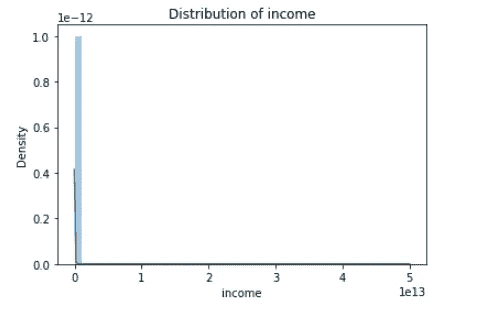

# 使用人工智能检测勒索软件交易中涉及的比特币地址

> 原文：<https://medium.com/analytics-vidhya/using-ai-to-detect-bitcoin-addresses-involved-in-ransomware-transactions-3beaeccba176?source=collection_archive---------3----------------------->

# 摘要

在线诈骗在过去十年中呈上升趋势，随着加密货币及其伪匿名性的引入，对骗子来说前所未有的方便。

这篇博客将讲述一个臭名昭著的黑客网上抢钱的机会——“比特币大劫案”。很直白。花里胡哨的网站，还有嗯，免费下载音乐？什么会出错？*click*-当你下载了一种叫做“勒索软件”的特殊计算机病毒时。

勒索软件像野火一样在你的电脑中蔓延，加密每一个文件。想要回您的敏感数据吗？只要向黑客支付一大笔赎金，他们就会(希望)给你一个解密密钥，这应该可以解锁你的数据。

想知道比特币是如何发挥作用的，而不是 PhonePe 之类的东西？比特币是一种基于点对点技术的加密货币，不涉及银行等中央机构。出于各种意图和目的，通过比特币完成的交易无法被追踪。现在你可能明白了，为什么这对骗子来说是完美的。

在这个项目中，我们将使用人工智能来分析这些交易是如何发生的，并尝试建立模型来预测给定的比特币地址是否被用于恶意目的。

## 内容

1.  *简介*
2.  *数据清理和特征工程*
3.  *探索性数据分析*
4.  *造型*
5.  *结论*
6.  *未来工作和参考资料*

注意:你可以在 [GitHub 库](https://github.com/yogeshchandrasekharuni/bitcoin-heist)中找到附带的 jupyter-notebook 和所有其他代码。要全面了解，建议也跟着笔记本走。

# 1.介绍

## 问题陈述

*   给定一个比特币地址以及与该地址相关的一些元数据，我们面临的挑战是预测该地址过去是否被用于接收赎金。

## 真实世界的用法

*   一旦发现一个地址确实被用于恶意目的，就可以对该比特币地址采取快速行动，例如禁止其未来的任何交易或将其列入黑名单，以防止进一步的在线诈骗。

## 商业目标

*   虽然比特币是开源的，但它接受[捐赠](https://bitcoin.org/en/)。随着越来越多的人开始使用比特币，该平台拥有良好的声誉符合比特币的最大利益，正因为如此，它会产生更多的捐款。因此，为了保持良好的公共关系，比特币必须防止其平台被宣传为一种方便的诈骗手段。

## 假定

*   鉴于我们的模型错误分类的结果可能非常高，我们将假设比特币或第三方雇佣了领域专家来验证我们模型的输出。
*   我们将让我们的最终模型最大限度地减少它的假阴性，也就是说，最大限度地减少地址被标记为白色的次数，而实际上，它已被用于恶意目的。这造成了一种权衡，反过来，假阳性的比率会增加。因此，假设有一个领域专家可以过滤掉假阳性数据点是很重要的。

## 业务限制

请注意，在这个项目中，我们只专注于禁止/黑名单过去用于恶意意图的比特币地址，而不是实时的。这个项目也可以很容易地扩展到实时工作，通过一个 API，在进行任何新的交易之前，检查接收者的比特币地址是否已经被我们的模型标记，如果是，立即通知当局，当局可以采取进一步的行动。然而，对于这个项目，我们不会将我们的用例扩展到实时。

现在让我们看看主要的业务约束。

*   ***误分类一个正数据点的代价可以很高*** 。这是因为如果一个用于恶意目的的地址被我们的模型标记为白色，该地址可以继续用于接收赎金和诈骗。
*   ***没有延迟问题*** 因为我们不考虑实时用例。但是，如果我们这样做，延迟就会成为一个非常重要的约束。
*   ***可解释性很重要*** 因为我们的领域专家需要模型预测背后的逻辑推理，因此他可以验证或进行进一步的调查。

## 数据

*   我们使用来自 UCI 机器学习知识库的[数据集](https://archive.ics.uci.edu/ml/datasets/BitcoinHeistRansomwareAddressDataset)，其中包含 2009 年 1 月至 2018 年 12 月解析的比特币交易图。该数据集包含交易的标记数据，以及它们是否是白色的或者它们是否属于勒索软件的类别。
*   我们加载。csv 文件转换成熊猫的数据帧

数据集的头部

# 2.数据清理和特征工程

在我们进行任何建模之前，需要处理我们从 UCI 存储库中获得的原始数据。我们还需要修改特征列的分布，因为我们将使用的一些预测模型可能会假设特征是正态分布的。

## 了解数据集

我们的数据集有大约 30，000，000 行和 10 列。在这 10 列中，我们有 9 个预测值和一个目标列。

*   每一行都与特定的交易相关。该交易有九个特征，其中每个特征是:

> 1.address [String]:
> 存储比特币交易接收方的地址。
> 
> 2。year [int] :
> 表示交易完成的年份。
> 
> 3。day [int] :
> 表示一年中的某一天。
> 
> 4。length [int] :
> Length 旨在量化比特币上的混合回合，其中交易在多个回合中接收和分发类似数量的硬币，并使用新创建的地址来隐藏硬币来源。
> 
> 5。weight [float] :
> Weight 量化合并行为(即交易的输入地址比输出地址多)，其中多个地址中的硬币都经过一系列合并交易，并累积在最终地址中。
> 
> 6。count [int] :
> 与 weight 类似，count 特性旨在量化合并模式。然而，计数特征表示关于交易数量的信息，而重量特征表示关于交易量的信息。
> 7
> 7。looped [int] :
> Loop 意在统计有多少笔交易 I)分割自己的硬币；ii)通过使用不同的路径在网络中移动这些硬币，最后，以及 iii)将它们合并在单个地址中。这个最终地址的硬币可以出售并转换成法定货币。
> 
> 8。neighbors [int] :
> 表示一个事务拥有的邻居数量。
> 
> 9。income [int] :
> 以 Satoshi 金额表示的收入，其中 Satoshi 是比特币的最小单位，相当于一个比特币的 1 亿分之一。

*   如果上面的一些功能太专业，不要担心。这些功能是由领域专家通过仔细分析每笔交易而设计的。作为人工智能工程师，我们只需要了解它们的分布，它们与其他特征的相关性，以及它们在预测目标中的重要性，等等，但了解每个特征背后的底层技术可能并不相关。

## 目标

对于给定的事务，我们想要预测的目标或实体是一组标签。标签可以是*白色*，表示对应于特定交易的地址未被用于恶意目的，或者它可以属于一组标签，如 *paduaCryptoWall、montrealSam、princetonLocky* 等，其中每个标签都是特定勒索软件家族的名称。

对于手头的任务，我们不需要担心特定勒索软件属于哪个家族，而只需要担心与交易相对应的地址是否被用于恶意目的。因此，我们将这种多类分类任务转换为二类分类。这是有益的另一个原因是我们的目标特性的分布。它是极度倾斜的，也就是说，我们有一个极度不平衡的数据集。

显示阶级不平衡的图表

## 我们特征的分布

让我们来看看我们的一些功能是如何分布的。先说特征‘长度’。

**长度**

长度的 PDF

我们注意到这种分布并不理想。从经验上来说，我们知道当特征是正态分布且不是极度偏斜时，一些模型(如逻辑回归)具有更好的预测能力。因此，我们通过使用 Boxcox 或其他变换将这些特征变换成更高斯的。

转换后长度的 PDF

我们看到 PDF 比以前更接近钟形曲线。我们对所有特征执行类似的变换，并构造新的和稍微变换的特征。

## 收入

让我们看看我们的收入特征是如何分布的:

收入的 PDF

我们注意到，即使是我们的收入特征也是极度扭曲的。让我们尝试通过应用 box-cox 变换来解决这个问题。

boxcox 变换后的收入 PDF

应用 boxcox 变换后，我们看到数据的总体分布有了很大的改善。

我们也对其他特征进行类似的分析和转换。

## 特征工程

## **固定偏斜度**

*   我们的一些新功能是 boxcox 或其他普通功能的变形。

## 工程新功能

创建可能与目标相关的新特征将使我们的模型具有更强的预测能力。让我们看一下我们新设计的一些功能。

**地址数量:**

*   该功能跟踪给定比特币地址在训练数据集中出现的次数。
*   假设是，如果一个比特币地址被用于恶意目的，它可能会参与比平时更多的交易，以收取赎金。我们稍后会看到这个假设是否成立。

**星期几:**

*   我们设计的另一个特性是交易发生在一周的哪一天。我们通过使用数据集中的*年*和*日*数据，并使用 python 的[日期时间](https://docs.python.org/3/library/datetime.html)库来检索日期，从而生成这些信息。我们将在后面看到这个特征是否与目标相关。

**快要放假了:**

*   使用我们之前生成的 datetime 对象，我们可以看到该事务是否发生在一个重要的假日/节日前后。假设是，如果一笔交易发生在一个重要假期的前一周或后一周，它可能是白色的。我们可以通过认为人们可能想在假期给家人或朋友转账来理解这一点。同样，在 EDA 过程中，我们将验证或否定这一假设。

我们设计了另外九个特性，包括修正偏斜的特性、工程特性，甚至交互特性。完整列表请参考 *jupyter 笔记本*中的 **3.1.2 工程特性**。

# 探索性数据分析

在本节中，我们将回顾对数据集执行初始调查的关键过程，以发现任何模式或异常。我们将对我们的特征进行单变量和多变量分析。

# 单变量分析:

**平衡我们的数据集**

*   在我们进行任何分析之前，我们需要修复数据集中存在的主要类别不平衡。为了节省 RAM，由于我们有足够的数据点，首先，我们将对负类数据点进行下采样。然而，我们也可以对我们的正数据点进行过采样，这将有助于保留关于我们的多数类的更多信息。
*   另一种方法是通过使用像 [SMOTE](https://machinelearningmastery.com/smote-oversampling-for-imbalanced-classification/) 这样的方法来人工合成更多的正类数据点。

让我们来看看我们的一些功能的类分离 pdf，并了解它们如何不同。请注意，我们希望在这些 pdf 中看到可分离性，因为这有助于模型区分两个类别。

## 地址数量

*   我们注意到两个类的 pdf 有非常明显的不同。
*   很明显，对应于白色交易的地址在数量上比属于恶意交易的地址更少。

## 年

*   在我们了解这些年来事务的性质是如何变化的之前，首先让我们看看特性本身是如何分布的。
*   我们看到每年的交易数量是一致的。

*   我们立即看到，2012 年、2015 年和 2017 年的交易性质有明显的区别。这一特点应该与我们的目标密切相关。然而，我们将在多变量分析中确认这一点。

## 重量

*   我们注意到两个 pdf 之间的可分性不是很大，但是我们的模型不能处理任何东西。
*   我们知道白色交易更有可能具有较高的权重值。

## 邻居

*   我们立即注意到我们班级中邻居数量的分布差异。正的类数据点往往与 2 个邻居的事务少得多，而与 4 和 3 的事务多得多。

## 快要放假了

*   我们意识到我们的假设，即在重大节日前后完成的交易更有可能是白色持有。

## 季度号

*   我们的工程功能季度数字清楚地表明，在第 3 和第 4 季度发生的交易更有可能是白色的，而不是与勒索病毒交易有关。

请参考随附的 *jupyter 笔记本*中的 **3.0 单变量分析**，了解其余特性的详细分析。

# 多变量分析

*   多变量分析(MVA)基于多变量统计学的原理，它涉及一次对多个统计结果变量的观察和分析。这将有助于我们了解各个功能之间以及与我们的目标之间是如何关联的。

## 配对图

让我们来看看我们的一些特征相对于彼此是如何变化的。

配对图

*   我们立即注意到，基于目标的几乎所有特征对都有不同的变化模式。例如，当 *gaussian_income* 与 *log_count* 配对时，我们注意到比我们的正类数据点更多的*白色*数据点聚集到更高的值。
*   配对图也有助于我们看到我们个人特征的分类 pdf。例如，我们可以看到 *gaussian_income* 的类分离 pdf 是多么的不同。

## 相关图

*   相关性是对两个定量变量(如身高、体重)之间线性关系强度的度量。关联图显示了要素集的关联程度。下面，方框中的颜色越深，对应特征之间的相关性越高。

特征之间的相关图

*   理想情况下，除了左对角线以外的所有方框都应该尽可能的轻。但是在现实中，有些特性总是相互依赖的。例如，我们看到特性*日*和*季度号*高度相关(这应该是意料之中的，因为我们就是这样构造季度特性的)。
*   要了解为什么预测值之间的多重共线性高对建模不利，请参考[此](https://datascience.stackexchange.com/a/65919)讨论。

现在，我们已经对我们的特性如何相互关联有了一个高层次的概述，让我们更仔细地看看每一对特性，以获得更深入的理解。

## 收入和计数

KDE 或核密度图描绘了连续变量的概率密度。在下图中，“圆圈”越小，组合变量的概率密度函数越高(因为我们使用 2D·KDE 图来同时测量两个变量的影响)。要了解更多关于 KDE 的情节，请参考这篇[文章](https://www.geeksforgeeks.org/kde-plot-visualization-with-pandas-and-seaborn/#:~:text=KDE%20Plot%20described%20as%20Kernel,in%20more%20efficient%20data%20visualization.)。

*   在我们的图中，我们希望蓝线和橙线尽可能分开。如果它们完全重叠，则表明无论目标变量是 1 还是 0，该特征都不会改变。
*   然而，在我们的例子中，有相当多的可分性。

## 长度和重量

*   我们看到，当特征长度和权重成对且分类分离时，我们会看到分布在图中的数据点略有不同。这表明这两个预测值一起为我们的模型提供了合理的信息。

## 收入和星期几

*   我们想分析一下，看收入会不会根据是哪一天而有增减。
*   从图中可以明显看出，星期五和星期天产生的收入最大。

## 收入、年数和互动 _ 计数 _ 收入

*   让我们仔细看看 income 及其对应的交互特性 count_income 这些年是如何变化的。

收入、年份及其对交互计数收入的影响之间的群集图

*   我们可以看到，这些年来，我们的交互功能发生了变化。在 2014 年前后，大多数高收入数据点都属于类型 0，但在 2018 年晚些时候，它们大多数属于类型 2。

# 建模

在我们可以建立预测模型并在数据集上训练它们之前，我们需要建立一个定义模型性能的指标。

## 韵律学

*   度量标准衡量我们的分类模型的性能，选择正确的*关键性能指标* (KPI)对于找到正确的模型是不可或缺的。一些模型可能获得很好的准确性，但获得很差的对数损失。

## 关键业绩指标

*   在我们的案例中，我们做出的设计选择是将**召回**作为我们的 KPI。我们希望最大化我们的回忆，并选择产生最少数量的假阴性的超参数。
*   这是因为我们希望正确分类尽可能多的正面数据点(勒索病毒交易),即使这意味着我们错误地将一些白色交易分类为勒索病毒类型。
*   在我们建模的其余部分，假设我们有一个领域专家，他将验证我们模型的输出，并在调查事务之前消除任何误报。

## 使用的其他指标

*   *对数损失*:没有特定范围的损失函数。越低越好。
*   *Precision* :告诉我们被归类为阳性的数据点中，有多少百分比实际上是阳性的。越高越好。
*   *ROC AUC* :使用真阳性率和假阳性率得到曲线下面积。越高越好。
*   *F1-得分*:精度和召回率的调和平均值。越高越好。
*   *准确性*:告诉我们我们的预测有多准确。越高越好

既然我们已经很好地理解了我们所有的特性，并且确切地知道了我们想要最大化的度量标准，我们就可以开始构建我们的模型了。

## 随机模型

*   在构建任何合适的模型之前，了解最坏情况下的性能是一个好主意。我们的一些度量标准(比如日志损失)没有任何范围。该随机模型将随机预测分类标签(统一)。
*   根据我们的随机模型计算出的指标应该会给我们一个好主意，告诉我们最坏的情况应该是什么样子。让我们看看它的输出。

随机模型输出

*   从上面可以看出，我们希望日志损失不超过 17，召回率至少为 50%。

**注意:**我们将在余下的建模中使用两种机器学习算法——基于距离的和基于树的。这两个模型的微调数据集是分别构建的。例如，基于距离的数据集已经被一次性编码、缩放等，因为这增加了它们的预测能力。然而，当特征被一次热编码时，基于树的模型实际上更差，等等。这种区别已经在附带的*笔记本*中明确强调，因此为了进一步澄清，建议您看一下。

# 基于距离的模型

*   基于距离的模型基于数据的几何结构。顾名思义，基于距离的模型基于距离的概念。

## 逻辑回归

*   逻辑回归是一种统计模型，其基本形式是使用逻辑函数来模拟二元因变量。它只是试图在 d 维中拟合一个超平面，以最好地分离正负数据点。
*   我们使用 sklearn 的 [SGDClassifier](https://scikit-learn.org/stable/modules/generated/sklearn.linear_model.SGDClassifier.html) 和一个逻辑损失，它比普通的 LogisticRegression 类更有效，因为它使用随机梯度下降。
*   对于所有模型，为了找到最佳超参数，我们使用[随机搜索](https://scikit-learn.org/stable/modules/generated/sklearn.model_selection.RandomizedSearchCV.html)。优化后，我们发现最佳的 *alpha* 为 0.001。将其拟合到模型中并获得测试预测，输出以下指标。

*   我们看到我们的召回率非常低，只有 52.3%。这仅比我们的随机模型多 2%左右。让我们看看其他指标。

*   我们看到我们模型的 ROCAUC 非常好，远远好于我们的基本模型或随机模型。
*   让我们看看我们所有的其他指标

*   由于我们的 KPI(召回)不可接受，我们将不会使用逻辑回归作为我们的最佳模型。让我们研究一下其他模型的表现。

## 支持向量机

*   我们可以从逻辑回归的失败中得到的一个教训是，也许我们的数据不是线性可分的。尽管逻辑回归非常强大，但它只能处理非线性数据。这也暗示了我们的线性 SVM 会和逻辑回归一样糟糕，因为同样天真地假设数据是线性可分的。然而，我们仍将对此进行调查。
*   对于支持向量机，我们也将使用 SGD 分类器，但这一次，我们将损失函数定义为铰链损失，因为我们只想找到支持向量。
*   请注意，我们不使用核 SVM，因为拟合 RBF 核 SVM 这样的模型的时间复杂度是二次的，并且由于大量的数据点，这是不可行的。
*   在超参数优化之后，我们发现 *C* 的最佳值是 10。(注意 *alpha* = 1/C，所以我们将我们的超参数设置为 0.1)。

*   看一下我们的混淆矩阵和输出表，我们看到这与逻辑回归的结果相同。虽然我们的 AUC 很好，但我们的精度和召回率只是不可接受(如我们所料)。因此，我们将不会考虑我们的任何一个基于距离的模型是足够的预测。

# 基于树的模型

*   基于树的模型是一系列分类器，它们形成一个树，每个属性位于一个级别，并且每次对一个属性执行一系列条件检查。
*   随着我们两个基于距离的模型的失败，这是一个很好的指标，表明我们的数据是非线性的，基于树的模型对数据没有天真的假设，这应该转化为更好的性能。

## 随机森林

*   随机森林是一种用于分类、回归和其他任务的集成学习方法，它通过在训练时构建大量决策树并输出作为各个树的类的模式的类来操作。
*   经过优化，我们发现 500 是基础估计的最佳数量。请注意，由于这些模型有更多的马力，我们优化 F1 的分数，而不仅仅是回忆。
*   让我们来看看他们的表现。

*   我们看到曲线下的面积比之前的任何一个模型都要大得多。
*   让我们看看它的混淆矩阵是什么样的。

*   我们看到精确度有了惊人的提高，但是我们的召回率非常低。既然我们的 KPI 被选择召回，随机森林似乎也是不可接受的。

## 梯度推进决策树

*   GBDT 的力量不是秘密。它们功能强大，速度相对较快。由于基础预测器仍然是一个单独的树，非线性不是问题。
*   让我们看看 GBDTs 如何公平地对待我们的数据集。经过超参数优化，我们发现以下结果。

*   我们看到令人难以置信的 0.98 的 AUC，这是迄今为止我们遇到的最高值。

*   转到混淆矩阵和我们的输出表，我们看到在看不见的数据点上有 92.6%的高召回率。如前所述，我们优先考虑其他指标的召回率，因此选择 GBDTs 作为我们迄今为止最好的模型。
*   我们的精度是 17%,这意味着我们的模型产生了相当多的误报。然而，我们早些时候已经确定，因为我们有一个领域专家，他将在进一步行动之前验证模型的结果，从而减少误报的影响。

## 堆积分类器

*   我们看到 GBDTs 有很好的召回率，而 Random Forest 有很高的准确率。堆叠这两个分类器会给我们一个更好的结果吗？
*   堆叠概括包括堆叠单个估计器的输出，并使用分类器来计算最终预测。叠加允许通过使用每个估计器的输出作为最终估计器的输入来使用每个估计器的强度。
*   我们构建自己的类，其中基本估计量是 GBDTs 和 RFs，而最终分类器是逻辑回归模型。我们的模型将使用数据集上两个模型的输出作为两个独立的要素，并根据输出本身训练一个逻辑回归模型。
*   让我们看看这是否给了我们更多的预测能力。

*   我们再次看到，我们的元类，即逻辑回归模型，已经完全过度适应随机森林输出，并且在很大程度上，忽略了 GBDT 的输出。因此，召回率低，但精确度高。
*   我们不认为我们的堆叠分类器是可接受的，仍然认为我们的 GBDT 是迄今为止表现最好的。

## 建模总结

*   正如我们所看到的，我们的一些模型失败了，一些相当不错，而一个表现很好。让我们一起来看看他们的数字，以了解他们的情况。

*   可以看出，我们的 GBDT 在回忆方面遥遥领先。由于我们最重要的关注点是预测勒索病毒交易，并尽可能少地错误分类正类数据点，因此我们选择了能够提供最佳回忆的模型。因此，我们选择 GBDT 来结束我们的建模。

## 与股票数据的比较

*   我们已经花了很多时间来设计新功能，并在其他数据预处理步骤(如缩放、编码等)中修复现有功能的偏斜。一个好问题是，这些对预测有多重要？让我们通过在未经预处理(除了标签编码等)的数据集上训练 GBDT 来找到这个问题的答案。)并与我们现在的 GBDT 进行比较。

*   幸运的是，我们看到所有的努力都没有白费，因为我们看到了大约 8%的准确率、13%的 F1、9%的精确度、4%的召回率以及大约 2.6 的对数损失。因此，我们看到，我们的数据预处理以及所有的特征工程在预测目标方面发挥了非常重要的作用。

# 结论

*   我们从一个具有极度扭曲特征的数据集开始，目标是预测比特币地址是否被用于恶意目的。我们进行了大量的数据分析，发现现有的功能需要一些调整，新的功能必须进行设计，以使我们的模型更有活力。
*   我们对现有的特征进行了各种变换，并利用这些变换提出了全新的特征，这将大大提高我们的预测能力。
*   我们研究了各种模型。基于距离、基于树、甚至堆叠的模型。在调查每个模型的性能，我们得出结论，GBDT 是最好的表现。
*   回到我们最初的业务约束，我们满足这三个条件。首先，我们最大化召回率，以便最小化正数据点的错误分类。第二个限制是我们没有任何严格的延迟限制，这就是为什么我们能够构建如此复杂的模型。最后一个限制是可解释性非常重要。我们可以很容易地让我们的模型给出其输出背后的解释，因为它的基本估计量(决策树)是非常容易解释的。关于特性重要性和其他图表，请查阅*笔记本*。

# 未来的工作

*   仔细观察，我们会发现我们的模型表现出一种趋势。模型越复杂，表现越好。这表明我们的数据不是线性可分的，并且基础函数非常复杂。在这个数据集上训练一个强大的神经网络可能会产生很好的性能，因为该网络将能够捕捉非线性并很好地拟合基础函数。
*   还可以研究和实施将这个项目扩展到实时工作。

# 参考

1.  d .戈德史密斯、k .格劳尔和 y .什马洛(2020 年)。分析比特币交易图中的黑客子网。应用网络科学，5，1–20。[链接](https://appliednetsci.springeropen.com/articles/10.1007/s41109-020-00261-7)
2.  Rivera-Castro，r .，Pilyugina，p .，& Burnaev，E. (2019 年 11 月)。加密货币投资组合管理的拓扑数据分析。2019 年数据挖掘研讨会国际会议(ICDMW)(第 238–243 页)，IEEE [链接](https://arxiv.org/pdf/1906.07852.pdf)

所有代码都可以在 [GitHub 库](https://github.com/yogeshchandrasekharuni/bitcoin-heist)上获得。

感谢您的阅读，如有任何更正、建议或问题，请通过电子邮件联系我:*yogeshchandrasekharuni@gmail.com*或登录 [LinkedIn](https://www.linkedin.com/in/yogesh-chandrasekharuni-2a8895191/) 。