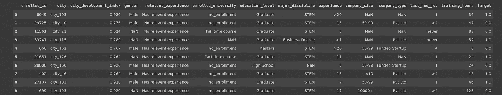
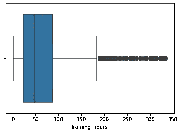
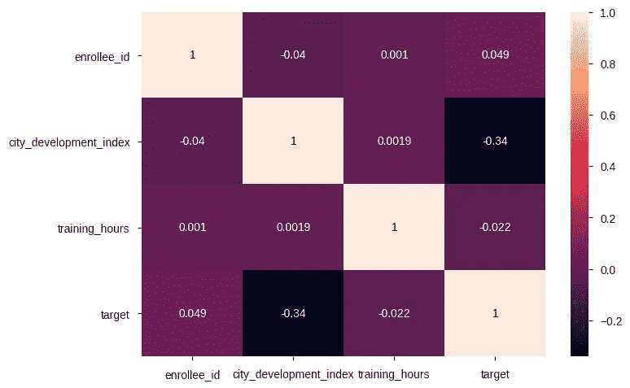
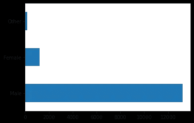
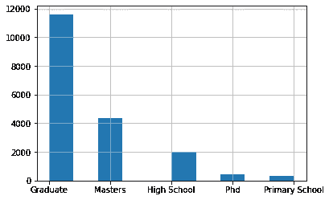
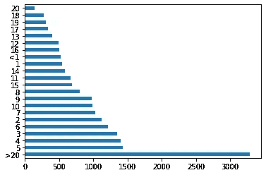
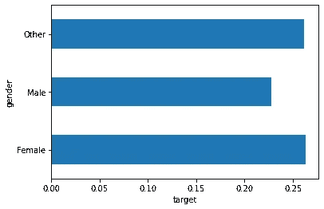

# 用人工神经网络进行分类来解决机器学习问题——第一部分(EDA)

> 原文：<https://medium.com/analytics-vidhya/using-artificial-neural-network-for-classification-to-solve-machine-learning-problem-part-1-eda-2a41ba1f6b90?source=collection_archive---------21----------------------->

最近我开始学习**深度学习，**我学习的第一个算法是人工神经网络，所以我们将使用人工神经网络来解决机器学习问题，最后我们将检查人工神经网络和 ML 算法的准确性，看看哪一个更好。


> 我们将努力解决以下问题:
> 
> 一家活跃在大数据和数据科学领域的公司希望从成功通过公司举办的一些课程的人中招聘数据科学家。许多人报名参加他们的培训。公司想知道这些候选人中谁在培训或寻找新工作后真正想为公司工作，因为**这有助于降低成本和时间以及培训质量或规划课程和候选人分类**。

## 1.数据集:

我将从 Kaggle 获得数据集，我将提供数据集的链接，你可以从那里下载并使用它。你可以从这个链接中读到更多关于这个数据集的信息，不过我会试着用图表向你解释。
[***https://www . ka ggle . com/arashnic/HR-analytics-job-change-of-data-scientists？select = aug _ train . CSV***](https://www.kaggle.com/arashnic/hr-analytics-job-change-of-data-scientists?select=aug_train.csv)

## 2.导入库:

解决数据科学问题的第一步是了解您将使用哪些库，并将它们导入到您的 jupyter 笔记本中。我将使用 google Colab，如果你打算使用本地机器，请确保在导入之前已经安装了所有的库。

```
# Importing libraries
import pandas as pd
import numpy as np
import matplotlib.pyplot as plt
import seaborn as sns
import tensorflow as tf
# Checking the version of tensorflow
tf.__version__
```

运行代码单元后，您将看到您将使用的 TensorFlow 版本，我的版本是 2.4.1

## 3.上传数据集:

从上面的链接，你需要下载数据集，解压缩，然后你需要上传它。

```
train = pd.read_csv('specify_path_of_your_train_dataset')
test = pd.read_csv('specify_path_of_your_test_dataset')
# To check if the dataset is loaded properly we will observe it
train.head(10)
```

您将看到以下输出，



数据集头

## 3.探索性数据分析(EDA):

现在，使用 numpy、pandas、matplotlib 和 seaborn，我们将尝试更好地理解数据集。

首先让我们打印数据集的形状

```
# shape of train and test dataset
print("shape of train dataset is",train.shape)
print("shape of test dataset is",test.shape)
```

这将打印训练和测试数据集的形状。

现在使用熊猫的 info()和 describe()方法，

```
 # using info() method
train.info()
```

在输出中，我们可以看到总共有 19158 行 14 列，其中两列包含浮点值，两列包含整数值，10 列包含目标值。

描述方法给出了更多关于数据集的描述，我们可以得到唯一值、数据集中最频繁的值、平均值、标准值、最小值、最大值等等。

```
# using describe method
train.describe(include='all')
```

使用 isna()检查空值，

```
# Checking for null values
train.isna().sum()
```

sum()方法会给你一些空值，如果我们不使用 sum()方法，那么它将打印真值和假值，这将很难知道每个特性有多少空值。要知道总的空值，您可以再添加一个 sum()方法。
总共有 20，733 个空值，这意味着我们需要做大量的清理工作。

检查重复值，然后检查唯一值，

```
# Checking for duplicated values
print("Print all duplicated values: ", train.duplicated.sum().sum())# Counting unique values
train.nunique()
```

没有任何重复的值。

> **异常值**:异常值是与其他观察值显著不同的数据点。我们用一个例子来理解；考虑到数据集有一个关于 CGPA 的特征，现在如果一些学生的 CGPA 低于 2.0，或者有人超过 9.0，那么这些数据点就是异常值，这意味着 CGPA 与其他点相比更加不符合，这些数据点可能会影响我们的模型，所以我们将删除它们，否则我们将使用标准化或规范化方法来调整它们。

找出我们有多少异常值，

```
# Checking for outliers
q1 = train.quantile(0.20)
q3 = train.quantile(0.80)
iqr = q3 - q1
# printing outlier from the dataset
print(iqr)
```

上面的代码单元会给我们异常值。现在，为了查看异常值的数量，我们将使用下面的代码，

```
# Checking for number of outliers
outliers = (train<(q1-1.5*iqr)) | (train>(q3+1.5*iqr))
print(outliers.sum())
```

除了特征“training_hours”之外，我们数据集中的大多数特征都没有异常值，这是因为我们数据集中的大多数特征都是客观(字符串)类型。

为了便于您理解，我们将可视化“training_hours”特性中的异常值。

```
# Visualizing outliers from training_hours
sns.boxplot(x = train["training_hours"])
```



训练中的异常值 _ 小时

正如你在上面的图像中看到的，小黑框远离我们的主轴，蓝色的矩形。这意味着我们有很多异常值。

**关系分析:**

现在，在 EDA 中，我们将使用**相关矩阵**来查看特征变量之间的关系。

```
# Get correlation matrix values
correlation = train.corr()# Visualizing correlation values using seaborn
sns.heatmap(correlation, annot=True)
```



相关矩阵

在我们的数据集中，target 和 enrollee _ id 之间的最高相关性为 0.049，因此我们将在功能工程阶段删除这些功能。

接下来，你会明白男性申请的申请性别比女性和其他。

```
# Male - Female - Other
train.gender.value_counts().plot(kind='barh')
```



性别分布

显然，我们可以说男性候选人比女性和其他人多。

下图会告诉你，大多数候选人都毕业了。

```
# Checking for educational level
train.educational_level.hist()
```



教育水平

现在，让我们试着了解候选人的经历，

```
# Candidate experience
train.experience.value_counts().plot(kind='barh')
```



经验

显然，我们可以说大多数候选人都有 20 多年的经验。

现在，我们将试着理解性别和目标特征之间的关系，

```
# Checking for chance that which gender is looking for jobpd.concat([train.gender, train.target], axis=1).groupby('gender').target.mean().plot(kind='barh').set_xlabel('target')
```



性别—目标

与男性候选人相比，女性和其他性别的候选人最有可能不找工作。

下一步将是特性工程，我们将在博客的第 2 部分讨论。

> 保持联系！！！！