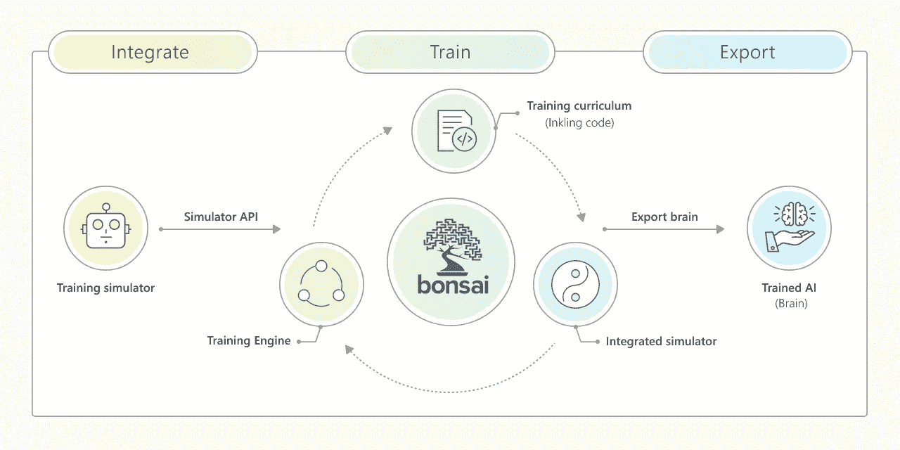
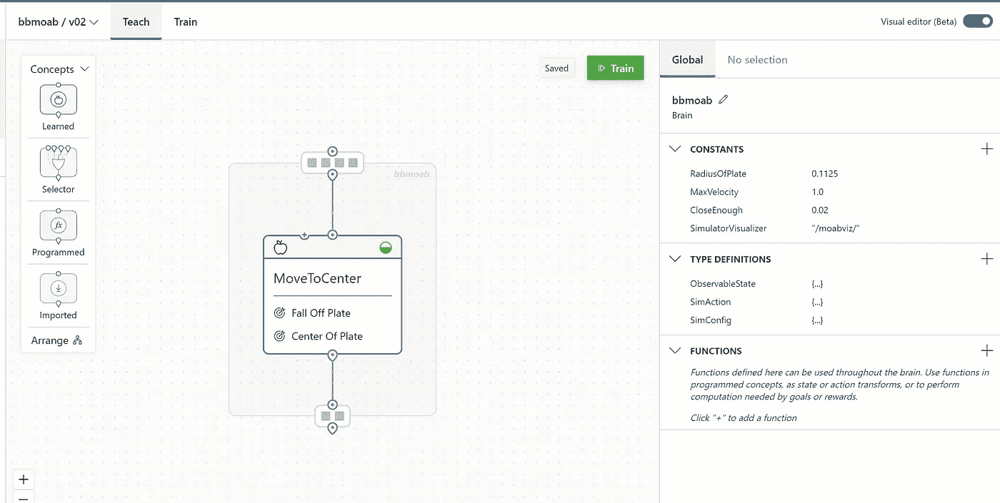
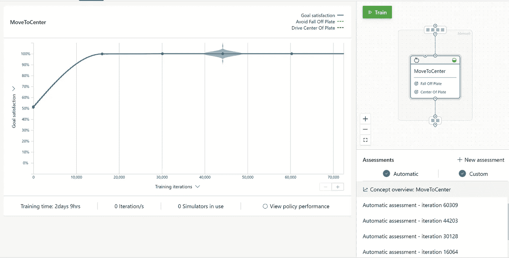
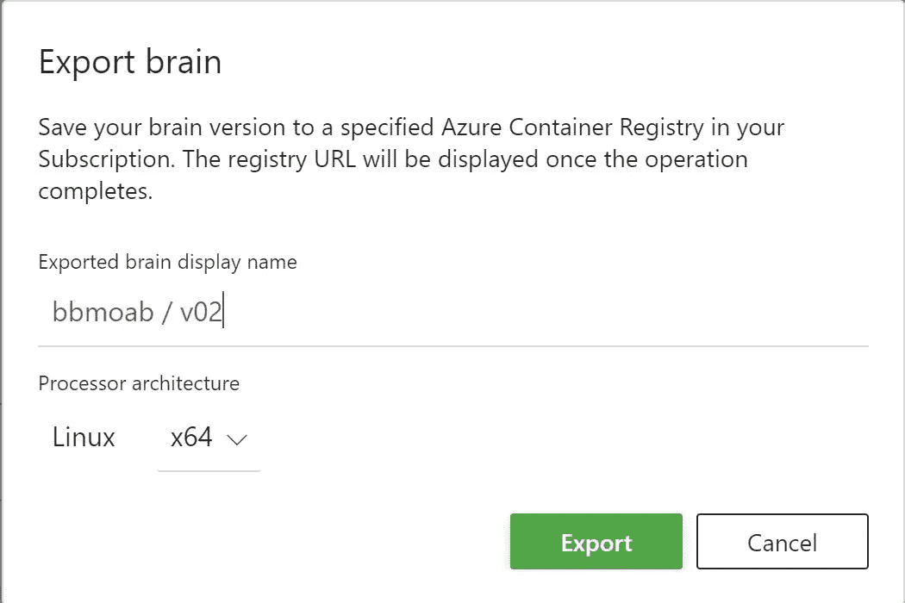

# 使用 bonzai 将自治系统用于自动化

> 原文：<https://medium.com/analytics-vidhya/using-autonomous-systems-for-automation-using-bonzai-53020c32c996?source=collection_archive---------3----------------------->

## 如何使用 bonzai 机器教学平台优化您的自动化

# 体系结构

*   Bonsai 平台允许我们自动控制系统操作
*   通过设计控制系统，使用工程工具来模拟控制系统。
*   基于 bonzai 的模拟训练平台可以让我们学习和建立模型
*   可用详情—[https://docs . Microsoft . com/en-us/learn/autonomous-systems/intro-to-project-bonsai/1-introduction](https://docs.microsoft.com/en-us/learn/autonomous-systems/intro-to-project-bonsai/1-introduction)
*   我相信这是下一代自动化发展到一个新的水平
*   任何大规模生产都可以利用这个系统

*   系统帮助您优化
*   过程变量
*   提高生产效率
*   减少停机时间
*   系统有 3 个组件
*   合并
*   培养
*   出口

# 催速剂

*   链接到加速器
*   https://github.com/microsoft/bonsai-solution-accelerators
*   [https://docs . Microsoft . com/en-us/autonomic-systems/bonsai-accelerators/overview/model/abca-model-overview # simulation-process-flow](https://docs.microsoft.com/en-us/autonomous-systems/bonsai-accelerators/overview/model/abca-model-overview#simulation-process-flow)
*   工厂物流
*   [https://docs . Microsoft . com/en-us/autonomous-systems/bonsai-accelerators/overview/model/abca-model-overview](https://docs.microsoft.com/en-us/autonomous-systems/bonsai-accelerators/overview/model/abca-model-overview)
*   建筑能源管理
*   [https://docs . Microsoft . com/en-us/autonomous-systems/bonsai-accelerators/overview/accelerator/building-energy-management](https://docs.microsoft.com/en-us/autonomous-systems/bonsai-accelerators/overview/accelerator/building-energy-management)
*   化学加工
*   [https://docs . Microsoft . com/en-us/autonomous-systems/bonsai-accelerators/什么是 bonsai-accelerators？tabs =化学处理](https://docs.microsoft.com/en-us/autonomous-systems/bonsai-accelerators/what-are-bonsai-accelerators?tabs=chemical-processing)

# 样品

*   我在 bonsai 平台中创建了一个示例
*   使用现有的 MOAB 模拟器
*   想训练一个 RL 模型
*   这是模型

*   保存并运行训练

*   最后导出模型

原文—[samples 2021/automation opt . MD at main balakreshnan/samples 2021(github.com)](https://github.com/balakreshnan/Samples2021/blob/main/bonsai/AutomationOpt.md)