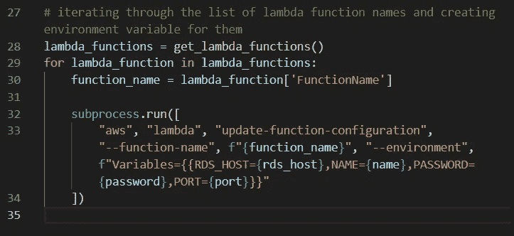

# 从本地使用 AWS Lambda 环境变量。环境文件(Python 3.7)

> 原文：<https://medium.com/analytics-vidhya/using-aws-lambda-environment-variables-from-local-env-file-python-3-7-f3edacdea015?source=collection_archive---------3----------------------->


由 [Unsplash](https://unsplash.com/s/photos/lock?utm_source=unsplash&utm_medium=referral&utm_content=creditCopyText) 上的 [iMattSmart](https://unsplash.com/@imattsmart?utm_source=unsplash&utm_medium=referral&utm_content=creditCopyText) 拍摄的照片

说到打造 MVP，现在的创业公司更喜欢[无服务器](https://aws.amazon.com/lambda/serverless-architectures-learn-more/)。优点是:

*   没有要管理的服务器。你只需要写函数。
*   持续扩展和任何规模下的一致性能。
*   成本优化。您只需为消耗的计算时间付费。

对于任何架构来说，安全的编码实践总是很重要的。在今天的博客中，我将讨论这样一种实践——使用**环境变量**来存储*安全密钥*和*数据库凭证*,而不是将它们硬编码在您的代码中。

这是我的第一个科技博客，所以请原谅我的任何技术或语法错误。评论将受到高度赞赏。所以事不宜迟，让我们深入 AWS 和它的美妙之处吧！

从 2016 年 11 月 18 日开始，为 AWS Lambda 添加了[对环境变量的支持。根据 AWS 文件，](https://aws.amazon.com/about-aws/whats-new/2016/11/aws-lambda-supports-environment-variables/)

> 这允许您在不修改或重新部署代码的情况下实现配置更改，并且应该使您的无服务器应用程序开发更加高效。每个环境变量都是一个键/值对。使用 [AWS 密钥管理服务(KMS)](https://aws.amazon.com/kms/) 对密钥和值进行加密，并根据需要进行解密。对于每个函数，环境变量的数量没有限制，但总大小不能超过 4 kb。”

有一种方法可以从您的 *AWS 控制台*使用 *GUI 工具*向您的 lambda 函数添加环境变量，但是我将向您展示如何使用 Lambda API 以编程方式完成此操作。

我们有一个这样的 lambda 函数，其中我们的数据库凭证是硬编码的。这是不安全的，因为如果有人访问了您的源代码，那么您的安全性就会受到威胁。


相反，我们可以创建一个. env 文件来本地存储 DB 凭证或任何其他安全密钥**，然后在提交更改并将其推送到我们的远程存储库之前忽略该文件。**

**`.env`文件以**键-值**对的形式包含凭证，值需要是字符串。*注意:稍后我们需要将端口转换为 int，否则在连接到 DB 时将无法访问。***

****

**我们现在可以从我们的 *lambdaFunction.py* 文件中删除硬编码的安全配置，因为我们现在有一个. env 文件来处理它们。为了将本地环境变量导入我们的函数代码，我们需要导入`[os](https://docs.python.org/3/library/os.html)`模块和`[python-dotenv](https://pypi.org/project/python-dotenv/)`模块。`load_dotenv()`方法将从本地加载环境变量键。env 文件和`os.environ.get(‘key’)`方法将返回环境变量的值或者不返回(如果键不存在)。一旦我们得到了这些值，我们就可以像这样在 lambda 函数中使用它们。**

****

**一旦这些步骤完成，我们将能够从本地机器连接到我们的远程 MySQL 服务器。我们仍然没有配置我们的代码从 AWS Lambda 运行，这将在下面的步骤中完成。[这里的](https://docs.aws.amazon.com/lambda/latest/dg/python-package.html)是把你的函数和依赖关系上传到 AWS lambda 的指令。**

**假设您的函数已经在运行，我们现在需要配置一些东西。正如我前面提到的，环境变量是本地的，Lambda 函数不能远程访问它。我们需要为每个 lambda 函数分别创建 AWS Lambda 环境变量(考虑到我们有不止一个 Lambda 函数)。幸运的是，我们可以通过使用 Python 的`[**subprocess**](https://docs.python.org/3/library/subprocess.html)` 模块和 **Lambda API 的脚本来自动完成这项任务。****

****

**在进行必要的导入并加载本地环境变量之后，我们需要从 AWS 获取 lambda 函数的列表。这可以通过两种方式实现:**

**通过在 aws-cli 中编写以下命令——**

```
$ aws lambda list-functions
```

**或者，通过使用`[Popen.communicate()](https://docs.python.org/3/library/subprocess.html#subprocess.Popen.communicate)`方法创建`[PIPE](https://docs.python.org/3/library/subprocess.html#subprocess.PIPE)` 和读取输出，使用`[subprocess.Popen()](https://docs.python.org/3/library/subprocess.html#popen-constructor)` 构造函数在新进程中执行子程序。`communicate()`返回一个元组`(stdout_data, stderr_data)`。如果流是以文本模式打开的，则数据将是字符串；否则，字节。我们只对元组的`[0]`索引感兴趣，我们将使用`json.loads()`将它映射到一个字典中。**

**我们将采用第二种方法，因为我们需要 lambda 函数的名称作为字符串。**

****

**`function_dict[‘Functions’]`将返回一个包含函数名和每个 lambda 函数的许多其他参数的 dict 列表。我们将遍历该列表，并使用另一个 aws-cli 命令更新每个 lambda 函数的环境变量:**

**`$ aws lambda update-function-configuration — function-name my-function --environment "Variables={BUCKET=my-bucket,KEY=file.txt”`**

****

**`subprocess.run(args)`方法运行由*参数*描述的命令。等待命令完成，然后返回一个`[CompletedProcess](https://docs.python.org/3/library/subprocess.html#subprocess.CompletedProcess)`实例。`subprocess.Popen()`和`subprocess.run()` 都接受字符串数组形式的参数。我们只需要`[FunctionName]`键的值，因为我们只对函数名感兴趣。*现在，我们的 lambda 函数中的数据库凭证由环境变量保护。***

## **总结一下:**

1.  **我们创建了一个本地。env 文件将我们的安全凭证存储在环境变量中，并使用 python-dotenv 模块在我们的 lambda 函数中访问这些凭证。**
2.  **我们开发了一个脚本来获取我们所有的 lambda 函数名，并为它们创建环境变量。**

**感谢您通读。这是我的第一个博客，我将非常感谢你的评论和建议。如果你觉得它有用，请给我一个掌声，并与你的开发伙伴分享。**不要硬编码，硬编码！****

****苏巴亚恩·戈什哈****

**[LinkedIn](https://www.linkedin.com/in/realsubhayan/)|[Twitter](https://twitter.com/realsubhayan)|[insta gram](https://www.instagram.com/realsubhayan/?hl=en)**