# 使用深度学习进行乳腺摄影分类

> 原文：<https://medium.com/analytics-vidhya/using-convolutional-neural-networks-for-mammogram-classification-6e67ed4e0cad?source=collection_archive---------4----------------------->

首次亮相中级和深度学习:)💻

我对图像分类很感兴趣，这是一次非常丰富的经历，特别是这个主题的重要性。这个小项目是我在 Awari 数据科学学院进行毕业设计的灵感来源。

**获取数据**

Mias 乳房造影数据集可从 Kaggle 网站下载，网址为:

 [## MIAS 乳房 x 线摄影

### 寻找乳腺癌

www.kaggle.com](https://www.kaggle.com/kmader/mias-mammography) 

**MIAS 数据集**

该数据集最初有 332 张大小为 1024x1024 的灰度乳房 x 光照片。有 6 类异常，按严重程度分为良性(B)或恶性(M)。正常扫描，即不存在异常的扫描，出于分类目的被任意地赋予值(A)。

你可以在这里找到这个项目[的代码和需要的文件。](https://github.com/cpoles/data_science/tree/main/projects/deep_learning/mias_mammography)

**项目文件夹结构**

├──全 mias
├──笔记本
└── src
└──模块

***all-mias****:原始扫描* ***笔记本*** *: jupyter 笔记本* ***src/modules****:自定义库和类*

**库**

```
# system related
import os
import syssys.path.append('../src/')# import custom modules
import helpers as hp
import mammoscan as ms# path manipulationfrom pathlib import Path# regex
import re# plotting
import matplotlib.pyplot as plt
import matplotlib.image as mpimg
from matplotlib.patches import Circle# data manipulation / preparation
import numpy as np
import pandas as pd
from sklearn.model_selection import train_test_split
from tensorflow.keras.preprocessing.image import ImageDataGenerator# image manipulation
from PIL import Image
from IPython.display import Image# metrics
from sklearn.metrics import confusion_matrix, classification_report# keras
from tensorflow.keras.models import Sequentialfrom tensorflow.keras.layers import Conv2D, Dense, Flatten, MaxPool2D, Dropoutfrom tensorflow.keras.utils import plot_modelfrom tensorflow.keras.callbacks import EarlyStopping, ModelCheckpointfrom tensorflow.keras.optimizers import Adam
```

**为扫描信息创建数据帧**

***create _ mias _ dataset(path:)***函数为实验创建必要的数据帧。它将包含扫描数据的文本文件(' scan_file_data.txt ')的路径作为参数。

```
mammo = hp.create_mias_dataset('../scan_file_data.txt')
```

**数据框列描述:**

```
1st column:
MIAS database reference number.2nd column:
Character of background tissue:
F Fatty
G Fatty-glandular
D Dense-glandular3rd column:
Class of abnormality present:
CALC Calcification
CIRC Well-defined/circumscribed masses
SPIC Spiculated masses
MISC Other, ill-defined masses
ARCH Architectural distortion
ASYM Asymmetry
NORM Normal4th column:
Severity of abnormality;
B Benign
M Malignant5th, 6th columns:
x,y image-coordinates of centre of abnormality.7th column:
Approximate radius (in pixels) of a circle enclosing the abnormality.
```

**玛莫斯坎级**

Mammoscan 类封装了扫描图像及其相应的数据。该类提供了一个 API 来访问它的属性和方法，以便为模型绘制和生成缩小的裁剪图像。可以通过导入'***/SCR/modules/Mammoscan . py '***文件来使用 Mammoscan 类。

**数据准备**

一些扫描包含不可用的数据，因此最初必须移除，因为它们缺少异常的位置。在 ***helpers.py*** 模块中，有一个用于删除此类扫描的功能:

```
def clean_ds_files(df: pd.DataFrame) -> pd.DataFrame:
 ‘’’Removes records with invalid data
 and cast x and y to float’’’
 new_df = df.copy()
 # search for invalid x values for removal
 indices = new_df.x[lambda x: x == ‘*NOTE’].index

 for idx in indices:
 n_idx = new_df.index.get_loc(idx)
 # drop from dataset
 new_df.drop(new_df.index[n_idx], inplace=True)
 # delete from directory
 delete_image(idx)# make x and y float values
 new_df.x = new_df.x.astype(float)
 new_df.y = new_df.y.astype(float)

 return new_df
```

根据 ***Gregory 等人*** 的说法，用小尺寸图像拟合 CNN 将提高计算性能和每个异常的召回率。此外，创建原始图像的子集也将改善分类结果。这个过程被称为数据扩充，旨在利用 CNN 在数据集最初提供的扫描样本如此之少的情况下的性能。

策略是在扫描中创建异常的旋转和镜像缩小版本。这些乳房 x 光片包含(x，y)坐标和异常的半径，指示潜在肿瘤(良性(B)或恶性(M ))可能在哪里。至于正常扫描，决定随机选择图像中心周围的一个点，并按照 Gregory 等人的建议进行 48x48 的裁剪。

**图像变换**

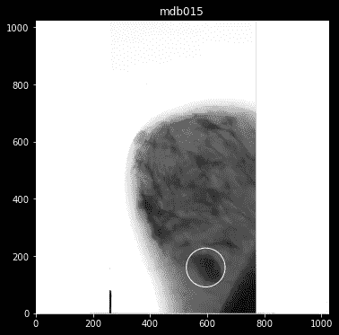

原始扫描

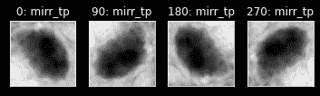

裁剪旋转版本示例(上下镜像)

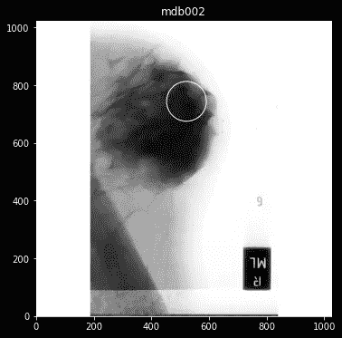

原始扫描

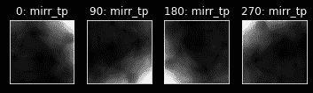

裁剪旋转版本示例(上下镜像)

helpers 模块有一个名为***generate _ sub samples(path:，df:)*** 的函数，它执行所有必要的图像转换，并将它们保存到 *subsamples* 文件夹中。它还输出包含扫描数据的数据框，包括图像的矩阵版本以及图像在子样本文件夹中的位置。

```
mias = hp.generate_subsamples('../all-mias/', mias)
```

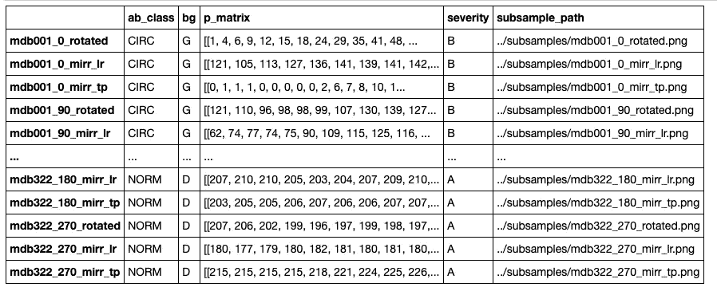

在数据扩充过程之后，我们有 3828 个 48×48 的图像。这表示图像数量增加了 1100%以上。

**异常数据分布**

大约 65%的数据集是正常扫描。至于异常类，数据更平衡，但不理想。理想情况下，在拟合模型之前，我们需要每个类别相同数量的良性(B)和恶性(M)样本。每当用任何异常类别的不平衡扫描样本进行训练时，该模型表现不佳。

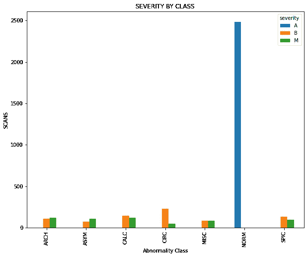

使用了两种数据集平衡方法:

*   **完全平衡**:所有类别按照严重程度平均分布，并且基于最不频繁的类别具有相同的样本大小。
*   **类别平衡**:每个类别按照严重性和原始样本量平均分配

您可以使用辅助函数***balance _ df _ by _ severity(df:，ab_class:)*** 进行类平衡，或者使用***full _ balance _ df _ by _ severity(df:，ab_class:)*** 进行完全同质数据集。

**钙化——等级平衡示例**

```
calcifications_unbalanced = mias[mias.ab_class == 'CALC']calcifications_unbalanced.severity.value_counts().plot(kind='bar')
```

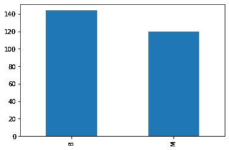

平衡前的钙化

```
calcifications_balanced = hp.balance_by_severity(mias, 'CALC')calcifications_balanced.severity.value_counts().plot(kind='bar')
```

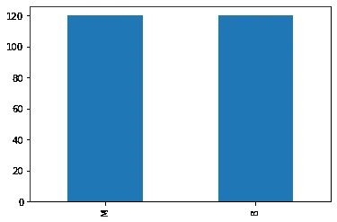

平衡后的钙化

**Mias —类平衡示例**

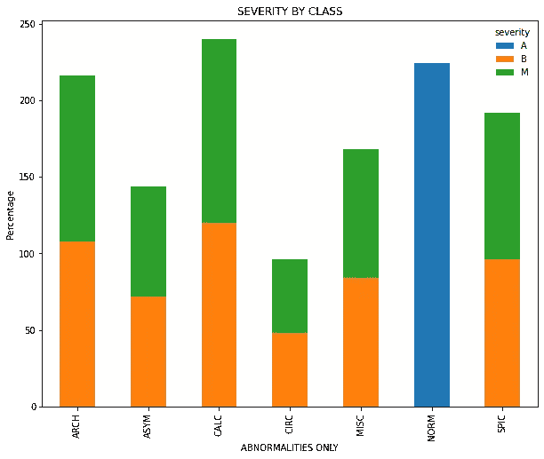

**Mias —完全平衡示例**

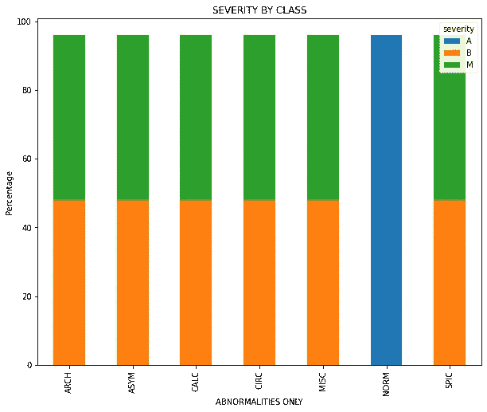

**卷积神经网络**

该模型是使用谷歌的 TensorFlow 建立的，并使用 RELU 作为卷积层的激活函数。决定输出的激活功能是 softmax。还在每个卷积后添加了最大汇集，并且下降率为 0.25。

输入层是具有 32 个内核滤波器大小(3x3)的卷积层。然后，添加了一个额外的卷积层，具有 64 个内核过滤器大小(3×3)和一个最大池大小(2×2)。

使用 softmax 激活函数的全连接层(密集层)返回一个元组，该元组具有用于推断异常类别的概率。元组的第一个元素说明良性(B)样本，第二个元素说明恶性(M)样本。

```
cnn_calc = Sequential()
# first layer
cnn_calc.add(Conv2D(32, kernel_size=(3, 3),activation='relu',input_shape=(48, 48, 1)))
cnn_calc.add(Conv2D(64, kernel_size=(3,3),activation='relu'))
cnn_calc.add(MaxPool2D(pool_size=(2, 2)))cnn_calc.add(Conv2D(64, kernel_size=(3,3),activation='relu'))
cnn_calc.add(MaxPool2D(pool_size=(2, 2)))
cnn_calc.add(Dropout(0.25))
# Add dense layer to reduce the number of features
cnn_calc.add(Dense(64, activation='relu'))
cnn_calc.add(Dropout(0.25))
# flattening results
cnn_calc.add(Flatten())
# Dense layer to produce final output
cnn_calc.add(Dense(2, activation='softmax'))
# print summary
mass_calc.summary()
```

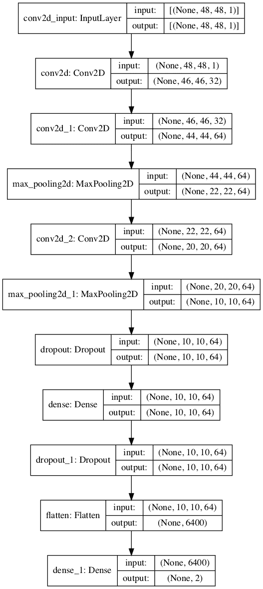

```
Model: "sequential"
_________________________________________________________________
Layer (type)                 Output Shape              Param #   
=================================================================
conv2d (Conv2D)              (None, 46, 46, 32)        320       
_________________________________________________________________
conv2d_1 (Conv2D)            (None, 44, 44, 64)        18496     
_________________________________________________________________
max_pooling2d (MaxPooling2D) (None, 22, 22, 64)        0         
_________________________________________________________________
conv2d_2 (Conv2D)            (None, 20, 20, 64)        36928     
_________________________________________________________________
max_pooling2d_1 (MaxPooling2 (None, 10, 10, 64)        0         
_________________________________________________________________
dropout (Dropout)            (None, 10, 10, 64)        0         
_________________________________________________________________
dense (Dense)                (None, 10, 10, 64)        4160      
_________________________________________________________________
dropout_1 (Dropout)          (None, 10, 10, 64)        0         
_________________________________________________________________
flatten (Flatten)            (None, 6400)              0         
_________________________________________________________________
dense_1 (Dense)              (None, 2)                 12802     
=================================================================
Total params: 72,706
Trainable params: 72,706
Non-trainable params: 0
_________________________________________________________________
```

**训练模型**

基于测试，当以 0.001 的学习率训练 10，000 个时期时，所有情况下都获得了最佳结果。目的是提高所有班级的召回率。这意味着我们希望改善与假阴性和假阳性案例相关的结果，并增加对真阴性和真阳性案例的自信。

换句话说，我们需要优化模型预测良性(B)而实际上是恶性(M)异常的情况，反之亦然。从错误诊断的角度来看，患者可能被给予不必要的治疗(假阳性)或没有及时接受治疗(假阴性)。

```
# compiling the model
adam = Adam(0.001)
cnn_calc.compile(optimizer=adam,
            loss='categorical_crossentropy',
            metrics=['accuracy'])# training and evaluating the model
early_stopping = EarlyStopping(patience=3000, restore_best_weights=True)model_check_point = ModelCheckpoint(filepath= './', 
                                    monitor='val_loss', verbose=1, 
                                    save_best_only=True,
                                    save_weights_only=False, 
                                    mode='auto', save_freq='epoch')# fit the model
hist = cnn_calc.fit(train_data, 
                    validation_data=test_data, 
                    epochs=10000,
                    callbacks=[early_stopping, model_check_point])
```

**进行预测并评估结果**

根据结果，当模型达到其最低验证损失或最高验证准确性时，情况会有所不同。一些 CNN 需要至少 1000 个步骤来产生一致的结果。尽管如此，当仅用钙化训练时，可以用较少的时期获得相对满意的结果。

在下面的测试中，该模型对于恶性钙化病例实现了 97%的召回率和 100%的精确度。这是最好的结果，它是在 Google 的 Collab 上使用 GPU 运行时运行的。

```
# get predictions
y_pred = cnn_calc.predict(test_data)
predicted = [np.argmax(w) for w in y_pred] # highest probabilities
expected = test_data.labelsprint(classification_report(expected, predicted)) precision    recall  f1-score   support

           0       0.97      1.00      0.98        31
           1       1.00      0.97      0.98        29

    accuracy                           0.98        60
   macro avg       0.98      0.98      0.98        60
weighted avg       0.98      0.98      0.98        60
```

据观察，硬件不仅影响运行速度，而且影响整个模型的性能。该模型在 MacBook Pro i7 16 GB 内存、Mac mini i5 8GB 内存和谷歌的 Collab 默认运行时上进行训练。当运行一个超过 1000 步的模型时，我会建议在谷歌的 Collab GPU 运行时上运行笔记本。

**最终结果图——恶性病例**

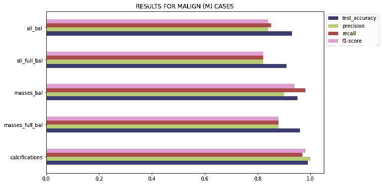

尚不清楚为什么该模型在预测钙化时表现更一致。这是从初始测试中观察到的，既没有应用数据集平衡，也没有应用数据扩充。钙化点必须有一个清晰的可识别的模式，这样只有 275 个时期的模型将达到几乎 90%的准确度、精确度和召回率。

至于质量，使用类平衡方法的模型也表现得更好。对肿块的检测几乎和对钙化的检测一样好。如果我们考虑质量包括三种不同类型的异常，模型的整体性能相当好。与钙化相反，通过训练模型至少 1000 步，可以获得显著的结果。

用所有类别训练该模型，结果显示对于类别平衡和完全平衡方法，在恶性病例上的模型性能稍好。

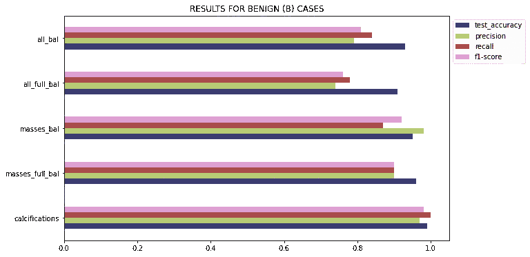

应用数据扩充技术后的结果强化了最初的策略，即使用数据扩充技术作为增强模型学习和预测能力的手段。实验还表明，当使用类平衡方法时，该模型比完全平衡方法产生稍好的结果。此外，从严重性的角度来看，该模型在恶性病例上表现稍好。

感谢阅读！

[1] Gregory 等人，[使用卷积神经网络进行乳房 x 线照片分类](https://ehnree.github.io/documents/papers/mammogram_conv_net.pdf)

[2] Deitel，数据科学和计算机科学的 Python 介绍