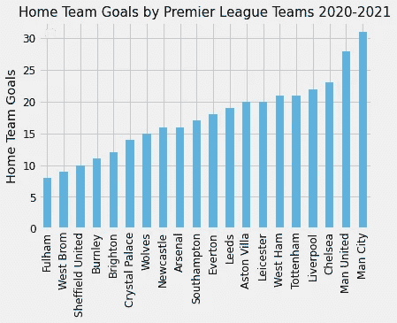

# 用数据科学分析英超

> 原文：<https://medium.com/analytics-vidhya/using-data-science-to-analyze-the-premier-league-b468c5b836ba?source=collection_archive---------16----------------------->


想要一个更技术性的方法来赢得你的体育赌注？这里有一些创建数据可视化的方法来帮助你实现这一点。我们将使用来自 http://www.football-data.co.uk/data.php 的数据集。足球-数据有各种不同的足球联赛，你可以使用。对于这篇文章，我们将使用 2020-21 赛季的初级联赛数据集。这是一个免费的数据集，可以通过 CSV 文件下载。它拥有本赛季英超联赛的最新数据。本文的数据可视化是截至 2021 年 3 月 7 日的最新数据。我们将使用 Pandas 和 Matplotlib 在 Python 中编码。

首先，直接从网站上读入数据。我们可以通过编写以下代码来实现这一点:

```
*import pandas as pd
import matplotlib.pyplot as plt
from matplotlib import cm*df =pd.read_csv('http://www.footballdata.co.uk/mmz4281/2021/E0.csv')
print(df)
```

接下来，我们想看看主场和客场的进球数。来自 footballdata.co.uk 的数据并没有汇总，而是按游戏排序。为了找出谁是主场得分最高的球队，我们可以使用下面的代码对主场球队进行分组，并对他们在主场的进球数进行求和。

```
**# slicing the df so we can find the number of goals from a Home Team
# FTHG = Full Time Home Goals**hometeam = df.loc[:,['HomeTeam','FTHG']]hometeam = hometeam.groupby('HomeTeam',as_index = False)['FTHG'].sum().sort_values(by = 'FTHG', ascending=True)
```

现在数据已经可以绘制了，我们可以使用 Matplotlib。

```
**# Plotting the DF** hometeam.plot(kind= 'bar', x = 'HomeTeam', y='FTHG',alpha =0.6)
plt.style.use('fivethirtyeight')
plt.ylabel('Home Team Goals')
plt.xticks(rotation=90)
plt.legend('')
plt.xlabel('')
plt.title('Home Team Goals by Premier League Teams 2020-2021',fontsize=15)
plt.legend('')
plt.rcParams.update({'font.size':10})
plt.show()
```



这里没有惊喜。曼城是本赛季球门前最具杀伤力的主队。接下来可以看一支客场球队的进球数。我们可以应用类似的方法。

```
**# Slicing the data**
awayteam = df.loc[:,['AwayTeam','FTAG']]**# Finding the number of away team goals**
awayteam = awayteam.groupby('AwayTeam',as_index = False)['FTAG'].sum().sort_values(by = 'FTAG', ascending=True)
```

现在，客队的数据已经可以绘制出来了。

```
**# plotting the DF**awayteam.plot(kind= 'bar', x = 'AwayTeam', y='FTAG',alpha = 0.6)
plt.style.use('fivethirtyeight')
plt.ylabel('Away Team Goals')
plt.xticks(rotation=90)
plt.title('Away Team Goals by Premier League Teams 2020-2021',fontsize=15)
plt.legend('')
plt.xlabel('')
plt.rcParams.update({'font.size':10})
plt.show()
```


有趣的是，就进球数而言，莱斯特城是最好的客场球队。接下来，我们来看看最有效的团队。我们会用两个指标来判断球队的效力:进球数和失球数。最有效率的球队会有最多的进球和最少的失球。为此，我们需要两个数据框架——进球数和失球数。然后我们可以使用。join()将两个数据帧连接在一起。我们先来算一下球队的总进球数。

```
**# Cleaning the data to find the number of goals scored
# FTHG = Full Time Home Goals
# FTAG = Full Time Away Goals****# Finding out number of goals scored by home and away and sorting** numberofgoalscoredaway= awayteam.sort_values(by = 'AwayTeam', ascending=True)
numberofgoalscoredhome = hometeam.sort_values(by = 'HomeTeam', ascending=True)**# Merging the two dataframes together**  
numberofgoalscored = numberofgoalscoredhome.join(numberofgoalscoredaway)**# Finding out the total number of goals**
numberofgoalscored['Total Goals Scored'] = numberofgoalscored.FTHG + numberofgoalscored.FTAG**# Cleaning the data** numberofgoalscored = numberofgoalscored.drop(columns= ['HomeTeam'])
numberofgoalscored['Team']  = numberofgoalscored['AwayTeam']
numberofgoalscored = numberofgoalscored.drop(columns = 'AwayTeam')**# Reordering columns**
numberofgoalscored = numberofgoalscored[['Team','FTAG','FTHG','Total Goals Scored']]
```

用类似的方法，我们来计算一下球队的总失球数。

```
**# Starting another dataframe to find the number of goals conceded** 
concededmostgoalsconceded = df.loc[:,['HomeTeam', 'AwayTeam', 'FTHG', 'FTAG']]**# Finding the number of goals conceded by summing the total # of goals conceded at home and away** hometeamconceded = mostgoalsconceded.groupby('HomeTeam',as_index = False)['FTAG'].sum().sort_values(by = 'FTAG', ascending=True)
awayteamconceded = mostgoalsconceded.groupby('AwayTeam',as_index = False)['FTHG'].sum().sort_values(by = 'FTHG', ascending=True)**# Merging the two dataframes together** totalgoalsconceded = awayteamconceded.join(hometeamconceded)**#finding out the total number of goals conceded**
totalgoalsconceded['Total Goals Conceded'] = totalgoalsconceded.FTHG + totalgoalsconceded.FTAG**# Cleaning the data**
totalgoalsconceded['Team'] = totalgoalsconceded['AwayTeam']
totalgoalsconceded = totalgoalsconceded.drop(columns= ['HomeTeam','AwayTeam'])
totalgoalsconceded = totalgoalsconceded[['Team','FTHG','FTAG','Total Goals Conceded']]
```

最后，合并失球总数和进球数数据框。

```
**# Merging the two dataframes**
mosteffectiveteam = totalgoalsconceded.join(numberofgoalscored['Total Goals Scored'])**# Cleaning the data** 
mosteffectiveteam = mosteffectiveteam.reset_index()
mosteffectiveteam = mosteffectiveteam.drop(columns='index')
mosteffectiveteam = mosteffectiveteam.drop(columns= ['FTAG','FTHG'])**# Creating an acronym for Tottenham's name so it's easier to plot**
mosteffectiveteam.iloc[7,0] = 'T.H.'**# Creating a ratio of goals/conceded goals to find out how effective the team is**
mosteffectiveteam['Goals/Conceded Goals'] = mosteffectiveteam['Total Goals Scored']/ mosteffectiveteam['Total Goals Conceded']**# Sorting values to get data ready to plot on Matplotlib's scatter plot**
mosteffectiveteam = mosteffectiveteam.sort_values(by='Goals/Conceded Goals',ascending=True)
```

现在，让我们来看看谁是最有效的团队。

```
**# Creating a color map for the scatterplot** colors = cm.Blues(np.linspace(0,1,len(mosteffectiveteam)))**# Plotting the most effective team** ax = mosteffectiveteam.plot(x = 'Total Goals Conceded', y = 'Total Goals Scored', kind = 'scatter', s = 150, figsize = (15,10),color = colors)**# Plotting the labels for the scatter plot** mosteffectiveteam[['Total Goals Conceded','Total Goals Scored','Team']].apply(lambda x: ax.text(*x),axis=1)**# Making the labels bigger** plt.rcParams.update({'font.size': 14})
plt.tick_params(axis='x', labelsize=14)
plt.tick_params(axis='y', labelsize=14)**# Inverting x axis so the least number of goals is on the right side instead of left** plt.gca().invert_xaxis()**# Labeling the data** plt.xlabel('Total Goals Conceded', fontsize=18)
plt.ylabel('Total Goals Scored', fontsize=16)
cmap = cm.get_cmap('Spectral')
plt.title('Who is the most effective team in the Premier League?', fontsize= 20)
plt.show()
```


蓝色越深，团队越有效。曼城是迄今为止最有效率的球队。

正如你所看到的，有许多方法来操作英超联赛数据集。这是另一个例子，我使用了列名 FTR(全职结果)和 HTR(半职结果)。我们现在可以使用这些列名来查看结果(赢、输、平)在半场结束后是否发生了变化。例如，如果结果在中场休息时打平，那么在全职后结果是否保持打平？


英超联赛的大多数结果在半场结束后并没有改变。如果你想看这段代码，请访问我在文章底部的 Github 链接。

该数据集还包括 Bet365 等欧洲热门体育博彩网站的数据。我们可以看看 365 猜多少次赢的队伍。请记住，这只考虑了主队赔率和客队赔率。出于解释的目的，我决定忽略平局的可能性。


Bet365 在大约 2/3 的时间里对结果是正确的。如果你想看代码，请访问我在文章底部的 github 链接。

在 [Linkedin](http://www.linkedin.com/in/andrewlmoore2020) 上关注我

如果你想深入了解代码，这里有 [Github 库](https://github.com/drewm8080/Analyzing-the-Premier-League.git)