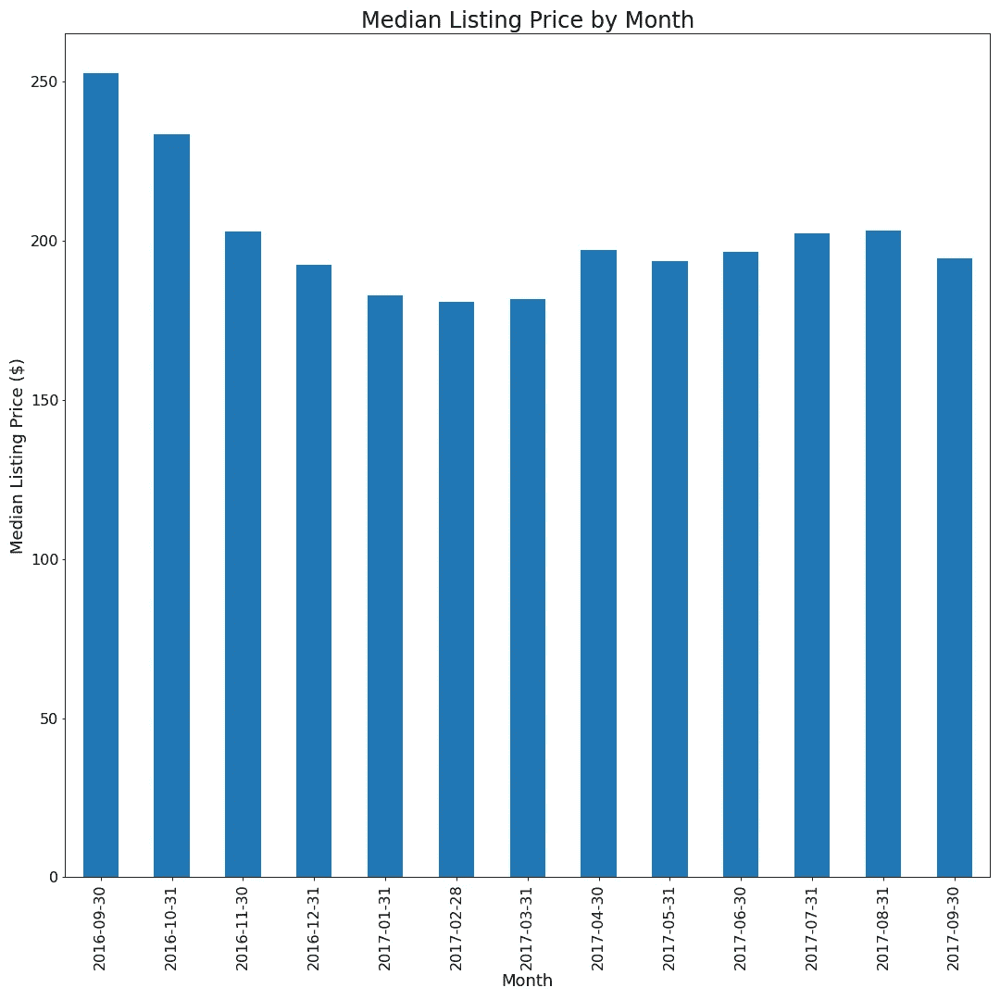
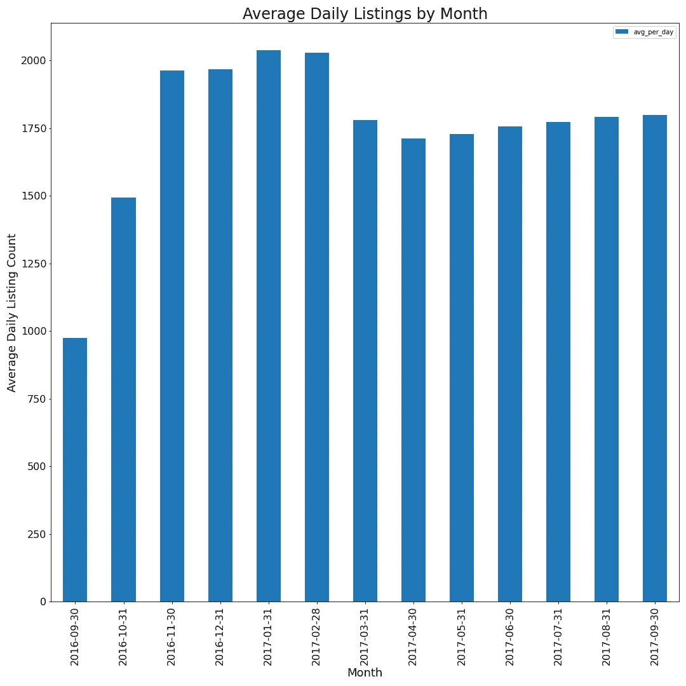
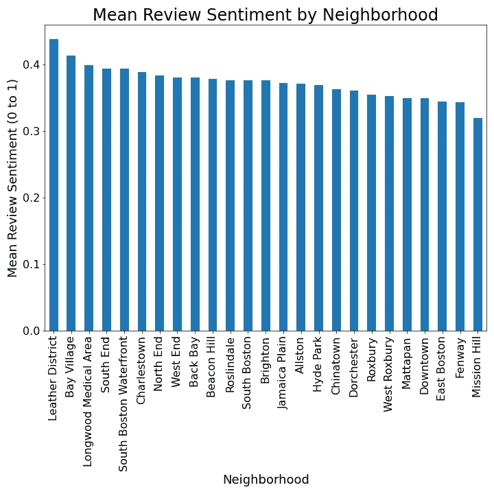
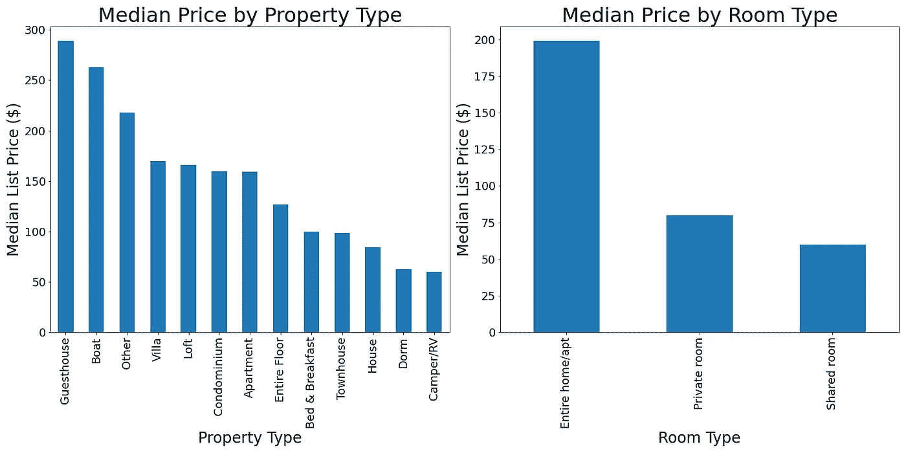
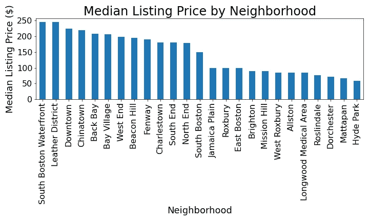

# 使用数据规划您的下一次波士顿之旅！

> 原文：<https://medium.com/analytics-vidhya/using-data-to-plan-your-next-boston-visit-90cc22725c8c?source=collection_archive---------23----------------------->

这篇博文是 Udacity 数据科学家纳米学位项目的一部分。

来源:https://unsplash.com/photos/Ic8B165N1og?utm_source=unsplash[UTM _ medium = referral&UTM _ content = creditShareLink](https://unsplash.com/photos/Ic8B165N1og?utm_source=unsplash&utm_medium=referral&utm_content=creditShareLink)

你是否曾经想去一个新的城市，但是对它的规划感到不知所措？你如何到达那里，你会做什么，最重要的是--你会住在哪里？使用从 Kaggle 收集的波士顿房源的 Airbnb 数据，这篇文章旨在利用数据来帮助规划你的下一次城市冒险！

**分析的主要目标:**

*   季节性如何影响波士顿的价格和库存？
*   点评意见与酒店的特点有什么关系？
*   哪些功能最有助于预测物品的价格？

**问题 1:“季节性如何影响波士顿的价格和库存？”**

除了天气和活动之外，决定何时去一个地方的一个关键因素是住宿的总价格以及库存的可用性。为了解决这个问题，我们可以利用 calendar.csv 中的数据，跟踪每月的列表中值价格以及可用列表的数量。

下图显示了每月的中间价格，并显示了在一年的前三个月可以找到最好的价格。尽管年复一年，由于房地产的长期升值，中间价可能会上升，但对价格的季节性影响可能会持续下去，1 月至 3 月应该会提供最好的价格。

用于最小化异常值影响的中值价格

除了好的价格，有一个合适的住宿清单可供选择也是决定何时何地去旅游的因素。为了帮助评估全年的可用库存数量，下面的图表显示了波士顿每月可用的每日平均列表。图表显示，在 11 月至 2 月期间，每天大约有 2，000 个单位可供预订。这表明游客在 11 月至 2 月间有最多的住宿选择。

*使用每日列表的平均数而不是每月列表的总数来控制每月的天数。*

从价格和库存的角度来看，一月和二月是游客的最佳选择。在这几个月中，用户有最多的库存可供选择，并且有最好的整体定价环境。也就是说，这几个月通常也是最冷的，平均温度约为 30 华氏度…

**问题 2:“位置会影响评论情绪吗？”**

在决定去哪里吃饭，看什么电影，住在哪里时，评论起着重要的作用。大量正面或负面的评论可能表明单位、主机或一般位置有问题。利用评论数据和 python 库，我们评估了每个列表的平均情绪，并分析了数据，以了解邻居如何影响评论情绪。

在列表数据集中有 25 个不同的社区，从图表中，我们可以看到，皮革山的平均评论情绪差异很大，总体评论最高，而使命山的平均得分最低。这表明，在同等条件下，与芬威酒店和米申山酒店相比，在海湾村皮革区预订房源将提供更好的整体体验。对一些街区的快速检查显示，平均情绪得分较高的区域位于靠近市中心的地方，通常比情绪得分较低的区域更有吸引力。

**问题 3:“哪些因素影响价格？”**

前面我们已经看到价格是季节性的，因为价格在月与月之间有意义地变动，一年中最早的几个月有最好的价格，同时也有最冷的天气。假设去隆冬不在你的计划之内，那么，你如何找到一个交易？

在下面的图表中，我们分析了不同物业类型和房间类型的价格，我们看到了一些有意义和直观的变化。

*   **物业类型:**关于物业类型，很明显，每种类型命令不同的价格，并且结果通常与直觉一致。例如，在所有条件相同的情况下，人们会认为宾馆比宿舍更贵。
*   **房型:**看房型呈现出清晰直观的格局。大多数人都会同意，一个人拥有整个单元比只有一个房间更令人向往，而房间本身比一个共享的房间更令人向往。中间价格趋势反映了这一点。

**定价和地点**

位置位置位置，正如咒语所说。传统上，在房地产中，位置在单位价格中起着很大的作用，这同样适用于短期住宿。为了评估“位置位置”对短期住宿的适用性，下图显示了不同社区的中值价格。

与之前对评论情绪和位置的分析一样，上面的图表也显示了列表价格和邻居之间的关系。我们可以看到，南波士顿海滨的房源价格约为 250 美元，而海德公园的房源价格要低得多，约为 50 美元。有趣的是，当分析评论情绪和按社区定价时，我们看到顶部和底部三分之一的名字有一些重叠。例如，皮革区拥有第二高的整体价格和最好的总体评价。

**预测价格**

利用之前分析的见解，我们将尝试开发一个线性模型，该模型旨在预测给定一组列表特征的列表价格。我们的线性模型将包含诸如邻居、房间类型以及卧室和浴室数量等变量。

最终模型的 r 平方值为 0.656，这表明我们可以大致解释上市价格变化的⅔！此外，该模型的截距为 30.53，这表明作为基线，波士顿的随机列表将为大约 31 美元，然后价格将基于该列表的特征从那里演变。虽然并不完美，但最终的模型可以非常清楚地选择应该影响价格的特征，如房间类型和位置。

前 20 个系数

对于所有系数，正值表示它积极地提高了标价，而负值表示它降低了标价。

使用线性回归的结果，对于南波士顿海滨社区的整个公寓/房屋，平均评论情绪得分为 0.5 的典型 2 床 1 卫列表应该为:

(30.53)+(2x 63.89)+(1x 31.39)+(109.99)+(0.5x 32.9)= $ 316.14

一般来说，任何低于这个价格的价格都可以被认为是 9 月份的一笔类似交易。

**概述**

计划一次旅行是一项艰巨的工作，幸运的是数据可以帮助你！在这篇文章中，我们看到了如何使用数据来帮助通知去波士顿的旅行。从数据中，我们看到最好的定价发生在一年的前几个月，这也是大多数单位可用的时候，但这也是最冷的时候。也就是说，五月至七月提供了不错的价格，略低于平均水平的库存，以及良好的天气！

既然我们已经解决了“何时”这个问题，我们就可以转向“何处”了。这有点棘手，也更主观，因为“在哪里”取决于你喜欢什么类型的活动和景点，但总的来说，在皮革区、海湾村或长木医疗区获得列表看起来会带来整体的乐趣。

**数据**

本分析中使用的数据来自 Kaggle，其中提供了三个独立的 CSV:

*来源:*[https://www.kaggle.com/airbnb/boston](https://www.kaggle.com/airbnb/boston)

*   calendar . CSV:2016 年 9 月至 2017 年 9 月每天的列表及其可用性和价格 *[1，308，890 条记录，3，585 条唯一列表]*
*   Listings.csv:截至 2016 年 9 月 7 日，每个房源的详细数据，如房产类型、地址和邻居。[ 3，585 条记录，3，585 个唯一列表]
*   Reviews.csv:对 2009 年 3 月至 2016 年 9 月期间刊登物品的个人评论。[68，275 条记录，2，829 个唯一列表]

**Github:**【https://github.com/angeles890/Udacity_Write_DS_Blog】T4