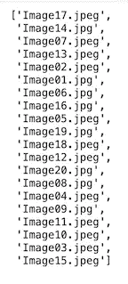
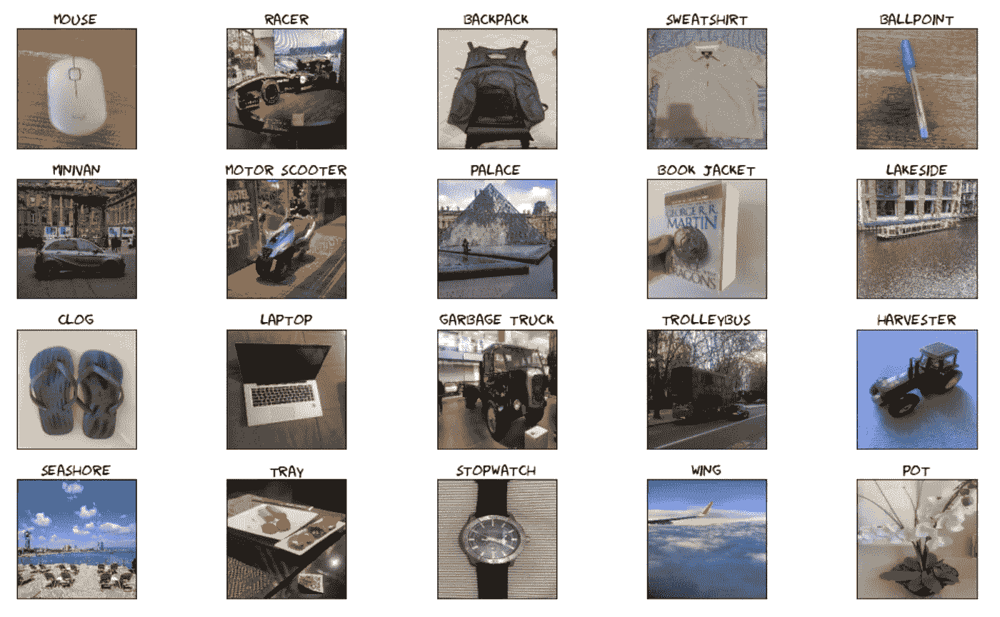
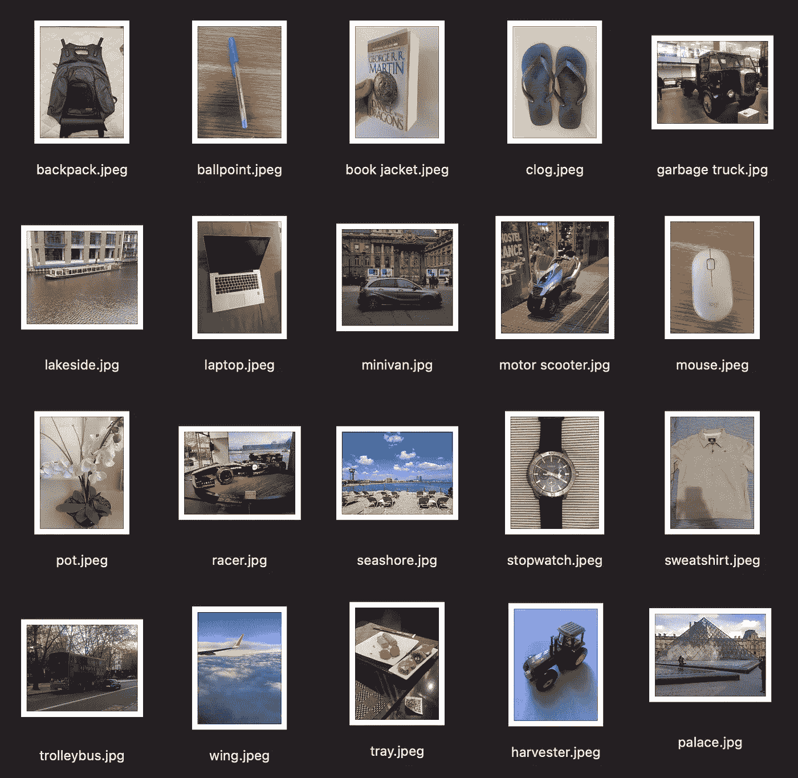

# 使用深度学习来组织您的图片

> 原文：<https://medium.com/analytics-vidhya/using-deep-learning-to-organize-your-pictures-f472bd07ef14?source=collection_archive---------10----------------------->

如何使用 TensorFlow 中经过训练的卷积神经网络，根据图片的预测类别轻松重命名图片。


[由 starline / Freepik 设计](http://www.freepik.com)

深度学习是机器学习的一个子领域，它使用多层神经网络从数据中提取模式。通常情况下，建立和训练一个高精度的模型需要很长时间。然而，如果您可以获得一个由专家构建和训练的模型，并应用它来解决您的问题，会怎么样呢？你可以的！这可能只需要几行代码。

这被称为迁移学习，这是一种重用机器学习专家创建的模型的技术，该模型已经在大型数据集上进行了训练。

我在这个项目中的目标是介绍如何轻松地应用迁移学习来帮助你组织你的图片，方法是使用 Python 中的 TensorFlow，使用来自训练好的卷积神经网络的预测类来重命名它们。

如果你对这个项目的源代码感兴趣，请查看我的 [GitHub](https://github.com/hugoplm/computer-vision/blob/main/Organizing_Pictures_Transfer_Learning/Organizing_Pictures.ipynb) 。

# 获取模型

在这个项目中，我们将使用移动 V2 模型，这是一个训练有素的图像分类模型。它是使用 ImageNet 数据集训练的，它有 1001 个类。MobileNet V2 模型在 [TensorFlow Hub](https://www.tensorflow.org/hub) 中可用，这是一个存储库，我们可以在其中找到经过训练的机器学习模型。我不会在本文中涵盖该模型的所有细节，但是如果您有兴趣了解更多，我推荐您看一下[文档](https://tfhub.dev/google/tf2-preview/mobilenet_v2/classification/4)。

该模型是 TensorFlow 2 格式的 SavedModel。我们可以使用 KerasLayer 方法获得它，证明 URL 和 input_shape 参数。这些信息可以在模型的文档中找到。

```
url = "https://tfhub.dev/google/tf2preview/mobilenet_v2/classification/4"model = tf.keras.Sequential([
   hub.KerasLayer(url, input_shape=(224, 224, 3))
])
```

此外，我们需要获得 ImageNet 数据集的 1001 个类。我们可以通过下载包含这些信息的 TXT 文件并将其保存为 numpy 数组来实现。

```
labels_path = tf.keras.utils.get_file('ImageNetLabels.txt', 'https://storage.googleapis.com/download.tensorflow.org/data/ImageNetLabels.txt')imagenet_labels = np.array(open(labels_path).read().splitlines())
```

# 做预测

这里的第一步是创建一个包含目录中图像文件名的列表。对于这个项目，我将使用 20 个不同的图片，我在我的手机上改名为“ImageXX”。



按作者列出目录中的图像列表。

让我们定义一个接收图像路径并返回预测类和图像数组的函数。在这个函数中，在进行预测之前，图像将以正确的大小加载、归一化并转换为一个 numpy 数组。

```
def pred_class(img):
   loaded_image =  tf.keras.preprocessing.image.load_img(img,
   color_mode='rgb', target_size=(224,224),interpolation='nearest')

   image_arr = np.array(loaded_image)/255. pred = model.predict(image_arr[np.newaxis, :]) predicted_class = imagenet_labels[np.argmax(pred)] return predicted_class, image_arr
```

现在，我们可以循环遍历我们的图像列表，并预测每个图像的类别。我们将把预测的类和图像数组保存在列表中，以便在接下来的步骤中使用。

```
predicted_classes = []images_arr = []for image in image_dir:
   image_path = dir + image
   predicted_class, image_arr = pred_class(image_path)
   predicted_classes.append(predicted_class)
   images_arr.append(image_arr)
```

然后，我们可以绘制我们的图像和各自的预测类。



按作者分类的图片。

# 重命名图像

用各自的类可视化图像后，让我们重命名我们的文件。它将使用预测的类作为文件名，保留原来的扩展名。

```
for i, image in enumerate(image_dir):
   old_name = dir + image
   new_name = dir + predicted_classes[i] + image[7:]
   os.rename(old_name, new_name)
```

我们的最后一步将是创建一个包含所有 20 个重命名图像的 ZIP 文件，并从 Google Colab 下载它。你可以在这个[库](https://github.com/hugoplm/computer-vision/tree/main/Organizing_Pictures_Transfer_Learning/renamed-pictures)里找到重命名后的图片。



由作者重命名的图片。

# 结论

这个项目介绍了如何使用移动 V2 模型来预测随机图片的类别。使用迁移学习可以节省我们很多时间，并达到一个非常好的准确性。正如我们所看到的，该模型预测了一些图像的正确类别，如背包、笔记本电脑、摩托车和海滨。而对于其他情况，即使它没有预测到正确的类别，我们也得到了一个非常接近的类别，如运动衫、木屐和垃圾车。

如果您对学习如何使用 TensorFlow 训练自己的卷积神经网络感兴趣，我建议您看看我以前的项目:

[使用 TensorFlow 对服装图像进行分类](/analytics-vidhya/classifying-images-of-clothing-using-tensorflow-39ec3c1cb8b7)

如果您对这个项目有任何问题或反馈，请随时通过 [LinkedIn](https://www.linkedin.com/in/hugoplm/) 联系我。