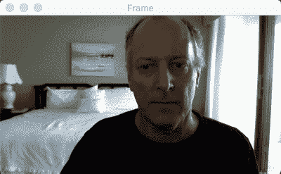
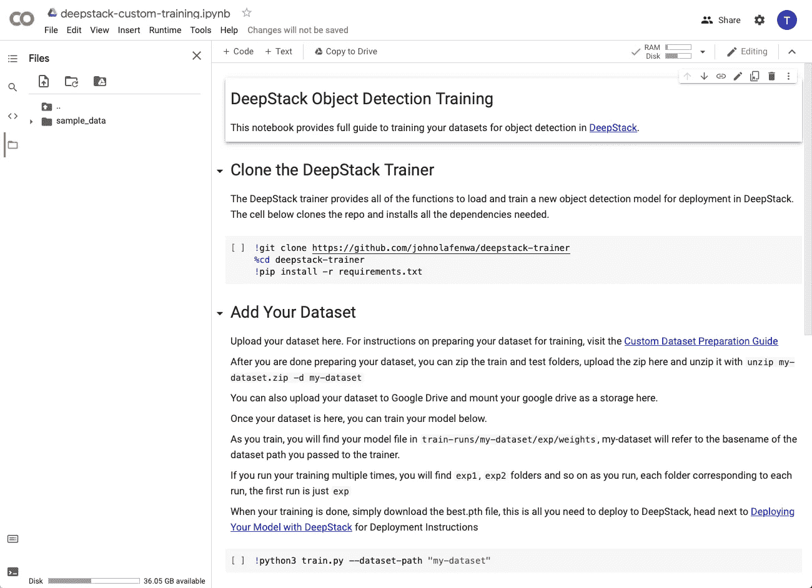
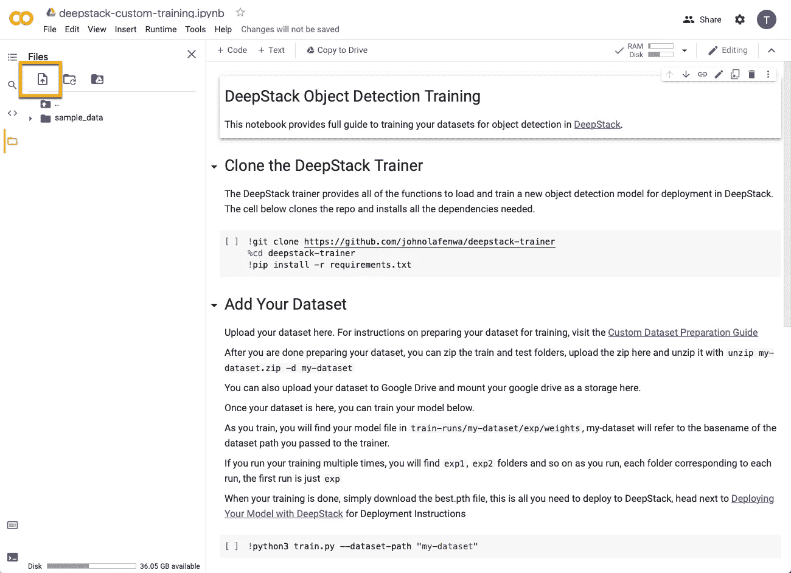
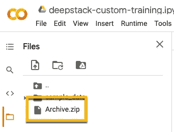
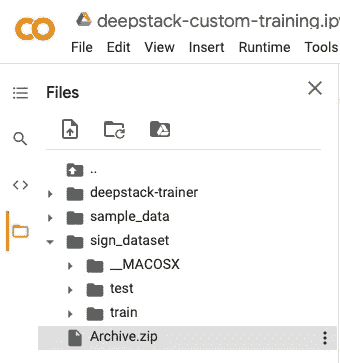
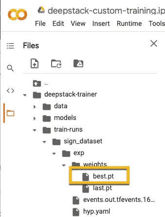

# 使用 DeepStack 进行手语对象检测

> 原文：<https://medium.com/analytics-vidhya/using-deepstack-for-sign-language-object-detection-4478a6e7a2e6?source=collection_archive---------17----------------------->



使用 DeepStack 的手语对象检测

我最近看了一个由 Nicholas Renotte 制作的关于如何使用 T2 tensor flow 2 手语物体检测 API 的视频。

使用 Tensorflow 2，我重新创建了那个项目，你可以在我的 [Github repo](https://github.com/youngsoul/sign-language-detection-with-tfod2) 上读到它。

在我研究如何执行自定义对象检测的过程中，我浏览了一个中型博客，“用 DeepStack 检测任何自定义对象”。

你可以在这里找到更多关于 DeepStack 的信息。DeepStack 的文档可以在[这里](https://docs.deepstack.cc)找到。

我对他们使用 Docker 容器的方法非常感兴趣，这些容器要么具有预配置的功能，要么可以根据自己的数据进行训练。

下面是我使用 DeepStack 框架创建你在上面看到的手语物体检测器的步骤总结。

# 注释数据集

首先，我用 pascal-voc 注释了用于 TFOD 的图像，并用 YOLO 格式重新注释了它们。你可以在我的[手语数据集报告](https://github.com/youngsoul/sign-language-dataset)中找到两个数据集的报告。

我用了 LabelImg，但是任何你喜欢的工具都可以。你只需要使用 YOLO 格式。

# 压缩数据集

创建一个包含测试和训练目录的 zip 文件。在每个测试和训练目录中都有 YOLO 格式的注释文件。

# 将数据集上传到 Google Colab

如果你有 GPU，你可以在你的计算机上进行本地训练，或者按照 DeepStack 的建议，你可以使用 Google Colab 环境进行训练。他们通过以下链接提供了入门笔记本。

[](https://colab.research.google.com/drive/1gbTr_4xpDk3cpnbAVbMVxtyp-3XuUPix?usp=sharing) [## 谷歌联合实验室

### 编辑描述

colab.research.google.com](https://colab.research.google.com/drive/1gbTr_4xpDk3cpnbAVbMVxtyp-3XuUPix?usp=sharing) 

所有这些信息都可以在“自定义模型”下的 DeepStack 文档中找到。

当你第一次访问 Google Colab 链接时，页面看起来像这样:



选择左上角的 upload 按钮，并导航到您创建测试和培训目录的 zip 文件的位置。



# 克隆 DeepStack 训练器

运行代码单元并克隆 DeepStack Trainer repo。你会得到一个警告，说该笔记本不是由谷歌创作的。尽管跑吧。

# 解压缩归档文件

打开一个新的代码单元格，并键入以下内容:

> ！unzip/content/archive . zip-d/content/sign _ dataset

完成后，左边的导航应该看起来像这样:



# 训练模型

打开一个新的代码单元格，要定型模型，您可以键入:

```
python3 train.py --dataset-path "/content/sign_dataset"
```

但是，文档中强调了一些您可能需要注意的参数。(直接来自他们的文档)。

当我训练这个模型的时候，我只是使用了上面的命令，但是我注意到在大约 110 个时期之后，精确度并没有提高。我可以把它剪短，但我让它跑了整整 300 个时代。

培训过程约 1.5 小时。

# 重要参数

可以设置以下参数来优化您的模型，使其更适合您

*   ``--model`` DeepStack 训练器支持五种模型类型，按照精度递增的顺序分别是``"yolov5s"``、``"yolov5m"``、``"yolov5l"``、``"yolov5x"``。默认值是 yolov5m，最高精度的 yolov5l 和 yolov5x 要慢得多，需要部署更高端的计算。如果部署在 nvidia jetson 上，强烈建议使用最快的 yolov5s。
*   ``--batch-size``这是一次处理的图像数量，如果您的 gpu 内存允许，您可以将其设置为较高的数字，如 32 或 64，如果您使用内存较低的 gpu，如果遇到内存问题，您可以将其设置为较低的数字，如 8 或更少。默认值是 16
*   ``epochs``这是整个数据集的迭代次数，默认值是 300。您总是可以用更少的时期或更多的时期运行，准确性随着您运行更多的时期而增加。

# 下载最佳模型

训练结束后。您将在目录中找到最佳型号:

> deep stack-trainer/train-runs/sign _ dataset/exp/weights/best . pt



# 设置 DeepStack Docker 容器

有许多方法可以设置 DeepStack docker 容器，您应该查看它们的文档以获得完整的可能性列表。我将讲述我是如何在 MacOS 上运行的。

假设您已经安装了 Docker。

在终端窗口中

```
docker pull deepquestai/deepstack
```

# 使用新模型运行 DeepStack Docker 容器

在终端窗口中运行以下命令:

> docker run-v/path/to/directory/containing/downloaded/model/sign language-model:/model store/detection-p 5000
> :5000 deepquestai/deep stack

我使用 5000 作为本地计算机端口号，而不是他们推荐的 80，因为我有太多的东西可能要使用端口 80。

# 运行脚本以捕获视频图像进行推断

我编写了一个脚本，可以捕获视频帧，将它们编码为 jpg 图像，并向运行新训练模型的运行 DeepStack Docker 容器发出所需的 post 请求。

你可以在我的[要点报告](https://gist.github.com/youngsoul/2e6a64dabbf9303103bc48b8b2ab3617)中找到那个脚本

请注意，您需要从客户端脚本访问的 url 如下所示:

> [http://localhost:5000/v1/vision/custom/sign](http://localhost:5000/v1/vision/custom/sign)

其中 5000 是你上面公开的端口。url 的“符号”部分是下载的模型的基本名称。在我的例子中，我把这个模型叫做‘sign . pt’

要使用这个客户端脚本，您需要创建一个 Python 虚拟环境并安装 OpenCV，因为我用它来捕捉视频和显示图像。当然，你也可以选择任何你喜欢的框架。

# 结果

你可以看到上面的结果。非常好的准确性，没有错误的预测。

使用“yolov5m”模型，运行推理模型每帧大约需要 250 毫秒。所以不完全是实时的，但在我看来相当不错。我会试试‘yolov 5s’，看看这个型号的性能特点是什么。

总的来说，我对工作流程和创建自定义 YOLOV5 对象检测模型的简单性印象深刻，只需安装一个 Docker 容器。